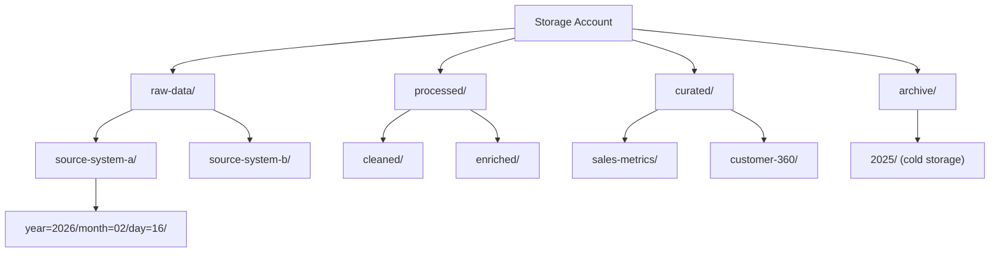

# How to Manage Directories and Files in Azure Data Lake Storage Gen2

Author: [nawazdhandala](https://www.github.com/nawazdhandala)

Tags: Azure, Data Lake Storage, File Management, Directories, Gen2, Cloud Storage, Data Engineering

Description: Learn how to create, list, rename, move, and delete directories and files in Azure Data Lake Storage Gen2 using SDKs and CLI tools.

---

Azure Data Lake Storage Gen2 brings real directory operations to cloud storage. Unlike standard blob storage where directories are just naming conventions, ADLS Gen2 has actual directory objects that you can create, rename, and delete atomically. This post covers the day-to-day file and directory management operations you will use when building data pipelines and managing a data lake.

## Creating File Systems (Containers)

In ADLS Gen2, a file system is the top-level container for your data. It is equivalent to a blob container but with hierarchical namespace capabilities.

```python
from azure.storage.filedatalake import DataLakeServiceClient
import os

# Initialize the Data Lake service client
connection_string = os.environ["AZURE_STORAGE_CONNECTION_STRING"]
service_client = DataLakeServiceClient.from_connection_string(connection_string)

# Create a new file system
file_system_client = service_client.create_file_system("raw-data")
print("File system 'raw-data' created")

# List all file systems in the account
file_systems = service_client.list_file_systems()
for fs in file_systems:
    print(f"  {fs.name} - last modified: {fs.last_modified}")
```

## Creating Directories

Directories in ADLS Gen2 are real objects, not virtual prefixes. You can create nested directory structures in a single call.

```python
fs_client = service_client.get_file_system_client("raw-data")

# Create a single directory
dir_client = fs_client.create_directory("events")
print("Directory 'events' created")

# Create nested directories - parent directories are created automatically
nested_dir = fs_client.create_directory("events/2026/02/16")
print("Nested directory structure created")

# You can also create directories through the directory client
events_dir = fs_client.get_directory_client("events")
sub_dir = events_dir.create_sub_directory("clickstream")
print("Subdirectory 'clickstream' created under 'events'")
```

## Uploading Files

There are several ways to upload files to ADLS Gen2.

```python
# Upload a small file from a string
file_client = fs_client.get_file_client("events/2026/02/16/event-001.json")
file_client.create_file()

# Upload content as bytes
data = b'{"event_type": "page_view", "user_id": "u-123", "timestamp": "2026-02-16T10:30:00Z"}'
file_client.append_data(data, offset=0, length=len(data))
file_client.flush_data(len(data))
print("File uploaded from bytes")

# Upload a local file directly
# This is simpler for larger files
file_client = fs_client.get_file_client("events/2026/02/16/batch-upload.csv")

with open("/tmp/local-data.csv", "rb") as local_file:
    file_client.upload_data(local_file, overwrite=True)
print("Local file uploaded")
```

For larger files, use the chunked upload approach to handle files that exceed memory.

```python
def upload_large_file(fs_client, remote_path, local_path, chunk_size=4*1024*1024):
    """
    Upload a large file in chunks of 4 MB.
    This avoids loading the entire file into memory.
    """
    file_client = fs_client.get_file_client(remote_path)
    file_client.create_file()

    offset = 0
    with open(local_path, "rb") as f:
        while True:
            chunk = f.read(chunk_size)
            if not chunk:
                break
            file_client.append_data(chunk, offset=offset, length=len(chunk))
            offset += len(chunk)

    # Flush to commit the upload
    file_client.flush_data(offset)
    print(f"Uploaded {offset} bytes to {remote_path}")

upload_large_file(fs_client, "events/large-dataset.parquet", "/tmp/large-file.parquet")
```

## Listing Directory Contents

```python
# List all items in a directory
paths = fs_client.get_paths(path="events/2026/02")

for path in paths:
    item_type = "DIR" if path.is_directory else "FILE"
    size = path.content_length if not path.is_directory else "-"
    print(f"[{item_type}] {path.name} (size: {size})")
```

You can also list only the immediate children (non-recursive) by setting `recursive=False`.

```python
# List only immediate children of a directory
# By default, get_paths is recursive
paths = fs_client.get_paths(path="events", recursive=False)

for path in paths:
    item_type = "DIR" if path.is_directory else "FILE"
    print(f"[{item_type}] {path.name}")
```

## Downloading Files

```python
# Download a file to memory
file_client = fs_client.get_file_client("events/2026/02/16/event-001.json")
download = file_client.download_file()
content = download.readall()
print(f"Downloaded content: {content.decode('utf-8')}")

# Download to a local file
with open("/tmp/downloaded-event.json", "wb") as local_file:
    download = file_client.download_file()
    download.readinto(local_file)
print("File downloaded to local disk")
```

## Renaming Files and Directories

Renaming in ADLS Gen2 is an atomic metadata operation, which is one of the major advantages of the hierarchical namespace.

```python
# Rename a file
file_client = fs_client.get_file_client("events/temp-data.csv")
file_client.rename_file("events/processed-data.csv")
print("File renamed")

# Rename a directory - this is atomic regardless of how many files it contains
dir_client = fs_client.get_directory_client("events/2026/02/16")
dir_client.rename_directory("events/2026/02/16-processed")
print("Directory renamed atomically")
```

## Moving Files Between Directories

Moving files is done through the rename operation - you simply rename the file to a different directory path.

```python
# Move a file from one directory to another
file_client = fs_client.get_file_client("raw-data/report.csv")
file_client.rename_file("processed-data/report.csv")
print("File moved to processed-data directory")

# Move an entire directory
dir_client = fs_client.get_directory_client("staging/batch-001")
dir_client.rename_directory("archive/batch-001")
print("Directory moved to archive")
```

## Deleting Files and Directories

```python
# Delete a single file
file_client = fs_client.get_file_client("events/old-data.csv")
file_client.delete_file()
print("File deleted")

# Delete an empty directory
dir_client = fs_client.get_directory_client("events/empty-dir")
dir_client.delete_directory()
print("Empty directory deleted")

# Delete a directory and all its contents recursively
# This is a single atomic operation
dir_client = fs_client.get_directory_client("events/2025")
dir_client.delete_directory()
print("Directory and all contents deleted")
```

## Managing Files with Azure CLI

The Azure CLI provides convenient commands for file operations.

```bash
# Create a directory
az storage fs directory create \
  --name "events/2026/02/17" \
  --file-system raw-data \
  --account-name mydatalakeaccount \
  --auth-mode login

# Upload a file
az storage fs file upload \
  --source ./local-data.csv \
  --path events/2026/02/17/data.csv \
  --file-system raw-data \
  --account-name mydatalakeaccount \
  --auth-mode login

# List directory contents
az storage fs file list \
  --file-system raw-data \
  --path events/2026/02 \
  --account-name mydatalakeaccount \
  --auth-mode login \
  --output table

# Download a file
az storage fs file download \
  --path events/2026/02/17/data.csv \
  --file-system raw-data \
  --destination ./downloaded.csv \
  --account-name mydatalakeaccount \
  --auth-mode login

# Delete a file
az storage fs file delete \
  --path events/2026/02/17/data.csv \
  --file-system raw-data \
  --account-name mydatalakeaccount \
  --auth-mode login --yes
```

## Getting File and Directory Properties

```python
# Get properties of a file
file_client = fs_client.get_file_client("events/2026/02/16/event-001.json")
properties = file_client.get_file_properties()

print(f"Name: {properties.name}")
print(f"Size: {properties.size} bytes")
print(f"Content type: {properties.content_settings.content_type}")
print(f"Last modified: {properties.last_modified}")
print(f"Created on: {properties.creation_time}")
print(f"ETag: {properties.etag}")

# Set metadata on a file
file_client.set_metadata(metadata={
    "source": "pipeline-v2",
    "processed_by": "spark-cluster-01",
    "batch_id": "batch-20260216"
})
```

## Building a Data Lake Directory Structure

Here is a common directory layout for a data lake.



```python
def create_data_lake_structure(fs_client):
    """
    Create a standard data lake directory structure.
    Follows the medallion architecture: raw -> processed -> curated.
    """
    directories = [
        "raw-data/source-system-a",
        "raw-data/source-system-b",
        "processed/cleaned",
        "processed/enriched",
        "curated/sales-metrics",
        "curated/customer-360",
        "archive",
        "temp"
    ]

    for dir_path in directories:
        fs_client.create_directory(dir_path)
        print(f"Created: {dir_path}")

    print("Data lake structure created successfully")

create_data_lake_structure(fs_client)
```

## Best Practices

Organize your data lake into zones (raw, processed, curated) to clearly separate data at different stages of processing.

Use date-based partitioning (year/month/day) for time-series data. This makes it easy to query specific time ranges and manage data lifecycle.

Take advantage of atomic directory operations for data pipeline patterns. Write to a temporary directory, then atomically rename it to the final location. This prevents consumers from reading partially written data.

Set appropriate file sizes. For analytics workloads, files between 256 MB and 1 GB perform best with Spark and Synapse. Avoid millions of small files, which create overhead in the file system metadata.

ADLS Gen2 file management is straightforward once you understand the hierarchical namespace model. The atomic directory operations and POSIX-like permissions make it a proper file system for big data workloads, not just a blob store with extra steps.
