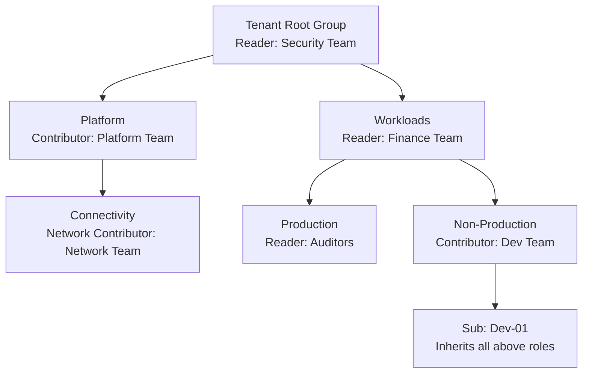

# How to Manage Role-Based Access Control Across Azure Management Groups

Author: [nawazdhandala](https://www.github.com/nawazdhandala)

Tags: Azure, RBAC, Management Groups, Access Control, Security, Governance, IAM

Description: Learn how to structure RBAC assignments across Azure management groups so the right teams get the right access without creating a permissions mess.

---

Role-Based Access Control (RBAC) in Azure is powerful but can turn into a tangled web of permissions if you do not have a clear strategy. When you combine RBAC with management groups, you get the ability to grant permissions that automatically flow down to all subscriptions and resources in that branch of the hierarchy. This is incredibly efficient but also means a single poorly scoped role assignment can give someone access to hundreds of resources they should not touch.

In this post, I will walk through how RBAC inheritance works with management groups, how to structure your role assignments for a clean governance model, and how to audit and troubleshoot access issues.

## How RBAC Inheritance Works

RBAC assignments in Azure follow a top-down inheritance model:



Key rules for inheritance:
- A role assigned at a management group applies to all child management groups, subscriptions, resource groups, and resources
- Permissions are additive - if you have Reader at the management group level and Contributor at the subscription level, you effectively have Contributor for that subscription
- There is no "deny" assignment in standard RBAC (deny assignments exist but can only be created by Azure Blueprints and some Azure PIM configurations)
- The most permissive role wins when you have overlapping assignments

## RBAC Strategy for Management Groups

### Principle of Least Privilege

The fundamental rule: assign the most restrictive role that still allows people to do their job, at the narrowest scope possible.

- Do not assign Owner at the management group level unless absolutely necessary
- Prefer narrow roles (like "Virtual Machine Contributor") over broad ones (like "Contributor")
- Assign at the lowest management group level that covers the needed scope

### Recommended Role Assignments by Management Group Level

Here is a practical structure for an enterprise:

**Tenant Root Group**
- Security Reader: Security operations team (read-only visibility across everything)
- Cost Management Reader: Finance and FinOps team (cost visibility everywhere)
- Management Group Contributor: Cloud governance team (can manage the hierarchy)

**Platform Management Group**
- Contributor: Platform engineering team (manages shared infrastructure)
- Reader: Application teams (can see platform resources for reference)

**Workloads Management Group**
- Reader: Central IT operations (visibility for support)
- User Access Administrator: Cloud governance team (can manage RBAC at this level)

**Production Management Group**
- Reader: SRE team and auditors
- Specific narrow roles assigned per subscription or resource group (not at this level)

**Non-Production Management Group**
- Contributor: Development teams (broad access for dev and test)
- Reader: QA team

**Individual Subscriptions**
- Owner: Subscription-specific admins (limited to 2-3 people)
- Contributor: Teams that deploy resources
- Custom roles as needed

## Creating Role Assignments at Management Groups

### Using the CLI

```bash
# Assign Reader role to the security team at the Tenant Root Group
# The --scope flag uses the management group resource ID
az role assignment create \
  --assignee-object-id "<security-team-group-object-id>" \
  --assignee-principal-type Group \
  --role "Reader" \
  --scope "/providers/Microsoft.Management/managementGroups/TenantRootGroup"

# Assign Contributor to the platform team at the Platform management group
az role assignment create \
  --assignee-object-id "<platform-team-group-object-id>" \
  --assignee-principal-type Group \
  --role "Contributor" \
  --scope "/providers/Microsoft.Management/managementGroups/Platform"

# Assign a custom role at a specific management group
az role assignment create \
  --assignee-object-id "<devops-team-group-object-id>" \
  --assignee-principal-type Group \
  --role "Virtual Machine Contributor" \
  --scope "/providers/Microsoft.Management/managementGroups/NonProduction"
```

### Using ARM Templates

```json
{
  "$schema": "https://schema.management.azure.com/schemas/2019-08-01/managementGroupDeploymentTemplate.json#",
  "contentVersion": "1.0.0.0",
  "parameters": {
    "principalId": {
      "type": "string",
      "metadata": {
        "description": "Object ID of the Azure AD group or user"
      }
    },
    "roleDefinitionId": {
      "type": "string",
      "metadata": {
        "description": "Role definition ID (e.g., Reader, Contributor)"
      }
    }
  },
  "resources": [
    {
      "type": "Microsoft.Authorization/roleAssignments",
      "apiVersion": "2022-04-01",
      "name": "[guid(managementGroup().id, parameters('principalId'), parameters('roleDefinitionId'))]",
      "properties": {
        "principalId": "[parameters('principalId')]",
        "roleDefinitionId": "[tenantResourceId('Microsoft.Authorization/roleDefinitions', parameters('roleDefinitionId'))]",
        "principalType": "Group"
      }
    }
  ]
}
```

## Using Azure AD Groups for RBAC

Always assign roles to Azure AD groups rather than individual users. This gives you several advantages:

- Adding or removing team members only requires changing group membership, not touching Azure RBAC
- You can review group membership in Azure AD without needing to check each management group
- Groups make it clear what the role assignment is for (the group name documents the intent)

### Recommended Group Naming Convention

```
az-rbac-<scope>-<role>

Examples:
az-rbac-platform-contributor
az-rbac-production-reader
az-rbac-workloads-useraccessadmin
az-rbac-root-securityreader
```

```bash
# Create an Azure AD group for the role assignment
az ad group create \
  --display-name "az-rbac-platform-contributor" \
  --mail-nickname "az-rbac-platform-contributor" \
  --description "Members have Contributor access to the Platform management group"

# Get the group's object ID
GROUP_ID=$(az ad group show \
  --group "az-rbac-platform-contributor" \
  --query "id" -o tsv)

# Create the role assignment using the group
az role assignment create \
  --assignee-object-id "$GROUP_ID" \
  --assignee-principal-type Group \
  --role "Contributor" \
  --scope "/providers/Microsoft.Management/managementGroups/Platform"

# Add users to the group (this is now the only step needed for new team members)
az ad group member add \
  --group "az-rbac-platform-contributor" \
  --member-id "<user-object-id>"
```

## Custom Roles at Management Group Scope

Sometimes built-in roles are too broad or too narrow. Create custom roles scoped to your management group:

```bash
# Create a custom role that allows reading and restarting VMs but not deleting them
az role definition create --role-definition '{
  "Name": "VM Operator",
  "Description": "Can view and restart VMs but not create or delete them",
  "Actions": [
    "Microsoft.Compute/virtualMachines/read",
    "Microsoft.Compute/virtualMachines/start/action",
    "Microsoft.Compute/virtualMachines/restart/action",
    "Microsoft.Compute/virtualMachines/powerOff/action",
    "Microsoft.Resources/subscriptions/resourceGroups/read"
  ],
  "NotActions": [],
  "AssignableScopes": [
    "/providers/Microsoft.Management/managementGroups/Production"
  ]
}'
```

Custom roles assigned at a management group can only be used at that management group or its descendants. They are not visible at other management groups.

## Auditing Role Assignments

Regularly audit who has access to what. Azure provides several tools for this.

### List All Role Assignments at a Management Group

```bash
# List all role assignments at a specific management group
# This shows direct assignments only, not inherited ones
az role assignment list \
  --scope "/providers/Microsoft.Management/managementGroups/Workloads" \
  --query "[].{principal:principalName, role:roleDefinitionName, scope:scope}" \
  --output table
```

### Find All Assignments for a Specific User

```bash
# Check what access a specific user has across all management groups
az role assignment list \
  --all \
  --assignee "<user-email-or-object-id>" \
  --query "[].{role:roleDefinitionName, scope:scope}" \
  --output table
```

### Check Effective Permissions

```bash
# Check effective permissions at a specific scope
# This shows the combined result of all inherited and direct assignments
az role assignment list \
  --scope "/subscriptions/<sub-id>" \
  --include-inherited \
  --query "[].{principal:principalName, role:roleDefinitionName, scope:scope}" \
  --output table
```

## Using Privileged Identity Management (PIM)

For sensitive management groups (especially Production and Platform), use Azure AD Privileged Identity Management to make role assignments "just-in-time" rather than permanent:

1. Instead of a permanent Contributor assignment, make users eligible for Contributor
2. When someone needs access, they activate their role through PIM
3. The activation requires justification and optionally requires approval
4. The role is active for a limited time (e.g., 8 hours) and then automatically deactivates

This dramatically reduces the risk of standing permissions being misused.

## Common Mistakes to Avoid

**Assigning Owner at the root level.** Owner includes the ability to manage RBAC, which means the person can grant themselves or others any permission across your entire Azure environment. Only the absolute minimum number of people should have this.

**Using individual user assignments instead of groups.** When someone leaves the team, you have to hunt down and remove every role assignment they had. With groups, you just remove them from the group.

**Assigning Contributor when Reader is sufficient.** Many teams request Contributor access "just in case" but only need Reader for their day-to-day work. Start with Reader and elevate only when they demonstrate a need.

**Not reviewing access regularly.** Set a quarterly access review schedule. Azure AD Access Reviews can automate this process.

**Ignoring the scope of service principals.** Managed identities and service principals can also have role assignments at management groups. Audit these alongside user and group assignments.

## Wrapping Up

RBAC at the management group level gives you a scalable way to manage access across your Azure environment. The combination of management group hierarchy, Azure AD groups, and the principle of least privilege creates a clean, auditable governance model. Assign broad read access at higher levels, more specific contributor access at lower levels, and use PIM for sensitive environments. Review assignments quarterly and keep your Azure AD groups well-organized with clear naming conventions. This approach scales from ten subscriptions to a thousand.
