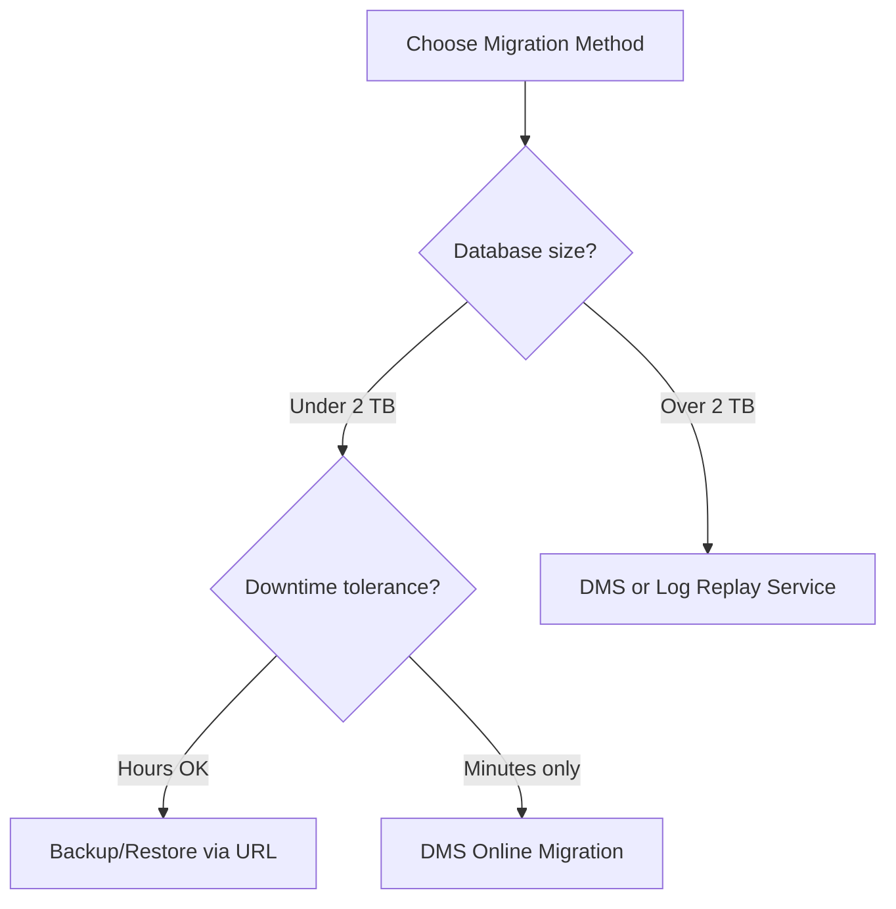

# How to Migrate an On-Premises SQL Server Database to Azure SQL Managed Instance

Author: [nawazdhandala](https://www.github.com/nawazdhandala)

Tags: Azure SQL, Managed Instance, Migration, SQL Server, DMS, Azure, Database

Description: A comprehensive guide to migrating an on-premises SQL Server database to Azure SQL Managed Instance using backup/restore, DMS, and other methods.

---

Azure SQL Managed Instance is the closest cloud equivalent to an on-premises SQL Server. It supports nearly all SQL Server features, including SQL Agent, cross-database queries, CLR, Service Broker, and linked servers. This makes it the natural migration target when you want to move to the cloud but cannot refactor your applications to work with the more restrictive Azure SQL Database.

In this post, I will cover the main migration methods, help you choose the right one, and walk through the process step by step.

## Migration Methods Overview

There are several ways to migrate to SQL Managed Instance. Each has different trade-offs in terms of downtime, complexity, and database size limits.

| Method | Max DB Size | Downtime | Complexity |
|--------|------------|----------|------------|
| Backup and restore via URL | 2 TB | Hours (offline) | Low |
| Azure Database Migration Service (DMS) | No limit | Minutes (online) | Medium |
| Log replay service | No limit | Minutes (online) | Medium |
| Transactional replication | Varies | Minutes | High |



## Method 1: Backup and Restore via URL

This is the simplest migration method and works well for databases under 2 TB where you can tolerate some downtime.

### Step 1: Create an Azure Storage Account

You need a storage account to hold the backup file temporarily.

```bash
# Create a storage account for the backup file
az storage account create \
    --resource-group myResourceGroup \
    --name mymigrationstore \
    --location eastus \
    --sku Standard_LRS

# Create a container for the backup
az storage container create \
    --account-name mymigrationstore \
    --name backups
```

### Step 2: Generate a SAS Token

Create a Shared Access Signature that allows SQL Server and Managed Instance to access the storage.

```bash
# Generate a SAS token valid for 24 hours with read/write/list permissions
az storage container generate-sas \
    --account-name mymigrationstore \
    --name backups \
    --permissions rwl \
    --expiry $(date -u -d "+24 hours" +%Y-%m-%dT%H:%MZ) \
    --output tsv
```

### Step 3: Create a Credential on the Source SQL Server

On your on-premises SQL Server:

```sql
-- Create a credential to access Azure Blob Storage
-- Replace the SAS token with the one you generated
CREATE CREDENTIAL [https://mymigrationstore.blob.core.windows.net/backups]
WITH IDENTITY = 'SHARED ACCESS SIGNATURE',
SECRET = 'your-sas-token-here';
```

### Step 4: Backup to Azure Blob Storage

```sql
-- Backup the database directly to Azure Blob Storage
-- Using COMPRESSION and CHECKSUM for faster transfer and verification
BACKUP DATABASE [MyDatabase]
TO URL = 'https://mymigrationstore.blob.core.windows.net/backups/MyDatabase.bak'
WITH COMPRESSION, CHECKSUM, STATS = 10;
```

For databases larger than 200 GB, use striped backups across multiple files for better performance:

```sql
-- Striped backup to multiple blob files for better performance
BACKUP DATABASE [MyDatabase]
TO URL = 'https://mymigrationstore.blob.core.windows.net/backups/MyDatabase_1.bak',
   URL = 'https://mymigrationstore.blob.core.windows.net/backups/MyDatabase_2.bak',
   URL = 'https://mymigrationstore.blob.core.windows.net/backups/MyDatabase_3.bak',
   URL = 'https://mymigrationstore.blob.core.windows.net/backups/MyDatabase_4.bak'
WITH COMPRESSION, CHECKSUM, STATS = 10;
```

### Step 5: Create a Credential on Managed Instance

```sql
-- Create a credential on the Managed Instance
CREATE CREDENTIAL [https://mymigrationstore.blob.core.windows.net/backups]
WITH IDENTITY = 'SHARED ACCESS SIGNATURE',
SECRET = 'your-sas-token-here';
```

### Step 6: Restore on Managed Instance

```sql
-- Restore the database on Managed Instance
RESTORE DATABASE [MyDatabase]
FROM URL = 'https://mymigrationstore.blob.core.windows.net/backups/MyDatabase.bak'
WITH STATS = 10;
```

For striped backups:

```sql
-- Restore from striped backup files
RESTORE DATABASE [MyDatabase]
FROM URL = 'https://mymigrationstore.blob.core.windows.net/backups/MyDatabase_1.bak',
     URL = 'https://mymigrationstore.blob.core.windows.net/backups/MyDatabase_2.bak',
     URL = 'https://mymigrationstore.blob.core.windows.net/backups/MyDatabase_3.bak',
     URL = 'https://mymigrationstore.blob.core.windows.net/backups/MyDatabase_4.bak'
WITH STATS = 10;
```

## Method 2: Azure Database Migration Service (DMS)

DMS supports online migrations with minimal downtime. It handles the initial data load and then continuously replicates changes until you are ready to cut over.

### Step 1: Assess Compatibility

Before migrating, run the Azure SQL Migration extension in Azure Data Studio or the Data Migration Assistant (DMA) to check for compatibility issues.

```bash
# Install the Azure SQL Migration extension in Azure Data Studio
# Then run an assessment against your source database
```

The assessment identifies:
- Features not supported in Managed Instance
- Configuration changes needed
- Potential performance issues
- Breaking changes

### Step 2: Create a DMS Instance

```bash
# Create a DMS instance
az dms create \
    --resource-group myResourceGroup \
    --name myDMS \
    --location eastus \
    --sku-name Premium_4vCores
```

### Step 3: Create a Migration Project

In the Azure Portal:
1. Go to your DMS instance.
2. Click "New migration project".
3. Set the source type to "SQL Server".
4. Set the target type to "Azure SQL Managed Instance".
5. Choose "Online data migration" for minimal downtime.

### Step 4: Configure Source and Target

Provide connection details for both the source SQL Server and the target Managed Instance. DMS needs network connectivity to both.

### Step 5: Select Databases and Tables

Choose which databases to migrate. You can migrate multiple databases in a single project.

### Step 6: Run the Migration

DMS performs:
1. Full backup of selected databases
2. Restore on Managed Instance
3. Continuous log shipping to keep the target in sync
4. When ready, you initiate the cutover

### Step 7: Cutover

When you are ready:
1. Stop application traffic to the source.
2. Wait for the final log backup to be applied.
3. Initiate cutover in DMS.
4. Redirect application traffic to Managed Instance.

The cutover window is typically 1-5 minutes.

## Method 3: Log Replay Service (LRS)

LRS is a managed log shipping service specifically for Managed Instance migrations. It is simpler than DMS and gives you more control over the process.

### How It Works

1. You place backup files (full, differential, and log backups) in Azure Blob Storage.
2. LRS reads these files and restores them on Managed Instance in the correct order.
3. You continue taking log backups on the source and uploading them.
4. When ready, you stop the source and let LRS apply the final log backup.

```bash
# Start the Log Replay Service for a database
az sql midb log-replay start \
    --resource-group myResourceGroup \
    --managed-instance myMI \
    --name MyDatabase \
    --storage-uri "https://mymigrationstore.blob.core.windows.net/backups" \
    --storage-sas "your-sas-token"
```

Monitor the progress:

```bash
# Check the status of the log replay
az sql midb log-replay show \
    --resource-group myResourceGroup \
    --managed-instance myMI \
    --name MyDatabase
```

Complete the cutover:

```bash
# Complete the migration (final cutover)
az sql midb log-replay complete \
    --resource-group myResourceGroup \
    --managed-instance myMI \
    --name MyDatabase \
    --last-backup-name "MyDatabase_log_final.trn"
```

## Pre-Migration Checklist

Before starting any migration, work through this checklist:

1. **Assess compatibility**: Run the migration assessment and fix all blocking issues.
2. **Size the Managed Instance**: Ensure the target has enough vCores, memory, and storage for your workload.
3. **Network connectivity**: Verify that your source server can reach Azure Blob Storage, and that DMS (if used) can reach both source and target.
4. **Application compatibility**: Test your application against the Managed Instance. While compatibility is high, some edge cases exist.
5. **Logins and users**: Plan how to migrate SQL logins. Managed Instance supports both SQL and Azure AD authentication.
6. **Agent jobs**: Inventory all SQL Agent jobs that need to be migrated.
7. **Linked servers**: Document any linked server connections that need to be recreated.
8. **SSIS packages**: Plan for migrating any Integration Services packages.

## Post-Migration Steps

After the migration completes:

1. **Verify data integrity**: Run row counts and checksums on critical tables.
2. **Migrate SQL logins**: Recreate logins on the Managed Instance or switch to Azure AD.
3. **Recreate SQL Agent jobs**: Set up the scheduled jobs on the new instance.
4. **Configure linked servers**: Recreate any linked server connections.
5. **Update connection strings**: Point all applications to the Managed Instance endpoint.
6. **Test application functionality**: Run your test suite against the new database.
7. **Set up monitoring**: Configure Azure Monitor alerts and diagnostics.
8. **Configure backups**: Review and adjust backup retention policies.

## Choosing the Right Method

**Use backup/restore via URL** when:
- Database is under 2 TB
- You can tolerate a few hours of downtime
- You want the simplest possible process

**Use DMS** when:
- You need minimal downtime (minutes, not hours)
- You are migrating multiple databases
- You want a managed, GUI-driven experience

**Use Log Replay Service** when:
- You need minimal downtime
- You want more control over the backup/restore process
- You prefer a CLI-driven workflow

## Summary

Migrating from on-premises SQL Server to Azure SQL Managed Instance is well-supported with multiple tools and methods. Backup and restore via URL is the simplest approach for smaller databases. DMS and Log Replay Service provide near-zero-downtime migrations for production workloads. Always run a compatibility assessment first, test your application thoroughly, and plan for the post-migration tasks like login migration, Agent job recreation, and connection string updates.
