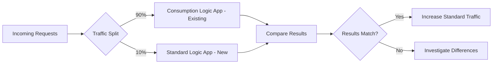

# How to Migrate Azure Logic Apps from Consumption to Standard Plan

Author: [nawazdhandala](https://www.github.com/nawazdhandala)

Tags: Azure, Logic Apps, Migration, Consumption Plan, Standard Plan, Workflow, Cloud Architecture

Description: A practical guide to migrating your Azure Logic Apps workflows from the Consumption plan to the Standard plan with minimal disruption.

---

Azure Logic Apps Consumption plan was the original way to build workflows - one workflow per resource, pay-per-execution pricing, and everything managed through the portal designer. The Standard plan offers better performance, local development, CI/CD integration, multiple workflows per resource, and predictable costs. Migrating from Consumption to Standard is not a lift-and-shift operation, though. The underlying execution model, project structure, and connector behavior are all different.

## Why Migrate?

The Consumption plan works well for simple, low-volume workflows. But it has limitations that become painful at scale:

- **No local development**: You design and test entirely in the Azure Portal
- **No CI/CD**: Deployment is through ARM templates that are hard to manage
- **One workflow per resource**: Managing hundreds of workflows means hundreds of Azure resources
- **Unpredictable costs**: Pay-per-action pricing makes budgeting difficult for high-volume workloads
- **Cold starts**: Consumption plan workflows can have noticeable startup latency
- **Limited networking**: No VNET integration on Consumption

Standard solves all of these. You develop locally in VS Code, deploy through CI/CD, run multiple workflows in one resource, pay a fixed hosting cost, and get VNET integration with the Premium App Service plan.

## Assessment: What Can and Cannot Be Migrated

Not every Consumption workflow translates directly to Standard. Here is what to check.

**Direct migration (straightforward):**
- HTTP triggers and actions
- Schedule (recurrence) triggers
- Inline code actions
- Condition, switch, loop, and scope actions
- Variables and compose actions
- Built-in connectors (HTTP, JSON parsing, etc.)

**Requires changes:**
- Managed API connectors (Outlook, SharePoint, SQL) - these exist in Standard but use a different connection model
- Custom connectors - need to be recreated
- ISE connectors - not applicable in Standard

**Not available in Standard:**
- Some Consumption-only triggers (certain polling triggers)
- Integration Account features work differently

## Step 1: Export the Consumption Workflow Definition

Start by exporting your existing workflow definition. Every Logic App Consumption workflow has a JSON definition that describes the triggers, actions, and connections.

```bash
# Export the workflow definition
az logic workflow show \
  --name logic-order-processor \
  --resource-group rg-old-workflows \
  --query "definition" \
  --output json > workflow-definition.json

# Also export the connection parameters
az logic workflow show \
  --name logic-order-processor \
  --resource-group rg-old-workflows \
  --query "parameters" \
  --output json > workflow-parameters.json
```

## Step 2: Create the Standard Logic App Project

Set up a new Standard project structure locally.

```bash
# Create the project directory
mkdir logic-order-workflows && cd logic-order-workflows

# Create the host.json file
cat > host.json << 'HOSTEOF'
{
  "version": "2.0",
  "extensionBundle": {
    "id": "Microsoft.Azure.Functions.ExtensionBundle.Workflows",
    "version": "[1.*, 2.0.0)"
  }
}
HOSTEOF

# Create the workflow directory
mkdir order-processor

# Create local settings for development
cat > local.settings.json << 'SETTINGSEOF'
{
  "IsEncrypted": false,
  "Values": {
    "AzureWebJobsStorage": "UseDevelopmentStorage=true",
    "FUNCTIONS_WORKER_RUNTIME": "node",
    "WORKFLOWS_SUBSCRIPTION_ID": "your-subscription-id",
    "WORKFLOWS_RESOURCE_GROUP_NAME": "rg-workflows"
  }
}
SETTINGSEOF
```

## Step 3: Adapt the Workflow Definition

The exported Consumption definition needs modifications for Standard. The key differences are:

1. The wrapper structure is different - Standard uses a simpler `workflow.json` format
2. Connection references change from `$connections` parameters to `managedApiConnections` in `connections.json`
3. Some action types have slightly different property names

Here is how to restructure the definition.

```json
{
  "definition": {
    "$schema": "https://schema.management.azure.com/providers/Microsoft.Logic/schemas/2016-06-01/workflowdefinition.json#",
    "actions": {
      "Parse_Order": {
        "type": "ParseJson",
        "inputs": {
          "content": "@triggerBody()",
          "schema": {
            "type": "object",
            "properties": {
              "orderId": { "type": "string" },
              "customerId": { "type": "string" },
              "totalAmount": { "type": "number" }
            }
          }
        },
        "runAfter": {}
      },
      "Call_Backend_API": {
        "type": "Http",
        "inputs": {
          "method": "POST",
          "uri": "@appsetting('BackendApiUrl')/orders",
          "headers": {
            "Content-Type": "application/json",
            "Authorization": "Bearer @{appsetting('BackendApiKey')}"
          },
          "body": "@body('Parse_Order')"
        },
        "runAfter": {
          "Parse_Order": ["Succeeded"]
        }
      },
      "Return_Response": {
        "type": "Response",
        "inputs": {
          "statusCode": 200,
          "body": {
            "status": "processed",
            "orderId": "@body('Parse_Order')?['orderId']"
          }
        },
        "runAfter": {
          "Call_Backend_API": ["Succeeded"]
        }
      }
    },
    "triggers": {
      "manual": {
        "type": "Request",
        "kind": "Http",
        "inputs": {
          "method": "POST"
        }
      }
    },
    "contentVersion": "1.0.0.0"
  },
  "kind": "Stateful"
}
```

Notice the `@appsetting('BackendApiUrl')` syntax - in Standard, you reference application settings instead of parameters for configuration values. This is one of the key changes from Consumption.

## Step 4: Migrate Connections

Consumption plan connections are Azure resources (`Microsoft.Web/connections`). Standard plan connections are defined in a `connections.json` file in the project root.

```json
{
  "managedApiConnections": {
    "office365": {
      "api": {
        "id": "/subscriptions/{sub-id}/providers/Microsoft.Web/locations/eastus2/managedApis/office365"
      },
      "connection": {
        "id": "/subscriptions/{sub-id}/resourceGroups/rg-workflows/providers/Microsoft.Web/connections/office365-conn"
      },
      "connectionRuntimeUrl": "https://...",
      "authentication": {
        "type": "ManagedServiceIdentity"
      }
    }
  },
  "serviceProviderConnections": {
    "serviceBus": {
      "parameterValues": {
        "connectionString": "@appsetting('ServiceBusConnectionString')"
      },
      "serviceProvider": {
        "id": "/serviceProviders/serviceBus"
      },
      "displayName": "Service Bus Connection"
    }
  }
}
```

Standard supports two types of connections:
- **Managed API connections**: Same as Consumption, backed by Azure resources
- **Service provider connections (built-in)**: Faster, run in-process, configured via connection strings in app settings

Prefer service provider (built-in) connections when available. They are faster and do not require separate Azure resources.

## Step 5: Deploy and Test

Deploy the Standard Logic App and run your tests.

```bash
# Create the Standard Logic App resource
az logicapp create \
  --name logic-order-workflows-std \
  --resource-group rg-workflows \
  --plan plan-workflows \
  --storage-account stworkflowsruntime \
  --runtime-version ~4

# Set application settings
az logicapp config appsettings set \
  --name logic-order-workflows-std \
  --resource-group rg-workflows \
  --settings \
    "BackendApiUrl=https://api.myapp.com/v1" \
    "BackendApiKey=your-key" \
    "ServiceBusConnectionString=Endpoint=sb://..."

# Deploy the project
cd logic-order-workflows
zip -r ../deploy.zip . -x ".git/*"
az logicapp deployment source config-zip \
  --name logic-order-workflows-std \
  --resource-group rg-workflows \
  --src ../deploy.zip
```

## Step 6: Parallel Running and Cutover

Run both the Consumption and Standard workflows in parallel during a testing period. Route a percentage of traffic to the Standard version and compare results.



Once you are confident the Standard version behaves correctly, shift all traffic to it and decommission the Consumption version.

## Common Migration Pitfalls

**Connection authentication**: Consumption workflows often use connection credentials stored in the Azure connection resource. Standard workflows prefer Managed Identity or app settings. You may need to reconfigure authentication.

**Trigger differences**: Some Consumption triggers poll at intervals. Standard has both polling and push-based triggers. Check if your trigger behavior changes.

**Run history**: Run history from the Consumption workflow does not carry over to Standard. Export any important run data before decommissioning.

**Pricing surprises**: Standard pricing is based on hosting (App Service plan), not per-action. For low-volume workflows, Standard may actually cost more. Do a cost comparison before migrating.

**Connector availability**: Not all Consumption connectors are available in Standard. Check the connector documentation for your specific connectors.

## Automation Script for Bulk Migration

If you have many workflows to migrate, automate the export and conversion.

```bash
# List all Consumption Logic Apps in a resource group
WORKFLOWS=$(az logic workflow list \
  --resource-group rg-old-workflows \
  --query "[].name" \
  --output tsv)

# Export each workflow definition
for WF in $WORKFLOWS; do
  echo "Exporting $WF..."
  mkdir -p "exported/$WF"
  az logic workflow show \
    --name "$WF" \
    --resource-group rg-old-workflows \
    --query "definition" \
    --output json > "exported/$WF/workflow.json"
done

echo "Exported $(echo "$WORKFLOWS" | wc -l) workflows"
```

## Summary

Migrating from Logic Apps Consumption to Standard is a worthwhile investment for production workloads. The Standard plan gives you local development, CI/CD, better performance, and predictable costs. The migration requires restructuring your workflow definitions, adapting connections, and updating configuration references, but the payoff is a much more maintainable and scalable workflow platform. Run both versions in parallel during the transition and cut over once you have confidence in the new setup.
