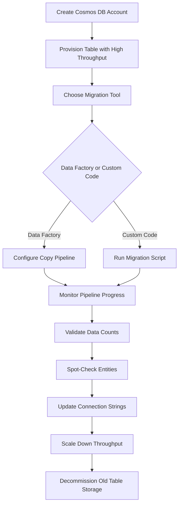

# How to Migrate Data from Azure Table Storage to Azure Cosmos DB Table API

Author: [nawazdhandala](https://www.github.com/nawazdhandala)

Tags: Azure, Table Storage, Cosmos DB, Data Migration, Cloud Migration, NoSQL, Database

Description: A step-by-step guide to migrating your data from Azure Table Storage to Azure Cosmos DB Table API with minimal downtime and data loss.

---

Azure Table Storage is a great NoSQL store for simple key-value data. But at some point, you might need features it does not offer - global distribution, single-digit millisecond latency guarantees, automatic secondary indexes, or more granular throughput control. That is when Azure Cosmos DB Table API enters the picture. It provides a wire-compatible API with Azure Table Storage, meaning your existing code can work with minimal changes. The tricky part is getting your data moved. Let me walk through the entire migration process.

## Why Migrate to Cosmos DB Table API?

Before diving into the how, let me quickly cover the why. Cosmos DB Table API offers several advantages over standard Table Storage.

Guaranteed low latency. Cosmos DB backs reads and writes with SLA-backed latency guarantees (under 10 ms for reads, under 15 ms for writes at the 99th percentile).

Global distribution. You can replicate your data across multiple Azure regions with automatic failover.

Automatic indexing. Every property is indexed by default, so queries on non-key properties are fast.

Higher throughput. You can provision throughput in Request Units (RUs) and scale up as needed without partition-level throughput limits.

The trade-off is cost. Cosmos DB is more expensive per GB stored and per operation. Make sure the benefits justify the price for your workload.

## Step 1: Create the Cosmos DB Account

First, create a Cosmos DB account with the Table API.

```bash
# Create a Cosmos DB account with the Table API
az cosmosdb create \
  --name my-cosmosdb-tables \
  --resource-group my-resource-group \
  --kind GlobalDocumentDB \
  --capabilities EnableTable \
  --default-consistency-level Session \
  --locations regionName=eastus failoverPriority=0

# Create a table in Cosmos DB with provisioned throughput
az cosmosdb table create \
  --account-name my-cosmosdb-tables \
  --resource-group my-resource-group \
  --name Employees \
  --throughput 10000
```

Set the throughput high during migration and scale it down afterward. You can also use autoscale.

## Step 2: Choose Your Migration Tool

There are several tools for migrating data.

**Azure Data Factory** is the recommended approach for large-scale migrations. It handles parallelism, retries, and monitoring out of the box.

**The Data Migration Tool (dt)** is a standalone utility from Microsoft designed for Cosmos DB migrations. It is straightforward for smaller datasets.

**Custom code** gives you the most control, especially if you need to transform data during migration.

## Step 3: Migrate Using Azure Data Factory

Here is how to set up a Data Factory pipeline for the migration.

```bash
# Create a Data Factory instance
az datafactory create \
  --resource-group my-resource-group \
  --factory-name my-migration-factory \
  --location eastus
```

In the Azure portal, create a Copy Data pipeline with the following configuration:

Source: Azure Table Storage linked service pointing to your storage account.

Sink: Azure Cosmos DB Table API linked service pointing to your Cosmos DB account.

You can also define the pipeline as JSON.

```json
{
    "name": "MigrateTableStorage",
    "properties": {
        "activities": [
            {
                "name": "CopyEmployees",
                "type": "Copy",
                "inputs": [
                    {
                        "referenceName": "AzureTableSource",
                        "type": "DatasetReference"
                    }
                ],
                "outputs": [
                    {
                        "referenceName": "CosmosTableSink",
                        "type": "DatasetReference"
                    }
                ],
                "typeProperties": {
                    "source": {
                        "type": "AzureTableSource",
                        "azureTableSourceQuery": ""
                    },
                    "sink": {
                        "type": "AzureTableSink",
                        "azureTableInsertType": "merge",
                        "writeBatchSize": 100
                    }
                }
            }
        ]
    }
}
```

## Step 4: Migrate Using Custom Code

For smaller datasets or when you need data transformation during migration, custom code works well.

```python
from azure.data.tables import TableClient
from azure.data.tables import TableServiceClient
import os
import time

# Source: Azure Table Storage
source_conn = os.environ["SOURCE_TABLE_CONNECTION_STRING"]
source_client = TableClient.from_connection_string(source_conn, "Employees")

# Destination: Cosmos DB Table API
# The Cosmos DB connection string uses the same SDK
dest_conn = os.environ["COSMOS_TABLE_CONNECTION_STRING"]
dest_client = TableClient.from_connection_string(dest_conn, "Employees")

def migrate_table(source, dest, batch_size=50):
    """
    Migrate all entities from source Table Storage to Cosmos DB.
    Uses batches grouped by PartitionKey for efficiency.
    Includes rate limiting to avoid exceeding provisioned throughput.
    """
    migrated = 0
    failed = 0
    current_batch = []
    current_pk = None

    # Query all entities from the source
    entities = source.list_entities()

    for entity in entities:
        pk = entity["PartitionKey"]

        # If partition key changed, flush the current batch
        if current_pk is not None and pk != current_pk:
            success, fail = flush_batch(dest, current_batch)
            migrated += success
            failed += fail
            current_batch = []

        current_pk = pk
        current_batch.append(entity)

        # Flush when batch reaches size limit
        if len(current_batch) >= batch_size:
            success, fail = flush_batch(dest, current_batch)
            migrated += success
            failed += fail
            current_batch = []

    # Flush remaining entities
    if current_batch:
        success, fail = flush_batch(dest, current_batch)
        migrated += success
        failed += fail

    return migrated, failed

def flush_batch(dest_client, entities):
    """
    Insert a batch of entities into the destination table.
    Falls back to individual inserts if batch fails.
    """
    try:
        operations = [("upsert", entity) for entity in entities]
        dest_client.submit_transaction(operations)
        # Small delay to avoid exceeding Cosmos DB throughput
        time.sleep(0.1)
        return len(entities), 0
    except Exception as e:
        print(f"Batch failed, falling back to individual inserts: {e}")
        success = 0
        fail = 0
        for entity in entities:
            try:
                dest_client.upsert_entity(entity)
                success += 1
            except Exception as individual_error:
                print(f"Failed to migrate entity {entity['RowKey']}: {individual_error}")
                fail += 1
        return success, fail

migrated, failed = migrate_table(source_client, dest_client)
print(f"Migration complete. Migrated: {migrated}, Failed: {failed}")
```

## Step 5: Handle Throughput and Throttling

Cosmos DB has a provisioned throughput model. If you push data faster than your provisioned RUs allow, you will get 429 (Too Many Requests) responses. Handle these with retry logic.

```python
from azure.core.exceptions import HttpResponseError
import time

def upsert_with_retry(client, entity, max_retries=5):
    """
    Insert an entity with retry logic for Cosmos DB throttling.
    Uses exponential backoff when hitting 429 status codes.
    """
    for attempt in range(max_retries):
        try:
            client.upsert_entity(entity)
            return True
        except HttpResponseError as e:
            if e.status_code == 429:
                # Extract retry-after header or use exponential backoff
                wait_time = 2 ** attempt
                print(f"Throttled, waiting {wait_time}s before retry")
                time.sleep(wait_time)
            else:
                raise
    return False
```

## Step 6: Validate the Migration

After migration, validate that all data was transferred correctly.

```python
def validate_migration(source_client, dest_client):
    """
    Compare entity counts and sample entities between source and destination.
    """
    # Count entities in both tables
    source_count = sum(1 for _ in source_client.list_entities())
    dest_count = sum(1 for _ in dest_client.list_entities())

    print(f"Source entities: {source_count}")
    print(f"Destination entities: {dest_count}")

    if source_count != dest_count:
        print(f"WARNING: Count mismatch! Missing {source_count - dest_count} entities")

    # Spot-check some entities
    sample_entities = list(source_client.query_entities(
        query_filter="",
        select=["PartitionKey", "RowKey"],
        results_per_page=10
    ))

    for entity in sample_entities[:10]:
        try:
            dest_entity = dest_client.get_entity(
                entity["PartitionKey"],
                entity["RowKey"]
            )
            # Compare key fields
            print(f"Verified: {entity['PartitionKey']}/{entity['RowKey']}")
        except Exception:
            print(f"MISSING: {entity['PartitionKey']}/{entity['RowKey']}")
```

## Step 7: Update Your Application

The Cosmos DB Table API uses the same SDK as Azure Table Storage. You mainly just need to swap the connection string.

```python
# Before: Azure Table Storage connection string
# connection_string = "DefaultEndpointsProtocol=https;AccountName=...;AccountKey=...;TableEndpoint=https://mystorageaccount.table.core.windows.net/"

# After: Cosmos DB Table API connection string
# connection_string = "DefaultEndpointsProtocol=https;AccountName=...;AccountKey=...;TableEndpoint=https://my-cosmosdb-tables.table.cosmos.azure.com:443/"

# The rest of your code stays the same
table_client = TableClient.from_connection_string(connection_string, "Employees")
```

## Migration Flow Overview



## Post-Migration Considerations

After the migration is complete, scale down your Cosmos DB throughput to match your actual workload. The high throughput you provisioned for migration would be expensive to maintain.

Monitor your RU consumption for a few days to right-size your throughput. Cosmos DB provides detailed metrics in the Azure portal showing exactly how many RUs each operation consumes.

Consider enabling autoscale if your workload has variable traffic patterns. Autoscale adjusts throughput between a minimum and maximum you define, saving money during quiet periods.

The migration from Azure Table Storage to Cosmos DB Table API is straightforward thanks to the compatible API. The biggest considerations are managing throughput during the migration and validating data completeness afterward. Take your time with the validation step and you will have a smooth transition.
