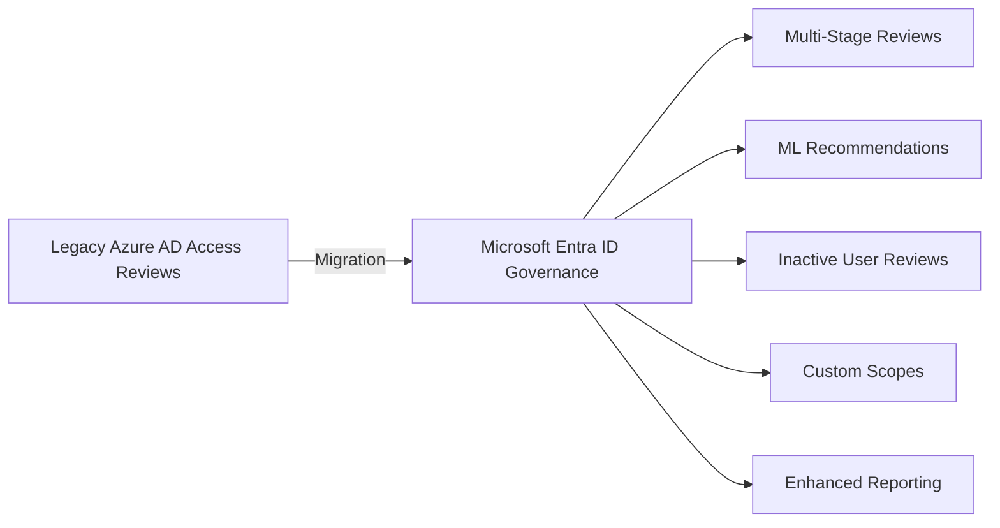

# How to Migrate from Azure AD Access Reviews to Microsoft Entra ID Governance Access Reviews

Author: [nawazdhandala](https://www.github.com/nawazdhandala)

Tags: Microsoft Entra ID, Access Reviews, Identity Governance, Azure AD, Migration, Compliance, Access Management

Description: A practical migration guide for moving from legacy Azure AD Access Reviews to the new Microsoft Entra ID Governance Access Reviews platform.

---

Microsoft has been steadily migrating Azure AD features into the broader Microsoft Entra product family. Access Reviews - the feature that helps you periodically verify who has access to what - is one of the capabilities that has moved from the Azure AD blade to Microsoft Entra ID Governance. If you have existing access reviews configured in the old Azure AD interface, you need to understand what has changed, what needs to be migrated, and what new capabilities are available.

This guide walks through the migration process, covering the differences between the old and new platforms, how to recreate your reviews, and how to take advantage of the new features.

## What Changed Between the Platforms

The core concept has not changed: access reviews periodically ask reviewers to confirm or revoke access for users, groups, or application assignments. But the new Entra ID Governance platform adds several improvements:

**Multi-stage reviews**: You can now chain multiple review stages. For example, the direct manager reviews first, then the resource owner reviews any decisions the manager did not make.

**Machine learning recommendations**: The new platform uses ML to recommend approve or deny decisions based on user activity patterns. If a user has not accessed a resource in 90 days, the system recommends removal.

**Inactive user reviews**: You can create reviews that specifically target users who have not used a resource within a specified timeframe.

**Custom review scopes**: Instead of reviewing all members of a group, you can scope the review to specific conditions like guest users only, or users from a specific department.

**Improved reporting**: The governance dashboard provides better visibility into review completion rates, decision patterns, and compliance posture.



## Prerequisites

Before migrating, confirm the following:

- Microsoft Entra ID P2 licenses (same requirement as before)
- Microsoft Entra ID Governance license for the advanced features (multi-stage, inactive user reviews)
- Global Administrator, Identity Governance Administrator, or User Administrator role
- An inventory of your existing access reviews

## Step 1: Inventory Existing Access Reviews

Before making any changes, document your current access review configuration. This gives you a checklist for the migration.

```powershell
# Connect to Microsoft Graph
Connect-MgGraph -Scopes "AccessReview.ReadWrite.All"

# List all existing access review definitions
$reviews = Get-MgIdentityGovernanceAccessReviewDefinition -All
$reviews | Select-Object DisplayName, Status, @{
    Name='Scope'; Expression={$_.Scope.AdditionalProperties.query}
}, @{
    Name='ReviewerType'; Expression={$_.Reviewers[0].Query}
}, StartDate | Format-Table -AutoSize

# Export the inventory to a CSV for reference
$reviews | Select-Object Id, DisplayName, Status, CreatedDateTime |
    Export-Csv -Path "access-review-inventory.csv" -NoTypeInformation
```

For each review, document:
- The name and description
- What is being reviewed (group membership, application assignment, role assignment)
- Who the reviewers are (managers, group owners, specific users, self-review)
- The review frequency (one-time, weekly, monthly, quarterly)
- What happens when reviewers do not respond (auto-approve or auto-deny)
- The notification settings

## Step 2: Understand the New Access Review Configuration

The new Entra ID Governance access reviews are configured through the same Microsoft Graph API and the Entra admin center portal, but the options have expanded.

Navigate to the Microsoft Entra admin center > Identity Governance > Access Reviews.

Here is a comparison of old vs. new settings:

| Setting | Legacy | Entra ID Governance |
|---|---|---|
| Review stages | Single stage | Multi-stage (up to 3 stages) |
| ML recommendations | Basic (last sign-in) | Advanced (resource usage, peer analysis) |
| Inactive user filter | Not available | Filter by days of inactivity |
| Auto-apply results | Yes | Yes, with configurable delay |
| Review scope | Group/App/Role members | Custom query-based scopes |
| Reviewer fallback | Fixed | Configurable fallback per stage |

## Step 3: Recreate Reviews in the New Platform

For most organizations, the easiest path is to let existing reviews complete their current cycle, then create new reviews in the Governance platform with enhanced settings.

Here is how to create a review using the new capabilities.

### Example: Quarterly Group Membership Review with Multi-Stage Approval

```powershell
# Create a multi-stage access review for a security group
$reviewDefinition = @{
    DisplayName = "Quarterly Review - Finance Team Access"
    DescriptionForAdmins = "Quarterly review of Finance Security Group membership"
    DescriptionForReviewers = "Please review whether each member still needs access to the Finance team resources."
    Scope = @{
        "@odata.type" = "#microsoft.graph.accessReviewQueryScope"
        Query = "/groups/FINANCE_GROUP_ID/members"
        QueryType = "MicrosoftGraph"
    }
    # Multi-stage configuration
    StageSettings = @(
        @{
            StageId = "1"
            DurationInDays = 7
            # First stage: direct managers review
            Reviewers = @(
                @{
                    Query = "./manager"
                    QueryType = "MicrosoftGraph"
                    QueryRoot = "decisions"
                }
            )
            RecommendationsEnabled = $true
            # Pass undecided items to stage 2
            FallbackReviewers = @()
        },
        @{
            StageId = "2"
            DurationInDays = 7
            DependsOn = @("1")
            # Second stage: group owner reviews items not decided in stage 1
            Reviewers = @(
                @{
                    Query = "/groups/FINANCE_GROUP_ID/owners"
                    QueryType = "MicrosoftGraph"
                }
            )
            RecommendationsEnabled = $true
        }
    )
    Settings = @{
        MailNotificationsEnabled = $true
        ReminderNotificationsEnabled = $true
        JustificationRequiredOnApproval = $true
        # Auto-remove access if no decision is made after all stages
        DefaultDecisionEnabled = $true
        DefaultDecision = "Deny"
        # How often the review recurs
        Recurrence = @{
            Pattern = @{
                Type = "absoluteMonthly"
                Interval = 3  # Quarterly
            }
            Range = @{
                Type = "noEnd"
                StartDate = "2026-03-01"
            }
        }
        # Apply results automatically after review ends
        AutoApplyDecisionsEnabled = $true
        # Require reviewer to provide a reason for approval
        InstanceDurationInDays = 14
        RecommendationInsightSettings = @(
            @{
                "@odata.type" = "#microsoft.graph.userLastSignInRecommendationInsightSetting"
                RecommendationLookBackDuration = "P90D"  # 90 days
                SignInScope = "tenant"
            }
        )
    }
}

New-MgIdentityGovernanceAccessReviewDefinition -BodyParameter $reviewDefinition
```

This review has two stages: first the direct manager reviews, then the group owner reviews anything the manager did not decide on. ML recommendations are enabled with a 90-day look-back window, and access is automatically removed if nobody approves within the review period.

### Example: Review of Inactive Guest Users

One of the new capabilities is reviewing users based on inactivity. This is perfect for guest accounts that may have gone stale.

```powershell
# Create a review targeting inactive guest users
$guestReview = @{
    DisplayName = "Monthly Inactive Guest User Review"
    DescriptionForAdmins = "Review guest users who have not signed in for 60 days"
    Scope = @{
        "@odata.type" = "#microsoft.graph.accessReviewInactiveUsersQueryScope"
        Query = "/users?$filter=(userType eq 'Guest')"
        QueryType = "MicrosoftGraph"
        InactiveDuration = "P60D"  # 60 days of inactivity
    }
    Reviewers = @(
        @{
            Query = "/users/ADMIN_USER_ID"
            QueryType = "MicrosoftGraph"
        }
    )
    Settings = @{
        MailNotificationsEnabled = $true
        DefaultDecisionEnabled = $true
        DefaultDecision = "Deny"
        AutoApplyDecisionsEnabled = $true
        Recurrence = @{
            Pattern = @{
                Type = "absoluteMonthly"
                Interval = 1
            }
            Range = @{
                Type = "noEnd"
                StartDate = "2026-03-01"
            }
        }
    }
}

New-MgIdentityGovernanceAccessReviewDefinition -BodyParameter $guestReview
```

## Step 4: Decommission Legacy Reviews

After your new reviews are running and producing results, decommission the old reviews to avoid duplicate notifications.

```powershell
# Stop and delete legacy access reviews that have been replaced
$legacyReviews = Get-MgIdentityGovernanceAccessReviewDefinition -Filter "displayName eq 'Old Finance Review'"
foreach ($review in $legacyReviews) {
    # Stop the review if it is currently active
    Stop-MgIdentityGovernanceAccessReviewDefinition -AccessReviewScheduleDefinitionId $review.Id
    # Delete the review definition
    Remove-MgIdentityGovernanceAccessReviewDefinition -AccessReviewScheduleDefinitionId $review.Id
}
```

Do not delete legacy reviews until you have confirmed the new reviews are working. Run the new reviews through at least one complete cycle before decommissioning the old ones.

## Step 5: Monitor Review Health

Set up monitoring for your access reviews to ensure they are being completed on time.

```powershell
# Check the completion status of all active review instances
$definitions = Get-MgIdentityGovernanceAccessReviewDefinition -All
foreach ($def in $definitions) {
    $instances = Get-MgIdentityGovernanceAccessReviewDefinitionInstance -AccessReviewScheduleDefinitionId $def.Id
    foreach ($instance in $instances) {
        $decisions = Get-MgIdentityGovernanceAccessReviewDefinitionInstanceDecision `
            -AccessReviewScheduleDefinitionId $def.Id `
            -AccessReviewInstanceId $instance.Id
        $total = $decisions.Count
        $decided = ($decisions | Where-Object { $_.Decision -ne "NotReviewed" }).Count
        Write-Output "$($def.DisplayName): $decided/$total decisions made ($($instance.Status))"
    }
}
```

If reviewers are not completing their reviews on time, consider:
- Sending additional reminder emails
- Shortening the review window to create urgency
- Setting up a fallback reviewer who handles undecided items
- Enabling auto-deny for undecided items to force action

## Best Practices for the Migration

1. **Migrate one review at a time.** Do not try to move everything at once. Start with your most important reviews and verify they work before moving on.

2. **Take advantage of ML recommendations.** Reviewers often approve everyone because reviewing hundreds of users is tedious. ML recommendations make the review faster and more accurate.

3. **Use multi-stage reviews for sensitive resources.** A single reviewer might miss something. Having a second stage catches mistakes and distributes the review workload.

4. **Set auto-deny as the default for non-responses.** This creates a "fail-closed" posture where access is removed if nobody confirms it. This is the safer default.

5. **Keep historical review data.** Do not delete old review instances until you have exported the decision data. Compliance auditors may ask for historical review records.

## Wrapping Up

The migration from Azure AD Access Reviews to Microsoft Entra ID Governance Access Reviews is not a forced cutover - existing reviews continue to work. But the new platform offers significant improvements like multi-stage reviews, ML-powered recommendations, and inactive user targeting that make the migration worthwhile. Plan the transition by inventorying your current reviews, recreate them with enhanced settings in the new platform, verify they complete successfully, and then decommission the old ones. The result is a more effective governance program with less reviewer fatigue and better compliance coverage.
