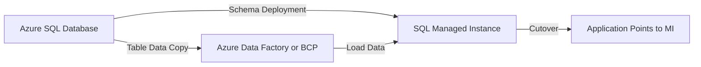

# How to Migrate from Azure SQL Database to Azure SQL Managed Instance

Author: [nawazdhandala](https://www.github.com/nawazdhandala)

Tags: Azure, SQL Managed Instance, Database Migration, Azure SQL, Cloud Migration

Description: A practical guide to migrating your databases from Azure SQL Database to Azure SQL Managed Instance with minimal downtime and data loss.

---

Azure SQL Managed Instance offers a near-complete SQL Server surface area that Azure SQL Database does not. If you started with Azure SQL Database and now need features like cross-database queries, SQL Agent, Service Broker, CLR integration, or linked servers, migrating to Managed Instance is the logical next step. This guide walks through the migration process from planning to execution.

## Why Migrate to SQL Managed Instance?

Azure SQL Database is great for single-database workloads, but it has deliberate limitations. It does not support certain SQL Server features because it was designed as a fully managed PaaS with a simplified surface area. SQL Managed Instance bridges the gap between Azure SQL Database and a full SQL Server installation. Here are the most common reasons teams make the move:

- Cross-database queries and transactions are needed
- SQL Server Agent jobs are required for scheduling
- Service Broker messaging between databases
- CLR stored procedures and functions
- Linked servers to other SQL Server instances
- Database Mail functionality
- Broader T-SQL compatibility

## Assess Your Current Environment

Before starting the migration, you need to understand what you are working with. Azure Database Migration Service does not provide an online Azure SQL Database to SQL Managed Instance migration path, so review your Azure SQL Database for compatibility issues before moving to Managed Instance.

Here is a basic inventory query you can run against the source database:

```sql
-- Inventory programmability objects that may need review before migration
SELECT
    o.name AS ObjectName,
    o.type_desc AS ObjectType,
    m.definition
FROM sys.sql_modules m
JOIN sys.objects o ON m.object_id = o.object_id
WHERE m.definition LIKE '%sys.dm_db_resource_stats%'
   OR m.definition LIKE '%elastic%'
   OR m.definition LIKE '%EXTERNAL DATA SOURCE%';
```

Pay attention to:

- Any deprecated features you might be using
- Data types or functions that behave differently
- Schema objects that need modification
- Stored procedures with platform-specific code

## Choose Your Migration Method

There are several approaches, and the right one depends on your database size, tolerance for downtime, and complexity.

### Option 1: BACPAC Export and Import

This is the simplest method but requires downtime. You export your Azure SQL Database as a BACPAC file and import it into the Managed Instance.

```sql
-- Step 1: Export from Azure SQL Database
-- Use the Azure Portal or SqlPackage.exe
-- The portal can export to Azure Blob Storage; SqlPackage writes to a filesystem path

-- Step 2: Import into Managed Instance using SqlPackage
-- Replace placeholders with your actual values
```

```bash
# Export the database to a local BACPAC file
SqlPackage.exe /Action:Export \
  /SourceServerName:myserver.database.windows.net \
  /SourceDatabaseName:mydb \
  /SourceUser:admin \
  /SourcePassword:YourPassword123 \
  /TargetFile:"C:\backups\mydb.bacpac"

# Import the BACPAC into Managed Instance
SqlPackage.exe /Action:Import \
  /TargetServerName:myinstance.abc123.database.windows.net \
  /TargetDatabaseName:mydb \
  /TargetUser:admin \
  /TargetPassword:YourPassword123 \
  /SourceFile:"C:\backups\mydb.bacpac"
```

This approach works well for databases under 200 GB and when you can afford a maintenance window. If you need to stage the BACPAC in Azure Storage, upload and download the file separately, because SqlPackage import and export use filesystem paths for BACPAC files.

### Option 2: Data Copy with Azure Data Factory or BCP

For larger databases where a BACPAC export is not practical, use Azure Data Factory or BCP to copy table data from Azure SQL Database to SQL Managed Instance. Azure Database Migration Service online migrations to SQL Managed Instance are designed for SQL Server sources, not Azure SQL Database sources.

The general flow looks like this:



Steps to set up this style of migration:

1. Deploy the schema to SQL Managed Instance using SqlPackage, SSDT, or your normal deployment pipeline
2. Create an Azure Data Factory pipeline or BCP scripts for the tables you need to copy
3. Configure the source connection to your Azure SQL Database
4. Configure the target connection to your Managed Instance
5. Run an initial data load and validate row counts
6. Pause writes during the final cutover window
7. Run a final incremental load if your process supports it, then point the application to MI

### Option 3: Transactional Replication

Transactional replication is not a direct migration path from Azure SQL Database to SQL Managed Instance. Azure SQL Database can be a push subscriber for transactional replication, but it cannot be the publisher. SQL Managed Instance can act as a publisher, distributor, or subscriber.

## Prepare the Target Managed Instance

Before migrating data, make sure your Managed Instance is properly configured.

```sql
-- Check available storage on the Managed Instance
SELECT
    storage_space_used_mb,
    reserved_storage_mb,
    reserved_storage_mb - storage_space_used_mb AS available_storage_mb
FROM sys.server_resource_stats
ORDER BY start_time DESC;

-- Verify the service tier can handle your workload
SELECT
    SERVERPROPERTY('Edition') AS Edition,
    SERVERPROPERTY('EngineEdition') AS EngineEdition;
```

Make sure you have:

- Enough storage allocated (resize if needed before migration)
- The right compute tier (General Purpose or Business Critical)
- Network connectivity between your application and the Managed Instance
- VNet configured with the proper subnet delegated to SQL Managed Instance

## Handle Schema Differences

Some objects in Azure SQL Database might need adjustments for Managed Instance. While MI has broader compatibility, there are still a few things to watch for.

```sql
-- Check for any objects using features specific to Azure SQL Database
-- For example, elastic pool references or certain DMVs
SELECT
    o.name AS ObjectName,
    o.type_desc AS ObjectType,
    m.definition
FROM sys.sql_modules m
JOIN sys.objects o ON m.object_id = o.object_id
WHERE m.definition LIKE '%elastic%'
   OR m.definition LIKE '%sys.dm_db_resource_stats%';
```

Common schema adjustments include:

- Replacing Azure SQL Database-specific DMVs with their Managed Instance equivalents
- Updating connection strings in any stored procedures that reference external databases
- Converting any elastic pool-specific logic

## Post-Migration Validation

After the data is migrated, run these validation checks:

```sql
-- Compare row counts between source and target
-- Run this on both databases and compare results
SELECT
    t.name AS TableName,
    p.rows AS RowCount
FROM sys.tables t
JOIN sys.partitions p ON t.object_id = p.object_id
WHERE p.index_id IN (0, 1)
ORDER BY t.name;

-- List routines to review or refresh after migration
SELECT
    name,
    type_desc
FROM sys.objects
WHERE type IN ('P', 'FN', 'IF', 'TF')
ORDER BY name;

-- Check for any broken dependencies
SELECT
    OBJECT_SCHEMA_NAME(referencing_id) AS ReferencingSchema,
    OBJECT_NAME(referencing_id) AS ReferencingObject,
    referenced_schema_name,
    referenced_entity_name
FROM sys.sql_expression_dependencies
WHERE referenced_id IS NULL
  AND referenced_entity_name IS NOT NULL;
```

## Update Application Connection Strings

The connection string format for Managed Instance is slightly different from Azure SQL Database.

```text
-- Azure SQL Database connection string
Server=myserver.database.windows.net;Database=mydb;User=admin;Password=secret;

-- SQL Managed Instance connection string
Server=myinstance.public.abc123.database.windows.net,3342;Database=mydb;User=admin;Password=secret;
```

Note the port number 3342 and the `.public.` host name label for the public endpoint, or use the VNet-local endpoint on port 1433 for private connectivity through the VNet.

## Performance Baseline Comparison

After migration, compare performance metrics to make sure nothing regressed.

```sql
-- Capture query performance on Managed Instance
SELECT TOP 20
    qs.total_elapsed_time / qs.execution_count AS avg_elapsed_time,
    qs.execution_count,
    SUBSTRING(qt.text, 1, 200) AS query_text
FROM sys.dm_exec_query_stats qs
CROSS APPLY sys.dm_exec_sql_text(qs.sql_handle) qt
ORDER BY avg_elapsed_time DESC;
```

## Common Pitfalls and How to Avoid Them

There are a few gotchas that catch people during this migration:

1. **VNet configuration delays**: Deploying or modifying a Managed Instance subnet can take hours. Plan this well ahead of the migration window.

2. **Storage sizing**: Managed Instance storage is pre-allocated. If your database is 300 GB, make sure you have at least 400-500 GB of reserved storage to accommodate growth and tempdb usage.

3. **DNS propagation**: After cutover, DNS changes for connection strings may take time to propagate. Test with IP addresses first if you see connection failures.

4. **Timezone differences**: Azure SQL Database uses UTC. Managed Instance allows configuring a timezone, but it must be set at creation time and cannot be changed later.

5. **Backup retention**: Your backup policies from Azure SQL Database do not carry over. Configure automated backups and long-term retention on the Managed Instance separately.

## Rollback Plan

Always have a rollback plan. Keep your Azure SQL Database running in read-only mode for at least a week after migration. If something goes wrong, you can point your application back to the original database. Once you are confident the migration is successful, decommission the old database to stop incurring costs.

Migrating from Azure SQL Database to SQL Managed Instance is not particularly difficult, but it does require careful planning. Take the time to assess compatibility, choose the right migration method for your downtime tolerance, and validate thoroughly after the move. The payoff is a much richer SQL Server feature set running as a fully managed service in Azure.
