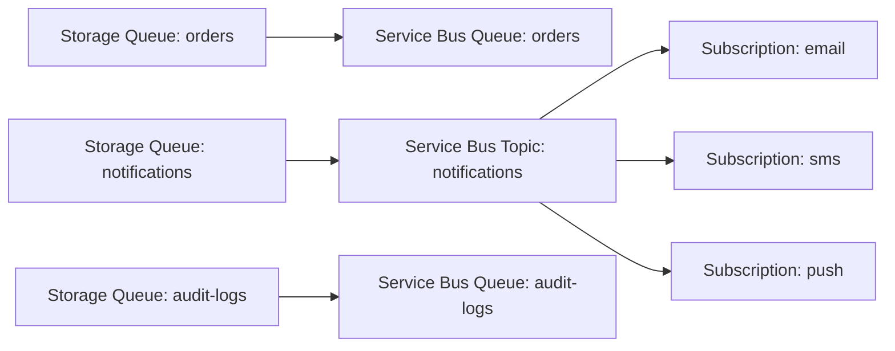
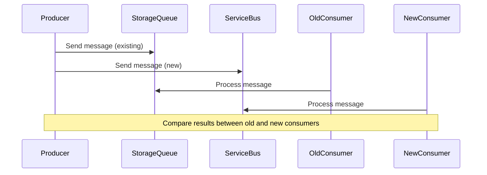

# How to Migrate from Azure Storage Queues to Azure Service Bus

Author: [nawazdhandala](https://www.github.com/nawazdhandala)

Tags: Azure, Service Bus, Storage Queues, Migration, Messaging, Cloud Architecture, Queue

Description: A practical guide to migrating your messaging workloads from Azure Storage Queues to Azure Service Bus with minimal downtime and data loss.

---

Azure Storage Queues are a great starting point for simple message queuing scenarios. They are cheap, easy to set up, and work well for basic producer-consumer patterns. But as your application grows, you often hit their limits - no dead-letter support, no topics and subscriptions, no sessions, and a maximum message size of 64 KB. When that happens, Azure Service Bus becomes the obvious next step.

This guide walks through the full migration process, covering everything from understanding the differences to running both systems side-by-side during the transition.

## Why Migrate?

Before diving into the how, let's be clear about the why. Azure Storage Queues give you a basic FIFO queue with at-least-once delivery. That works for a lot of scenarios, but Service Bus brings several features that Storage Queues simply do not have:

- Dead-letter queues for messages that fail processing
- Topics and subscriptions for pub/sub patterns
- Sessions for ordered message processing grouped by a key
- Duplicate detection built into the broker
- Message deferral and scheduled delivery
- Transactions spanning multiple operations
- Messages up to 256 KB (or 100 MB with Premium tier)

If you need any of these features, migrating is worth the effort.

## Step 1: Audit Your Current Usage

Start by understanding how your Storage Queues are currently used. Map out every queue, every producer, and every consumer. You need to know the message volume, peak throughput, average message size, and any patterns around visibility timeout usage.

Here is a simple script to inventory your existing queues and get basic metrics.

```csharp
// Enumerate all queues in a Storage Account and print basic info
using Azure.Storage.Queues;

var connectionString = "your-storage-connection-string";
var serviceClient = new QueueServiceClient(connectionString);

// List all queues in the storage account
await foreach (var queueItem in serviceClient.GetQueuesAsync())
{
    var queueClient = serviceClient.GetQueueClient(queueItem.Name);
    var properties = await queueClient.GetPropertiesAsync();

    // Print queue name and approximate message count
    Console.WriteLine($"Queue: {queueItem.Name}");
    Console.WriteLine($"  Approximate message count: {properties.Value.ApproximateMessagesCount}");
    Console.WriteLine();
}
```

## Step 2: Design the Service Bus Topology

Not every Storage Queue maps one-to-one to a Service Bus queue. Some queues might be better served by a topic with subscriptions. For example, if you have multiple consumers that each need to see every message, that is a topic. If you have a single consumer processing messages one at a time, that is a queue.

Here is a diagram of a typical migration mapping.



Create a mapping document that lists every source queue and its target Service Bus entity.

## Step 3: Provision Service Bus Resources

Create your Service Bus namespace and entities using the Azure CLI or Bicep templates. Here is a Bicep template that sets up a namespace with a queue and a topic.

```bicep
// Bicep template to create a Service Bus namespace with a queue and topic
param location string = resourceGroup().location
param namespaceName string = 'sb-myapp-prod'

// Create the Service Bus namespace at Standard tier
resource sbNamespace 'Microsoft.ServiceBus/namespaces@2022-10-01-preview' = {
  name: namespaceName
  location: location
  sku: {
    name: 'Standard'
    tier: 'Standard'
  }
}

// Create a queue for order processing
resource ordersQueue 'Microsoft.ServiceBus/namespaces/queues@2022-10-01-preview' = {
  parent: sbNamespace
  name: 'orders'
  properties: {
    maxDeliveryCount: 10
    deadLetteringOnMessageExpiration: true
    lockDuration: 'PT1M'
    defaultMessageTimeToLive: 'P14D'
  }
}

// Create a topic for notifications
resource notificationsTopic 'Microsoft.ServiceBus/namespaces/topics@2022-10-01-preview' = {
  parent: sbNamespace
  name: 'notifications'
  properties: {
    defaultMessageTimeToLive: 'P7D'
    maxSizeInMegabytes: 1024
  }
}
```

## Step 4: Update Message Serialization

Storage Queues store messages as strings (often base64-encoded). Service Bus messages have a body that can be bytes, and they support a rich set of properties. Take this opportunity to clean up your message format.

Here is an example of adapting a message sender from Storage Queues to Service Bus.

```csharp
// Old: Sending a message via Storage Queue
using Azure.Storage.Queues;
using System.Text.Json;

var storageClient = new QueueClient("storage-conn-string", "orders");
var order = new Order { Id = 1, Product = "Widget", Quantity = 5 };

// Storage Queues require string messages
var messageBody = JsonSerializer.Serialize(order);
await storageClient.SendMessageAsync(messageBody);

// New: Sending a message via Service Bus
using Azure.Messaging.ServiceBus;

var sbClient = new ServiceBusClient("servicebus-conn-string");
var sender = sbClient.CreateSender("orders");

var sbMessage = new ServiceBusMessage(JsonSerializer.Serialize(order))
{
    // Set a content type so consumers know the format
    ContentType = "application/json",
    // Correlation ID for tracing through your system
    CorrelationId = Guid.NewGuid().ToString(),
    // Subject helps with filtering on topics
    Subject = "new-order"
};

await sender.SendMessageAsync(sbMessage);
```

## Step 5: Update Consumers

The consumer side needs the most attention. Storage Queue consumers typically poll with a visibility timeout, and if processing fails, the message reappears. Service Bus uses peek-lock by default, which is similar but has better semantics.

```csharp
// Service Bus consumer with proper error handling
using Azure.Messaging.ServiceBus;

var client = new ServiceBusClient("servicebus-conn-string");

// Create a processor that handles messages automatically
var processor = client.CreateProcessor("orders", new ServiceBusProcessorOptions
{
    MaxConcurrentCalls = 5,
    AutoCompleteMessages = false // We want explicit control
});

// Handler for successful processing
processor.ProcessMessageAsync += async args =>
{
    var body = args.Message.Body.ToString();
    var order = JsonSerializer.Deserialize<Order>(body);

    // Process the order
    await ProcessOrder(order);

    // Explicitly complete the message to remove it from the queue
    await args.CompleteMessageAsync(args.Message);
};

// Handler for errors during processing
processor.ProcessErrorAsync += async args =>
{
    Console.WriteLine($"Error: {args.Exception.Message}");
    Console.WriteLine($"Source: {args.ErrorSource}");
    // Message will be retried automatically up to maxDeliveryCount
};

await processor.StartProcessingAsync();
```

## Step 6: Run Both Systems in Parallel

The safest migration strategy is to run both systems side by side. Have your producers send messages to both Storage Queues and Service Bus for a period of time. This lets you verify that Service Bus consumers are processing correctly without risking data loss.



During this phase, monitor both paths and compare the results. Check message counts, processing latency, and error rates.

## Step 7: Cut Over

Once you are confident that Service Bus is handling messages correctly, flip the switch. Stop sending to Storage Queues but keep the old consumers running until the queues are fully drained. Then decommission the old infrastructure.

## Common Pitfalls

There are a few things that trip people up during this migration.

**Message ordering**: Storage Queues do not guarantee ordering. If your application accidentally depends on approximate ordering behavior, Service Bus sessions might change that behavior. Test thoroughly.

**Poison message handling**: With Storage Queues, you handle poison messages manually by checking the dequeue count. Service Bus handles this automatically with its dead-letter queue after the max delivery count is reached.

**Cost differences**: Service Bus is more expensive per operation than Storage Queues. Run cost estimates based on your actual message volume before committing.

**Connection management**: Service Bus connections are more heavyweight than Storage Queue HTTP calls. Use a single `ServiceBusClient` instance per application and share it.

## Monitoring After Migration

Set up Azure Monitor alerts on your Service Bus namespace. Key metrics to watch include active message count, dead-letter message count, server errors, and throttled requests. If you are coming from Storage Queues, you likely did not have dead-letter monitoring before, so make sure to set that up from day one.

## Wrapping Up

Migrating from Azure Storage Queues to Azure Service Bus is not a trivial lift-and-shift. The APIs are different, the semantics are different, and the operational model is different. But the benefits - dead-lettering, topics, sessions, and richer message handling - make it worthwhile for any application that has outgrown basic queuing. Take it step by step, run both systems in parallel during the transition, and you will come out the other side with a more robust messaging backbone.
