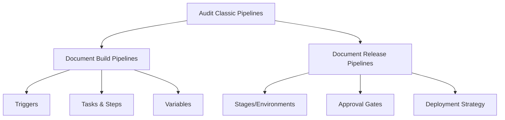

# How to Migrate from Classic Pipelines to YAML Pipelines in Azure DevOps

Author: [nawazdhandala](https://www.github.com/nawazdhandala)

Tags: Azure DevOps, YAML Pipelines, Classic Pipelines, CI/CD, Migration, DevOps, Pipeline as Code

Description: A practical guide for migrating your Azure DevOps classic build and release pipelines to modern YAML-based pipelines.

---

If you have been using Azure DevOps for a while, you probably have classic pipelines - the ones built through the visual designer. They work fine, but Microsoft has been pushing YAML pipelines hard, and for good reason. YAML pipelines are version-controlled, reviewable in pull requests, and portable across projects. Classic pipelines are none of those things.

The migration does not have to be a big-bang effort. In this post, I will share a methodical approach to migrating from classic to YAML, including how to export existing pipelines, handle common patterns that do not have direct YAML equivalents, and avoid the pitfalls that trip up most teams.

## Why Migrate?

Before spending time on migration, let us be clear about the benefits:

**Version control.** Your pipeline definition lives in the same repository as your code. You can see exactly what the pipeline looked like at any commit, review changes in PRs, and roll back if something breaks.

**Reproducibility.** Given a commit hash, you can reproduce the exact pipeline that ran against it. With classic pipelines, the definition can change independently of the code.

**Templates and reuse.** YAML templates let you share pipeline logic across projects in ways that classic task groups cannot match.

**Multi-stage pipelines.** YAML pipelines can define build, test, and deployment stages in a single file, replacing the need for separate build and release pipelines.

**Future-proofing.** Microsoft's investment is in YAML pipelines. New features land in YAML first, and classic pipelines receive fewer updates over time.

## Step 1: Audit Your Existing Pipelines

Before migrating anything, catalog what you have. For each classic pipeline, document:

- What triggers it (branch, schedule, manual)
- What tasks it uses and their configuration
- What variables and variable groups it references
- What service connections it uses
- For release pipelines: the environments, approval gates, and deployment strategies

I use a simple spreadsheet for this.



## Step 2: Use the Export Feature

Azure DevOps can export a classic build pipeline to YAML. Go to your classic build pipeline, click **Edit**, then click the three dots menu and look for **View YAML** or **Export to YAML**.

The exported YAML is a starting point, not a finished product. It is often verbose, uses legacy task versions, and does not take advantage of YAML-specific features. But it saves you from having to look up every task's YAML syntax.

Here is what a typical exported pipeline looks like before cleanup.

```yaml
# Exported from classic pipeline - needs cleanup
trigger:
  branches:
    include:
      - main

pool:
  vmImage: 'windows-latest'

steps:
  - task: NuGetToolInstaller@1
    inputs:
      versionSpec: '6.x'

  - task: NuGetCommand@2
    inputs:
      command: 'restore'
      restoreSolution: '**/*.sln'
      feedsToUse: 'select'
      vstsFeed: 'my-feed-id-guid'

  - task: VSBuild@1
    inputs:
      solution: '**/*.sln'
      msbuildArgs: '/p:DeployOnBuild=true /p:WebPublishMethod=Package /p:PackageAsSingleFile=true'
      platform: 'Any CPU'
      configuration: 'Release'

  - task: VSTest@2
    inputs:
      platform: 'Any CPU'
      configuration: 'Release'

  - task: PublishBuildArtifacts@1
    inputs:
      PathtoPublish: '$(Build.ArtifactStagingDirectory)'
      ArtifactName: 'drop'
```

And after cleanup, using modern task versions and better practices.

```yaml
# Cleaned up YAML pipeline
trigger:
  branches:
    include:
      - main

pool:
  vmImage: 'ubuntu-latest'  # Switch to Linux unless Windows is required

variables:
  buildConfiguration: 'Release'

steps:
  # Restore NuGet packages
  - task: DotNetCoreCLI@2
    displayName: 'Restore packages'
    inputs:
      command: 'restore'
      projects: '**/*.csproj'
      feedsToUse: 'config'
      nugetConfigPath: 'nuget.config'

  # Build the solution
  - task: DotNetCoreCLI@2
    displayName: 'Build'
    inputs:
      command: 'build'
      projects: '**/*.csproj'
      arguments: '--configuration $(buildConfiguration) --no-restore'

  # Run tests
  - task: DotNetCoreCLI@2
    displayName: 'Run tests'
    inputs:
      command: 'test'
      projects: '**/*Tests.csproj'
      arguments: '--configuration $(buildConfiguration) --no-build'

  # Publish build output
  - task: DotNetCoreCLI@2
    displayName: 'Publish'
    inputs:
      command: 'publish'
      projects: '**/MyApp.csproj'
      arguments: '--configuration $(buildConfiguration) --output $(Build.ArtifactStagingDirectory)'

  # Upload artifacts
  - task: PublishBuildArtifacts@1
    displayName: 'Publish artifacts'
    inputs:
      pathToPublish: '$(Build.ArtifactStagingDirectory)'
      artifactName: 'drop'
```

## Step 3: Convert Release Pipelines to Stages

Classic release pipelines are the harder part of the migration. They have stages, environments, approval gates, and deployment strategies that need to be translated into YAML.

A classic release pipeline with Dev, Staging, and Production stages translates to something like this.

```yaml
# Multi-stage pipeline replacing a classic release pipeline
trigger:
  branches:
    include:
      - main

pool:
  vmImage: 'ubuntu-latest'

stages:
  # Build stage (replaces classic build pipeline)
  - stage: Build
    displayName: 'Build'
    jobs:
      - job: BuildJob
        steps:
          - task: DotNetCoreCLI@2
            displayName: 'Build and publish'
            inputs:
              command: 'publish'
              projects: '**/MyApp.csproj'
              arguments: '--configuration Release --output $(Build.ArtifactStagingDirectory)'

          - task: PublishBuildArtifacts@1
            inputs:
              pathToPublish: '$(Build.ArtifactStagingDirectory)'
              artifactName: 'drop'

  # Dev stage (replaces first release stage)
  - stage: DeployDev
    displayName: 'Deploy to Dev'
    dependsOn: Build
    jobs:
      - deployment: DeployDev
        environment: 'development'
        strategy:
          runOnce:
            deploy:
              steps:
                - task: AzureWebApp@1
                  inputs:
                    azureSubscription: 'my-service-connection'
                    appName: 'myapp-dev'
                    package: '$(Pipeline.Workspace)/drop/**/*.zip'

  # Staging stage with approval (replaces second release stage)
  - stage: DeployStaging
    displayName: 'Deploy to Staging'
    dependsOn: DeployDev
    jobs:
      - deployment: DeployStaging
        environment: 'staging'  # Configure approvals on this environment
        strategy:
          runOnce:
            deploy:
              steps:
                - task: AzureWebApp@1
                  inputs:
                    azureSubscription: 'my-service-connection'
                    appName: 'myapp-staging'
                    package: '$(Pipeline.Workspace)/drop/**/*.zip'

  # Production stage with approval (replaces third release stage)
  - stage: DeployProduction
    displayName: 'Deploy to Production'
    dependsOn: DeployStaging
    jobs:
      - deployment: DeployProduction
        environment: 'production'  # Configure approvals on this environment
        strategy:
          runOnce:
            deploy:
              steps:
                - task: AzureWebApp@1
                  inputs:
                    azureSubscription: 'my-service-connection'
                    appName: 'myapp-production'
                    package: '$(Pipeline.Workspace)/drop/**/*.zip'
```

## Handling Classic-Specific Features

### Variable Groups

Classic pipelines link variable groups through the UI. In YAML, you reference them explicitly.

```yaml
variables:
  # Reference a variable group by name
  - group: 'my-variable-group'
  # You can also define inline variables alongside groups
  - name: buildConfiguration
    value: 'Release'
```

### Pre and Post Deployment Gates

Classic release pipelines support pre and post deployment gates (like Azure Monitor alerts, REST API calls). In YAML, the closest equivalent is checks on environments.

Go to **Pipelines > Environments**, click your environment, and add checks like:
- Approvals
- Azure Monitor alerts
- Invoke REST API
- Business hours

### Task Groups

Classic task groups become YAML templates. Export the task group steps and put them in a template file.

```yaml
# templates/steps/run-integration-tests.yml
# Replacement for classic task group "Run Integration Tests"
parameters:
  - name: testFilter
    type: string
    default: 'Category=Integration'

steps:
  - task: DotNetCoreCLI@2
    displayName: 'Run integration tests'
    inputs:
      command: 'test'
      projects: '**/*IntegrationTests.csproj'
      arguments: '--filter "${{ parameters.testFilter }}"'
```

## Step 4: Run in Parallel

You do not have to migrate everything at once. A safe approach is:

1. Create the YAML pipeline alongside the classic one
2. Run both for a few sprints to verify they produce the same results
3. Disable the classic pipeline once you are confident
4. Delete the classic pipeline after a grace period

This way, if something goes wrong with the YAML pipeline, you can quickly revert to the classic one.

## Common Migration Pitfalls

**Artifact handling is different.** Classic release pipelines automatically download artifacts. YAML deployment jobs use `$(Pipeline.Workspace)` and the download task. Make sure your artifact paths are correct.

**Service connections might need new permissions.** YAML pipelines authenticate differently than classic ones. Verify that your service connections allow the YAML pipeline to use them.

**Scheduled triggers behave differently.** In classic pipelines, schedules are defined in the UI. In YAML, they are part of the file. If you have both, the YAML schedule takes precedence and the UI schedule is ignored.

**Variable scoping changes.** In classic pipelines, variables set in one phase are available in later phases. In YAML, variables are scoped to stages and jobs. You need output variables to pass data between them.

## Wrapping Up

Migrating from classic to YAML pipelines is an investment that pays off in maintainability, reproducibility, and team velocity. Take it one pipeline at a time, start with the simplest ones, and use the export feature as a starting point. Keep the classic pipeline running in parallel until you are confident in the YAML version. Within a few sprints, your team will wonder why they did not make the switch sooner.
