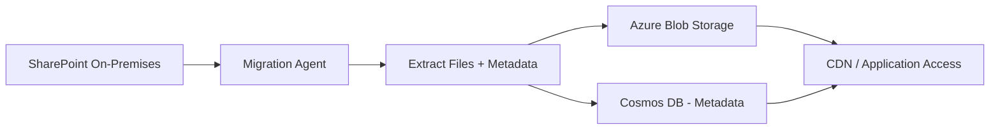

# How to Migrate SharePoint On-Premises Document Libraries to Azure Blob Storage with Metadata Preservation

Author: [nawazdhandala](https://www.github.com/nawazdhandala)

Tags: SharePoint, Azure Blob Storage, Migration, Metadata, On-Premises, Cloud Migration, PowerShell

Description: Migrate SharePoint on-premises document libraries to Azure Blob Storage while preserving metadata, permissions, and folder structure.

---

Moving document libraries from SharePoint on-premises to Azure Blob Storage is a common step in cloud migration projects. Maybe you are decommissioning your SharePoint farm, or you need cheaper storage for archived documents, or you want to build new applications that access the documents through Azure services. Whatever the reason, the migration is not just about copying files - you need to preserve the metadata, timestamps, and folder hierarchy that give those documents context.

In this guide, I will walk through the complete migration process, from connecting to your on-premises SharePoint farm to uploading documents to Azure Blob Storage with all their metadata intact.

## Migration Architecture



The migration agent connects to your SharePoint farm using the Client Side Object Model (CSOM) or REST API, extracts documents with their metadata, uploads the files to Azure Blob Storage, and stores the metadata in Cosmos DB for easy querying.

## Prerequisites and Connection Setup

First, set up the connections to both SharePoint and Azure:

```powershell
# Install required modules
Install-Module -Name PnP.PowerShell -Force
Install-Module -Name Az.Storage -Force
Install-Module -Name Az.CosmosDB -Force

# Connect to SharePoint on-premises
$siteUrl = "https://sharepoint.yourcompany.com/sites/documents"
$credentials = Get-Credential -Message "Enter SharePoint admin credentials"

Connect-PnPOnline -Url $siteUrl -Credentials $credentials

# Connect to Azure
Connect-AzAccount

# Set up the blob storage context
$storageAccount = Get-AzStorageAccount `
    -ResourceGroupName "rg-migration" `
    -Name "stmigratedspdocs"
$storageContext = $storageAccount.Context
```

## Inventorying the Source Library

Before migrating, inventory what you are working with. This helps you plan the migration batches and estimate time:

```powershell
# Inventory script that catalogs all documents in a SharePoint library
function Get-LibraryInventory {
    param(
        [string]$LibraryName
    )

    $items = Get-PnPListItem -List $LibraryName -PageSize 500

    $inventory = @()

    foreach ($item in $items) {
        $fileRef = $item.FieldValues["FileRef"]
        $fileSize = $item.FieldValues["File_x0020_Size"]

        $inventory += [PSCustomObject]@{
            FileName      = $item.FieldValues["FileLeafRef"]
            FilePath      = $fileRef
            FileSize      = [long]$fileSize
            ContentType   = $item.FieldValues["ContentType"].Name
            Created       = $item.FieldValues["Created"]
            Modified      = $item.FieldValues["Modified"]
            Author        = $item.FieldValues["Author"].Email
            Editor        = $item.FieldValues["Editor"].Email
            Version       = $item.FieldValues["_UIVersionString"]
            CheckedOutTo  = $item.FieldValues["CheckedOutTitle"]
        }
    }

    # Summary statistics
    $totalSize = ($inventory | Measure-Object -Property FileSize -Sum).Sum
    $totalFiles = $inventory.Count

    Write-Host "Library: $LibraryName"
    Write-Host "Total files: $totalFiles"
    Write-Host "Total size: $([math]::Round($totalSize / 1GB, 2)) GB"
    Write-Host "Date range: $(($inventory.Created | Sort-Object | Select-Object -First 1)) to $(($inventory.Created | Sort-Object | Select-Object -Last 1))"

    return $inventory
}

# Run inventory on the target library
$inventory = Get-LibraryInventory -LibraryName "Shared Documents"

# Export to CSV for review
$inventory | Export-Csv -Path "migration-inventory.csv" -NoTypeInformation
```

## Building the Migration Script

The main migration script processes documents in batches, preserving metadata as blob metadata and tags:

```powershell
# Main migration function that moves documents from SharePoint to Azure Blob Storage
function Migrate-DocumentLibrary {
    param(
        [string]$LibraryName,
        [string]$ContainerName,
        [object]$StorageContext,
        [int]$BatchSize = 100,
        [string]$LogFile = "migration-log.csv"
    )

    # Create the blob container if it does not exist
    $container = Get-AzStorageContainer -Name $ContainerName -Context $StorageContext -ErrorAction SilentlyContinue
    if (-not $container) {
        New-AzStorageContainer -Name $ContainerName -Context $StorageContext -Permission Off
        Write-Host "Created container: $ContainerName"
    }

    # Get all items from the library
    $items = Get-PnPListItem -List $LibraryName -PageSize $BatchSize

    $migrated = 0
    $failed = 0
    $skipped = 0

    foreach ($item in $items) {
        $fileName = $item.FieldValues["FileLeafRef"]
        $fileRef = $item.FieldValues["FileRef"]

        # Skip folders - we handle them through the blob path
        if ($item.FileSystemObjectType -eq "Folder") {
            $skipped++
            continue
        }

        try {
            # Build the blob path preserving the folder structure
            $relativePath = $fileRef -replace "^/sites/[^/]+/$LibraryName/", ""
            $blobName = $relativePath

            # Download the file from SharePoint
            $tempFile = [System.IO.Path]::GetTempFileName()
            Get-PnPFile -Url $fileRef -Path ([System.IO.Path]::GetDirectoryName($tempFile)) `
                -FileName ([System.IO.Path]::GetFileName($tempFile)) -AsFile -Force

            # Build metadata dictionary from SharePoint properties
            $metadata = @{
                "sp_created"     = $item.FieldValues["Created"].ToString("o")
                "sp_modified"    = $item.FieldValues["Modified"].ToString("o")
                "sp_author"      = ($item.FieldValues["Author"].Email -replace "[^a-zA-Z0-9@._-]", "")
                "sp_editor"      = ($item.FieldValues["Editor"].Email -replace "[^a-zA-Z0-9@._-]", "")
                "sp_contenttype" = ($item.FieldValues["ContentType"].Name -replace "[^a-zA-Z0-9 _-]", "")
                "sp_version"     = $item.FieldValues["_UIVersionString"]
                "sp_source"      = "sharepoint-onprem"
                "sp_library"     = $LibraryName
                "sp_itemid"      = $item.Id.ToString()
            }

            # Add any custom metadata columns
            foreach ($field in $item.FieldValues.Keys) {
                if ($field -like "Custom_*" -and $item.FieldValues[$field]) {
                    $safeKey = "sp_" + ($field -replace "[^a-zA-Z0-9_]", "").ToLower()
                    $safeValue = $item.FieldValues[$field].ToString().Substring(
                        0, [Math]::Min(256, $item.FieldValues[$field].ToString().Length))
                    $metadata[$safeKey] = $safeValue
                }
            }

            # Upload to Azure Blob Storage with metadata
            Set-AzStorageBlobContent `
                -File $tempFile `
                -Container $ContainerName `
                -Blob $blobName `
                -Context $StorageContext `
                -Metadata $metadata `
                -Force

            # Clean up temp file
            Remove-Item $tempFile -Force

            $migrated++

            # Log the successful migration
            [PSCustomObject]@{
                Status    = "Success"
                Source    = $fileRef
                Target    = "$ContainerName/$blobName"
                Size      = $item.FieldValues["File_x0020_Size"]
                Timestamp = (Get-Date).ToString("o")
            } | Export-Csv -Path $LogFile -Append -NoTypeInformation

            if ($migrated % 50 -eq 0) {
                Write-Host "Progress: $migrated migrated, $failed failed, $skipped skipped"
            }
        }
        catch {
            $failed++
            Write-Warning "Failed to migrate: $fileRef - $($_.Exception.Message)"

            [PSCustomObject]@{
                Status    = "Failed"
                Source    = $fileRef
                Target    = ""
                Error     = $_.Exception.Message
                Timestamp = (Get-Date).ToString("o")
            } | Export-Csv -Path $LogFile -Append -NoTypeInformation
        }
    }

    Write-Host "`nMigration complete:"
    Write-Host "  Migrated: $migrated"
    Write-Host "  Failed: $failed"
    Write-Host "  Skipped: $skipped"
}
```

## Storing Rich Metadata in Cosmos DB

Azure Blob metadata has limitations - keys must be valid C# identifiers and values are limited to a certain size. For rich metadata, store a companion document in Cosmos DB:

```csharp
// Service that stores detailed document metadata in Cosmos DB
public class MetadataService
{
    private readonly Container _container;

    public MetadataService(CosmosClient cosmosClient)
    {
        _container = cosmosClient.GetContainer("Migration", "DocumentMetadata");
    }

    public async Task StoreMetadataAsync(DocumentMetadata metadata)
    {
        await _container.UpsertItemAsync(
            metadata,
            new PartitionKey(metadata.LibraryName));
    }
}

public class DocumentMetadata
{
    public string Id { get; set; } // Blob name as the ID
    public string LibraryName { get; set; }
    public string OriginalPath { get; set; }
    public string BlobUrl { get; set; }
    public string FileName { get; set; }
    public string ContentType { get; set; }
    public long FileSize { get; set; }

    // SharePoint metadata
    public DateTime Created { get; set; }
    public DateTime Modified { get; set; }
    public string Author { get; set; }
    public string Editor { get; set; }
    public string Version { get; set; }

    // Custom metadata from SharePoint columns
    public Dictionary<string, string> CustomProperties { get; set; }

    // Permission information
    public List<PermissionEntry> Permissions { get; set; }

    // Migration tracking
    public DateTime MigratedAt { get; set; }
    public string MigrationBatch { get; set; }
}
```

## Preserving Version History

If you need to preserve version history, migrate all versions of each document:

```powershell
# Migrate all versions of a document
function Migrate-DocumentVersions {
    param(
        [string]$FileUrl,
        [string]$ContainerName,
        [object]$StorageContext
    )

    # Get all versions of the file
    $file = Get-PnPFile -Url $FileUrl -AsFileObject
    $versions = Get-PnPFileVersion -Url $FileUrl

    foreach ($version in $versions) {
        $versionBlobName = "$FileUrl.v$($version.VersionLabel)"

        # Download the specific version
        $tempFile = [System.IO.Path]::GetTempFileName()
        Get-PnPFile -Url $version.Url -Path ([System.IO.Path]::GetDirectoryName($tempFile)) `
            -FileName ([System.IO.Path]::GetFileName($tempFile)) -AsFile -Force

        $versionMetadata = @{
            "sp_version"    = $version.VersionLabel
            "sp_versionid"  = $version.ID.ToString()
            "sp_created"    = $version.Created.ToString("o")
            "sp_createdby"  = $version.CreatedBy.Email
            "sp_iscurrent"  = "false"
        }

        Set-AzStorageBlobContent `
            -File $tempFile `
            -Container $ContainerName `
            -Blob $versionBlobName `
            -Context $StorageContext `
            -Metadata $versionMetadata `
            -Force

        Remove-Item $tempFile -Force
    }
}
```

## Validation After Migration

After migration, validate that all documents were transferred correctly:

```powershell
# Validation script that compares source and target
function Test-Migration {
    param(
        [string]$LibraryName,
        [string]$ContainerName,
        [object]$StorageContext
    )

    $sourceItems = Get-PnPListItem -List $LibraryName -PageSize 500 |
        Where-Object { $_.FileSystemObjectType -ne "Folder" }

    $blobs = Get-AzStorageBlob -Container $ContainerName -Context $StorageContext

    $sourceCount = $sourceItems.Count
    $targetCount = $blobs.Count

    Write-Host "Source documents: $sourceCount"
    Write-Host "Target blobs: $targetCount"

    if ($sourceCount -ne $targetCount) {
        Write-Warning "Count mismatch! $($sourceCount - $targetCount) documents missing"
    }

    # Check file sizes match
    $mismatches = @()
    foreach ($item in $sourceItems) {
        $expectedSize = [long]$item.FieldValues["File_x0020_Size"]
        $blobName = $item.FieldValues["FileRef"] -replace "^/sites/[^/]+/$LibraryName/", ""

        $blob = $blobs | Where-Object { $_.Name -eq $blobName }

        if (-not $blob) {
            $mismatches += [PSCustomObject]@{
                File   = $blobName
                Issue  = "Missing in target"
            }
        }
        elseif ($blob.Length -ne $expectedSize) {
            $mismatches += [PSCustomObject]@{
                File   = $blobName
                Issue  = "Size mismatch: expected $expectedSize, got $($blob.Length)"
            }
        }
    }

    if ($mismatches.Count -gt 0) {
        Write-Warning "$($mismatches.Count) issues found:"
        $mismatches | Format-Table -AutoSize
    } else {
        Write-Host "Validation passed - all documents migrated correctly"
    }
}
```

## Setting Up Access Tiers for Cost Optimization

After migration, set blob access tiers based on the document age:

```powershell
# Move older documents to cheaper storage tiers
$blobs = Get-AzStorageBlob -Container "migrated-docs" -Context $storageContext

foreach ($blob in $blobs) {
    $created = [DateTime]$blob.BlobProperties.Metadata["sp_modified"]
    $age = (Get-Date) - $created

    if ($age.TotalDays -gt 365) {
        # Move documents older than 1 year to Archive tier
        $blob.BlobClient.SetAccessTier("Archive")
    }
    elseif ($age.TotalDays -gt 90) {
        # Move documents older than 90 days to Cool tier
        $blob.BlobClient.SetAccessTier("Cool")
    }
    # Documents less than 90 days old stay in Hot tier
}
```

## Wrapping Up

Migrating SharePoint document libraries to Azure Blob Storage is more than a file copy job. The metadata, version history, and folder structure carry important context that needs to be preserved. The combination of blob metadata for quick lookups, Cosmos DB for rich metadata storage, and a thorough validation step ensures nothing gets lost in translation. Plan your migration in batches, run validation after each batch, and use storage tiers to optimize costs once the migration is complete. With the documents in Azure Blob Storage, you can build new applications on top of them using Azure Functions, Cognitive Search, and CDN - capabilities that were much harder to achieve with on-premises SharePoint.
