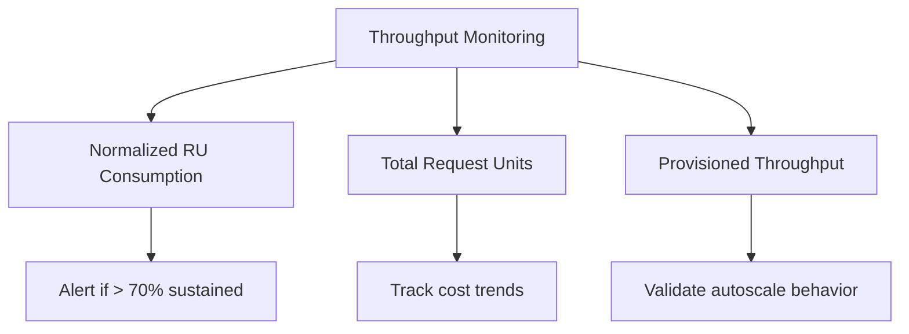

# How to Monitor and Diagnose Azure Cosmos DB Performance with Metrics and Logs

Author: [nawazdhandala](https://www.github.com/nawazdhandala)

Tags: Azure, Cosmos DB, Monitoring, Performance Diagnostics, Azure Monitor, Metrics, Logging

Description: Set up comprehensive monitoring for Azure Cosmos DB using built-in metrics, diagnostic logs, alerts, and the Azure Monitor ecosystem to catch performance issues early.

---

Monitoring your Cosmos DB account is not optional - it is how you catch performance regressions, identify cost overruns, diagnose throttling, and validate that your partition key strategy is working. Cosmos DB exposes a rich set of metrics through Azure Monitor, plus detailed diagnostic logs that capture every request. This guide covers how to set up monitoring, which metrics to watch, how to create actionable alerts, and how to dig into diagnostic logs when something goes wrong.

## Key Metrics to Monitor

Cosmos DB exposes dozens of metrics. Here are the ones that matter most:

### Throughput Metrics



**Normalized RU Consumption**: This is the most important metric. It shows the percentage of provisioned throughput being used, normalized across all partitions. If this is consistently above 70%, you need more throughput. If it spikes to 100%, you are getting throttled.

**Total Request Units**: The absolute number of RUs consumed. Directly maps to your bill.

**Provisioned Throughput**: The current provisioned RU/s. With autoscale, this changes dynamically.

### Request Metrics

**Total Requests**: Count of all operations, split by status code. Watch for 429 (throttled) and 5xx (server errors).

**429 Rate**: The number of throttled requests. Any sustained 429s means you need to either increase throughput or optimize your queries.

### Latency Metrics

**Server-Side Latency**: Time spent processing the request on the Cosmos DB backend. Compare P50, P95, and P99.

**Replication Latency**: If using multi-region, this shows how far behind read regions are.

### Storage Metrics

**Data Usage**: Total data stored in GB. Watch for unexpected growth.

**Index Usage**: Storage consumed by indexes. If this is disproportionately large, review your indexing policy.

**Document Count**: Total number of documents.

## Viewing Metrics in Azure Portal

The Azure Portal has built-in dashboards for Cosmos DB metrics:

1. Navigate to your Cosmos DB account
2. Click on Metrics under Monitoring
3. Select the metric namespace (Cosmos DB)
4. Choose a metric from the dropdown
5. Apply filters and splitting

Useful configurations:

```
Metric: Normalized RU Consumption
Split by: PartitionKeyRangeId
Time range: Last 24 hours
Aggregation: Maximum

This shows you which partitions are hot
```

```
Metric: Total Requests
Split by: StatusCode
Filter: StatusCode = 429
Time range: Last 7 days
Aggregation: Count

This shows your throttling history
```

## Setting Up Diagnostic Logs

Diagnostic logs capture detailed information about every request. Enable them to stream logs to Log Analytics, Event Hubs, or a Storage Account:

### Using Azure CLI

```bash
# Enable diagnostic settings to send logs to Log Analytics
az monitor diagnostic-settings create \
    --name "cosmos-diagnostics" \
    --resource "/subscriptions/{sub}/resourceGroups/{rg}/providers/Microsoft.DocumentDB/databaseAccounts/myCosmosAccount" \
    --workspace "/subscriptions/{sub}/resourceGroups/{rg}/providers/Microsoft.OperationalInsights/workspaces/myLogAnalytics" \
    --logs '[
        {
            "category": "DataPlaneRequests",
            "enabled": true,
            "retentionPolicy": { "enabled": true, "days": 30 }
        },
        {
            "category": "QueryRuntimeStatistics",
            "enabled": true,
            "retentionPolicy": { "enabled": true, "days": 30 }
        },
        {
            "category": "PartitionKeyStatistics",
            "enabled": true,
            "retentionPolicy": { "enabled": true, "days": 30 }
        },
        {
            "category": "PartitionKeyRUConsumption",
            "enabled": true,
            "retentionPolicy": { "enabled": true, "days": 30 }
        }
    ]' \
    --metrics '[
        {
            "category": "Requests",
            "enabled": true,
            "retentionPolicy": { "enabled": true, "days": 30 }
        }
    ]'
```

### Log Categories Explained

- **DataPlaneRequests**: Every read, write, query, and stored procedure execution. Includes RU charge, duration, status code, and request size.
- **QueryRuntimeStatistics**: Detailed query execution metrics including execution time, output document count, and RU charge per query.
- **PartitionKeyStatistics**: Information about storage distribution across partition keys. Useful for detecting hot partitions.
- **PartitionKeyRUConsumption**: RU consumption broken down by partition key. Shows which partitions are consuming the most throughput.

## Querying Diagnostic Logs with KQL

Once logs are in Log Analytics, use Kusto Query Language (KQL) to analyze them:

### Find the Most Expensive Queries

```
// Top 20 queries by RU cost in the last 24 hours
CDBDataPlaneRequests
| where TimeGenerated > ago(24h)
| where OperationName == "Query"
| summarize
    TotalRU = sum(RequestCharge),
    AvgRU = avg(RequestCharge),
    MaxRU = max(RequestCharge),
    Count = count()
    by tostring(RequestResourceId), tostring(ClientIpAddress)
| top 20 by TotalRU desc
```

### Identify Throttled Requests

```
// Throttled requests (429s) over time
CDBDataPlaneRequests
| where TimeGenerated > ago(7d)
| where StatusCode == 429
| summarize ThrottledCount = count() by bin(TimeGenerated, 1h)
| order by TimeGenerated asc
| render timechart
```

### Detect Hot Partitions

```
// RU consumption by partition key range
CDBPartitionKeyRUConsumption
| where TimeGenerated > ago(24h)
| summarize TotalRU = sum(RequestCharge) by PartitionKeyRangeId
| order by TotalRU desc
| render barchart
```

### Latency Analysis

```
// P50, P95, and P99 latency over time
CDBDataPlaneRequests
| where TimeGenerated > ago(24h)
| summarize
    P50 = percentile(DurationMs, 50),
    P95 = percentile(DurationMs, 95),
    P99 = percentile(DurationMs, 99)
    by bin(TimeGenerated, 15m)
| order by TimeGenerated asc
| render timechart
```

### Failed Operations

```
// Failed operations grouped by error type
CDBDataPlaneRequests
| where TimeGenerated > ago(24h)
| where StatusCode >= 400
| summarize Count = count() by StatusCode, OperationName
| order by Count desc
```

## Creating Alerts

Set up alerts to catch issues before they become outages:

### Alert on High RU Consumption

```bash
# Create an alert when Normalized RU Consumption exceeds 80%
az monitor metrics alert create \
    --name "cosmos-high-ru" \
    --resource-group myResourceGroup \
    --scopes "/subscriptions/{sub}/resourceGroups/{rg}/providers/Microsoft.DocumentDB/databaseAccounts/myCosmosAccount" \
    --condition "avg NormalizedRUConsumption > 80" \
    --window-size 5m \
    --evaluation-frequency 1m \
    --severity 2 \
    --action-group "/subscriptions/{sub}/resourceGroups/{rg}/providers/Microsoft.Insights/actionGroups/myTeam" \
    --description "Cosmos DB throughput usage is above 80 percent"
```

### Alert on Throttling

```bash
# Alert when throttled requests exceed a threshold
az monitor metrics alert create \
    --name "cosmos-throttling" \
    --resource-group myResourceGroup \
    --scopes "/subscriptions/{sub}/resourceGroups/{rg}/providers/Microsoft.DocumentDB/databaseAccounts/myCosmosAccount" \
    --condition "count TotalRequests > 100 where StatusCode includes 429" \
    --window-size 5m \
    --evaluation-frequency 1m \
    --severity 1 \
    --action-group "/subscriptions/{sub}/resourceGroups/{rg}/providers/Microsoft.Insights/actionGroups/myTeam" \
    --description "Cosmos DB is experiencing throttling"
```

### Alert on High Latency

```bash
# Alert when server-side latency P99 exceeds 50ms
az monitor metrics alert create \
    --name "cosmos-high-latency" \
    --resource-group myResourceGroup \
    --scopes "/subscriptions/{sub}/resourceGroups/{rg}/providers/Microsoft.DocumentDB/databaseAccounts/myCosmosAccount" \
    --condition "avg ServerSideLatency > 50" \
    --window-size 15m \
    --evaluation-frequency 5m \
    --severity 2 \
    --action-group "/subscriptions/{sub}/resourceGroups/{rg}/providers/Microsoft.Insights/actionGroups/myTeam" \
    --description "Cosmos DB P99 latency is above 50ms"
```

## SDK-Level Diagnostics

The Cosmos DB SDKs provide detailed diagnostics per request, which is invaluable for debugging specific slow operations:

```csharp
// Capture and log SDK-level diagnostics for slow requests
ItemResponse<MyDoc> response = await container.ReadItemAsync<MyDoc>(
    "doc-123", new PartitionKey("pk-1"));

// Check if the request was slow
if (response.Diagnostics.GetClientElapsedTime() > TimeSpan.FromMilliseconds(100))
{
    // Log the full diagnostics for investigation
    Console.WriteLine("Slow request detected!");
    Console.WriteLine($"Client elapsed time: {response.Diagnostics.GetClientElapsedTime()}");
    Console.WriteLine($"Request charge: {response.RequestCharge} RUs");

    // The full diagnostics string contains retry info, connection details,
    // and timeline of the request processing
    string diagnostics = response.Diagnostics.ToString();
    // Log this to your logging system for investigation
    _logger.LogWarning("Slow Cosmos DB request: {Diagnostics}", diagnostics);
}
```

### Capturing Query Diagnostics

```csharp
// Get detailed query execution statistics
var query = new QueryDefinition("SELECT * FROM c WHERE c.status = 'active'");
var options = new QueryRequestOptions
{
    PopulateIndexMetrics = true  // Shows which indexes were used
};

FeedIterator<MyDoc> iterator = container.GetItemQueryIterator<MyDoc>(query, requestOptions: options);

while (iterator.HasMoreResults)
{
    FeedResponse<MyDoc> page = await iterator.ReadNextAsync();

    Console.WriteLine($"Page RU charge: {page.RequestCharge}");
    Console.WriteLine($"Items returned: {page.Count}");
    Console.WriteLine($"Diagnostics: {page.Diagnostics}");

    // Index utilization tells you if the query used indexes efficiently
    if (page.Headers.TryGetValue("x-ms-cosmos-index-utilization", out string indexUtilization))
    {
        Console.WriteLine($"Index utilization: {indexUtilization}");
    }
}
```

## Building a Monitoring Dashboard

Create a custom Azure dashboard that gives you an at-a-glance view:

1. **Row 1 - Throughput**: Normalized RU Consumption (line chart, 24h), Total Request Units (line chart, 24h)
2. **Row 2 - Availability**: Total Requests split by StatusCode (stacked bar), 429 Count (line chart)
3. **Row 3 - Latency**: Server-Side Latency P50/P95/P99 (line chart), Replication Latency (if multi-region)
4. **Row 4 - Storage**: Data Usage (number tile), Index Usage (number tile), Document Count (number tile)

```bash
# Create a shared dashboard using Azure CLI
az portal dashboard create \
    --resource-group myResourceGroup \
    --name "Cosmos DB Monitoring" \
    --input-path dashboard-template.json
```

## Troubleshooting Workflow

When something goes wrong, follow this diagnostic workflow:

1. **Check Normalized RU Consumption**: If it is at 100%, you are being throttled. Increase throughput or optimize queries.

2. **Check 429 count**: If throttling is partition-specific, you have a hot partition problem. Check PartitionKeyRUConsumption logs.

3. **Check server-side latency**: If latency spiked, check if it correlates with increased traffic or specific operations.

4. **Query diagnostic logs**: Use KQL to find the specific requests that are slow or failing.

5. **Check SDK diagnostics**: For client-side issues, the SDK diagnostics show connection problems, retries, and regional routing.

6. **Review recent changes**: Did you deploy new code? Change an indexing policy? Modify throughput settings?

Monitoring Cosmos DB effectively is about setting up the right metrics, creating proactive alerts, and knowing where to dig when problems arise. Do the setup work now - enable diagnostic logs, create key alerts, and build a dashboard. When an issue hits at 2 AM, you will be glad the observability infrastructure is already in place.
