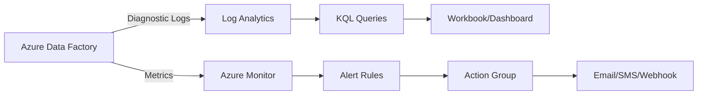

# How to Monitor and Troubleshoot Pipeline Failures in Azure Data Factory

Author: [nawazdhandala](https://www.github.com/nawazdhandala)

Tags: Azure Data Factory, Monitoring, Troubleshooting, Pipeline Failures, Azure Monitor, Data Engineering

Description: A practical guide to monitoring pipeline runs and troubleshooting common failures in Azure Data Factory with real-world debugging techniques.

---

Pipelines fail. It is not a matter of if but when. A source file might be missing, a database connection might time out, a data flow might run out of memory, or a credential might expire. The difference between a frustrating debugging experience and a quick resolution comes down to how well you have set up monitoring and how systematically you approach troubleshooting.

In this post, I will cover the monitoring tools available in Azure Data Factory, walk through the most common failure scenarios, and share the debugging workflow I use to resolve issues quickly.

## The Monitoring Hub

The primary monitoring interface in ADF is the Monitor hub in ADF Studio.

1. Open ADF Studio
2. Click the **Monitor** icon (gauge) on the left sidebar
3. You will see several tabs: Pipeline runs, Trigger runs, Integration runtimes, and Data flow debug

### Pipeline Runs

The Pipeline runs view shows all pipeline executions with:

- **Pipeline name** and **run ID**
- **Status** - Succeeded, Failed, In Progress, Cancelled, or Queued
- **Start time** and **Duration**
- **Trigger type** - Manual, Schedule, Tumbling Window, etc.

Click on any run to drill into the activity-level details.

### Activity-Level Details

Each activity within a pipeline run shows:

- **Activity name** and **type**
- **Status** and **Duration**
- **Input** - the JSON payload that was passed to the activity
- **Output** - the JSON response from the activity
- **Error** - detailed error message if the activity failed

The Input and Output views are incredibly useful for debugging. They show exactly what parameters the activity received and what the data source returned.

## Setting Up Alerts with Azure Monitor

Do not rely on manually checking the Monitor hub. Set up alerts so you get notified when pipelines fail.

### Create an Alert Rule

1. Go to your Data Factory resource in the Azure portal (not ADF Studio)
2. Click **Alerts** > **New alert rule**
3. Under **Condition**, select the signal "Pipeline Failed Runs"
4. Configure the threshold (e.g., greater than 0 in the last 5 minutes)
5. Under **Actions**, create or select an action group that sends emails, SMS, or calls a webhook
6. Give the alert a name and save

Here is a more targeted alert using a custom dimension to alert only on specific pipelines.

```json
// Alert rule condition for specific pipeline failures
{
  "signal": "PipelineFailedRuns",
  "criteria": {
    "metricName": "PipelineFailedRuns",
    "dimensions": [
      {
        // Only alert on production pipelines
        "name": "Name",
        "operator": "Include",
        "values": ["pl_daily_etl", "pl_customer_sync"]
      },
      {
        "name": "FailureType",
        "operator": "Include",
        "values": ["UserError", "SystemError"]
      }
    ],
    "threshold": 0,
    "operator": "GreaterThan",
    "timeAggregation": "Total"
  }
}
```

### Diagnostic Settings for Log Analytics

For deeper analysis, send ADF logs to Log Analytics.

1. Go to your Data Factory in the Azure portal
2. Click **Diagnostic settings** > **Add diagnostic setting**
3. Select the log categories:
   - **PipelineRuns** - pipeline execution logs
   - **ActivityRuns** - activity execution logs
   - **TriggerRuns** - trigger execution logs
   - **DataFlowDebugOutput** - data flow debug logs
4. Select **Send to Log Analytics workspace**
5. Choose your workspace and save

Once logs are flowing, you can query them with KQL (Kusto Query Language).

```
// KQL query to find failed pipeline runs in the last 24 hours
ADFPipelineRun
| where Status == "Failed"
| where TimeGenerated > ago(24h)
| project TimeGenerated, PipelineName, RunId, FailureType, ErrorMessage = Parameters
| order by TimeGenerated desc
```

```
// KQL query to find the most frequently failing activities
ADFActivityRun
| where Status == "Failed"
| where TimeGenerated > ago(7d)
| summarize FailureCount = count() by ActivityName, ActivityType, PipelineName
| order by FailureCount desc
| take 10
```

## Common Failure Patterns and Solutions

Let me walk through the failures I see most often and how to fix them.

### 1. Authentication and Credential Failures

**Symptoms**: "The client does not have authorization", "Login failed", "Invalid credential"

**Common causes**:
- Expired service principal secret
- Rotated storage account key
- Expired SAS token
- Insufficient permissions on the target resource

**How to fix**:
- Check the linked service connection by clicking "Test connection"
- If using Key Vault, verify the secret has not expired
- If using managed identity, verify the IAM role assignments on the target resource
- For service principals, check the credential expiration date in Azure AD

### 2. Data Source Connection Failures

**Symptoms**: "Cannot connect to server", "Connection timeout", "Name resolution failure"

**Common causes**:
- Network connectivity issues (especially with self-hosted IR)
- Firewall rules blocking access
- Private endpoint misconfiguration
- Self-hosted integration runtime is offline
- DNS resolution failures

**How to fix**:
- Check the integration runtime status in the Monitor hub
- For self-hosted IR, verify the Windows service is running on the host machine
- Check NSG rules and firewall settings on the target resource
- Test connectivity from the IR machine directly (e.g., telnet to the SQL port)

### 3. Copy Activity Failures

**Symptoms**: "Column count mismatch", "Conversion failed", "The input file has fewer columns"

**Common causes**:
- Schema changes in the source data
- Encoding issues in CSV files
- Data type mismatches between source and sink
- Null values in non-nullable columns
- File format issues (wrong delimiter, missing headers)

**How to fix**:
- Check the activity Input to see the actual file/table being read
- Preview the source data to verify the schema
- Enable fault tolerance in the Copy activity settings to skip bad rows
- Check column mappings for any mismatches

```json
// Enable fault tolerance to skip problematic rows
{
  "typeProperties": {
    "source": { "type": "DelimitedTextSource" },
    "sink": { "type": "AzureSqlSink" },
    "enableSkipIncompatibleRow": true,
    // Log skipped rows for investigation
    "redirectIncompatibleRowSettings": {
      "linkedServiceName": {
        "referenceName": "ls_log_storage",
        "type": "LinkedServiceReference"
      },
      "path": "error-logs/skipped-rows"
    }
  }
}
```

### 4. Data Flow Failures

**Symptoms**: "Spark job failed", "Out of memory", "Executor heartbeat timed out"

**Common causes**:
- Insufficient cluster resources for the data volume
- Skewed data causing one partition to be much larger than others
- Complex transformations on very wide datasets
- Broadcasting a large table in a join

**How to fix**:
- Increase the core count in the data flow activity settings
- Check data preview to identify data skew
- Add partition settings to redistribute data more evenly
- Disable auto-broadcast on joins with large tables
- Simplify the data flow by breaking it into multiple flows

### 5. Trigger Failures

**Symptoms**: Pipelines do not run when expected, trigger shows as "Failed"

**Common causes**:
- Trigger is in "Stopped" state
- Event Grid subscription is not created (for storage event triggers)
- Conflicting trigger schedules
- Pipeline parameters do not match trigger parameters

**How to fix**:
- Check trigger status in Manage > Triggers
- For event triggers, verify the Event Grid subscription exists on the storage account
- Check the Trigger runs tab in Monitor for error details

## Building a Monitoring Dashboard

For a comprehensive view, set up an Azure Monitor workbook or a Power BI dashboard that shows:

- Pipeline success/failure rates over time
- Average pipeline duration trending
- Top failing activities
- Integration runtime health
- Alert history

Here is the flow for a monitoring setup.



## Adding Logging to Pipelines

For custom logging within your pipelines, add explicit logging activities.

1. Use **Web Activity** to call an Azure Function or Logic App that logs to your preferred system
2. Use **Set Variable** combined with **Append Variable** to collect diagnostic info during execution
3. Use a **Stored Procedure** activity to write status records to a logging table

```json
// Log activity status to a SQL table
{
  "name": "LogPipelineStart",
  "type": "SqlServerStoredProcedure",
  "inputs": [],
  "outputs": [],
  "typeProperties": {
    "storedProcedureName": "usp_LogPipelineRun",
    "storedProcedureParameters": {
      "PipelineName": { "value": "@pipeline().Pipeline", "type": "String" },
      "RunId": { "value": "@pipeline().RunId", "type": "String" },
      "Status": { "value": "Started", "type": "String" },
      "Timestamp": { "value": "@utcnow()", "type": "DateTime" }
    }
  }
}
```

## Retry and Error Handling Patterns

Configure retries on individual activities to handle transient failures.

```json
// Retry policy on a Copy activity
{
  "name": "CopyWithRetry",
  "type": "Copy",
  "policy": {
    "retry": 3,
    "retryIntervalInSeconds": 30,
    "timeout": "01:00:00",
    "secureInput": false,
    "secureOutput": false
  }
}
```

For more complex error handling, use the failure dependency (red connector) to route execution to error-handling activities when something goes wrong.

## Wrapping Up

Effective monitoring and troubleshooting in Azure Data Factory comes down to three things: proactive alerting so you know about failures immediately, structured logging so you have the data to investigate, and a systematic debugging approach so you can resolve issues quickly. Set up diagnostic settings for Log Analytics from day one, create alerts for pipeline failures, and add custom logging to your critical pipelines. When something breaks, start with the activity-level error details, check the input/output payloads, and work outward from there. Most failures fall into a handful of categories - credentials, connectivity, schema mismatches, and resource limits - and once you know the patterns, you can resolve them fast.
