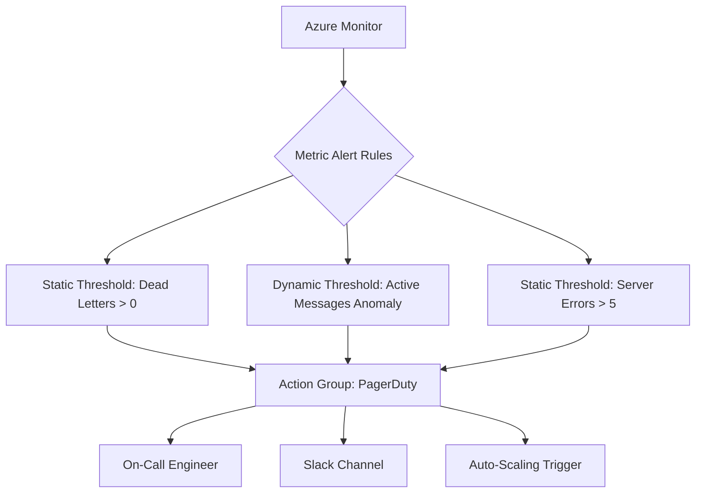

# How to Monitor Azure Service Bus Queue Depth and Set Up Alerts

Author: [nawazdhandala](https://www.github.com/nawazdhandala)

Tags: Azure, Service Bus, Monitoring, Alerts, Azure Monitor, Queue Management, Observability

Description: Learn how to monitor Azure Service Bus queue depth metrics and configure alerts to catch message backlogs before they become incidents.

---

A Service Bus queue that is slowly filling up is a ticking time bomb. If your consumers fall behind, messages pile up, TTLs expire, and you start losing data. The fix is straightforward: monitor your queue depth and alert before things go wrong. This guide covers everything from basic Azure Monitor metrics to custom monitoring with the Service Bus SDK.

## Key Metrics to Watch

Azure Service Bus exposes several metrics through Azure Monitor. The most important ones for queue health are:

- **Active Messages**: Messages in the queue ready to be received. This is your primary queue depth metric.
- **Dead-Letter Messages**: Messages that have failed processing too many times. A growing dead-letter count usually signals a bug.
- **Scheduled Messages**: Messages with a scheduled enqueue time that have not yet become active.
- **Size**: The total size of the queue in bytes.
- **Incoming Messages**: Rate of messages being sent to the queue.
- **Outgoing Messages**: Rate of messages being received from the queue.
- **Server Errors**: Internal errors in the Service Bus service.

The most critical alert is on Active Messages. If it goes above a threshold, something is wrong with your consumers.

## Setting Up Alerts in the Azure Portal

The quickest way to set up an alert is through the Azure Portal. Navigate to your Service Bus namespace, click on Metrics, select the Active Messages metric, filter by the specific queue name, and create an alert rule from there.

But portal clicks do not scale and they are not repeatable. Let's do it properly with infrastructure as code.

## Setting Up Alerts with Bicep

Here is a Bicep template that creates metric alerts for queue depth and dead-letter count.

```bicep
// Bicep template for Service Bus monitoring alerts
param serviceBusNamespaceId string
param actionGroupId string
param queueName string = 'orders'

// Alert when active messages exceed 1000
resource activeMessagesAlert 'Microsoft.Insights/metricAlerts@2018-03-01' = {
  name: 'alert-sb-active-messages-${queueName}'
  location: 'global'
  properties: {
    description: 'Active message count in ${queueName} queue exceeds threshold'
    severity: 2 // Warning
    enabled: true
    evaluationFrequency: 'PT5M' // Check every 5 minutes
    windowSize: 'PT15M' // Look at a 15-minute window
    scopes: [serviceBusNamespaceId]
    criteria: {
      'odata.type': 'Microsoft.Azure.Monitor.SingleResourceMultipleMetricCriteria'
      allOf: [
        {
          name: 'ActiveMessages'
          metricName: 'ActiveMessages'
          metricNamespace: 'Microsoft.ServiceBus/namespaces'
          operator: 'GreaterThan'
          threshold: 1000
          timeAggregation: 'Maximum'
          // Filter to just this specific queue
          dimensions: [
            {
              name: 'EntityName'
              operator: 'Include'
              values: [queueName]
            }
          ]
        }
      ]
    }
    actions: [
      {
        actionGroupId: actionGroupId
      }
    ]
  }
}

// Alert when dead-letter messages appear
resource deadLetterAlert 'Microsoft.Insights/metricAlerts@2018-03-01' = {
  name: 'alert-sb-deadletter-${queueName}'
  location: 'global'
  properties: {
    description: 'Dead-letter messages detected in ${queueName} queue'
    severity: 1 // Critical - dead letters usually need immediate attention
    enabled: true
    evaluationFrequency: 'PT5M'
    windowSize: 'PT5M'
    scopes: [serviceBusNamespaceId]
    criteria: {
      'odata.type': 'Microsoft.Azure.Monitor.SingleResourceMultipleMetricCriteria'
      allOf: [
        {
          name: 'DeadLetteredMessages'
          metricName: 'DeadletteredMessages'
          metricNamespace: 'Microsoft.ServiceBus/namespaces'
          operator: 'GreaterThan'
          threshold: 0
          timeAggregation: 'Total'
          dimensions: [
            {
              name: 'EntityName'
              operator: 'Include'
              values: [queueName]
            }
          ]
        }
      ]
    }
    actions: [
      {
        actionGroupId: actionGroupId
      }
    ]
  }
}
```

## Setting Up Alerts with Azure CLI

If you prefer the command line, the Azure CLI works too. Here is how to create the same alerts.

```bash
# Create an alert rule for active messages exceeding 1000
az monitor metrics alert create \
  --name "alert-sb-active-messages-orders" \
  --resource-group "rg-messaging" \
  --scopes "/subscriptions/{sub-id}/resourceGroups/rg-messaging/providers/Microsoft.ServiceBus/namespaces/sb-prod" \
  --condition "max ActiveMessages > 1000 where EntityName includes orders" \
  --window-size 15m \
  --evaluation-frequency 5m \
  --severity 2 \
  --action "/subscriptions/{sub-id}/resourceGroups/rg-messaging/providers/Microsoft.Insights/actionGroups/ag-oncall" \
  --description "Active messages in orders queue exceeded 1000"

# Create an alert rule for dead-lettered messages
az monitor metrics alert create \
  --name "alert-sb-deadletter-orders" \
  --resource-group "rg-messaging" \
  --scopes "/subscriptions/{sub-id}/resourceGroups/rg-messaging/providers/Microsoft.ServiceBus/namespaces/sb-prod" \
  --condition "total DeadletteredMessages > 0 where EntityName includes orders" \
  --window-size 5m \
  --evaluation-frequency 5m \
  --severity 1 \
  --action "/subscriptions/{sub-id}/resourceGroups/rg-messaging/providers/Microsoft.Insights/actionGroups/ag-oncall" \
  --description "Dead-lettered messages detected in orders queue"
```

## Custom Monitoring with the SDK

Azure Monitor metrics are aggregated and can have a delay of several minutes. If you need real-time queue depth monitoring, use the Service Bus management SDK to poll the queue directly.

```csharp
using Azure.Messaging.ServiceBus.Administration;

public class QueueDepthMonitor
{
    private readonly ServiceBusAdministrationClient _adminClient;
    private readonly string[] _queueNames;

    public QueueDepthMonitor(string connectionString, string[] queueNames)
    {
        _adminClient = new ServiceBusAdministrationClient(connectionString);
        _queueNames = queueNames;
    }

    // Poll queue depths and return current state
    public async Task<List<QueueStats>> GetQueueStatsAsync()
    {
        var stats = new List<QueueStats>();

        foreach (var queueName in _queueNames)
        {
            // GetQueueRuntimeProperties gives real-time counts
            var properties = await _adminClient.GetQueueRuntimePropertiesAsync(queueName);

            stats.Add(new QueueStats
            {
                QueueName = queueName,
                ActiveMessages = properties.Value.ActiveMessageCount,
                DeadLetterMessages = properties.Value.DeadLetterMessageCount,
                ScheduledMessages = properties.Value.ScheduledMessageCount,
                TransferMessages = properties.Value.TransferMessageCount,
                SizeInBytes = properties.Value.SizeInBytes,
                CheckedAt = DateTimeOffset.UtcNow
            });
        }

        return stats;
    }

    // Run continuous monitoring and push to your metrics system
    public async Task RunAsync(CancellationToken cancellationToken)
    {
        while (!cancellationToken.IsCancellationRequested)
        {
            var stats = await GetQueueStatsAsync();

            foreach (var stat in stats)
            {
                // Push to your metrics system (Prometheus, Datadog, etc.)
                Console.WriteLine(
                    $"[{stat.CheckedAt:HH:mm:ss}] {stat.QueueName}: " +
                    $"Active={stat.ActiveMessages}, " +
                    $"DeadLetter={stat.DeadLetterMessages}"
                );

                // Simple threshold check
                if (stat.ActiveMessages > 1000)
                {
                    Console.WriteLine($"WARNING: {stat.QueueName} has {stat.ActiveMessages} active messages!");
                }
            }

            // Poll every 30 seconds
            await Task.Delay(TimeSpan.FromSeconds(30), cancellationToken);
        }
    }
}

public class QueueStats
{
    public string QueueName { get; set; }
    public long ActiveMessages { get; set; }
    public long DeadLetterMessages { get; set; }
    public long ScheduledMessages { get; set; }
    public long TransferMessages { get; set; }
    public long SizeInBytes { get; set; }
    public DateTimeOffset CheckedAt { get; set; }
}
```

## Dashboard with Azure Workbooks

For a visual overview, create an Azure Workbook that shows queue depth over time. You can query the metrics data using KQL.

```
// KQL query to show queue depth trend over the last 24 hours
AzureMetrics
| where ResourceProvider == "MICROSOFT.SERVICEBUS"
| where MetricName == "ActiveMessages"
| where TimeGenerated > ago(24h)
| extend QueueName = tostring(parse_json(DimensionList)[0].value)
| summarize MaxDepth = max(Maximum), AvgDepth = avg(Average) by bin(TimeGenerated, 5m), QueueName
| order by TimeGenerated asc
| render timechart
```

## Choosing the Right Thresholds

Setting alert thresholds is more art than science. Here are some guidelines.

For active message alerts, baseline your normal queue depth over a week. Your threshold should be 3-5 times the normal peak. If your queue normally hovers around 50 messages and peaks at 200 during busy hours, set the alert at 600-1000.

For dead-letter alerts, any dead-letter message is potentially a problem. Set the threshold to 0 for critical systems so you hear about it immediately.

For incoming vs outgoing rate divergence, if incoming messages consistently exceed outgoing messages, your consumers are falling behind. This is often a better early warning signal than raw queue depth.

## Multi-Queue Monitoring Strategy

Most applications have multiple queues, and you do not want to create individual alerts for each one. Use dynamic thresholds in Azure Monitor, which automatically learn the normal pattern for each queue and alert on anomalies.



## Connecting Alerts to Auto-Scaling

Here is a practical tip: use queue depth alerts to trigger auto-scaling of your consumer instances. When the queue grows past a threshold, scale out your consumers. When it drops back down, scale in. Azure Functions with Service Bus triggers do this automatically, but if you are running consumers on App Service or AKS, you need to wire this up yourself.

## Summary

Monitoring Service Bus queue depth is not optional - it is the difference between catching a problem at 2 PM and getting paged at 2 AM. Set up alerts on active messages and dead-letter counts, use real-time SDK polling for dashboards, and connect your alerts to both your notification system and your auto-scaling infrastructure. Start with conservative thresholds and tune them as you learn what normal looks like for your workloads.
