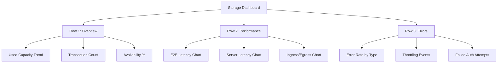

# How to Monitor Azure Storage Account Performance with Azure Monitor

Author: [nawazdhandala](https://www.github.com/nawazdhandala)

Tags: Azure, Storage Account, Azure Monitor, Performance Monitoring, Metrics, Alerts, Diagnostics

Description: A complete guide to monitoring Azure Storage Account performance using Azure Monitor metrics, diagnostic settings, alerts, and workbooks.

---

Monitoring your Azure Storage accounts is not optional if you care about application performance and reliability. A storage account that is throttled, running out of capacity, or experiencing high latency will impact every service that depends on it. Azure Monitor provides the metrics, logs, and alerting capabilities you need to stay on top of storage performance.

This guide walks through setting up comprehensive monitoring for Azure Storage accounts, from basic metrics to custom dashboards and automated alerts.

## Understanding Storage Metrics

Azure Storage exposes metrics at several levels:

- **Account-level metrics**: Overall capacity, ingress/egress, and transaction counts
- **Service-level metrics**: Metrics specific to Blob, File, Queue, or Table storage
- **API-level metrics**: Latency and success rates broken down by API operation (GetBlob, PutBlob, etc.)

Metrics are collected automatically - you do not need to enable anything to get basic metrics. However, diagnostic logs require explicit configuration.

## Step 1: View Built-in Metrics

The quickest way to check storage performance is through the Azure portal's built-in metrics explorer. But for automation and scripting, the CLI works well too.

The following commands query common storage metrics:

```bash
# Query total transactions over the last hour
az monitor metrics list \
  --resource "/subscriptions/<sub-id>/resourceGroups/rg-app/providers/Microsoft.Storage/storageAccounts/stappdata2026" \
  --metric "Transactions" \
  --interval PT1H \
  --aggregation Total \
  --output table

# Query end-to-end latency (includes network time)
az monitor metrics list \
  --resource "/subscriptions/<sub-id>/resourceGroups/rg-app/providers/Microsoft.Storage/storageAccounts/stappdata2026" \
  --metric "SuccessE2ELatency" \
  --interval PT5M \
  --aggregation Average \
  --output table

# Query server latency (excludes network time)
az monitor metrics list \
  --resource "/subscriptions/<sub-id>/resourceGroups/rg-app/providers/Microsoft.Storage/storageAccounts/stappdata2026" \
  --metric "SuccessServerLatency" \
  --interval PT5M \
  --aggregation Average \
  --output table
```

The difference between E2E latency and server latency tells you how much time is spent in the network versus the storage service itself.

## Step 2: Key Metrics to Monitor

Here are the most important metrics to track for each scenario:

**Capacity and Usage**:
- `UsedCapacity`: Total bytes used across all services
- `BlobCapacity`: Bytes used by blob storage
- `BlobCount`: Number of blobs in the account
- `ContainerCount`: Number of containers

**Performance**:
- `SuccessE2ELatency`: End-to-end latency for successful requests
- `SuccessServerLatency`: Server-side processing latency
- `Availability`: Percentage of successful requests

**Throughput**:
- `Ingress`: Bytes received by the storage account
- `Egress`: Bytes sent from the storage account
- `Transactions`: Total number of API requests

**Throttling**:
- `Transactions` with `ResponseType` dimension filtered to `ServerBusyError` or `ClientThrottlingError`

## Step 3: Enable Diagnostic Settings

For detailed operation-level logging, enable diagnostic settings. This sends logs to a Log Analytics workspace, storage account, or Event Hub.

```bash
# Create a Log Analytics workspace if you do not have one
az monitor log-analytics workspace create \
  --resource-group rg-app \
  --workspace-name law-storage-monitoring \
  --location eastus2

# Enable diagnostic settings for blob storage
az monitor diagnostic-settings create \
  --resource "/subscriptions/<sub-id>/resourceGroups/rg-app/providers/Microsoft.Storage/storageAccounts/stappdata2026/blobServices/default" \
  --name diag-blob-logs \
  --workspace law-storage-monitoring \
  --logs '[{"category":"StorageRead","enabled":true},{"category":"StorageWrite","enabled":true},{"category":"StorageDelete","enabled":true}]' \
  --metrics '[{"category":"Transaction","enabled":true}]'

# Enable diagnostic settings for the account level
az monitor diagnostic-settings create \
  --resource "/subscriptions/<sub-id>/resourceGroups/rg-app/providers/Microsoft.Storage/storageAccounts/stappdata2026" \
  --name diag-account-metrics \
  --workspace law-storage-monitoring \
  --metrics '[{"category":"Transaction","enabled":true},{"category":"Capacity","enabled":true}]'
```

Once enabled, logs start flowing within a few minutes. Storage read logs can be very high volume, so consider enabling them selectively or setting a sampling rate in production.

## Step 4: Create Alert Rules

Alerts notify you before problems become outages. Here are the essential alerts for storage accounts.

This alert fires when storage latency exceeds 100ms for 5 minutes:

```bash
# Alert when average E2E latency exceeds 100ms
az monitor metrics alert create \
  --resource-group rg-app \
  --name alert-storage-latency \
  --scopes "/subscriptions/<sub-id>/resourceGroups/rg-app/providers/Microsoft.Storage/storageAccounts/stappdata2026" \
  --condition "avg SuccessE2ELatency > 100" \
  --window-size 5m \
  --evaluation-frequency 1m \
  --action "/subscriptions/<sub-id>/resourceGroups/rg-app/providers/microsoft.insights/actionGroups/ag-ops-team" \
  --description "Storage E2E latency exceeded 100ms" \
  --severity 2
```

This alert fires when throttling errors are detected:

```bash
# Alert when throttling occurs (more than 10 throttled requests in 5 minutes)
az monitor metrics alert create \
  --resource-group rg-app \
  --name alert-storage-throttling \
  --scopes "/subscriptions/<sub-id>/resourceGroups/rg-app/providers/Microsoft.Storage/storageAccounts/stappdata2026" \
  --condition "total Transactions > 10" \
  --dimension "ResponseType=ServerBusyError" \
  --window-size 5m \
  --evaluation-frequency 1m \
  --action "/subscriptions/<sub-id>/resourceGroups/rg-app/providers/microsoft.insights/actionGroups/ag-ops-team" \
  --description "Storage account is being throttled" \
  --severity 1
```

This alert fires when capacity reaches 80% of the limit:

```bash
# Alert when used capacity exceeds 80% of a 5 TiB limit (4 TiB threshold)
az monitor metrics alert create \
  --resource-group rg-app \
  --name alert-storage-capacity \
  --scopes "/subscriptions/<sub-id>/resourceGroups/rg-app/providers/Microsoft.Storage/storageAccounts/stappdata2026" \
  --condition "avg UsedCapacity > 4398046511104" \
  --window-size 1h \
  --evaluation-frequency 1h \
  --action "/subscriptions/<sub-id>/resourceGroups/rg-app/providers/microsoft.insights/actionGroups/ag-ops-team" \
  --description "Storage capacity exceeds 80% of limit" \
  --severity 2
```

## Step 5: Query Logs with KQL

Once diagnostic logs are flowing to Log Analytics, you can run KQL queries to analyze storage operations.

Find the slowest blob operations in the last 24 hours:

```
StorageBlobLogs
| where TimeGenerated > ago(24h)
| where DurationMs > 500
| project TimeGenerated, OperationName, Uri, DurationMs, StatusCode, CallerIpAddress
| order by DurationMs desc
| take 50
```

Identify which clients are generating the most traffic:

```
StorageBlobLogs
| where TimeGenerated > ago(1h)
| summarize RequestCount = count(), TotalBytes = sum(ResponseBodySize) by CallerIpAddress
| order by RequestCount desc
| take 20
```

Detect failed authentication attempts:

```
StorageBlobLogs
| where TimeGenerated > ago(24h)
| where StatusCode == 403
| summarize FailCount = count() by CallerIpAddress, AuthenticationType
| order by FailCount desc
```

Find throttled requests and their patterns:

```
StorageBlobLogs
| where TimeGenerated > ago(6h)
| where StatusCode == 503 or StatusCode == 429
| summarize ThrottledCount = count() by bin(TimeGenerated, 5m), OperationName
| render timechart
```

## Step 6: Create a Monitoring Dashboard

Build a custom Azure dashboard that shows all key storage metrics at a glance. You can do this via the portal, or use an ARM template.

Here is a simplified dashboard layout to build in the portal:



For each tile, use the Metrics Explorer and pin it to the dashboard. Set time ranges to the last 24 hours for a good overview.

## Step 7: Set Up Azure Monitor Workbooks

For more sophisticated monitoring, use Azure Monitor Workbooks. They support parameterized queries, dynamic filtering, and conditional formatting.

A useful workbook for storage monitoring includes:

1. **Parameter section**: Dropdown to select the storage account and time range
2. **Capacity overview**: Current usage with trend chart
3. **Latency analysis**: P50, P95, and P99 latency percentiles over time
4. **Throughput trends**: Ingress and egress with hour-over-hour comparison
5. **Error breakdown**: Pie chart of error types with drill-down
6. **Top operations**: Table of most frequent API operations with average latency

## Common Performance Issues and Solutions

**High E2E latency but normal server latency**: The bottleneck is in the network. Check if clients are in the same region as the storage account. Consider using Private Endpoints to avoid the public internet.

**Frequent throttling (503 errors)**: You are hitting IOPS or throughput limits. Options include spreading data across multiple storage accounts, using premium storage, or implementing retry logic with exponential backoff.

**Gradual latency increase over time**: This often indicates growing blob counts in a single container. Azure Storage performance degrades when containers have millions of blobs without a good partition key prefix.

**Spiky availability metrics**: Check for transient failures. If availability drops briefly but recovers, implement retry logic in your application. If drops are sustained, investigate network connectivity and region health.

## Wrapping Up

Monitoring Azure Storage accounts requires attention to metrics, logs, and alerts across multiple dimensions. Start with the built-in metrics for a quick view, enable diagnostic logs for detailed analysis, set up alerts for the critical thresholds, and build dashboards for ongoing visibility. The combination of Azure Monitor metrics, Log Analytics, and workbooks gives you everything you need to keep your storage accounts performing well and catch issues before they impact your applications.
