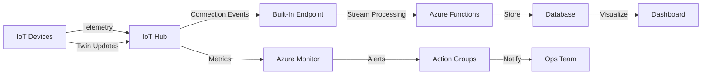

# How to Monitor IoT Device Connectivity and Health Using Azure IoT Hub Built-In Endpoints

Author: [nawazdhandala](https://www.github.com/nawazdhandala)

Tags: Azure IoT Hub, Device Monitoring, Built-In Endpoints, IoT Health, Device Connectivity, Azure Monitor, Diagnostics

Description: Learn how to monitor IoT device connectivity and health using Azure IoT Hub built-in endpoints, metrics, and event routing for operational visibility.

---

When you are managing hundreds or thousands of IoT devices in production, knowing whether they are connected, healthy, and sending data on schedule is not optional. It is the foundation of operational reliability. Azure IoT Hub provides several built-in mechanisms for monitoring device connectivity and health, but they are spread across different features and it takes some effort to wire them together into a cohesive monitoring solution. This guide walks through the practical steps of setting up device health monitoring using IoT Hub's built-in endpoints, metrics, and event routing.

## The Monitoring Challenge

IoT devices are not like web servers. They run on constrained hardware, connect over unreliable networks, and might go silent for hours at a time as a normal part of their operation. A device that has not sent telemetry in 15 minutes might be broken, or it might just be sleeping between its scheduled reporting intervals. The monitoring system needs to understand the difference.

Azure IoT Hub gives you three categories of monitoring data:

1. **Connection state events** - emitted when a device connects or disconnects
2. **Built-in metrics** - aggregate counters like messages sent, connections active, throttling events
3. **Device twin reported properties** - device-side health data that the device itself reports

Let us set up each of these.

## Understanding the Built-In Events Endpoint

Every IoT Hub instance has a built-in Event Hubs-compatible endpoint. By default, all device-to-cloud messages flow through this endpoint. But you can also route lifecycle events - specifically device connection and disconnection events - to this endpoint or to custom endpoints.

First, check that the built-in endpoint is accessible.

```bash
# Get the built-in endpoint details
az iot hub show \
  --name my-iot-hub \
  --query properties.eventHubEndpoints.events \
  --output json
```

This returns the Event Hubs-compatible endpoint URI, the partition count, and the retention period. By default, messages are retained for 1 day and spread across 4 partitions.

## Routing Device Connection State Events

Device connected and disconnected events are not routed by default. You need to create a message route that captures these lifecycle events.

```bash
# Create a route for device lifecycle events to the built-in endpoint
az iot hub route create \
  --hub-name my-iot-hub \
  --route-name device-lifecycle-route \
  --source devicelifecycleevents \
  --endpoint events \
  --condition "true" \
  --enabled true

# Also create a route for connection state events specifically
az iot hub route create \
  --hub-name my-iot-hub \
  --route-name connection-state-route \
  --source deviceconnectionstateevents \
  --endpoint events \
  --condition "true" \
  --enabled true
```

Now, whenever a device connects or disconnects, an event flows to the built-in endpoint alongside regular telemetry messages.

## Reading Connection State Events

Here is a Node.js consumer that reads from the built-in endpoint and filters for connection state events.

```javascript
// monitor-connections.js - Read device connection events from the built-in endpoint
const { EventHubConsumerClient } = require('@azure/event-hubs');

// Use the built-in endpoint connection string from IoT Hub
const eventHubConnectionString = 'Endpoint=sb://ihsuprodbyres123.servicebus.windows.net/;SharedAccessKeyName=iothubowner;SharedAccessKey=...;EntityPath=my-iot-hub';
const consumerGroup = '$Default';

async function main() {
  const client = new EventHubConsumerClient(consumerGroup, eventHubConnectionString);

  console.log('Listening for device connection state events...');

  // Subscribe to all partitions
  client.subscribe({
    processEvents: async (events, context) => {
      for (const event of events) {
        // Check if this is a connection state event
        const source = event.systemProperties['iothub-message-source'];

        if (source === 'deviceConnectionStateEvents') {
          const deviceId = event.systemProperties['iothub-connection-device-id'];
          const eventType = event.body.opType; // 'deviceConnected' or 'deviceDisconnected'
          const timestamp = event.enqueuedTimeUtc;

          console.log(`[${timestamp}] Device ${deviceId}: ${eventType}`);

          // Track the event in your monitoring system
          if (eventType === 'deviceDisconnected') {
            console.log(`  WARNING: Device ${deviceId} went offline`);
            // Trigger an alert or update a dashboard
          }
        }
      }
    },
    processError: async (err) => {
      console.error('Error processing events:', err.message);
    }
  });
}

main().catch(console.error);
```

## Using Built-In Metrics for Aggregate Health

IoT Hub exposes a set of platform metrics through Azure Monitor. These give you the big picture without processing individual events.

Key metrics to watch include:

- **d2c.telemetry.ingress.success** - successful telemetry messages received
- **connectedDeviceCount** - currently connected devices
- **totalDeviceCount** - total registered devices
- **d2c.telemetry.ingress.allProtocol** - all attempted telemetry sends (including failures)
- **dailyMessageQuotaUsed** - percentage of daily message quota consumed
- **deviceDataUsage** - bytes of data transferred

You can query these metrics using the Azure CLI or set up alerts.

```bash
# Query the connected device count metric for the last hour
az monitor metrics list \
  --resource /subscriptions/{sub-id}/resourceGroups/iot-rg/providers/Microsoft.Devices/IotHubs/my-iot-hub \
  --metric connectedDeviceCount \
  --interval PT5M \
  --aggregation Average \
  --start-time $(date -u -d '1 hour ago' +%Y-%m-%dT%H:%M:%SZ) \
  --end-time $(date -u +%Y-%m-%dT%H:%M:%SZ)
```

## Setting Up Metric Alerts

Create an alert rule that fires when the connected device count drops below a threshold. This catches scenarios where a network outage or firmware bug causes mass disconnections.

```bash
# Create an alert rule for low device connectivity
az monitor metrics alert create \
  --name low-device-connectivity \
  --resource-group iot-rg \
  --scopes /subscriptions/{sub-id}/resourceGroups/iot-rg/providers/Microsoft.Devices/IotHubs/my-iot-hub \
  --condition "avg connectedDeviceCount < 50" \
  --window-size PT5M \
  --evaluation-frequency PT1M \
  --action-group /subscriptions/{sub-id}/resourceGroups/iot-rg/providers/microsoft.insights/actionGroups/ops-team \
  --description "Alert when connected device count drops below 50" \
  --severity 2
```

## Device-Side Health Reporting with Device Twins

The most granular health data comes from the devices themselves. Implement a health reporter on each device that periodically updates its device twin reported properties with diagnostic information.

```javascript
// device-health-reporter.js - Device reports its own health via twin properties
const { Client } = require('azure-iot-device');
const { Mqtt } = require('azure-iot-device-mqtt');
const os = require('os');

const connectionString = 'HostName=my-hub.azure-devices.net;DeviceId=device-01;SharedAccessKey=...';
const client = Client.fromConnectionString(connectionString, Mqtt);

async function reportHealth() {
  const twin = await client.getTwin();

  // Collect device health metrics
  const healthReport = {
    lastHeartbeat: new Date().toISOString(),
    uptimeSeconds: process.uptime(),
    freeMemoryMB: Math.round(os.freemem() / 1024 / 1024),
    totalMemoryMB: Math.round(os.totalmem() / 1024 / 1024),
    cpuLoadAvg: os.loadavg()[0],
    firmwareVersion: '2.1.3',
    networkInterfaces: Object.keys(os.networkInterfaces()).length,
    status: 'healthy'
  };

  // Update the twin reported properties
  return new Promise((resolve, reject) => {
    twin.properties.reported.update({ health: healthReport }, (err) => {
      if (err) reject(err);
      else resolve();
    });
  });
}

async function main() {
  await client.open();
  console.log('Device connected. Starting health reporter...');

  // Report health every 5 minutes
  await reportHealth();
  setInterval(reportHealth, 5 * 60 * 1000);
}

main().catch(console.error);
```

## Querying Device Health at Scale

On the back end, use IoT Hub query language to find devices based on their reported health properties.

```javascript
// query-device-health.js - Query device health across the fleet
const { Registry } = require('azure-iothub');

const connectionString = 'HostName=my-hub.azure-devices.net;SharedAccessKeyName=service;SharedAccessKey=...';
const registry = Registry.fromConnectionString(connectionString);

async function findUnhealthyDevices() {
  // Find devices that haven't sent a heartbeat in 30 minutes
  const thirtyMinutesAgo = new Date(Date.now() - 30 * 60 * 1000).toISOString();

  const query = registry.createQuery(
    `SELECT deviceId, properties.reported.health FROM devices
     WHERE properties.reported.health.lastHeartbeat < '${thirtyMinutesAgo}'`
  );

  while (query.hasMoreResults()) {
    const result = await query.nextAsTwin();
    for (const device of result.result) {
      console.log(`Stale device: ${device.deviceId}`);
      console.log(`  Last heartbeat: ${device.properties?.reported?.health?.lastHeartbeat}`);
    }
  }
}

async function getFleetSummary() {
  // Count devices by status
  const query = registry.createQuery(
    `SELECT properties.reported.health.status, COUNT() as count
     FROM devices
     GROUP BY properties.reported.health.status`
  );

  const result = await query.nextAsTwin();
  console.log('Fleet health summary:', result.result);
}

findUnhealthyDevices().catch(console.error);
```

## Building a Monitoring Architecture

Here is how all these pieces fit together in a production monitoring setup.



## Practical Tips

A few things I have learned from running IoT monitoring in production:

- Connection state events can be delayed by up to 60 seconds. Do not use them for real-time presence detection. Use them for trend analysis and alerting on prolonged disconnections.
- The `connectedDeviceCount` metric is eventually consistent. If you need an exact count at a specific moment, query device twins instead.
- Set different heartbeat intervals for different device types. A gateway that processes data continuously should report every minute. A battery-powered sensor might only report every hour.
- Always include the firmware version in health reports. When something goes wrong fleet-wide, the first question is usually "which firmware version are these devices running?"

## Wrapping Up

Monitoring IoT device connectivity and health is not a single feature - it is a combination of connection state events, platform metrics, device twin properties, and custom alerting rules. Azure IoT Hub gives you the raw building blocks through its built-in endpoints and metrics. The work is in wiring them together into a system that gives your operations team clear visibility into fleet health and alerts them before small problems become outages.
