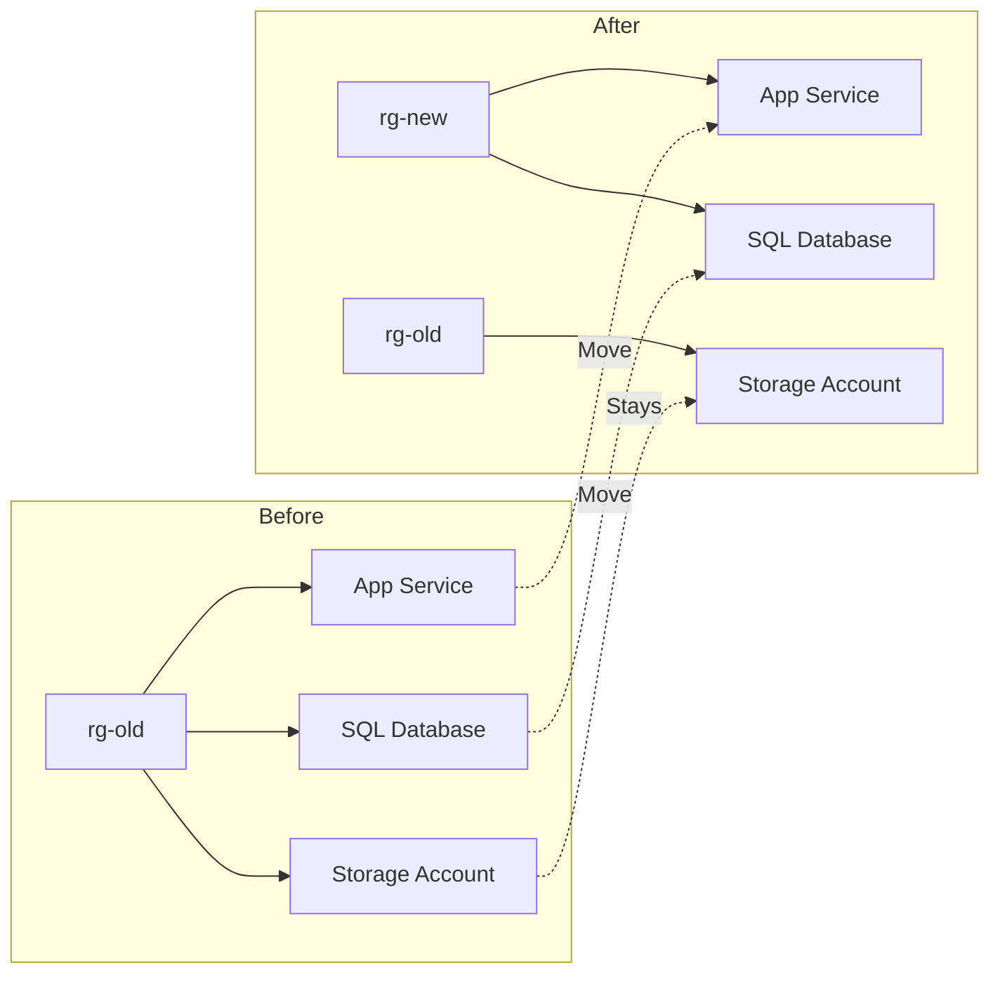

# How to Move Azure Resources Between Resource Groups and Subscriptions Using Azure CLI

Author: [nawazdhandala](https://www.github.com/nawazdhandala)

Tags: Azure CLI, Resource Management, Azure Resource Groups, Subscriptions, Cloud Governance, DevOps

Description: Move Azure resources between resource groups and subscriptions using Azure CLI with proper validation, planning, and handling of dependencies.

---

Resource organization in Azure is not always right the first time. Maybe you created resources in the wrong resource group during development. Maybe your team restructured and resources need to move to a different subscription. Or maybe you are consolidating scattered resources into a more logical grouping. Whatever the reason, Azure supports moving resources between resource groups and between subscriptions, and the Azure CLI makes it scriptable.

But resource moves are not as simple as drag and drop. Some resources cannot be moved at all, some have dependencies that must move together, and the move operation itself has nuances you need to understand to avoid surprises. This guide covers the practical details.

## How Resource Moves Work

When you move a resource in Azure, you are changing its resource group and possibly its subscription. The resource ID changes (because the resource group is part of the ID), but the resource itself is not redeployed or recreated. It is a metadata operation - the resource stays running throughout the move.



The resource IDs change after a move. If you have scripts, pipelines, or applications that reference resources by their full resource ID, you will need to update those references.

## Prerequisites

- Azure CLI installed and logged in
- Contributor (or Owner) role on both the source and destination resource groups
- If moving between subscriptions, Contributor role on both subscriptions
- The destination resource group must already exist

## Step 1: Check if Your Resources Can Be Moved

Not all Azure resources support moves. Before attempting anything, validate that your resources are eligible.

### Common Resources That Support Moves

- Virtual Machines (and their disks, NICs)
- Storage Accounts
- App Services and App Service Plans
- SQL Servers and Databases
- Virtual Networks
- Key Vaults
- Container Registries
- Log Analytics Workspaces

### Resources That Cannot Be Moved

- Azure Active Directory Domain Services
- Azure Backup vaults (with active backups)
- Resources in a classic deployment model
- Some marketplace resources

### Validate Before Moving

Azure provides a validation API that checks whether a move will succeed without actually performing it:

```bash
# Validate that resources can be moved to a new resource group
az resource invoke-action \
  --action validateMoveResources \
  --ids "/subscriptions/{sub-id}/resourceGroups/rg-old" \
  --request-body '{
    "resources": [
      "/subscriptions/{sub-id}/resourceGroups/rg-old/providers/Microsoft.Web/sites/myapp",
      "/subscriptions/{sub-id}/resourceGroups/rg-old/providers/Microsoft.Web/serverfarms/myplan"
    ],
    "targetResourceGroup": "/subscriptions/{sub-id}/resourceGroups/rg-new"
  }'
```

A simpler approach using the `az resource move` command with the `--validate` flag:

```bash
# Validate a move without actually performing it
# First, get the resource IDs
APP_ID=$(az webapp show --name "myapp" --resource-group "rg-old" --query id -o tsv)
PLAN_ID=$(az appservice plan show --name "myplan" --resource-group "rg-old" --query id -o tsv)

# Validate the move
az resource move \
  --destination-group "rg-new" \
  --ids "$APP_ID" "$PLAN_ID"
```

## Step 2: Move Resources Between Resource Groups

### Moving a Single Resource

```bash
# Move a storage account to a different resource group
STORAGE_ID=$(az storage account show \
  --name "mystorageaccount" \
  --resource-group "rg-old" \
  --query id -o tsv)

az resource move \
  --destination-group "rg-new" \
  --ids "$STORAGE_ID"
```

### Moving Multiple Resources

```bash
# Move an App Service and its plan together
APP_ID=$(az webapp show --name "myapp" --resource-group "rg-old" --query id -o tsv)
PLAN_ID=$(az appservice plan show --name "myplan" --resource-group "rg-old" --query id -o tsv)

# Both must move together because the app depends on the plan
az resource move \
  --destination-group "rg-new" \
  --ids "$APP_ID" "$PLAN_ID"
```

### Moving All Resources from a Resource Group

```bash
# Get all resource IDs in the source group
RESOURCE_IDS=$(az resource list \
  --resource-group "rg-old" \
  --query "[].id" -o tsv)

# Move all resources to the new group
az resource move \
  --destination-group "rg-new" \
  --ids $RESOURCE_IDS
```

Be cautious with this approach. If any resource in the group cannot be moved, the entire operation fails.

## Step 3: Move Resources Between Subscriptions

Moving between subscriptions follows the same pattern but requires specifying the destination subscription:

```bash
# Move a resource to a different subscription
STORAGE_ID=$(az storage account show \
  --name "mystorageaccount" \
  --resource-group "rg-old" \
  --query id -o tsv)

az resource move \
  --destination-group "rg-new" \
  --destination-subscription-id "target-subscription-id" \
  --ids "$STORAGE_ID"
```

Cross-subscription moves have additional requirements:

- Both subscriptions must be in the same Azure AD tenant
- The destination subscription must be registered for the resource provider (e.g., Microsoft.Web for App Services)
- You need Contributor permissions on both subscriptions

### Register Resource Providers in the Destination Subscription

Before moving resources across subscriptions, make sure the destination subscription has the required resource providers registered:

```bash
# Check if a resource provider is registered in the destination subscription
az provider show \
  --namespace "Microsoft.Web" \
  --subscription "target-subscription-id" \
  --query "registrationState"

# Register a resource provider if needed
az provider register \
  --namespace "Microsoft.Web" \
  --subscription "target-subscription-id"

# Wait for registration to complete
az provider show \
  --namespace "Microsoft.Web" \
  --subscription "target-subscription-id" \
  --query "registrationState"
```

## Handling Dependencies

Some resources have dependencies that must be moved together. If you try to move a resource without its dependencies, the operation will fail.

### Common Dependency Chains

**Virtual Machines** must move with:
- Managed disks
- Network interfaces
- Public IP addresses (optional)

```bash
# Move a VM and all its dependencies
VM_ID=$(az vm show --name "myvm" --resource-group "rg-old" --query id -o tsv)
NIC_ID=$(az vm show --name "myvm" --resource-group "rg-old" --query "networkProfile.networkInterfaces[0].id" -o tsv)
OS_DISK_ID=$(az vm show --name "myvm" --resource-group "rg-old" --query "storageProfile.osDisk.managedDisk.id" -o tsv)

# Get data disk IDs if any
DATA_DISK_IDS=$(az vm show --name "myvm" --resource-group "rg-old" \
  --query "storageProfile.dataDisks[].managedDisk.id" -o tsv)

# Move everything together
az resource move \
  --destination-group "rg-new" \
  --ids "$VM_ID" "$NIC_ID" "$OS_DISK_ID" $DATA_DISK_IDS
```

**App Services** must move with their App Service Plan:

```bash
# App and plan must be in the same resource group
APP_ID=$(az webapp show --name "myapp" --resource-group "rg-old" --query id -o tsv)
PLAN_ID=$(az appservice plan show --name "myplan" --resource-group "rg-old" --query id -o tsv)

az resource move \
  --destination-group "rg-new" \
  --ids "$APP_ID" "$PLAN_ID"
```

**SQL Databases** must move with their SQL Server:

```bash
# SQL Server and all its databases must move together
SQL_SERVER_ID=$(az sql server show --name "mysqlserver" --resource-group "rg-old" --query id -o tsv)
SQL_DB_IDS=$(az sql db list --server "mysqlserver" --resource-group "rg-old" --query "[].id" -o tsv)

az resource move \
  --destination-group "rg-new" \
  --ids "$SQL_SERVER_ID" $SQL_DB_IDS
```

## Scripting a Complete Move with Validation

Here is a comprehensive script that validates, moves, and verifies:

```bash
#!/bin/bash
# move-resources.sh - Move resources with validation and verification

SOURCE_RG="rg-old"
DEST_RG="rg-new"
DEST_SUB=""  # Leave empty for same-subscription move

echo "=== Gathering resource IDs from $SOURCE_RG ==="
RESOURCE_IDS=$(az resource list \
  --resource-group "$SOURCE_RG" \
  --query "[].id" -o tsv)

RESOURCE_COUNT=$(echo "$RESOURCE_IDS" | wc -l)
echo "Found $RESOURCE_COUNT resources to move"

# List the resources for review
az resource list --resource-group "$SOURCE_RG" --output table

echo ""
echo "=== Destination: $DEST_RG ==="
read -p "Proceed with move? (y/n): " confirm
if [ "$confirm" != "y" ]; then
    echo "Move cancelled."
    exit 0
fi

# Create destination group if it does not exist
az group show --name "$DEST_RG" &>/dev/null || \
    az group create --name "$DEST_RG" --location "eastus2"

# Perform the move
echo "=== Starting move ==="
MOVE_CMD="az resource move --destination-group $DEST_RG --ids $RESOURCE_IDS"
if [ -n "$DEST_SUB" ]; then
    MOVE_CMD="$MOVE_CMD --destination-subscription-id $DEST_SUB"
fi

eval $MOVE_CMD

if [ $? -eq 0 ]; then
    echo "=== Move completed successfully ==="
    echo ""
    echo "Resources now in $DEST_RG:"
    az resource list --resource-group "$DEST_RG" --output table
else
    echo "=== Move failed ==="
    echo "Check the source group for remaining resources:"
    az resource list --resource-group "$SOURCE_RG" --output table
fi
```

## Post-Move Checklist

After moving resources, verify these items:

1. **Update resource IDs** in any scripts, pipelines, or application configurations
2. **Check RBAC assignments** - role assignments at the resource level stay with the resource, but resource group-level assignments do not follow
3. **Update diagnostic settings** - if diagnostics were configured to send to a resource in the old group, check they still work
4. **Verify resource locks** - locks at the resource group level do not follow resources to the new group
5. **Test your applications** - make sure everything still works after the move

## Wrapping Up

Moving Azure resources between resource groups and subscriptions is a supported operation for most resource types, and the Azure CLI makes it straightforward to script. The key is to validate before moving, understand dependency chains, and handle post-move cleanup like updating resource IDs and RBAC assignments. Always run the validation step first, move dependent resources together, and verify everything works after the move completes. With proper planning, resource moves are a routine operation rather than a stressful one.
