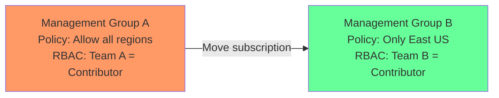

# How to Move Azure Subscriptions Between Management Groups

Author: [nawazdhandala](https://www.github.com/nawazdhandala)

Tags: Azure, Management Groups, Subscriptions, Governance, Organization, Azure Administration, Cloud Management

Description: A step-by-step guide to moving Azure subscriptions between management groups, including prerequisites, impact assessment, and rollback procedures.

---

Moving an Azure subscription from one management group to another is a common governance task. Maybe a development subscription is being promoted to production, a team is being reorganized, or you are restructuring your management group hierarchy. The move itself is technically simple - it is a single API call - but the implications can be significant because the subscription immediately inherits different policies, RBAC assignments, and budgets from its new parent.

In this post, I will walk through how to move subscriptions safely, what to check before and after the move, and how to handle the edge cases.

## What Happens When You Move a Subscription

When a subscription moves from Management Group A to Management Group B, several things change immediately:

1. **Policy assignments**: The subscription loses all policies inherited from Management Group A and gains all policies inherited from Management Group B. Direct policy assignments on the subscription itself are unaffected.

2. **RBAC assignments**: The subscription loses all RBAC roles inherited from Management Group A and gains all RBAC roles inherited from Management Group B. Direct role assignments on the subscription are unaffected.

3. **Budgets and cost management**: Budget alerts configured at Management Group A no longer include this subscription. Budget alerts at Management Group B now include it.

4. **Blueprint assignments**: Azure Blueprint assignments at the management group level are affected. The subscription may gain or lose blueprint assignments.



After the move, the subscription would be restricted to East US only (from Management Group B's policy) and Team B would have Contributor access instead of Team A.

## Prerequisites

To move a subscription between management groups, you need:

- **Microsoft.Management/managementGroups/subscriptions/write** permission on the target management group
- **Microsoft.Management/managementGroups/write** permission on the target management group
- **Owner** role on the subscription (or Management Group Contributor at the source management group)

In practice, the "Management Group Contributor" role at both the source and target management groups, combined with at least Reader on the subscription, is sufficient.

## Step 1: Assess the Impact Before Moving

Before moving anything, understand what will change.

### Check Current Inherited Policies

```bash
# List all policy assignments that the subscription currently inherits
# This includes both direct and inherited assignments
az policy assignment list \
  --scope "/subscriptions/<subscription-id>" \
  --query "[].{name:displayName, scope:scope, enforcement:enforcementMode}" \
  --output table
```

### Check Current RBAC Inheritance

```bash
# List all inherited role assignments on the subscription
az role assignment list \
  --scope "/subscriptions/<subscription-id>" \
  --include-inherited \
  --query "[?contains(scope, 'managementGroups')].{principal:principalName, role:roleDefinitionName, scope:scope}" \
  --output table
```

### Check Target Management Group Policies

```bash
# List policies assigned at the target management group
az policy assignment list \
  --scope "/providers/Microsoft.Management/managementGroups/<target-group>" \
  --query "[].{name:displayName, effect:parameters.effect.value, scope:scope}" \
  --output table
```

### Check Target Management Group RBAC

```bash
# List role assignments at the target management group
az role assignment list \
  --scope "/providers/Microsoft.Management/managementGroups/<target-group>" \
  --query "[].{principal:principalName, role:roleDefinitionName}" \
  --output table
```

### Run a Compliance Pre-Check

Check whether the subscription's existing resources would be compliant with the target management group's policies:

```bash
# Trigger a policy compliance scan on the subscription
az policy state trigger-scan \
  --subscription "<subscription-id>"

# After the scan completes (can take several minutes), check current compliance
az policy state summarize \
  --subscription "<subscription-id>" \
  --query "value[0].results" \
  --output table
```

If the target management group has "Deny" policies that would block existing resources (for example, an "Allowed locations" policy and the subscription has resources in a disallowed region), those existing resources will not be deleted but will be flagged as non-compliant, and you will not be able to create new similar resources.

## Step 2: Communicate With Affected Teams

This is the step most people skip and later regret. Before moving a subscription:

- Notify the teams that currently use the subscription about the upcoming policy and access changes
- Notify the teams at the target management group that a new subscription is joining
- Schedule the move during a low-activity period if there are significant policy changes
- Document the reason for the move in your change management system

## Step 3: Move the Subscription

### Using the Azure Portal

1. Go to "Management groups" in the Azure portal
2. Navigate to the management group that currently contains the subscription
3. Click on the subscription
4. Click "Move" in the toolbar
5. Select the target management group
6. Click Save

### Using the Azure CLI

```bash
# Move a subscription to a different management group
# This is an immediate operation with no undo button
az account management-group subscription add \
  --name "<target-management-group-name>" \
  --subscription "<subscription-id>"
```

### Using PowerShell

```powershell
# Move a subscription to a new management group
New-AzManagementGroupSubscription `
    -GroupId "<target-management-group-name>" `
    -SubscriptionId "<subscription-id>"
```

### Using REST API

```bash
# Move using the REST API directly
# This is useful for automation and scripting
az rest --method put \
  --url "https://management.azure.com/providers/Microsoft.Management/managementGroups/<target-group>/subscriptions/<subscription-id>?api-version=2021-04-01" \
  --body '{}'
```

## Step 4: Verify the Move

After moving the subscription, verify that everything is as expected.

### Confirm the New Parent

```bash
# Verify the subscription is now under the target management group
az account management-group show \
  --name "<target-management-group-name>" \
  --query "children[?name=='<subscription-id>']" \
  --output table
```

### Check New Policy Compliance

```bash
# Trigger a compliance evaluation under the new policies
az policy state trigger-scan \
  --subscription "<subscription-id>"

# Check compliance status (run after scan completes)
az policy state summarize \
  --subscription "<subscription-id>" \
  --query "value[0].{compliant:results.nonCompliantResources}" \
  --output table
```

### Verify RBAC

```bash
# Verify the new inherited role assignments
az role assignment list \
  --scope "/subscriptions/<subscription-id>" \
  --include-inherited \
  --query "[].{principal:principalName, role:roleDefinitionName, scope:scope}" \
  --output table
```

### Test Access

Ask a member of the team that should now have access to verify they can see and manage resources in the subscription. Also ask someone from the old team to verify they no longer have inherited access (they should only retain any direct assignments).

## Rolling Back a Move

If the move causes problems, you can move the subscription back to its original management group:

```bash
# Move the subscription back to the original management group
az account management-group subscription add \
  --name "<original-management-group-name>" \
  --subscription "<subscription-id>"
```

This is not technically an undo - it is just another move. All the same policy and RBAC inheritance changes apply in reverse.

## Bulk Moving Subscriptions

If you are restructuring your hierarchy and need to move many subscriptions at once, script it:

```bash
#!/bin/bash
# Move multiple subscriptions to a new management group
# Reads subscription IDs from a text file, one per line

TARGET_MG="Production"
SUB_FILE="subscriptions-to-move.txt"

while IFS= read -r sub_id; do
    echo "Moving subscription: $sub_id to $TARGET_MG"
    az account management-group subscription add \
      --name "$TARGET_MG" \
      --subscription "$sub_id"

    if [ $? -eq 0 ]; then
        echo "  Success"
    else
        echo "  FAILED - check permissions and subscription status"
    fi
done < "$SUB_FILE"
```

## Handling Edge Cases

### Subscriptions in a Disabled State

Disabled subscriptions can be moved between management groups. The policies from the new group will apply once the subscription is re-enabled.

### Subscriptions with Blueprint Assignments

If the subscription has a blueprint assignment from the source management group, the assignment is not automatically removed. You may need to manually unassign the old blueprint and assign a new one from the target management group.

### Enterprise Agreement Subscriptions

For EA subscriptions, the management group move does not affect the EA enrollment hierarchy. The subscription's billing relationship stays the same - only governance controls change.

### Cross-Tenant Considerations

You cannot move a subscription to a management group in a different Azure AD tenant through the management group API. Moving subscriptions between tenants requires a separate process (transferring the subscription to a different directory).

## Automating Subscription Placement

For organizations that frequently create new subscriptions, you can set a default management group where new subscriptions land automatically:

```bash
# Set the default management group for new subscriptions
# New subscriptions will automatically be placed in this group
az rest --method put \
  --url "https://management.azure.com/providers/Microsoft.Management/managementGroups/<tenant-root-group-id>/settings/default?api-version=2021-04-01" \
  --body '{
    "properties": {
      "defaultManagementGroup": "/providers/Microsoft.Management/managementGroups/Sandbox",
      "requireAuthorizationForGroupCreation": true
    }
  }'
```

This is useful for ensuring new subscriptions go to a "Sandbox" or "Onboarding" group with basic policies rather than landing at the Tenant Root Group with no governance.

## Wrapping Up

Moving Azure subscriptions between management groups is a straightforward operation with significant governance implications. The key to doing it safely is preparation: assess the policy and RBAC changes before the move, communicate with affected teams, perform the move during a low-risk window, and verify everything immediately after. For large-scale restructuring, script the moves and test with non-critical subscriptions first. The ability to reorganize subscriptions freely is one of the biggest advantages of a well-designed management group hierarchy.
