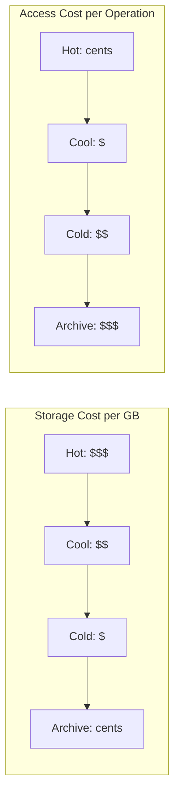

# How to Move Data Between Azure Blob Storage Access Tiers (Hot, Cool, Cold, Archive)

Author: [nawazdhandala](https://www.github.com/nawazdhandala)

Tags: Azure, Blob Storage, Access Tiers, Cost Optimization, Data Management, Azure Storage, Cloud Storage

Description: A practical guide to moving blobs between Hot, Cool, Cold, and Archive tiers in Azure Blob Storage to optimize storage costs based on access patterns.

---

Azure Blob Storage offers four access tiers - Hot, Cool, Cold, and Archive - each with different pricing models. Understanding when and how to move data between these tiers is one of the most effective ways to reduce your Azure Storage bill. I have seen storage costs drop by 60% or more just by putting infrequently accessed data in the right tier.

This guide covers the mechanics of tier transitions, how to move blobs manually and automatically, and the cost tradeoffs you need to consider.

## Understanding the Access Tiers

Each tier is optimized for a different access pattern:

**Hot tier** - Designed for data that is accessed frequently. Highest storage cost per GB, lowest access cost per operation. Good for active application data, recently uploaded content, and data being processed.

**Cool tier** - For data accessed infrequently but needs to be available immediately when requested. Lower storage cost than Hot, higher access cost. Minimum storage duration of 30 days (early deletion fee applies). Good for short-term backup, staging data, and content older than 30 days.

**Cold tier** - For data that is rarely accessed but still needs to be available on demand. Lower storage cost than Cool, higher access cost. Minimum storage duration of 90 days. Good for long-term data sets that are seldom read.

**Archive tier** - For data that is almost never accessed and can tolerate retrieval latency of hours. Lowest storage cost, highest access cost. Minimum storage duration of 180 days. Data must be rehydrated before it can be read. Good for compliance archives, raw data backups, and historical records.

Here is how the costs compare (rough order of magnitude, actual prices vary by region):



## Setting the Default Account Tier

Every storage account has a default access tier that applies to blobs uploaded without an explicit tier:

```bash
# Set the default access tier for the storage account to Cool
az storage account update \
  --name mystorageaccount \
  --resource-group myresourcegroup \
  --access-tier Cool
```

The default tier applies to new blobs that do not specify a tier. Existing blobs are not affected when you change the default.

## Moving Individual Blobs Between Tiers

You can change a blob's tier at any time using the Set Blob Tier operation:

### Azure CLI

```bash
# Move a single blob from Hot to Cool tier
az storage blob set-tier \
  --account-name mystorageaccount \
  --container-name mycontainer \
  --name old-report.pdf \
  --tier Cool
```

```bash
# Move a blob to Archive tier
az storage blob set-tier \
  --account-name mystorageaccount \
  --container-name mycontainer \
  --name historical-data-2024.csv \
  --tier Archive
```

### Python SDK

```python
from azure.storage.blob import BlobServiceClient, StandardBlobTier

# Connect to the storage account
blob_service_client = BlobServiceClient.from_connection_string("your-connection-string")
blob_client = blob_service_client.get_blob_client(
    container="mycontainer",
    blob="old-report.pdf"
)

# Change the blob's tier to Cool
blob_client.set_standard_blob_tier(StandardBlobTier.COOL)
print("Blob moved to Cool tier")
```

### C# SDK

```csharp
using Azure.Storage.Blobs;
using Azure.Storage.Blobs.Models;

var blobServiceClient = new BlobServiceClient("your-connection-string");
var containerClient = blobServiceClient.GetBlobContainerClient("mycontainer");
var blobClient = containerClient.GetBlobClient("old-report.pdf");

// Set the blob tier to Cool
await blobClient.SetAccessTierAsync(AccessTier.Cool);
Console.WriteLine("Blob moved to Cool tier");
```

## Moving Blobs in Bulk

Moving blobs one at a time is fine for a handful of files, but when you have thousands or millions of blobs to move, you need a more efficient approach.

### Batch Tier Change with Azure CLI

```bash
# Move all blobs with a specific prefix to Cool tier using a batch operation
az storage blob set-tier \
  --account-name mystorageaccount \
  --container-name mycontainer \
  --tier Cool \
  --name "logs/2024/" \
  --type block
```

### Scripted Bulk Tier Change

For more control, write a script that iterates through blobs and changes their tiers:

```python
from azure.storage.blob import BlobServiceClient, StandardBlobTier
from datetime import datetime, timedelta, timezone

# Connect to the storage account
blob_service_client = BlobServiceClient.from_connection_string("your-connection-string")
container_client = blob_service_client.get_container_client("mycontainer")

# Calculate the cutoff date - move blobs older than 60 days to Cool
cutoff_date = datetime.now(timezone.utc) - timedelta(days=60)

# Iterate through all blobs in the container
moved_count = 0
for blob in container_client.list_blobs():
    # Check if the blob is in Hot tier and older than the cutoff
    if blob.blob_tier == "Hot" and blob.last_modified < cutoff_date:
        blob_client = container_client.get_blob_client(blob.name)
        blob_client.set_standard_blob_tier(StandardBlobTier.COOL)
        moved_count += 1
        if moved_count % 100 == 0:
            print(f"Moved {moved_count} blobs to Cool tier...")

print(f"Total blobs moved: {moved_count}")
```

## Automating Tier Transitions with Lifecycle Policies

The best approach for ongoing tier management is lifecycle management policies. These run daily and automatically move blobs between tiers based on age:

```json
{
  "rules": [
    {
      "enabled": true,
      "name": "tiered-retention",
      "type": "Lifecycle",
      "definition": {
        "actions": {
          "baseBlob": {
            "tierToCool": {
              "daysAfterModificationGreaterThan": 30
            },
            "tierToCold": {
              "daysAfterModificationGreaterThan": 60
            },
            "tierToArchive": {
              "daysAfterModificationGreaterThan": 180
            },
            "delete": {
              "daysAfterModificationGreaterThan": 730
            }
          }
        },
        "filters": {
          "blobTypes": ["blockBlob"]
        }
      }
    }
  ]
}
```

Apply this policy to your storage account:

```bash
# Apply the lifecycle policy
az storage account management-policy create \
  --account-name mystorageaccount \
  --resource-group myresourcegroup \
  --policy @lifecycle-policy.json
```

## Using Last Access Time for Smarter Tiering

Instead of using modification time (when the blob was last written), you can use last access time (when the blob was last read). This is more accurate for determining whether data is actually being used.

First, enable last access time tracking:

```bash
# Enable last access time tracking
az storage account blob-service-properties update \
  --account-name mystorageaccount \
  --resource-group myresourcegroup \
  --enable-last-access-tracking true
```

Then use `daysAfterLastAccessTimeGreaterThan` in your lifecycle policy:

```json
{
  "rules": [
    {
      "enabled": true,
      "name": "access-based-tiering",
      "type": "Lifecycle",
      "definition": {
        "actions": {
          "baseBlob": {
            "tierToCool": {
              "daysAfterLastAccessTimeGreaterThan": 30
            },
            "tierToArchive": {
              "daysAfterLastAccessTimeGreaterThan": 90
            }
          }
        },
        "filters": {
          "blobTypes": ["blockBlob"]
        }
      }
    }
  ]
}
```

## Early Deletion Fees

Each tier has a minimum storage duration:

- Cool: 30 days
- Cold: 90 days
- Archive: 180 days

If you move a blob out of a tier before the minimum period, you get charged an early deletion fee equal to the remaining days. For example, moving a blob from Cool to Hot after 10 days means you pay for 20 additional days of Cool storage.

This is important when designing lifecycle policies. Do not create rules that move blobs from Cool to Archive in less than 30 days - you will pay the Cool early deletion fee on top of the Archive storage cost.

## Tier Transition Costs

Every tier change incurs a write operation charge at the destination tier's rate. Moving a blob to Archive is cheap, but moving it from Archive (rehydrating) is expensive.

Here is a rough cost comparison for moving 1 TB of data:

| Transition | Approximate Cost |
|-----------|-----------------|
| Hot to Cool | Low (write ops at Cool rate) |
| Hot to Archive | Low (write ops at Archive rate) |
| Cool to Hot | Moderate (read ops at Cool rate + write ops at Hot rate) |
| Archive to Hot | High (rehydration cost + read ops at Archive rate) |

Always factor in transition costs when calculating potential savings. If you frequently need to access archived data, the rehydration costs might outweigh the storage savings.

## Checking a Blob's Current Tier

Before moving blobs, you might want to check which tier they are in:

```bash
# Show the access tier of a specific blob
az storage blob show \
  --account-name mystorageaccount \
  --container-name mycontainer \
  --name myfile.pdf \
  --query "properties.blobTier" \
  --output tsv
```

Or list all blobs with their tiers:

```bash
# List blobs with their access tiers
az storage blob list \
  --account-name mystorageaccount \
  --container-name mycontainer \
  --output table \
  --query "[].{Name:name, Tier:properties.blobTier, Size:properties.contentLength}"
```

## Best Practices

**Analyze your access patterns first.** Before moving data to cheaper tiers, understand how often it gets accessed. Use Azure Storage Analytics or last access time tracking to make data-driven decisions.

**Start with lifecycle policies.** Manual tier management does not scale. Automate it from the start.

**Account for early deletion fees.** Design your tier transition schedule to respect minimum storage durations.

**Monitor cost impact.** After implementing tiering, track your storage costs in Azure Cost Management to verify you are actually saving money.

**Test with a subset.** Before applying a lifecycle policy account-wide, test it on a specific container or prefix.

## Wrapping Up

Moving data between Azure Blob Storage access tiers is the single most impactful thing you can do to reduce storage costs. The key is matching each tier to your data's access pattern - frequently accessed data in Hot, infrequently accessed in Cool or Cold, and rarely needed data in Archive. Automate the transitions with lifecycle management policies and monitor the results. The storage cost savings add up quickly, especially at scale.
