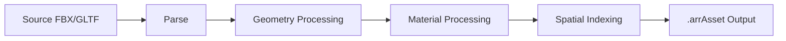

# How to Optimize 3D Model Conversion and Loading Times with Azure Remote Rendering

Author: [nawazdhandala](https://www.github.com/nawazdhandala)

Tags: Azure, Remote Rendering, 3D Models, Optimization, Performance, Mixed Reality, Cloud

Description: Practical techniques for optimizing 3D model conversion and loading times in Azure Remote Rendering to reduce costs and improve user experience.

---

The biggest frustration with Azure Remote Rendering is waiting. Model conversion can take anywhere from two minutes to several hours depending on the source file, and loading a converted model into a session adds more delay. For users standing in a warehouse wearing a HoloLens, every second of waiting chips away at the experience. The good news is that most of this waiting time is controllable through model preparation, conversion settings, and session management strategies.

This guide covers practical techniques to reduce both conversion time and model loading time in Azure Remote Rendering.

## Understanding the Conversion Pipeline

When you submit a model for conversion, Azure Remote Rendering goes through several stages:

1. **Parsing** - Reads the source file format (FBX, GLTF, GLB).
2. **Geometry processing** - Analyzes and optimizes mesh data, removes degenerate triangles, and builds spatial acceleration structures.
3. **Material processing** - Converts materials and textures to the internal format.
4. **Spatial indexing** - Builds the data structures used for efficient rendering and raycasting.
5. **Output** - Writes the optimized `.arrAsset` binary file.



The geometry processing step is typically the bottleneck. Complex models with millions of polygons, deeply nested hierarchies, or numerous small meshes take significantly longer than simple models with the same polygon count.

## Technique 1: Reduce Polygon Count Before Conversion

The most effective optimization happens before you send the model to Azure. Reducing polygon count directly reduces conversion time and loading time.

Most CAD models contain far more detail than necessary for visualization. A bolt with 5000 polygons looks identical to one with 500 when viewed at arm's length on HoloLens.

Use a tool like Blender, MeshLab, or Simplygon to decimate the mesh before conversion.

```python
# Blender Python script to decimate a model to a target polygon count
# Run this in Blender's scripting workspace before exporting
import bpy

# Select all mesh objects
bpy.ops.object.select_all(action='SELECT')

for obj in bpy.context.selected_objects:
    if obj.type != 'MESH':
        continue

    # Set the active object
    bpy.context.view_layer.objects.active = obj

    # Add a decimate modifier to reduce polygon count
    modifier = obj.modifiers.new(name="Decimate", type='DECIMATE')

    # Ratio of 0.5 means keep 50% of polygons
    # Adjust this value based on your visual quality requirements
    modifier.ratio = 0.5

    # Apply the modifier to make the changes permanent
    bpy.ops.object.modifier_apply(modifier="Decimate")

print("Decimation complete.")
```

A general guideline for polygon budgets:

- **Standard VM**: Up to 20 million polygons for smooth performance.
- **Premium VM**: Up to 100 million polygons, but loading time increases significantly above 50 million.

## Technique 2: Flatten Deep Object Hierarchies

CAD assemblies often have deeply nested hierarchies - a car model might have Assembly > Subassembly > Part > SubPart > Mesh with 10+ levels of nesting. Azure Remote Rendering preserves this hierarchy in the converted model, but deep hierarchies slow down both conversion and runtime performance.

Flatten the hierarchy where detailed nesting is not needed for your application.

```python
# Blender script to flatten object hierarchy to a maximum depth of 2
import bpy

def flatten_hierarchy(max_depth=2, current_depth=0, parent=None):
    for obj in bpy.data.objects:
        if obj.parent == parent and current_depth >= max_depth:
            # Move this object to the root or second level
            obj.parent = parent.parent if parent else None

flatten_hierarchy(max_depth=2)
print("Hierarchy flattened.")
```

## Technique 3: Use the Conversion Configuration File

Azure Remote Rendering accepts a JSON configuration file that controls how the conversion process handles the model. Using the right settings can dramatically affect conversion time and output quality.

```json
{
  "scaling": 0.01,
  "recenterToOrigin": true,
  "opaqueMaterialDefaultSidedness": "SingleSided",
  "material-override": "Basic",
  "gammaToLinearMaterial": true,
  "gammaToLinearVertex": false,
  "sceneGraphMode": "Static",
  "generateCollisionMesh": false,
  "unlitMaterials": false,
  "fbxAssumeMetallic": true,
  "deduplicateMaterials": true,
  "axis": [
    [1, 0, 0],
    [0, 0, 1],
    [0, 1, 0]
  ]
}
```

Key settings that affect performance:

- **sceneGraphMode**: Set to `Static` if you do not need to manipulate individual parts at runtime. This allows the renderer to batch geometry more aggressively. Use `Dynamic` only when you need to move, hide, or modify individual parts.

- **generateCollisionMesh**: Set to `false` if you only need visual rendering and not physics collisions. Collision meshes add significant conversion time and memory.

- **deduplicateMaterials**: Set to `true` to merge identical materials. CAD models often have hundreds of materials that are functionally identical, and deduplication reduces draw calls at runtime.

- **material-override**: Set to `Basic` for simpler material representation that loads faster. Use `PBR` only when photorealistic materials are important.

## Technique 4: Optimize Textures

Large textures increase both conversion time and loading time. Most HoloLens scenarios do not benefit from 4K textures because the display resolution and typical viewing distance make anything above 1024x1024 indistinguishable.

Resize textures before conversion:

```bash
# Batch resize all PNG textures to 1024x1024 maximum using ImageMagick
for file in textures/*.png; do
  # Only resize if the image is larger than 1024 in either dimension
  convert "$file" -resize 1024x1024\> "$file"
  echo "Resized: $file"
done
```

Also convert textures to compressed formats. JPEG for color textures and PNG for anything that needs an alpha channel. Uncompressed BMP or TIFF textures waste bandwidth during conversion.

## Technique 5: Pre-convert Models During CI/CD

Instead of converting models on-demand, integrate conversion into your build pipeline. This way, models are ready when users need them.

```yaml
# GitHub Actions workflow to convert models when they change
name: Convert 3D Models

on:
  push:
    paths:
      - 'models/**'

jobs:
  convert:
    runs-on: ubuntu-latest
    steps:
      - uses: actions/checkout@v3

      - name: Install Azure CLI
        uses: azure/setup-azure-cli@v1

      - name: Convert Changed Models
        run: |
          # Find all changed model files
          CHANGED_FILES=$(git diff --name-only HEAD~1 HEAD -- 'models/*.fbx' 'models/*.gltf')

          for model in $CHANGED_FILES; do
            echo "Converting: $model"
            # Trigger conversion via REST API
            curl -X POST \
              "https://remoterendering.eastus.mixedreality.azure.com/accounts/$ACCOUNT_ID/conversions/$(uuidgen)" \
              -H "Authorization: Bearer $TOKEN" \
              -H "Content-Type: application/json" \
              -d "{
                \"settings\": {
                  \"inputLocation\": {
                    \"storageContainerUri\": \"$STORAGE_URI\",
                    \"relativeInputAssetPath\": \"$model\"
                  },
                  \"outputLocation\": {
                    \"storageContainerUri\": \"$OUTPUT_URI\"
                  }
                }
              }"
          done
        env:
          ACCOUNT_ID: ${{ secrets.ARR_ACCOUNT_ID }}
          TOKEN: ${{ secrets.ARR_ACCESS_TOKEN }}
          STORAGE_URI: ${{ secrets.STORAGE_CONTAINER_URI }}
          OUTPUT_URI: ${{ secrets.OUTPUT_CONTAINER_URI }}
```

## Technique 6: Use Session Pools for Faster Startup

The biggest delay users experience is waiting for a rendering session to start. VM provisioning typically takes 1-5 minutes. Session pools keep warm sessions available so users can connect immediately.

```csharp
// SessionPoolManager.cs
// Maintains a pool of pre-warmed rendering sessions for instant access
using System.Collections.Generic;
using System.Threading.Tasks;
using Microsoft.Azure.RemoteRendering;

public class SessionPoolManager
{
    private Queue<RenderingSession> availableSessions = new Queue<RenderingSession>();
    private RemoteRenderingClient client;
    private int poolSize;

    public SessionPoolManager(RemoteRenderingClient client, int poolSize = 2)
    {
        this.client = client;
        this.poolSize = poolSize;
    }

    // Pre-warm sessions during low-usage periods
    public async Task WarmPool()
    {
        while (availableSessions.Count < poolSize)
        {
            var options = new RenderingSessionCreationOptions
            {
                MaxLeaseInMinutes = 60,
                Size = RenderingSessionVmSize.Standard
            };

            var result = await client.CreateNewRenderingSessionAsync(options);
            if (result.ErrorCode == Result.Success)
            {
                // Wait for the session to become ready
                await WaitForSessionReady(result.Session);
                availableSessions.Enqueue(result.Session);
            }
        }
    }

    // Get an immediately available session from the pool
    public RenderingSession GetSession()
    {
        if (availableSessions.Count > 0)
        {
            var session = availableSessions.Dequeue();
            // Start warming a replacement session in the background
            Task.Run(() => WarmPool());
            return session;
        }
        return null;
    }

    private async Task WaitForSessionReady(RenderingSession session)
    {
        while (true)
        {
            var props = await session.GetPropertiesAsync();
            if (props.SessionProperties.Status == RenderingSessionStatus.Ready)
                break;
            await Task.Delay(5000);
        }
    }
}
```

This approach trades cost for speed. Idle sessions still cost money, so this makes sense only when you have predictable usage patterns.

## Technique 7: Load Models Incrementally

For complex scenes with multiple models, load them incrementally rather than all at once. Show the most important model first and load secondary models in the background.

```csharp
// Load models in priority order so users see the most important content first
public async Task LoadModelsIncrementally(List<ModelInfo> models)
{
    // Sort by priority - primary models first
    models.Sort((a, b) => a.Priority.CompareTo(b.Priority));

    foreach (var model in models)
    {
        var loadOptions = new LoadModelOptions(
            model.Url,
            currentSession.Connection.CurrentCoordinateSystem
        );

        var result = await currentSession.Connection.LoadModelAsync(loadOptions);

        if (result.Root != null)
        {
            result.Root.Position = model.Position;
            result.Root.Scale = model.Scale;
            result.Root.CreateGameObject(UnityCreationMode.CreateUnityComponents);
        }

        // Yield to let the UI update between model loads
        await Task.Delay(100);
    }
}
```

## Measuring Performance

Track conversion and loading metrics to identify bottlenecks.

```csharp
// Track timing for model operations
var stopwatch = System.Diagnostics.Stopwatch.StartNew();
await session.Connection.LoadModelAsync(loadOptions);
stopwatch.Stop();

Debug.Log($"Model loaded in {stopwatch.ElapsedMilliseconds}ms");
// Report this metric to your monitoring system
```

Key metrics to monitor:

- **Conversion time per model**: Identify models that need optimization.
- **Session startup time**: Track VM provisioning duration.
- **Model load time**: Measure from load request to first rendered frame.
- **Frame rate during rendering**: Should stay above 60fps for comfortable mixed reality.

## Summary

Optimizing Azure Remote Rendering is about reducing work at every stage: fewer polygons means faster conversion, simpler hierarchies mean faster spatial indexing, smaller textures mean faster upload and load times, and pre-warmed sessions eliminate startup delays. The configuration file gives you direct control over many of these trade-offs. Start with the source model optimization since that has the biggest impact, then tune conversion settings, and finally consider session pools if startup time is critical for your use case.
