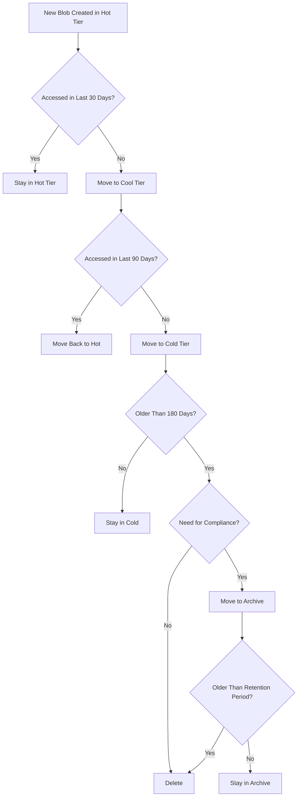

# How to Optimize Azure Blob Storage Costs with Lifecycle Management Policies

Author: [nawazdhandala](https://www.github.com/nawazdhandala)

Tags: Azure, Blob Storage, Lifecycle Management, Cost Optimization, Storage, Cloud Costs, Data Management

Description: Learn how to use Azure Blob Storage lifecycle management policies to automatically tier and delete data for significant cost savings.

---

Azure Blob Storage costs can creep up quickly, especially when you store data that gets accessed frequently at first but rarely (or never) after a few weeks. Logs, backups, media files, exports, and analytics data all follow this pattern - hot on day one, cold by day thirty, and archival by day ninety. But if you leave everything in the Hot tier, you pay hot-tier prices forever.

Lifecycle management policies automate the process of moving data between storage tiers and deleting old data. Set up the rules once, and Azure handles the rest. In this post, I will show you how to design and implement these policies effectively.

## Understanding Azure Blob Storage Tiers

Azure Blob Storage has four access tiers, each with different storage and access costs:

| Tier | Storage Cost (per GB/month) | Read Cost (per 10K ops) | Best For |
|------|---------------------------|------------------------|----------|
| Hot | ~$0.018 | ~$0.004 | Frequently accessed data |
| Cool | ~$0.010 | ~$0.010 | Infrequently accessed (30+ days) |
| Cold | ~$0.0036 | ~$0.010 | Rarely accessed (90+ days) |
| Archive | ~$0.002 | ~$5.00 (rehydrate) | Long-term retention, rarely retrieved |

The tradeoff is clear: lower storage cost means higher access cost. For data you read often, Hot is cheapest overall. For data you store but rarely read, Archive can save you 90% compared to Hot.

## Step 1: Analyze Your Current Storage Usage

Before creating policies, understand what data you have and how it is accessed:

```bash
# Check the total size of your storage account by tier
az storage account show \
  --resource-group myResourceGroup \
  --name mystorageaccount \
  --query "{Name: name, Kind: kind, Tier: accessTier}" \
  --output table

# List containers and their sizes
az storage container list \
  --account-name mystorageaccount \
  --query "[].{Name: name}" \
  --output table
```

For more detailed analysis, use Azure Storage metrics:

```bash
# Check storage capacity metrics
az monitor metrics list \
  --resource "/subscriptions/<sub-id>/resourceGroups/myRG/providers/Microsoft.Storage/storageAccounts/mystorageaccount/blobServices/default" \
  --metric "BlobCapacity" \
  --interval P1D \
  --aggregation Average \
  --output table
```

Look at the `LastAccessTime` tracking if it is enabled. This tells you when each blob was last read:

```bash
# Enable last access time tracking (required for access-time-based policies)
az storage account blob-service-properties update \
  --resource-group myResourceGroup \
  --account-name mystorageaccount \
  --enable-last-access-tracking true
```

## Step 2: Design Your Lifecycle Rules

Think about the data lifecycle for each container or blob prefix. A common pattern for application logs:

- Days 0-30: Hot tier (active log analysis)
- Days 30-90: Cool tier (occasional troubleshooting)
- Days 90-365: Cold tier (rare access, compliance retention)
- After 365 days: Delete (retention period over)

For backups:
- Days 0-7: Hot tier (quick restore needed)
- Days 7-30: Cool tier (restore possible but less urgent)
- Days 30-365: Archive tier (disaster recovery)
- After 365 days: Delete old backups

## Step 3: Create a Lifecycle Management Policy

Here is how to create a policy using the Azure CLI:

```bash
# Create a lifecycle management policy
az storage account management-policy create \
  --account-name mystorageaccount \
  --resource-group myResourceGroup \
  --policy @lifecycle-policy.json
```

And here is the policy JSON file with rules for different data types:

```json
{
  "rules": [
    {
      "name": "MoveLogsToCooltier",
      "enabled": true,
      "type": "Lifecycle",
      "definition": {
        "actions": {
          "baseBlob": {
            "tierToCool": {
              "daysAfterModificationGreaterThan": 30
            },
            "tierToCold": {
              "daysAfterModificationGreaterThan": 90
            },
            "delete": {
              "daysAfterModificationGreaterThan": 365
            }
          },
          "snapshot": {
            "delete": {
              "daysAfterCreationGreaterThan": 90
            }
          }
        },
        "filters": {
          "blobTypes": ["blockBlob"],
          "prefixMatch": ["logs/", "diagnostics/"]
        }
      }
    },
    {
      "name": "ArchiveOldBackups",
      "enabled": true,
      "type": "Lifecycle",
      "definition": {
        "actions": {
          "baseBlob": {
            "tierToCool": {
              "daysAfterModificationGreaterThan": 7
            },
            "tierToArchive": {
              "daysAfterModificationGreaterThan": 30
            },
            "delete": {
              "daysAfterModificationGreaterThan": 365
            }
          }
        },
        "filters": {
          "blobTypes": ["blockBlob"],
          "prefixMatch": ["backups/"]
        }
      }
    },
    {
      "name": "CleanUpOldVersions",
      "enabled": true,
      "type": "Lifecycle",
      "definition": {
        "actions": {
          "version": {
            "delete": {
              "daysAfterCreationGreaterThan": 90
            }
          }
        },
        "filters": {
          "blobTypes": ["blockBlob"]
        }
      }
    }
  ]
}
```

## Step 4: Use Access-Time Based Policies

Modification-time based policies are simple, but access-time based policies are smarter. Instead of tiering data based on when it was written, you tier it based on when it was last read. Data that is still being accessed stays in the hot tier regardless of age.

```json
{
  "rules": [
    {
      "name": "TierBasedOnAccess",
      "enabled": true,
      "type": "Lifecycle",
      "definition": {
        "actions": {
          "baseBlob": {
            "tierToCool": {
              "daysAfterLastAccessTimeGreaterThan": 30
            },
            "tierToCold": {
              "daysAfterLastAccessTimeGreaterThan": 90
            },
            "tierToArchive": {
              "daysAfterLastAccessTimeGreaterThan": 180
            },
            "enableAutoTierToHotFromCool": true
          }
        },
        "filters": {
          "blobTypes": ["blockBlob"],
          "prefixMatch": ["media/", "documents/"]
        }
      }
    }
  ]
}
```

The `enableAutoTierToHotFromCool` setting is important - it automatically moves a blob back to the Hot tier when it is accessed while in Cool tier. This prevents you from paying high Cool-tier read costs when data gets accessed again.

Note: Access-time tracking must be enabled on the storage account (Step 1) for these rules to work.

## Step 5: Handle Archive Tier Carefully

The Archive tier is the cheapest for storage but has important limitations:

- **Rehydration time**: It takes hours to read data from Archive. Standard rehydration takes up to 15 hours; high-priority takes under 1 hour but costs significantly more.
- **Minimum retention**: You are charged for a minimum of 180 days. If you delete or move data out of Archive before 180 days, you still pay for the full 180 days.
- **Read costs**: Rehydrating data from Archive is expensive ($5 per 10,000 read operations plus per-GB rehydration fees).

Only use Archive for data you genuinely will not need to access, like compliance archives, old audit logs, and cold backups.

```bash
# Rehydrate a blob from Archive to Hot (takes up to 15 hours)
az storage blob set-tier \
  --account-name mystorageaccount \
  --container-name backups \
  --name "2025/01/backup-full.tar.gz" \
  --tier Hot \
  --rehydrate-priority Standard
```

## Step 6: Monitor Policy Execution

Lifecycle policies run once per day. Azure processes the rules and moves or deletes blobs that match the criteria. You can monitor execution through:

```bash
# Check if the lifecycle policy is set correctly
az storage account management-policy show \
  --account-name mystorageaccount \
  --resource-group myResourceGroup \
  --output json
```

Monitor storage metrics to see the impact of your policies:

```kusto
// Track tier distribution over time in Log Analytics
StorageBlobLogs
| where TimeGenerated > ago(30d)
| where OperationName == "SetBlobTier"
| summarize TierChanges = count() by bin(TimeGenerated, 1d), ResponseBody
| render timechart
```

## Step 7: Calculate Your Savings

Estimate savings before implementing policies. Here is an example calculation:

Suppose you have 10 TB of log data:
- All in Hot tier: 10 TB * $0.018/GB * 1024 = $184/month
- With lifecycle policy (Hot 2TB, Cool 3TB, Cold 3TB, Archive 2TB):
  - Hot: 2TB * $0.018 * 1024 = $36.86
  - Cool: 3TB * $0.010 * 1024 = $30.72
  - Cold: 3TB * $0.0036 * 1024 = $11.06
  - Archive: 2TB * $0.002 * 1024 = $4.10
  - Total: $82.74/month

Savings: $101/month, or **55%**. Scale this to petabytes and the savings are massive.

## Step 8: Best Practices

1. **Start with modification-time rules if you do not have access tracking enabled.** Access-time rules are better but require the feature to be turned on.

2. **Use blob prefixes to apply different rules to different data types.** Logs, backups, and media files have different access patterns.

3. **Do not archive data you might need quickly.** Rehydration takes hours and costs money.

4. **Account for the minimum retention charges.** Moving data to Cool for 10 days then deleting it costs more than just keeping it in Hot for 10 days.

5. **Test policies with a small container first.** Verify the rules work as expected before applying to production data.

6. **Remember version and snapshot cleanup.** Old versions and snapshots accumulate silently. Include rules to delete them.

## Policy Design Flowchart



## Summary

Azure Blob Storage lifecycle management policies automate data tiering and deletion, saving 50-90% on storage costs depending on your data access patterns. Enable last-access-time tracking for the smartest tiering decisions. Use different rules for different data types via blob prefix filters. Be careful with the Archive tier due to its rehydration costs and minimum retention charges. Monitor the impact of your policies and adjust thresholds as your data patterns change. The setup takes 30 minutes and saves money every month automatically.
