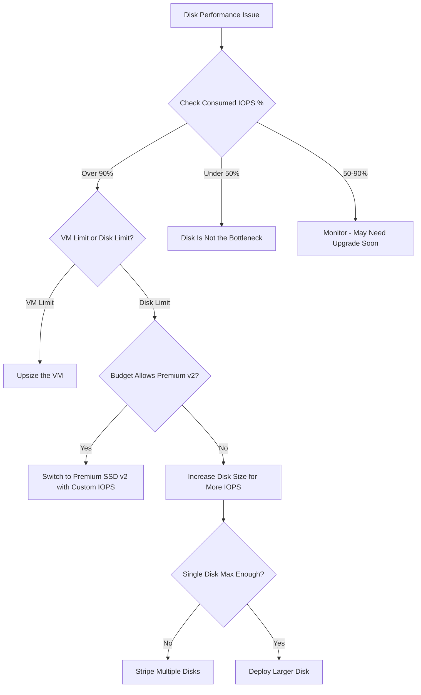

# How to Optimize Azure VM Disk Performance by Choosing the Right Storage Tier

Author: [nawazdhandala](https://www.github.com/nawazdhandala)

Tags: Azure, Virtual Machines, Managed Disks, Storage Performance, IOPS, Disk Tiers, Cloud

Description: A practical guide to choosing the right Azure managed disk tier for your VM workload to optimize both performance and cost.

---

Disk performance is one of the most overlooked aspects of Azure VM sizing. You can have a VM with plenty of CPU and memory, but if your disk cannot keep up with I/O demands, everything slows down. Database queries take longer, application boot times increase, and file operations crawl. The fix is choosing the right disk tier and size for your workload.

In this post, I will explain the different Azure managed disk tiers, how to measure your actual I/O needs, and how to pick the right disk for your use case.

## Understanding Azure Managed Disk Tiers

Azure offers five managed disk tiers, each with different performance and cost characteristics:

| Tier | Max IOPS | Max Throughput | Latency | Best For |
|------|----------|---------------|---------|----------|
| Ultra Disk | 160,000 | 4,000 MB/s | Sub-ms | SAP HANA, top-tier databases |
| Premium SSD v2 | 80,000 | 1,200 MB/s | Sub-ms | High-performance databases |
| Premium SSD | 20,000 | 900 MB/s | Single-digit ms | Production databases, demanding apps |
| Standard SSD | 6,000 | 750 MB/s | Single-digit ms | Web servers, dev/test, light databases |
| Standard HDD | 2,000 | 500 MB/s | Tens of ms | Backups, archival, infrequent access |

The most common mistake I see: running a production database on Standard SSD when it needs Premium SSD IOPS, or running a development server on Premium SSD when Standard SSD would be perfectly fine.

## Step 1: Measure Your Current Disk I/O

Before choosing a tier, measure what your workload actually needs. On a running VM:

On Linux:

```bash
# Install iostat if not already available
sudo apt-get install sysstat -y

# Monitor disk I/O for 60 seconds with 5-second intervals
# Look at r/s (reads per second), w/s (writes per second), and %util
iostat -xz 5 12

# Alternative: use the Azure Monitor agent data
# Check the Perf table in Log Analytics
```

On Windows:

```powershell
# Use Performance Monitor to check disk metrics
# Key counters to watch:
# - Disk Reads/sec and Disk Writes/sec (IOPS)
# - Disk Read Bytes/sec and Disk Write Bytes/sec (Throughput)
# - Avg. Disk sec/Read and Avg. Disk sec/Write (Latency)

Get-Counter -Counter "\PhysicalDisk(_Total)\Disk Reads/sec","\PhysicalDisk(_Total)\Disk Writes/sec","\PhysicalDisk(_Total)\Current Disk Queue Length" -SampleInterval 5 -MaxSamples 12
```

From Azure Monitor:

```bash
# Check disk IOPS and throughput metrics from Azure Monitor
az monitor metrics list \
  --resource "/subscriptions/<sub-id>/resourceGroups/myRG/providers/Microsoft.Compute/virtualMachines/myVM" \
  --metric "Data Disk IOPS Consumed Percentage,Data Disk Bandwidth Consumed Percentage,OS Disk IOPS Consumed Percentage" \
  --interval PT5M \
  --output table
```

The "Consumed Percentage" metrics are crucial. If you are regularly hitting 90%+ of consumed IOPS or bandwidth, your disk is the bottleneck.

## Step 2: Understand IOPS and Throughput Scaling

Managed disk performance depends on the disk size. Larger disks get more IOPS and throughput. Here is how Premium SSD scales:

| Premium SSD Size | IOPS | Throughput | Monthly Cost (approx) |
|-----------------|------|------------|---------------------|
| P4 (32 GB) | 120 | 25 MB/s | $5 |
| P10 (128 GB) | 500 | 100 MB/s | $19 |
| P15 (256 GB) | 1,100 | 125 MB/s | $37 |
| P20 (512 GB) | 2,300 | 150 MB/s | $73 |
| P30 (1 TB) | 5,000 | 200 MB/s | $135 |
| P40 (2 TB) | 7,500 | 250 MB/s | $260 |
| P50 (4 TB) | 7,500 | 250 MB/s | $491 |
| P60 (8 TB) | 16,000 | 500 MB/s | $860 |

Notice that a P4 (32 GB) only gets 120 IOPS. If your database needs 3,000 IOPS, you need at least a P20 (512 GB), even if you only store 50 GB of data. Sometimes you pay for disk capacity you do not need just to get the IOPS you do need.

This is where Premium SSD v2 shines - it lets you provision IOPS and throughput independently of capacity.

## Step 3: Choose Between Premium SSD and Premium SSD v2

**Premium SSD** (P-series) couples performance with capacity. You pick a size and get a fixed amount of IOPS and throughput. Simple, but inflexible.

**Premium SSD v2** lets you provision capacity, IOPS, and throughput independently:

- Base: 3,000 IOPS and 125 MB/s included with any size
- Additional IOPS: $0.05 per provisioned IOPS per month
- Additional throughput: $0.04 per provisioned MB/s per month

This means you can have a 100 GB disk with 10,000 IOPS, which is not possible with standard Premium SSD.

```bash
# Create a Premium SSD v2 disk with custom IOPS and throughput
az disk create \
  --resource-group myResourceGroup \
  --name myPremiumV2Disk \
  --location eastus \
  --size-gb 256 \
  --sku PremiumV2_LRS \
  --disk-iops-read-write 10000 \
  --disk-mbps-read-write 500 \
  --zone 1
```

**When to use Premium SSD v2**: When you need high IOPS but do not need a lot of storage capacity, or when you want to fine-tune performance independently of size.

**When to use regular Premium SSD**: When you need simplicity, or when your storage capacity needs naturally align with performance needs.

## Step 4: Consider Ultra Disks for Extreme Workloads

Ultra Disks are for workloads that need the absolute best storage performance: SAP HANA, Oracle databases, high-transaction financial systems.

```bash
# Create an Ultra Disk
az disk create \
  --resource-group myResourceGroup \
  --name myUltraDisk \
  --location eastus \
  --size-gb 512 \
  --sku UltraSSD_LRS \
  --disk-iops-read-write 50000 \
  --disk-mbps-read-write 1000 \
  --zone 1
```

Ultra Disks have some restrictions:

- Only available in specific regions and zones
- Only supported on specific VM sizes (Es_v5, Dsv5, M series, etc.)
- Cannot be used as OS disks
- Do not support disk snapshots (use disk backup instead)

Only use Ultra Disks if your workload genuinely needs more than 20,000 IOPS or sub-millisecond latency. For most workloads, Premium SSD v2 is sufficient.

## Step 5: Use Disk Bursting for Spiky Workloads

Premium SSD and Standard SSD disks smaller than P30 (1 TB) support bursting - they can temporarily exceed their baseline IOPS. This is useful for workloads with periodic spikes (like boot sequences, batch jobs, or traffic bursts).

There are two types of bursting:

- **Credit-based bursting** (default, free): Accumulates burst credits during idle periods. Bursts up to 3,500 IOPS for P4-P20 disks.
- **On-demand bursting** (paid, for P30+): Allows disks P30 and larger to burst beyond their baseline at a per-operation cost.

Check if your disk is using burst credits:

```bash
# Monitor disk burst credit percentage
az monitor metrics list \
  --resource "/subscriptions/<sub-id>/resourceGroups/myRG/providers/Microsoft.Compute/disks/myDisk" \
  --metric "BurstIOCreditsPercentage,BurstBWCreditsPercentage" \
  --interval PT5M \
  --output table
```

If burst credits are frequently at 0%, your disk is constantly bursting and you need a larger disk with a higher baseline.

## Step 6: Do Not Forget VM-Level Disk Limits

Even if your disk supports 20,000 IOPS, the VM itself has I/O limits. Each VM size has a maximum cached and uncached disk IOPS and throughput.

```bash
# Check VM size specifications including disk limits
az vm list-sizes \
  --location eastus \
  --query "[?name=='Standard_D4s_v5'].{Name: name, Cores: numberOfCores, MemoryMB: memoryInMb, MaxDataDisks: maxDataDiskCount}" \
  --output table
```

For detailed specs including I/O limits, check the Azure documentation or:

```bash
# Get the disk throughput limits of your running VM
az vm show \
  --resource-group myResourceGroup \
  --name myVM \
  --query "hardwareProfile.vmSize" \
  --output tsv
```

A Standard_D4s_v5 VM supports:
- Uncached disk IOPS: 6,400
- Uncached disk throughput: 150 MB/s
- Cached disk IOPS: 9,000

So even if you attach a P40 (7,500 IOPS) disk, the VM can only deliver 6,400 IOPS uncached. To get more disk I/O, you need a larger VM.

## Step 7: Use Disk Striping for Higher Performance

If a single disk does not provide enough IOPS or throughput, stripe multiple disks together using OS-level tools:

On Linux:

```bash
# Create a striped RAID-0 array from 4 Premium SSD disks
# This combines the IOPS and throughput of all 4 disks
sudo mdadm --create /dev/md0 \
  --level=0 \
  --raid-devices=4 \
  /dev/sdc /dev/sdd /dev/sde /dev/sdf

# Create a filesystem on the array
sudo mkfs.ext4 /dev/md0

# Mount the striped array
sudo mkdir /data
sudo mount /dev/md0 /data
```

On Windows, use Storage Spaces to create a striped virtual disk from multiple Azure data disks.

Four P30 (5,000 IOPS each) disks striped together give you 20,000 IOPS - matching the VM limit for larger VM sizes.

## Step 8: Match Disk Tier to Workload

Here is a decision guide:

| Workload | Recommended Tier |
|----------|-----------------|
| Dev/test environments | Standard SSD (E-series) |
| Web server (mostly reads, cached) | Standard SSD or Premium SSD P10 |
| Application server with moderate I/O | Premium SSD P20-P30 |
| SQL Server or PostgreSQL production | Premium SSD P30+ or Premium SSD v2 |
| High-transaction OLTP database | Premium SSD v2 or Ultra Disk |
| Backup storage | Standard HDD |
| Temp/scratch data | Local/Temporary disk (free, ephemeral) |

## Performance Optimization Flowchart



## Summary

Disk performance optimization in Azure comes down to understanding your I/O requirements and picking the right tier. Measure your actual IOPS and throughput needs before choosing. Remember that Premium SSD performance is tied to disk size, so you might pay for capacity you do not need just to get performance. Premium SSD v2 solves this by decoupling performance from capacity. Always check VM-level I/O limits since the VM can be the bottleneck regardless of the disk. And use disk striping when a single disk is not enough. Start with Standard SSD for non-production workloads and upgrade based on measured needs, not guesses.
