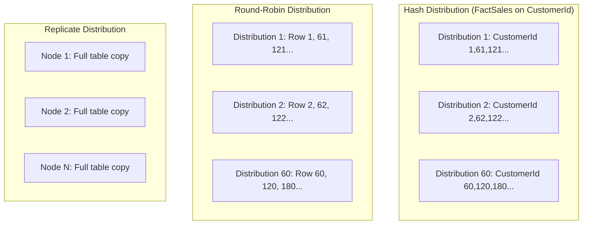

# How to Optimize Query Performance in Azure Synapse Dedicated SQL Pool with Distribution Keys

Author: [nawazdhandala](https://www.github.com/nawazdhandala)

Tags: Azure, Synapse Analytics, Query Performance, Distribution Keys, Dedicated SQL Pool, Data Warehouse, Optimization

Description: Learn how to choose the right distribution keys in Azure Synapse dedicated SQL pool to minimize data movement and maximize query performance.

---

The single most impactful performance decision in Azure Synapse dedicated SQL pool is how you distribute your data. Every table is split across 60 distributions. When a query joins two tables, the engine needs matching rows to be on the same compute node. If they are not, data must be shuffled across the network - an expensive operation called data movement. The right distribution key minimizes this movement. The wrong one can make queries orders of magnitude slower than they need to be.

## Understanding Data Distribution

When you create a table in a dedicated SQL pool, you choose one of three distribution strategies:

- **Hash distribution**: Rows are assigned to distributions based on a hash of a specified column value. All rows with the same hash value end up in the same distribution.
- **Round-robin distribution**: Rows are distributed evenly across all 60 distributions in a round-robin fashion. No column determines placement.
- **Replicate distribution**: The entire table is copied to every compute node.



## Why Distribution Keys Matter

Consider this simple join:

```sql
SELECT c.CustomerName, SUM(s.TotalAmount) AS Revenue
FROM FactSales s
JOIN DimCustomer c ON s.CustomerId = c.CustomerId
GROUP BY c.CustomerName;
```

**Scenario 1: FactSales distributed on CustomerId, DimCustomer replicated.**
- The join executes locally on each compute node. No data movement needed.
- This is the ideal scenario.

**Scenario 2: FactSales distributed on OrderId, DimCustomer distributed on CustomerId.**
- To join, the engine must shuffle either FactSales or DimCustomer so that matching CustomerId values are co-located.
- For a billion-row fact table, this shuffle is extremely expensive.

**Scenario 3: Both tables are round-robin.**
- The engine must shuffle both tables for the join. This is the worst case.

You can see the impact by looking at the query execution plan:

```sql
-- Check the execution plan for data movement operations
EXPLAIN
SELECT c.CustomerName, SUM(s.TotalAmount) AS Revenue
FROM FactSales s
JOIN DimCustomer c ON s.CustomerId = c.CustomerId
GROUP BY c.CustomerName;
```

Look for these data movement operations in the plan:
- **ShuffleMove**: Data is redistributed by a hash key. Moderate cost.
- **BroadcastMove**: An entire table is sent to all nodes. Expensive for large tables.
- **TrimMove**: Data is moved to reduce distributions. Moderate cost.
- **No movement**: Data is already co-located. Ideal.

## Choosing the Right Distribution Key

A good hash distribution key has these characteristics:

### 1. High Cardinality

The column should have many unique values (ideally at least 60, since there are 60 distributions). Low cardinality means some distributions get much more data than others, creating skew.

```sql
-- Check the cardinality of potential distribution columns
SELECT
    COUNT(DISTINCT CustomerId) AS CustomerIdCardinality,
    COUNT(DISTINCT ProductId) AS ProductIdCardinality,
    COUNT(DISTINCT OrderDate) AS OrderDateCardinality,
    COUNT(DISTINCT Country) AS CountryCardinality
FROM FactSales;
```

If CustomerId has 500,000 unique values and Country has 50, CustomerId is the better distribution key.

### 2. Even Distribution

The values should be evenly distributed. If 80% of sales come from 10 customers, distributing on CustomerId will create 10 hot distributions and 50 cold ones.

```sql
-- Check distribution evenness for a candidate column
SELECT
    CustomerId,
    COUNT(*) AS RowCount
FROM FactSales
GROUP BY CustomerId
ORDER BY RowCount DESC;

-- Check for skew across distributions after a table is created
DBCC PDW_SHOWSPACEUSED('dbo.FactSales');
```

The output of `DBCC PDW_SHOWSPACEUSED` shows row counts per distribution. Significant variance means skew.

### 3. Frequently Used in JOINs

The column should be a common join key. If most queries join FactSales to DimCustomer on CustomerId, distributing FactSales on CustomerId eliminates data movement for those joins.

```sql
-- Review your most common query patterns to identify join columns
-- These queries from your workload tell you which columns matter:

-- Pattern 1: Sales by customer
SELECT c.CustomerName, SUM(s.TotalAmount)
FROM FactSales s JOIN DimCustomer c ON s.CustomerId = c.CustomerId
GROUP BY c.CustomerName;

-- Pattern 2: Sales by product
SELECT p.ProductName, SUM(s.TotalAmount)
FROM FactSales s JOIN DimProduct p ON s.ProductId = p.ProductId
GROUP BY p.ProductName;

-- If Pattern 1 runs 10x more often, distribute on CustomerId
```

### 4. Not Used in WHERE Clauses with Single Values

If your queries frequently filter on a single value of the distribution column (`WHERE CustomerId = 12345`), only one distribution out of 60 handles the query. The other 59 distributions do nothing, wasting compute.

## Distribution Strategy by Table Type

### Fact Tables (Large, Many Rows)

Always use HASH distribution on fact tables. Choose the most frequently joined column.

```sql
-- Example: Fact table distributed on the primary join key
CREATE TABLE dbo.FactSales (
    SalesId BIGINT NOT NULL,
    CustomerId INT NOT NULL,
    ProductId INT NOT NULL,
    OrderDate DATE NOT NULL,
    Quantity INT NOT NULL,
    UnitPrice DECIMAL(10, 2) NOT NULL,
    TotalAmount DECIMAL(12, 2) NOT NULL
)
WITH (
    DISTRIBUTION = HASH(CustomerId),
    CLUSTERED COLUMNSTORE INDEX
);
```

### Dimension Tables (Small to Medium)

For small dimensions (under a few hundred MB), use REPLICATE. This copies the table to every node, eliminating joins altogether.

```sql
-- Small dimension table - replicate to all nodes
CREATE TABLE dbo.DimProduct (
    ProductId INT NOT NULL,
    ProductName NVARCHAR(200),
    Category NVARCHAR(100),
    Brand NVARCHAR(100)
)
WITH (
    DISTRIBUTION = REPLICATE,
    CLUSTERED COLUMNSTORE INDEX
);
```

For large dimensions (millions of rows), consider HASH distribution on the same key used to join with fact tables.

```sql
-- Large dimension table - hash distribute on the join key
CREATE TABLE dbo.DimCustomer (
    CustomerId INT NOT NULL,
    CustomerName NVARCHAR(200),
    City NVARCHAR(100),
    Country NVARCHAR(100)
)
WITH (
    DISTRIBUTION = HASH(CustomerId),
    CLUSTERED COLUMNSTORE INDEX
);
```

When both FactSales and DimCustomer are distributed on CustomerId, the join is always local. No data movement.

### Staging Tables

Use ROUND_ROBIN for staging tables. You are just loading data temporarily, and round-robin is the fastest distribution for inserts.

```sql
CREATE TABLE dbo.StagingSales (
    SalesId BIGINT,
    CustomerId INT,
    ProductId INT,
    OrderDate VARCHAR(10),
    Quantity INT,
    UnitPrice DECIMAL(10, 2)
)
WITH (
    DISTRIBUTION = ROUND_ROBIN,
    HEAP
);
```

## Detecting and Fixing Skewed Distributions

After loading data, check for distribution skew:

```sql
-- Check row distribution across the 60 distributions
SELECT
    distribution_id,
    COUNT(*) AS row_count
FROM sys.pdw_table_distribution_properties dp
JOIN sys.tables t ON dp.object_id = t.object_id
WHERE t.name = 'FactSales'
GROUP BY distribution_id
ORDER BY row_count DESC;

-- Alternative: use DBCC for a quick check
DBCC PDW_SHOWSPACEUSED('dbo.FactSales');
```

If the largest distribution has more than 2x the rows of the smallest, you have a skew problem. Solutions:

1. **Choose a different distribution column**: Pick one with more even distribution.
2. **Use a composite column**: Create a computed column combining two fields and distribute on that.
3. **Switch to ROUND_ROBIN**: If no column distributes evenly, round-robin at least avoids skew (though joins will require shuffles).

## Changing Distribution After Table Creation

You cannot alter the distribution of an existing table. You need to recreate it using CTAS:

```sql
-- Recreate the table with a different distribution key
CREATE TABLE dbo.FactSales_new
WITH (
    DISTRIBUTION = HASH(ProductId),   -- Changed from CustomerId to ProductId
    CLUSTERED COLUMNSTORE INDEX
)
AS
SELECT * FROM dbo.FactSales;

-- Rename tables to swap
RENAME OBJECT dbo.FactSales TO FactSales_old;
RENAME OBJECT dbo.FactSales_new TO FactSales;

-- Drop the old table after verifying
DROP TABLE dbo.FactSales_old;
```

## Wrapping Up

Distribution key selection is the foundation of query performance in Azure Synapse dedicated SQL pool. The rules are straightforward: hash-distribute large fact tables on frequently joined columns with high cardinality and even distribution, replicate small dimension tables, and use round-robin for staging. After loading data, verify distribution evenness with `DBCC PDW_SHOWSPACEUSED` and check execution plans for unnecessary data movement operations. Getting distribution right eliminates the most expensive operation in MPP query processing - shuffling data across the network.
