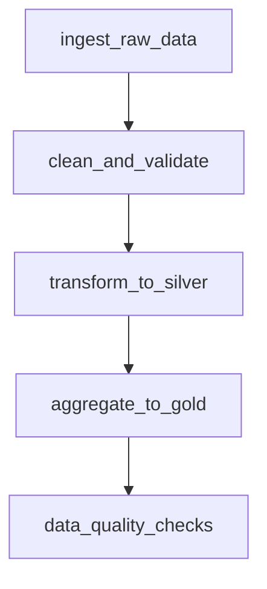

# How to Orchestrate Databricks Notebooks as Workflows with Job Scheduling

Author: [nawazdhandala](https://www.github.com/nawazdhandala)

Tags: Azure Databricks, Workflows, Job Scheduling, Notebook Orchestration, Data Pipelines, Azure

Description: Learn how to orchestrate Databricks notebooks as production workflows using Databricks Jobs with scheduling, dependencies, and error handling.

---

Running notebooks interactively is fine for development and exploration, but production data pipelines need something more structured. Databricks Workflows (formerly Jobs) lets you orchestrate notebooks into multi-step pipelines with scheduling, task dependencies, retry logic, and monitoring. It is the built-in way to run production workloads in Databricks without needing an external orchestrator.

In this post, I will show you how to build a complete workflow that orchestrates multiple notebooks, configure scheduling, handle failures, and monitor execution.

## Workflows vs. External Orchestrators

You might wonder why you would use Databricks Workflows instead of Azure Data Factory or Apache Airflow. Here is the tradeoff:

- **Databricks Workflows** - best when your pipeline is entirely within Databricks. It has tight integration with clusters, notebooks, and Delta Lake. Simpler to set up and maintain.
- **Azure Data Factory** - best when your pipeline spans multiple services (Databricks + SQL Database + Blob Storage + other Azure services). Better for heterogeneous pipelines.
- **Apache Airflow** - best when you need complex DAG logic, have a large existing Airflow infrastructure, or need platform independence.

For Databricks-centric workloads, Workflows is the natural choice.

## Step 1: Prepare Your Notebooks

Before creating a workflow, structure your notebooks as modular, reusable units. Each notebook should do one thing well.

Here is an example pipeline structure for a data processing workflow.

```
/Repos/production/etl-pipeline/
  01_ingest_raw_data.py
  02_clean_and_validate.py
  03_transform_to_silver.py
  04_aggregate_to_gold.py
  05_data_quality_checks.py
```

### Parameterize Notebooks with Widgets

Use Databricks widgets to accept parameters at runtime.

```python
# 01_ingest_raw_data.py - Ingest raw data from source

# Define input parameters using widgets
dbutils.widgets.text("source_path", "abfss://raw@storage.dfs.core.windows.net/")
dbutils.widgets.text("target_table", "bronze.raw_events")
dbutils.widgets.text("processing_date", "2026-02-16")

# Read parameters
source_path = dbutils.widgets.get("source_path")
target_table = dbutils.widgets.get("target_table")
processing_date = dbutils.widgets.get("processing_date")

# Build the full path with date partitioning
full_path = f"{source_path}year={processing_date[:4]}/month={processing_date[5:7]}/day={processing_date[8:10]}/"

print(f"Reading from: {full_path}")
print(f"Writing to: {target_table}")

# Read the raw data
df = spark.read.format("json").load(full_path)

# Write to Delta table with append mode
df.write.format("delta").mode("append").saveAsTable(target_table)

# Return a status for downstream tasks
dbutils.notebook.exit(f"Ingested {df.count()} rows")
```

### Pass Values Between Notebooks

Notebooks can return values using `dbutils.notebook.exit()`. Downstream tasks can access these values.

```python
# 05_data_quality_checks.py - Run data quality checks

target_table = dbutils.widgets.get("target_table")

# Run quality checks
row_count = spark.sql(f"SELECT COUNT(*) as cnt FROM {target_table}").first().cnt
null_count = spark.sql(f"SELECT COUNT(*) as cnt FROM {target_table} WHERE id IS NULL").first().cnt

# Fail the notebook if quality checks do not pass
if row_count == 0:
    raise ValueError(f"Table {target_table} has zero rows after processing")

if null_count > 0:
    raise ValueError(f"Found {null_count} null IDs in {target_table}")

print(f"Quality checks passed: {row_count} rows, 0 null IDs")
dbutils.notebook.exit(f"PASSED: {row_count} rows")
```

## Step 2: Create a Workflow

### Using the UI

1. In the Databricks workspace, click **Workflows** in the left sidebar
2. Click **Create Job**
3. Give the job a name (e.g., `etl_daily_pipeline`)

### Add Tasks

Each task in a workflow represents a notebook to run. Add tasks and define their dependencies.

**Task 1: Ingest Data**
- Task name: `ingest_raw_data`
- Type: Notebook
- Source: `/Repos/production/etl-pipeline/01_ingest_raw_data.py`
- Cluster: New Job Cluster (define configuration)
- Parameters: `{"source_path": "abfss://raw@storage.dfs.core.windows.net/", "target_table": "bronze.raw_events", "processing_date": "{{job.start_time.iso_date}}"}`

**Task 2: Clean and Validate**
- Task name: `clean_and_validate`
- Depends on: `ingest_raw_data`
- Source: `/Repos/production/etl-pipeline/02_clean_and_validate.py`

**Task 3: Transform to Silver**
- Task name: `transform_to_silver`
- Depends on: `clean_and_validate`
- Source: `/Repos/production/etl-pipeline/03_transform_to_silver.py`

**Task 4: Aggregate to Gold**
- Task name: `aggregate_to_gold`
- Depends on: `transform_to_silver`
- Source: `/Repos/production/etl-pipeline/04_aggregate_to_gold.py`

**Task 5: Data Quality**
- Task name: `data_quality_checks`
- Depends on: `aggregate_to_gold`
- Source: `/Repos/production/etl-pipeline/05_data_quality_checks.py`

The dependency graph looks like this.



### Using the REST API

You can also create workflows programmatically.

```json
// POST to https://<databricks-instance>/api/2.1/jobs/create
{
  "name": "etl_daily_pipeline",
  "tasks": [
    {
      "task_key": "ingest_raw_data",
      "notebook_task": {
        "notebook_path": "/Repos/production/etl-pipeline/01_ingest_raw_data",
        "base_parameters": {
          "source_path": "abfss://raw@storage.dfs.core.windows.net/",
          "target_table": "bronze.raw_events",
          "processing_date": "{{job.start_time.iso_date}}"
        }
      },
      "new_cluster": {
        "spark_version": "14.3.x-scala2.12",
        "node_type_id": "Standard_DS3_v2",
        "num_workers": 2
      }
    },
    {
      "task_key": "clean_and_validate",
      "depends_on": [{"task_key": "ingest_raw_data"}],
      "notebook_task": {
        "notebook_path": "/Repos/production/etl-pipeline/02_clean_and_validate"
      },
      "new_cluster": {
        "spark_version": "14.3.x-scala2.12",
        "node_type_id": "Standard_DS3_v2",
        "num_workers": 2
      }
    },
    {
      "task_key": "transform_to_silver",
      "depends_on": [{"task_key": "clean_and_validate"}],
      "notebook_task": {
        "notebook_path": "/Repos/production/etl-pipeline/03_transform_to_silver"
      },
      "new_cluster": {
        "spark_version": "14.3.x-scala2.12",
        "node_type_id": "Standard_DS4_v2",
        "num_workers": 4
      }
    },
    {
      "task_key": "aggregate_to_gold",
      "depends_on": [{"task_key": "transform_to_silver"}],
      "notebook_task": {
        "notebook_path": "/Repos/production/etl-pipeline/04_aggregate_to_gold"
      },
      "existing_cluster_id": "same-as-previous"
    },
    {
      "task_key": "data_quality_checks",
      "depends_on": [{"task_key": "aggregate_to_gold"}],
      "notebook_task": {
        "notebook_path": "/Repos/production/etl-pipeline/05_data_quality_checks"
      },
      "existing_cluster_id": "same-as-previous"
    }
  ]
}
```

## Step 3: Configure Scheduling

Add a schedule to run the workflow automatically.

In the Workflows UI:
1. Open your job
2. Click **Add trigger** > **Scheduled**
3. Configure the cron expression

```json
// Schedule configuration
{
  "quartz_cron_expression": "0 0 6 * * ?",
  "timezone_id": "UTC",
  "pause_status": "UNPAUSED"
}
```

Common cron expressions:
- `0 0 6 * * ?` - every day at 6:00 AM
- `0 0 */2 * * ?` - every 2 hours
- `0 0 6 ? * MON-FRI` - weekdays at 6:00 AM
- `0 30 8 1 * ?` - 1st of every month at 8:30 AM

## Step 4: Configure Error Handling

### Retry Policies

Set retry policies on individual tasks to handle transient failures.

```json
// Task with retry configuration
{
  "task_key": "ingest_raw_data",
  "retry_on_timeout": true,
  "max_retries": 3,
  "min_retry_interval_millis": 60000,
  "timeout_seconds": 3600
}
```

### Conditional Tasks

Run specific tasks only when upstream tasks fail.

```json
// Alert task that runs only on failure
{
  "task_key": "send_failure_alert",
  "depends_on": [
    {
      "task_key": "data_quality_checks",
      "outcome": "failed"
    }
  ],
  "notebook_task": {
    "notebook_path": "/Repos/production/etl-pipeline/send_alert",
    "base_parameters": {
      "message": "Data quality checks failed"
    }
  }
}
```

### Email Notifications

Configure email notifications for job success, failure, or both.

```json
// Notification configuration
{
  "email_notifications": {
    "on_start": ["team@company.com"],
    "on_success": ["team@company.com"],
    "on_failure": ["oncall@company.com", "team@company.com"],
    "no_alert_for_skipped_runs": true
  }
}
```

## Step 5: Monitor Workflow Runs

### Workflows UI

The Workflows page shows all job runs with:
- Run status (Succeeded, Failed, Running, Cancelled)
- Start time and duration
- Task-level status and timelines
- Links to notebook output and logs

### Programmatic Monitoring

Use the REST API to check job run status.

```bash
# List recent runs for a job
curl -X GET "https://<databricks-instance>/api/2.1/jobs/runs/list?job_id=12345&limit=5" \
  -H "Authorization: Bearer <token>"
```

## Cluster Sharing Between Tasks

For cost efficiency, multiple tasks can share a single job cluster instead of each spinning up its own.

```json
// Define a shared job cluster
{
  "job_clusters": [
    {
      "job_cluster_key": "shared_etl_cluster",
      "new_cluster": {
        "spark_version": "14.3.x-scala2.12",
        "node_type_id": "Standard_DS4_v2",
        "num_workers": 4,
        "spark_conf": {
          "spark.sql.adaptive.enabled": "true"
        }
      }
    }
  ],
  "tasks": [
    {
      "task_key": "task_1",
      "job_cluster_key": "shared_etl_cluster",
      "notebook_task": { "notebook_path": "/path/to/notebook1" }
    },
    {
      "task_key": "task_2",
      "depends_on": [{"task_key": "task_1"}],
      "job_cluster_key": "shared_etl_cluster",
      "notebook_task": { "notebook_path": "/path/to/notebook2" }
    }
  ]
}
```

Shared clusters save time (no cluster startup between tasks) and money (one cluster instead of many).

## Wrapping Up

Databricks Workflows provides a solid orchestration layer for notebook-based data pipelines. The key is to design your notebooks as modular, parameterized units that each handle one step of the process. Use task dependencies to define the execution order, retry policies to handle transient failures, and shared job clusters to optimize cost. For Databricks-centric workloads, this is often simpler and more integrated than bringing in an external orchestrator. Start with a simple linear workflow, then evolve to parallel and conditional execution patterns as your pipeline complexity grows.
