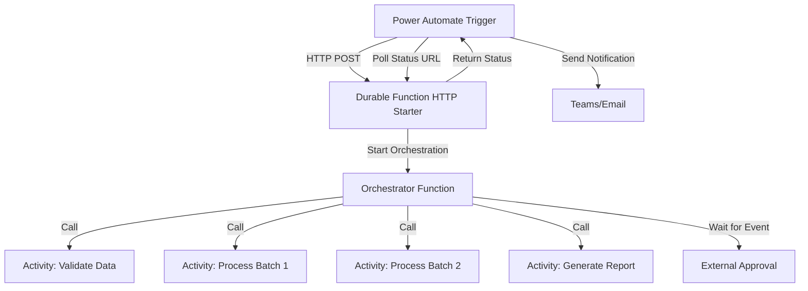

# How to Orchestrate Long-Running Workflows with Power Automate and Azure Durable Functions

Author: [nawazdhandala](https://www.github.com/nawazdhandala)

Tags: Power Automate, Azure Durable Functions, Orchestration, Serverless, Workflows, Power Platform, Azure Functions

Description: Combine Power Automate with Azure Durable Functions to orchestrate long-running workflows that exceed Power Automate's timeout limits.

---

Power Automate has a 30-day timeout limit for cloud flows, which sounds generous until you realize that individual HTTP actions timeout after 120 seconds by default. When your workflow needs to process large datasets, wait for external approvals, or coordinate multiple long-running tasks, you hit walls quickly. Azure Durable Functions solve this by providing stateful orchestration that can run for days, weeks, or even months, all while being serverless.

This guide shows how to kick off and monitor Durable Function orchestrations from Power Automate, giving you the best of both worlds.

## Why Combine These Two?

Power Automate excels at:
- Triggering workflows from business events (Dataverse changes, emails, form submissions)
- Connecting to hundreds of SaaS connectors
- User-friendly approval workflows
- No-code/low-code accessibility

Azure Durable Functions excel at:
- Long-running stateful workflows
- Fan-out/fan-in patterns (parallel processing)
- Human interaction patterns with custom timeouts
- Complex retry and error handling
- High-throughput processing

By combining them, Power Automate handles the trigger and notification side, while Durable Functions handle the heavy lifting.

## Architecture



## Step 1: Create the Durable Functions Project

Set up a .NET Azure Functions project with the Durable Functions extension. Here is the project setup:

```bash
# Create the project
func init LongRunningWorkflow --dotnet
cd LongRunningWorkflow

# Add the Durable Functions extension
dotnet add package Microsoft.Azure.WebJobs.Extensions.DurableTask
```

### The HTTP Starter Function

This is the entry point that Power Automate calls. It starts the orchestration and returns status URLs.

```csharp
// HTTP Starter function - the entry point called by Power Automate
// Returns status URLs for checking orchestration progress
using Microsoft.Azure.WebJobs;
using Microsoft.Azure.WebJobs.Extensions.DurableTask;
using Microsoft.Azure.WebJobs.Extensions.Http;
using Microsoft.AspNetCore.Http;
using Microsoft.Extensions.Logging;
using System.Threading.Tasks;

public static class HttpStarter
{
    [FunctionName("StartOrchestration")]
    public static async Task<HttpResponseMessage> Run(
        [HttpTrigger(AuthorizationLevel.Function, "post")] HttpRequest req,
        [DurableClient] IDurableOrchestrationClient client,
        ILogger log)
    {
        // Read the input payload from Power Automate
        string requestBody = await new StreamReader(req.Body).ReadToEndAsync();
        var input = JsonSerializer.Deserialize<WorkflowInput>(requestBody);

        // Start the orchestration with the input
        string instanceId = await client.StartNewAsync(
            "DataProcessingOrchestrator",
            input
        );

        log.LogInformation($"Started orchestration with ID = {instanceId}");

        // Return the status check URLs
        // Power Automate will use these to poll for completion
        return client.CreateCheckStatusResponse(req, instanceId);
    }
}
```

### The Orchestrator Function

This is the brain of the workflow. It coordinates the activity functions.

```csharp
// Orchestrator function - coordinates the workflow steps
// This function is replayed by the Durable Task framework
// so it must be deterministic (no I/O, no random, no DateTime.Now)
using Microsoft.Azure.WebJobs;
using Microsoft.Azure.WebJobs.Extensions.DurableTask;
using Microsoft.Extensions.Logging;
using System.Collections.Generic;
using System.Threading.Tasks;

public static class DataProcessingOrchestrator
{
    [FunctionName("DataProcessingOrchestrator")]
    public static async Task<WorkflowResult> Run(
        [OrchestrationTrigger] IDurableOrchestrationContext context,
        ILogger log)
    {
        var input = context.GetInput<WorkflowInput>();
        var result = new WorkflowResult();

        // Step 1: Validate the input data
        result.ValidationResult = await context.CallActivityAsync<ValidationResult>(
            "ValidateData", input);

        if (!result.ValidationResult.IsValid)
        {
            result.Status = "ValidationFailed";
            return result;
        }

        // Step 2: Split data into batches and process in parallel
        var batches = await context.CallActivityAsync<List<DataBatch>>(
            "SplitIntoBatches", input);

        // Fan-out: process all batches in parallel
        var batchTasks = new List<Task<BatchResult>>();
        foreach (var batch in batches)
        {
            batchTasks.Add(
                context.CallActivityAsync<BatchResult>("ProcessBatch", batch)
            );
        }

        // Fan-in: wait for all batches to complete
        var batchResults = await Task.WhenAll(batchTasks);
        result.ProcessedBatches = batchResults.Length;

        // Step 3: Generate a summary report
        result.ReportUrl = await context.CallActivityAsync<string>(
            "GenerateReport", batchResults);

        // Step 4: Wait for human approval (with a 7-day timeout)
        using (var cts = new CancellationTokenSource())
        {
            var approvalTimeout = context.CurrentUtcDateTime.AddDays(7);
            var timeoutTask = context.CreateTimer(approvalTimeout, cts.Token);
            var approvalTask = context.WaitForExternalEvent<bool>("ApprovalEvent");

            var winner = await Task.WhenAny(approvalTask, timeoutTask);
            if (winner == approvalTask)
            {
                cts.Cancel();
                result.Approved = approvalTask.Result;
            }
            else
            {
                result.Approved = false;
                result.Status = "TimedOut";
                return result;
            }
        }

        // Step 5: If approved, finalize
        if (result.Approved)
        {
            await context.CallActivityAsync("FinalizeProcessing", result);
            result.Status = "Completed";
        }
        else
        {
            result.Status = "Rejected";
        }

        return result;
    }
}
```

### Activity Functions

These do the actual work. Each activity runs independently and can be retried.

```csharp
// Activity function for data validation
// Activities contain the actual business logic and can do I/O
[FunctionName("ValidateData")]
public static ValidationResult ValidateData(
    [ActivityTrigger] WorkflowInput input,
    ILogger log)
{
    log.LogInformation($"Validating data for {input.DataSource}");

    var result = new ValidationResult { IsValid = true };

    // Check data source accessibility
    if (string.IsNullOrEmpty(input.DataSource))
    {
        result.IsValid = false;
        result.Errors.Add("Data source URL is required");
    }

    // Add more validation as needed
    return result;
}

// Activity function for batch processing
// Each batch runs independently and can be retried on failure
[FunctionName("ProcessBatch")]
public static async Task<BatchResult> ProcessBatch(
    [ActivityTrigger] DataBatch batch,
    ILogger log)
{
    log.LogInformation($"Processing batch {batch.BatchId} with {batch.RecordCount} records");

    var result = new BatchResult { BatchId = batch.BatchId };

    foreach (var record in batch.Records)
    {
        // Process each record
        await ProcessRecord(record);
        result.ProcessedCount++;
    }

    return result;
}
```

## Step 2: Deploy and Configure

Deploy the function app to Azure:

```bash
# Deploy using Azure Functions Core Tools
func azure functionapp publish YourFunctionAppName
```

After deployment, get the function URL:
`https://yourfunctionapp.azurewebsites.net/api/StartOrchestration?code=YOUR_FUNCTION_KEY`

## Step 3: Build the Power Automate Flow

### Trigger

Choose your trigger based on the business scenario. For example, a Dataverse trigger when a new processing request is created.

### Start the Orchestration

Add an HTTP action to call the Durable Function starter:

- Method: POST
- URI: Your function URL
- Headers: Content-Type: application/json
- Body:

```json
{
    "dataSource": "@{triggerOutputs()?['body/datasourceurl']}",
    "recordCount": "@{triggerOutputs()?['body/recordcount']}",
    "requestedBy": "@{triggerOutputs()?['body/requestedby']}"
}
```

### Parse the Status URLs

The starter function returns a JSON response with status URLs. Parse it:

```json
{
    "type": "object",
    "properties": {
        "id": { "type": "string" },
        "statusQueryGetUri": { "type": "string" },
        "sendEventPostUri": { "type": "string" },
        "terminatePostUri": { "type": "string" },
        "purgeHistoryDeleteUri": { "type": "string" }
    }
}
```

Store `statusQueryGetUri` and `sendEventPostUri` in variables - you will need them.

### Poll for Completion

Use a "Do until" loop to poll the orchestration status:

1. Add a "Do until" loop.
2. Condition: `@equals(variables('orchestrationStatus'), 'Completed')` OR the status is Failed/Terminated.
3. Inside the loop:
   - Add a Delay of 5 minutes (adjust based on expected duration).
   - Add an HTTP GET to the `statusQueryGetUri`.
   - Parse the response and update the `orchestrationStatus` variable.

The status response includes:
- `runtimeStatus`: Running, Completed, Failed, Terminated, etc.
- `output`: The final result when completed.
- `customStatus`: Custom status messages set by the orchestrator.

### Handle the Approval Step

When the orchestration reaches the approval wait step, send an approval from Power Automate:

1. After the polling loop detects `customStatus` is "WaitingForApproval", break out.
2. Use the Power Automate Approvals connector to send an approval request.
3. When the approver responds, send the event to the orchestration:

HTTP POST to the `sendEventPostUri` (replace `{eventName}` with `ApprovalEvent`):

```json
true
```

Or `false` if rejected.

## Step 4: Error Handling

### Retry Policies in Durable Functions

Configure retry policies on activity calls:

```csharp
// Retry options for the batch processing activity
// Retries up to 5 times with exponential backoff
var retryOptions = new RetryOptions(
    firstRetryInterval: TimeSpan.FromSeconds(30),
    maxNumberOfAttempts: 5
)
{
    BackoffCoefficient = 2.0,
    MaxRetryInterval = TimeSpan.FromMinutes(10)
};

await context.CallActivityWithRetryAsync<BatchResult>(
    "ProcessBatch", retryOptions, batch);
```

### Handling Orchestration Failure in Power Automate

In the polling loop, check for failure status:

```
@or(
    equals(variables('orchestrationStatus'), 'Failed'),
    equals(variables('orchestrationStatus'), 'Terminated')
)
```

If failed, retrieve the error details from the status response and send an alert.

## Step 5: Monitor the Orchestration

### Durable Functions Monitor

Use the Durable Functions Monitor extension for VS Code or the Azure Portal to view:

- Active orchestration instances
- Orchestration history (each step and its duration)
- Failed instances and error details

### Custom Status Updates

Set custom status in the orchestrator to give Power Automate more detail:

```csharp
// Update the custom status so Power Automate knows the current step
context.SetCustomStatus(new {
    Step = "ProcessingBatches",
    Progress = $"{completedBatches}/{totalBatches}"
});
```

Power Automate can read this from the status polling response and display progress to users.

## Wrapping Up

Combining Power Automate with Azure Durable Functions lets you orchestrate workflows that would be impossible with either tool alone. Power Automate handles triggers, approvals, and notifications while Durable Functions handle the long-running, stateful processing with fan-out/fan-in parallelism, custom retry policies, and human interaction timeouts. The key integration points are the HTTP starter function, the status polling loop, and the external event mechanism for approvals.
