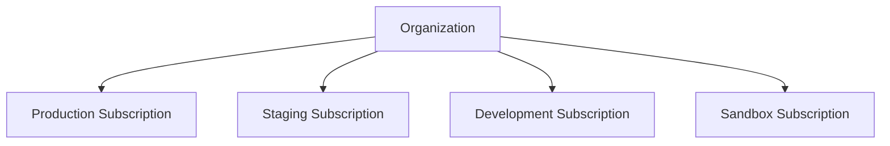
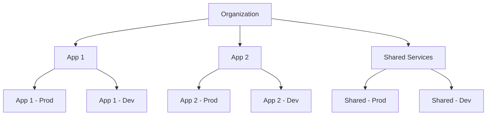
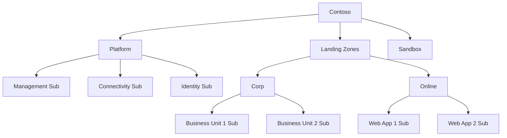

# How to Organize Azure Subscriptions and Management Groups for Enterprise Governance

Author: [nawazdhandala](https://www.github.com/nawazdhandala)

Tags: Azure, Subscriptions, Management Groups, Enterprise Governance, Cloud Organization, Architecture, Policy

Description: Organize your Azure subscriptions and management groups into a scalable hierarchy that enables effective governance, cost management, and team autonomy.

---

As your Azure footprint grows, the question of how to organize subscriptions becomes critical. Should each team get their own subscription? Should each environment be a separate subscription? Should you use one subscription for everything? The answer depends on your organization's size, governance requirements, and operational model.

In this post, I will walk through the decision framework for organizing subscriptions and management groups, with practical guidance based on patterns that work well for enterprises.

## Why Multiple Subscriptions

At first, a single subscription seems simpler. But as you scale, a single subscription creates problems:

- **Subscription limits.** Azure subscriptions have resource limits (e.g., 250 storage accounts per region per subscription, 25,000 VMs). You will hit these limits faster than you think.
- **Blast radius.** An accidental policy change or RBAC modification in a single subscription affects everything.
- **Cost isolation.** With one subscription, it is hard to allocate costs to specific teams or projects.
- **Autonomy.** Different teams need different levels of access and different policies.

The general rule: use separate subscriptions for separate concerns.

## Subscription Organization Patterns

### Pattern 1: By Environment

Separate subscriptions for each environment. This is the simplest pattern and works well for small to medium organizations:



**Pros:** Clear separation between environments, easy to apply different policies per environment.
**Cons:** As you add applications, each environment subscription gets crowded.

### Pattern 2: By Application and Environment

Each application gets its own set of subscriptions. Better for larger organizations:



**Pros:** Each application has its own isolated environment, teams have full autonomy within their subscriptions.
**Cons:** Many subscriptions to manage, needs automation for subscription provisioning.

### Pattern 3: By Business Unit (Enterprise)

The Cloud Adoption Framework recommended approach for enterprises:



**Pros:** Scales to thousands of subscriptions, clear policy inheritance, supports team autonomy.
**Cons:** Requires upfront planning and platform team investment.

## Decision Framework

Use this decision tree to choose the right pattern:

1. **Fewer than 10 workloads?** Use Pattern 1 (by environment). Simple and sufficient.
2. **10-50 workloads with 2-5 teams?** Use Pattern 2 (by application and environment). Gives each team their space.
3. **50+ workloads with multiple business units?** Use Pattern 3 (enterprise). Invest in the management group hierarchy.

## Setting Up the Management Group Hierarchy

For the enterprise pattern, create management groups that reflect your governance needs:

```bash
# Create the hierarchy
az account management-group create --name "contoso" --display-name "Contoso"

# Platform groups
az account management-group create --name "contoso-platform" --display-name "Platform" --parent "contoso"
az account management-group create --name "contoso-mgmt" --display-name "Management" --parent "contoso-platform"
az account management-group create --name "contoso-conn" --display-name "Connectivity" --parent "contoso-platform"
az account management-group create --name "contoso-identity" --display-name "Identity" --parent "contoso-platform"

# Landing zone groups
az account management-group create --name "contoso-lz" --display-name "Landing Zones" --parent "contoso"
az account management-group create --name "contoso-lz-corp" --display-name "Corp" --parent "contoso-lz"
az account management-group create --name "contoso-lz-online" --display-name "Online" --parent "contoso-lz"

# Other groups
az account management-group create --name "contoso-sandbox" --display-name "Sandbox" --parent "contoso"
az account management-group create --name "contoso-decom" --display-name "Decommissioned" --parent "contoso"
```

## Subscription Provisioning Automation

Manual subscription creation does not scale. Automate it with a subscription vending machine:

```hcl
# Terraform module for subscription vending
# Teams request subscriptions through a self-service portal
# The portal triggers this Terraform workflow

module "new_subscription" {
  source = "Azure/lz-vending/azurerm"

  # Subscription details
  subscription_alias_enabled = true
  subscription_billing_scope = var.billing_scope
  subscription_display_name  = "${var.team_name}-${var.application_name}-${var.environment}"
  subscription_workload      = "Production"

  # Place in the correct management group
  subscription_management_group_association_enabled = true
  subscription_management_group_id = var.needs_corporate_network ? "contoso-lz-corp" : "contoso-lz-online"

  # Network configuration
  virtual_network_enabled = true
  virtual_networks = {
    primary = {
      name                = "vnet-${var.application_name}-${var.environment}"
      address_space       = [var.address_space]
      location            = var.primary_location
      resource_group_name = "rg-network-${var.environment}"

      # Peer to hub network
      hub_peering_enabled = true
      hub_network_resource_id = var.hub_vnet_id
    }
  }

  # RBAC - give the team contributor access
  role_assignments = {
    team_contributor = {
      principal_id   = var.team_ad_group_id
      definition     = "Contributor"
      relative_scope = ""
    }
    # Security team gets reader access
    security_reader = {
      principal_id   = var.security_team_group_id
      definition     = "Security Reader"
      relative_scope = ""
    }
  }

  # Tags
  tags = {
    CostCenter  = var.cost_center
    Owner       = var.team_name
    Environment = var.environment
    Application = var.application_name
  }
}
```

## Policy Assignment by Management Group Level

Apply policies at the highest appropriate level in the hierarchy:

```bash
# Root level - applies to everything
# Require tags on all resource groups
az policy assignment create \
  --name "require-tags" \
  --scope "/providers/Microsoft.Management/managementGroups/contoso" \
  --policy-set-definition "require-core-tags" \
  --enforcement-mode Default

# Landing zone level - applies to all workload subscriptions
# Require diagnostic settings
az policy assignment create \
  --name "require-diagnostics" \
  --scope "/providers/Microsoft.Management/managementGroups/contoso-lz" \
  --policy "deploy-diagnostics-to-log-analytics"

# Corp level - internal workloads
# No public endpoints
az policy assignment create \
  --name "deny-public-endpoints" \
  --scope "/providers/Microsoft.Management/managementGroups/contoso-lz-corp" \
  --policy "deny-public-paas-endpoints"

# Sandbox level - relaxed but bounded
# Set spending limit
az consumption budget create \
  --subscription-id $SANDBOX_SUB \
  --budget-name "sandbox-limit" \
  --amount 500 \
  --time-grain Monthly \
  --start-date "2026-02-01" \
  --end-date "2027-01-31"
```

## RBAC Strategy

Match RBAC assignments to your organizational structure:

| Scope | Role | Who |
|-------|------|-----|
| Root MG | Reader | Security team |
| Platform MG | Owner | Platform team |
| Connectivity MG | Network Contributor | Network team |
| Landing Zones MG | Policy Contributor | Governance team |
| Individual subscription | Contributor | Workload team |
| Individual subscription | Reader | Finance team |

```bash
# Platform team owns the platform management group
az role assignment create \
  --role "Owner" \
  --assignee-object-id $PLATFORM_TEAM_ID \
  --scope "/providers/Microsoft.Management/managementGroups/contoso-platform"

# Workload teams get contributor on their specific subscription
az role assignment create \
  --role "Contributor" \
  --assignee-object-id $TEAM_ALPHA_ID \
  --scope "/subscriptions/$TEAM_ALPHA_SUB_ID"
```

## Subscription Lifecycle Management

Subscriptions go through lifecycle stages:

1. **Provisioning** - new subscription created through the vending process
2. **Active** - subscription is in use by a team
3. **Deprecated** - workload is being migrated or decommissioned
4. **Decommissioned** - move to the Decommissioned MG, apply deny-all policy

```bash
# Move a deprecated subscription to Decommissioned
az account management-group subscription add \
  --name "contoso-decom" \
  --subscription "deprecated-sub-name"

# The Decommissioned MG should have a deny-all policy
# This prevents new resource creation while cleanup happens
az policy assignment create \
  --name "deny-all-resources" \
  --scope "/providers/Microsoft.Management/managementGroups/contoso-decom" \
  --policy "/providers/Microsoft.Authorization/policyDefinitions/deny-all-custom"
```

## Monitoring and Reporting

Track the health of your subscription organization:

```bash
# List all subscriptions and their management group placement
az graph query -q "
  ResourceContainers
  | where type == 'microsoft.resources/subscriptions'
  | extend mgParent = properties.managementGroupAncestorsChain
  | project name, subscriptionId, mgParent
  | take 100
"

# Find subscriptions without proper tags
az graph query -q "
  ResourceContainers
  | where type == 'microsoft.resources/subscriptions'
  | where isnull(tags.CostCenter) or isnull(tags.Owner)
  | project name, subscriptionId, tags
"

# Count resources by subscription
az graph query -q "
  Resources
  | summarize resourceCount = count() by subscriptionId
  | order by resourceCount desc
  | take 20
"
```

## Summary

Organizing Azure subscriptions and management groups is a foundational decision that affects governance, security, cost management, and team productivity. Start by choosing the right pattern for your organization's size - environment-based for small teams, application-based for medium teams, or the full CAF enterprise-scale pattern for large organizations. Automate subscription provisioning so teams do not wait weeks for a new environment. Apply policies at the management group level for consistency, and set up clear RBAC boundaries that give teams autonomy within their subscriptions while maintaining central oversight. The upfront investment in proper organization pays dividends as your Azure footprint scales.
