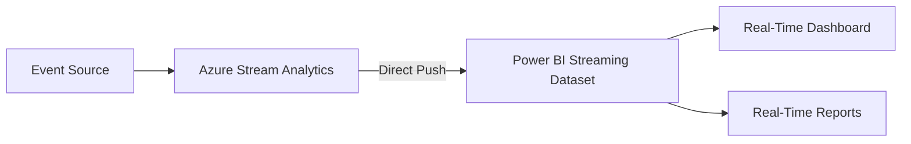

# How to Output Stream Analytics Results to Power BI for Real-Time Dashboards

Author: [nawazdhandala](https://www.github.com/nawazdhandala)

Tags: Azure Stream Analytics, Power BI, Real-Time Dashboards, Data Visualization, Streaming Analytics, Azure

Description: Learn how to connect Azure Stream Analytics to Power BI to build real-time dashboards that update automatically as streaming data flows in.

---

Static dashboards that refresh every few hours are fine for historical analysis, but when you need to see what is happening right now, you need real-time dashboards. Azure Stream Analytics can push processed streaming data directly to Power BI, where it appears in real-time tiles and reports that update automatically as new data arrives.

This integration is one of the fastest ways to get a live operational dashboard running. There is no intermediate database or polling mechanism - Stream Analytics pushes data directly to a Power BI streaming dataset, and the dashboard reflects changes within seconds.

In this post, I will walk through the full setup: configuring the Stream Analytics output, building the Power BI dataset, creating real-time tiles, and handling the practical challenges that come up in production.

## How the Integration Works

The data flow is straightforward.



Stream Analytics pushes rows to a Power BI streaming dataset. Power BI automatically updates any tiles and visuals that are bound to that dataset. Users see the updates in their browser without refreshing the page.

There are two types of Power BI datasets that work with Stream Analytics:

- **Push dataset** - Stream Analytics creates and manages the dataset schema. Supports both real-time tiles and standard report visuals with historical data.
- **Streaming dataset** - for extremely low-latency updates. Supports only real-time tiles (no standard reports). Data is not stored permanently.

Stream Analytics uses push datasets by default, which is what most people want.

## Prerequisites

1. Azure Stream Analytics job with a working input and query
2. Power BI Pro or Premium workspace (Power BI Free does not support streaming datasets from Stream Analytics)
3. An Azure AD account that has access to both Stream Analytics and Power BI

## Step 1: Configure the Power BI Output

Add Power BI as an output in your Stream Analytics job.

### Using the Azure Portal

1. Open your Stream Analytics job
2. Go to **Outputs** > **Add** > **Power BI**
3. Click **Authorize** and sign in with your Azure AD account that has Power BI access
4. Configure:
   - **Output alias**: `powerbi-output`
   - **Group workspace**: select your Power BI workspace
   - **Dataset name**: `IoT Telemetry Stream` (this will be created automatically)
   - **Table name**: `TelemetryData`
   - **Authentication mode**: User token (or Managed Identity for production)

5. Click **Save**

### Using Managed Identity (Recommended for Production)

User token authentication requires manual re-authorization when the token expires (every 90 days). Managed identity avoids this.

1. In the Stream Analytics job, go to **Identity** and ensure system-assigned managed identity is enabled
2. In Power BI Admin portal, enable "Service principals can use Power BI APIs"
3. Add the Stream Analytics managed identity to the Power BI workspace with Contributor access
4. When configuring the output, select "Managed Identity" as the authentication mode

```json
// Power BI output configuration with managed identity
{
  "name": "powerbi-output",
  "properties": {
    "type": "PowerBI",
    "datasource": {
      "type": "PowerBI",
      "properties": {
        "dataset": "IoT Telemetry Stream",
        "table": "TelemetryData",
        "groupId": "<power-bi-workspace-id>",
        "groupName": "IoT Analytics Workspace",
        "authenticationMode": "Msi"
      }
    }
  }
}
```

## Step 2: Write the Stream Analytics Query

Design your query to produce output suitable for dashboard visualization. Keep a few things in mind:

- Aggregate the data to a reasonable granularity (do not push raw events to Power BI)
- Include a timestamp column so Power BI can create time-based visuals
- Keep the column count manageable (under 20 columns)

Here is a query that produces dashboard-ready output.

```sql
-- Query for real-time IoT dashboard
-- Calculates metrics per device in 1-minute windows

SELECT
    DeviceId,
    DeviceLocation,
    AVG(temperature) AS AvgTemperature,
    MAX(temperature) AS MaxTemperature,
    MIN(temperature) AS MinTemperature,
    AVG(humidity) AS AvgHumidity,
    COUNT(*) AS EventCount,
    -- Include timestamp for time-series visuals
    System.Timestamp() AS WindowEnd
INTO [powerbi-output]
FROM [telemetry-input] AS t
TIMESTAMP BY EventTime
-- Join with reference data for device names and locations
LEFT JOIN [device-reference] AS d
    ON t.DeviceId = d.DeviceId
GROUP BY
    t.DeviceId,
    d.DeviceLocation,
    TumblingWindow(minute, 1)
```

### Multiple Outputs for Different Visuals

You can have multiple Power BI outputs, each feeding a different dataset.

```sql
-- Output 1: Per-device metrics for detail view
SELECT
    DeviceId,
    AVG(temperature) AS AvgTemperature,
    AVG(humidity) AS AvgHumidity,
    System.Timestamp() AS WindowEnd
INTO [powerbi-device-details]
FROM [telemetry-input]
TIMESTAMP BY EventTime
GROUP BY
    DeviceId,
    TumblingWindow(minute, 1)

-- Output 2: Overall summary for executive dashboard
SELECT
    COUNT(DISTINCT DeviceId) AS ActiveDevices,
    AVG(temperature) AS OverallAvgTemp,
    MAX(temperature) AS HighestTemp,
    SUM(CASE WHEN temperature > 80 THEN 1 ELSE 0 END) AS AlertCount,
    System.Timestamp() AS WindowEnd
INTO [powerbi-summary]
FROM [telemetry-input]
TIMESTAMP BY EventTime
GROUP BY
    TumblingWindow(minute, 1)

-- Output 3: Alert events for real-time alert ticker
SELECT
    DeviceId,
    temperature AS Temperature,
    'HIGH_TEMPERATURE' AS AlertType,
    EventTime AS AlertTime
INTO [powerbi-alerts]
FROM [telemetry-input]
TIMESTAMP BY EventTime
WHERE temperature > 80
```

## Step 3: Start the Stream Analytics Job

After saving the output and query:

1. Click **Start** on the Stream Analytics job
2. Choose "Now" as the output start time
3. Wait for the job to begin processing

Within a minute or two, data will start flowing to Power BI. The streaming dataset will be created automatically in your Power BI workspace.

## Step 4: Build the Power BI Dashboard

Now open Power BI and build the real-time dashboard.

### Create Real-Time Tiles

1. Go to your Power BI workspace
2. Click **New** > **Dashboard**
3. Name it "IoT Monitoring Dashboard"
4. Click **Edit** > **Add a tile** > **Custom Streaming Data**
5. Select the `IoT Telemetry Stream` dataset
6. Choose a visualization type:
   - **Card** - show a single value (like current average temperature)
   - **Line chart** - show values over time
   - **Clustered bar chart** - compare values across categories
   - **Gauge** - show a value against a target range

### Example: Temperature Over Time

1. Add a tile > Custom Streaming Data
2. Select the dataset
3. Choose "Line chart"
4. Configure:
   - **Axis**: WindowEnd
   - **Values**: AvgTemperature
   - **Legend**: DeviceId
   - **Time window**: Last 30 minutes
5. Click **Apply**

### Example: Active Device Count

1. Add a tile > Custom Streaming Data
2. Choose "Card"
3. Configure:
   - **Value**: ActiveDevices
   - **Display unit**: None
4. Click **Apply**

### Example: Alert Counter

1. Add a tile > Custom Streaming Data
2. Choose "Card" with conditional formatting
3. Configure:
   - **Value**: AlertCount
4. Set conditional formatting to turn red when AlertCount > 0

## Step 5: Build Standard Reports

Push datasets (which Stream Analytics creates by default) support standard Power BI reports in addition to real-time tiles. This means you can build interactive reports with filters, slicers, and drill-through on the streaming data.

1. In your workspace, click on the `IoT Telemetry Stream` dataset
2. Click **Create a report**
3. Build visuals using the standard Power BI report designer
4. Add filters, slicers, and drill-through pages
5. Pin visuals to your dashboard for a combined real-time and interactive experience

The difference: real-time tiles update automatically without user interaction. Standard report visuals update when the user refreshes the page or interacts with filters.

## Data Retention and Limits

Power BI streaming datasets have some limits to be aware of:

- **200,000 rows per hour per dataset** - if you exceed this, Power BI drops rows
- **5 million rows total per push dataset** - older rows are evicted on a FIFO basis when this is exceeded
- **15 columns maximum** per table for real-time tiles
- **75 maximum datasets per workspace** for push datasets

These limits mean you should:
- Aggregate data in Stream Analytics before pushing to Power BI (do not push raw events)
- Use appropriate window sizes (1-minute windows produce 60 rows per hour per group)
- Keep column counts reasonable

## Handling Authentication Token Expiration

If you used User Token authentication, the token expires after about 90 days. When it expires:

1. The Power BI output starts failing with authentication errors
2. Data stops flowing to the dashboard

To fix:
1. Go to the Stream Analytics job in the Azure portal
2. Stop the job
3. Go to the Power BI output
4. Click **Renew authorization** and sign in again
5. Restart the job

To avoid this, use Managed Identity authentication for production dashboards.

## Dashboard Design Tips

1. **Put the most important metrics at the top** - executives and operators scan dashboards from top-left to bottom-right.
2. **Use consistent color coding** - green for normal, yellow for warning, red for alert across all tiles.
3. **Show time context** - always include a time-series chart so viewers can see trends, not just current values.
4. **Include an alert indicator** - a simple count or status tile that shows whether any alerts are active.
5. **Keep it simple** - 6-8 tiles per dashboard is plenty. Too many tiles dilute attention.
6. **Set appropriate time windows** - last 30 minutes for operational monitoring, last 24 hours for trend analysis.

## Alternative: Power BI Streaming API

If you need more control over the dataset schema or want to push data from sources other than Stream Analytics, you can use the Power BI Streaming API directly. Create a streaming dataset in Power BI, get the push URL, and POST data to it from any application.

But for Stream Analytics integration, the built-in output is simpler and handles all the plumbing for you.

## Wrapping Up

Connecting Azure Stream Analytics to Power BI is one of the quickest paths to real-time operational dashboards. Stream Analytics handles the data processing and aggregation, and Power BI handles the visualization. The key is to aggregate your data to a reasonable granularity in the Stream Analytics query before pushing it to Power BI - do not push raw events. Use managed identity authentication to avoid token expiration headaches. And design your dashboard for the audience: operational teams need current values and alerts, while management needs trends and summaries. With this setup running, your stakeholders can monitor live operations without waiting for batch reports.
