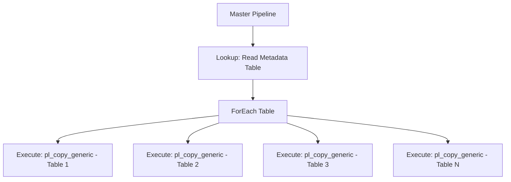

# How to Parameterize Pipelines in Azure Data Factory for Reusability

Author: [nawazdhandala](https://www.github.com/nawazdhandala)

Tags: Azure Data Factory, Parameterization, Pipeline Design, Reusability, Dynamic Pipelines, Azure

Description: Master pipeline parameterization in Azure Data Factory to build reusable, dynamic pipelines that handle multiple data sources with a single definition.

---

One of the biggest mistakes I see in Azure Data Factory projects is pipeline sprawl - dozens of nearly identical pipelines that differ only in a table name, file path, or connection string. Instead of copying pipelines for each source table, you should parameterize them. A single well-designed parameterized pipeline can replace ten or twenty hardcoded ones.

In this post, I will cover how to use parameters at every level in ADF - pipelines, datasets, linked services, and data flows - and show patterns that keep your data factory clean and maintainable.

## Types of Parameters in ADF

ADF supports parameterization at multiple levels:

1. **Pipeline parameters** - values passed to a pipeline at runtime
2. **Dataset parameters** - dynamic values in datasets (table names, file paths)
3. **Linked service parameters** - dynamic connection properties
4. **Global parameters** - factory-wide values shared across all pipelines
5. **System variables** - built-in values like pipeline name, run ID, trigger time

## Pipeline Parameters

Pipeline parameters are the starting point. You define them on the pipeline and pass values when the pipeline runs.

### Defining Parameters

In ADF Studio, open your pipeline and click on the canvas background. In the properties pane at the bottom, click the **Parameters** tab and add your parameters.

```json
// Pipeline with parameters defined
{
  "name": "pl_copy_generic",
  "properties": {
    "parameters": {
      "sourceTableName": {
        "type": "String",
        "defaultValue": "dbo.Customers"
      },
      "sinkFolderPath": {
        "type": "String",
        "defaultValue": "raw/customers"
      },
      "loadType": {
        "type": "String",
        "defaultValue": "full"
      }
    },
    "activities": []
  }
}
```

### Using Parameters in Activities

Reference pipeline parameters using the expression syntax `@pipeline().parameters.parameterName`.

```json
// Copy activity using pipeline parameters
{
  "name": "CopyData",
  "type": "Copy",
  "typeProperties": {
    "source": {
      "type": "SqlServerSource",
      // Use the parameter to dynamically set the query
      "sqlReaderQuery": {
        "value": "SELECT * FROM @{pipeline().parameters.sourceTableName}",
        "type": "Expression"
      }
    },
    "sink": {
      "type": "ParquetSink",
      "storeSettings": {
        "type": "AzureBlobFSWriteSettings"
      }
    }
  }
}
```

## Dataset Parameters

Dataset parameters let you create generic datasets that work with any table, file, or folder.

### Parameterized SQL Dataset

Instead of creating one dataset per table, create one parameterized dataset that accepts the table name.

```json
// One dataset for any SQL table
{
  "name": "ds_sql_generic",
  "properties": {
    "type": "SqlServerTable",
    "parameters": {
      "tableName": { "type": "String" }
    },
    "linkedServiceName": {
      "referenceName": "ls_onprem_sqlserver",
      "type": "LinkedServiceReference"
    },
    "typeProperties": {
      // Dynamic table name from parameter
      "tableName": {
        "value": "@dataset().tableName",
        "type": "Expression"
      }
    }
  }
}
```

### Parameterized File Dataset

```json
// One dataset for any Parquet file in the data lake
{
  "name": "ds_parquet_generic",
  "properties": {
    "type": "Parquet",
    "parameters": {
      "container": { "type": "String" },
      "folder": { "type": "String" },
      "fileName": { "type": "String", "defaultValue": "" }
    },
    "linkedServiceName": {
      "referenceName": "ls_adls_gen2",
      "type": "LinkedServiceReference"
    },
    "typeProperties": {
      "location": {
        "type": "AzureBlobFSLocation",
        "fileSystem": { "value": "@dataset().container", "type": "Expression" },
        "folderPath": { "value": "@dataset().folder", "type": "Expression" },
        "fileName": { "value": "@dataset().fileName", "type": "Expression" }
      },
      "compressionCodec": "snappy"
    }
  }
}
```

### Passing Parameters from Pipeline to Dataset

When you reference a parameterized dataset in a Copy activity, you pass the values from the pipeline.

```json
// Copy activity passing pipeline parameters to datasets
{
  "name": "CopyData",
  "type": "Copy",
  "inputs": [
    {
      "referenceName": "ds_sql_generic",
      "type": "DatasetReference",
      "parameters": {
        // Pass pipeline parameter to dataset parameter
        "tableName": "@pipeline().parameters.sourceTableName"
      }
    }
  ],
  "outputs": [
    {
      "referenceName": "ds_parquet_generic",
      "type": "DatasetReference",
      "parameters": {
        "container": "raw",
        "folder": "@pipeline().parameters.sinkFolderPath",
        "fileName": ""
      }
    }
  ]
}
```

## Linked Service Parameters

You can even parameterize linked services for scenarios where you need to connect to different servers or databases dynamically.

```json
// Parameterized linked service - connect to any database on the server
{
  "name": "ls_sql_dynamic",
  "properties": {
    "type": "SqlServer",
    "parameters": {
      "databaseName": { "type": "String" }
    },
    "typeProperties": {
      "connectionString": {
        "value": "Server=DBSERVER01;Database=@{linkedService().databaseName};User ID=adf_reader;Password=<password>;",
        "type": "Expression"
      }
    },
    "connectVia": {
      "referenceName": "SelfHostedIR",
      "type": "IntegrationRuntimeReference"
    }
  }
}
```

## Global Parameters

Global parameters are factory-wide values accessible from any pipeline. They are useful for values like environment names, common paths, or feature flags.

1. In ADF Studio, go to **Manage** > **Global parameters**
2. Add parameters like `environment` (dev/staging/prod) or `dataLakeBasePath`

Reference them with `@pipeline().globalParameters.parameterName`.

## Dynamic Expressions

ADF has a rich expression language for building dynamic values. Here are some commonly used patterns.

```
// Get current date components for partitioned paths
@formatDateTime(utcnow(), 'yyyy')                    // "2026"
@formatDateTime(utcnow(), 'MM')                       // "02"
@formatDateTime(utcnow(), 'dd')                       // "16"

// Build a dynamic folder path
@concat('raw/', pipeline().parameters.entityName, '/year=', formatDateTime(utcnow(), 'yyyy'), '/month=', formatDateTime(utcnow(), 'MM'))

// Conditional logic
@if(equals(pipeline().parameters.loadType, 'full'), 'SELECT * FROM', 'SELECT * FROM ... WHERE ModifiedDate >')

// String operations
@toUpper(pipeline().parameters.entityName)
@replace(pipeline().parameters.fileName, '.csv', '.parquet')
```

## The Metadata-Driven Pattern

The most powerful parameterization pattern is metadata-driven ingestion. Instead of defining pipeline parameters manually, you store the configuration in a metadata table and use a ForEach loop to iterate over it.

### Step 1: Create a Metadata Table

```sql
-- Metadata table defining what to copy
CREATE TABLE dbo.IngestionConfig (
    SourceSchema VARCHAR(50),
    SourceTable VARCHAR(100),
    SinkContainer VARCHAR(100),
    SinkFolder VARCHAR(200),
    IsActive BIT DEFAULT 1,
    LoadType VARCHAR(20) DEFAULT 'full',
    WatermarkColumn VARCHAR(100) NULL
);

-- Add entries for each table you want to copy
INSERT INTO dbo.IngestionConfig VALUES ('dbo', 'Customers', 'raw', 'sql/customers', 1, 'full', NULL);
INSERT INTO dbo.IngestionConfig VALUES ('dbo', 'Orders', 'raw', 'sql/orders', 1, 'incremental', 'LastModifiedDate');
INSERT INTO dbo.IngestionConfig VALUES ('dbo', 'Products', 'raw', 'sql/products', 1, 'full', NULL);
INSERT INTO dbo.IngestionConfig VALUES ('sales', 'Transactions', 'raw', 'sql/transactions', 1, 'incremental', 'TransactionDate');
```

### Step 2: Build the Metadata-Driven Pipeline

```json
// Metadata-driven pipeline
{
  "name": "pl_metadata_driven_ingestion",
  "properties": {
    "activities": [
      {
        // Step 1: Read the metadata table
        "name": "GetTableList",
        "type": "Lookup",
        "typeProperties": {
          "source": {
            "type": "SqlServerSource",
            "sqlReaderQuery": "SELECT * FROM dbo.IngestionConfig WHERE IsActive = 1"
          },
          "dataset": {
            "referenceName": "ds_sql_generic",
            "type": "DatasetReference",
            "parameters": { "tableName": "dbo.IngestionConfig" }
          },
          // Return all rows, not just the first
          "firstRowOnly": false
        }
      },
      {
        // Step 2: Loop through each table
        "name": "ForEachTable",
        "type": "ForEach",
        "dependsOn": [
          { "activity": "GetTableList", "dependencyConditions": ["Succeeded"] }
        ],
        "typeProperties": {
          // Iterate over the lookup results
          "items": {
            "value": "@activity('GetTableList').output.value",
            "type": "Expression"
          },
          // Process up to 5 tables in parallel
          "isSequential": false,
          "batchCount": 5,
          "activities": [
            {
              // Execute the generic copy pipeline for each table
              "name": "ExecuteCopyPipeline",
              "type": "ExecutePipeline",
              "typeProperties": {
                "pipeline": {
                  "referenceName": "pl_copy_generic",
                  "type": "PipelineReference"
                },
                "parameters": {
                  "sourceTableName": {
                    "value": "@concat(item().SourceSchema, '.', item().SourceTable)",
                    "type": "Expression"
                  },
                  "sinkFolderPath": {
                    "value": "@item().SinkFolder",
                    "type": "Expression"
                  },
                  "loadType": {
                    "value": "@item().LoadType",
                    "type": "Expression"
                  }
                }
              }
            }
          ]
        }
      }
    ]
  }
}
```

This pattern is extremely powerful. To add a new table to your ingestion process, you just insert a row in the metadata table. No pipeline changes needed.



## Best Practices

1. **Start generic, specialize when needed** - build parameterized pipelines first. Only create specialized pipelines when the generic ones cannot handle a specific case.
2. **Use default values** - set sensible defaults for parameters so pipelines work out of the box during testing.
3. **Validate parameters** - use If Condition activities at the start of pipelines to validate required parameters and fail fast with a clear message.
4. **Document parameters** - add descriptions to parameters explaining what values they expect.
5. **Limit nesting depth** - deeply nested Execute Pipeline calls can be hard to debug. Keep the nesting to two levels maximum.

## Wrapping Up

Parameterization is the single most important design pattern in Azure Data Factory. It turns rigid, single-purpose pipelines into flexible, reusable components. Start by parameterizing your datasets and pipelines, then graduate to the metadata-driven pattern for large-scale ingestion. A well-parameterized data factory with five pipelines is far more maintainable than one with fifty hardcoded pipelines that do essentially the same thing.
