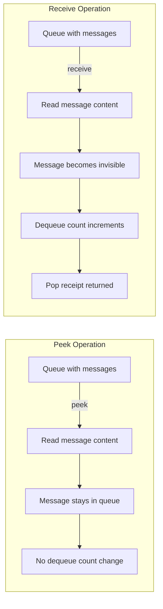

# How to Peek at Messages in Azure Queue Storage Without Dequeuing Them

Author: [nawazdhandala](https://www.github.com/nawazdhandala)

Tags: Azure, Queue Storage, Peek Messages, Message Inspection, Cloud Monitoring, Debugging

Description: Learn how to peek at messages in Azure Queue Storage without removing them from the queue, useful for monitoring, debugging, and building dashboards.

---

Sometimes you need to look at what is sitting in your Azure Queue without actually processing anything. Maybe you want to build a monitoring dashboard that shows pending work, or you are debugging a production issue and need to see what messages are stuck. Azure Queue Storage has a peek operation that lets you do exactly this - inspect messages without changing their state.

## How Peeking Differs from Receiving

When you receive (dequeue) a message, two things happen. First, the message becomes invisible to other consumers for the duration of the visibility timeout. Second, the message's dequeue count increments. This is the normal flow for processing.

Peeking is completely different. When you peek at a message, it stays visible in the queue. The dequeue count does not change. No pop receipt is returned (because the message has not been dequeued). Other consumers can still receive the message normally. You are just looking at it.

This distinction matters because peek is a read-only operation. You cannot delete or update a message that you have only peeked at - you need the pop receipt from a proper dequeue for that.

## Peeking with the Python SDK

Here is how to peek at messages using the Azure Storage Python SDK.

```python
from azure.storage.queue import QueueClient
import os

# Connect to the queue
connection_string = os.environ["AZURE_STORAGE_CONNECTION_STRING"]
queue_client = QueueClient.from_connection_string(connection_string, "task-queue")

# Peek at up to 5 messages from the front of the queue
# These messages remain in the queue and their dequeue count stays unchanged
peeked = queue_client.peek_messages(max_messages=5)

for msg in peeked:
    print(f"Message ID: {msg.id}")
    print(f"Content: {msg.content}")
    print(f"Inserted on: {msg.inserted_on}")
    print(f"Expires on: {msg.expires_on}")
    print(f"Dequeue count: {msg.dequeue_count}")
    print("---")
```

The max_messages parameter accepts values from 1 to 32. If you omit it, Azure defaults to peeking at a single message.

## Peeking with the .NET SDK

The C# equivalent is straightforward.

```csharp
using Azure.Storage.Queues;
using Azure.Storage.Queues.Models;

var queueClient = new QueueClient(connectionString, "task-queue");

// Peek at up to 10 messages without dequeuing them
PeekedMessage[] peekedMessages = await queueClient.PeekMessagesAsync(maxMessages: 10);

foreach (var message in peekedMessages)
{
    Console.WriteLine($"ID: {message.MessageId}");
    Console.WriteLine($"Body: {message.Body}");
    Console.WriteLine($"Inserted: {message.InsertedOn}");
    Console.WriteLine($"Dequeue Count: {message.DequeueCount}");
}
```

## Peeking with the REST API

If you are working outside the SDKs, you can peek using the REST API directly.

```bash
# Peek at 5 messages from the queue
# The peekonly=true parameter is what makes this a peek instead of a dequeue
curl -X GET \
  "https://mystorageaccount.queue.core.windows.net/task-queue/messages?peekonly=true&numofmessages=5" \
  -H "x-ms-version: 2024-11-04" \
  -H "x-ms-date: $(date -u '+%a, %d %b %Y %H:%M:%S GMT')" \
  -H "Authorization: SharedKey mystorageaccount:..."
```

The critical parameter here is `peekonly=true`. Without it, you would be dequeuing messages instead.

## Peeking with Azure CLI

For quick diagnostics from the command line, you can use the Azure CLI.

```bash
# Peek at messages in the queue
az storage message peek \
  --queue-name task-queue \
  --account-name mystorageaccount \
  --num-messages 10 \
  --output table
```

The table output format is particularly nice for quick visual inspection.

## Building a Queue Monitoring Dashboard

One of the most practical uses for peeking is building a monitoring dashboard. You can periodically peek at your queues and display the results alongside queue depth metrics.

```python
from azure.storage.queue import QueueServiceClient
import json
from datetime import datetime

def get_queue_status(connection_string, queue_name):
    """
    Gather queue statistics including depth and a sample of pending messages.
    Useful for monitoring dashboards and alerting systems.
    """
    queue_client = QueueClient.from_connection_string(connection_string, queue_name)

    # Get the queue properties to find approximate message count
    properties = queue_client.get_queue_properties()
    approx_count = properties.approximate_message_count

    # Peek at the oldest messages to see what is waiting
    sample_messages = queue_client.peek_messages(max_messages=5)

    status = {
        "queue_name": queue_name,
        "approximate_count": approx_count,
        "checked_at": datetime.utcnow().isoformat(),
        "oldest_messages": []
    }

    for msg in sample_messages:
        status["oldest_messages"].append({
            "id": msg.id,
            "inserted_on": msg.inserted_on.isoformat() if msg.inserted_on else None,
            "dequeue_count": msg.dequeue_count,
            # Show a preview of the content, truncated for display
            "content_preview": str(msg.content)[:200]
        })

    return status

# Check multiple queues
queues_to_monitor = ["orders-queue", "notifications-queue", "reports-queue"]
for queue_name in queues_to_monitor:
    status = get_queue_status(connection_string, queue_name)
    print(json.dumps(status, indent=2))
```

## Debugging Stuck Messages

When messages keep failing and getting re-enqueued, peeking helps you understand why. You can inspect the message content without triggering another processing attempt.

```python
def find_problem_messages(queue_client, dequeue_threshold=3):
    """
    Peek at messages and identify ones with high dequeue counts.
    These are likely failing repeatedly and may need manual intervention.
    """
    messages = queue_client.peek_messages(max_messages=32)

    problem_messages = []
    for msg in messages:
        if msg.dequeue_count >= dequeue_threshold:
            problem_messages.append({
                "id": msg.id,
                "content": msg.content,
                "dequeue_count": msg.dequeue_count,
                "inserted_on": msg.inserted_on
            })

    if problem_messages:
        print(f"Found {len(problem_messages)} messages with {dequeue_threshold}+ dequeue attempts:")
        for pm in problem_messages:
            print(f"  ID: {pm['id']}, Attempts: {pm['dequeue_count']}")
            print(f"  Content: {pm['content'][:100]}")
    else:
        print("No problem messages found")

    return problem_messages
```

## Limitations of Peeking

There are some important limitations to keep in mind.

You can only peek at up to 32 messages per call. If your queue has thousands of messages, you will only see the first 32. There is no pagination mechanism for peek operations.

Peeked messages are returned in FIFO order from the front of the queue. You cannot peek at messages in the middle or at the end of the queue.

The message content you see when peeking might already be invisible to dequeue operations. If another worker already dequeued a message but has not deleted it yet, you might still see it via peek even though no other worker can receive it right now.

Peek does not return a pop receipt, so you cannot delete or update messages based solely on a peek operation. If you need to remove a message you spotted during peeking, you must dequeue it normally first.

Here is a diagram showing the difference between peek and receive operations.



## Peek in Azure Functions

If you are using Azure Functions with a Queue trigger, you do not typically peek at messages because the function runtime handles dequeuing. But you can peek from a separate monitoring function triggered on a timer.

```python
import azure.functions as func
import logging
from azure.storage.queue import QueueClient

# Timer-triggered function that runs every 5 minutes to check queue health
def main(timer: func.TimerRequest) -> None:
    queue_client = QueueClient.from_connection_string(
        os.environ["AzureWebJobsStorage"],
        "orders-queue"
    )

    props = queue_client.get_queue_properties()
    count = props.approximate_message_count

    if count > 100:
        logging.warning(f"Queue depth is {count}, checking for stuck messages")
        messages = queue_client.peek_messages(max_messages=5)
        for msg in messages:
            if msg.dequeue_count > 5:
                logging.error(
                    f"Message {msg.id} has been dequeued {msg.dequeue_count} times"
                )
```

## When to Use Peek vs. Receive

Use peek when you want to inspect messages for monitoring or debugging without affecting the queue state. Use receive when you intend to process and delete messages.

A good rule of thumb: if you are building tooling that observes queue state (dashboards, alerts, diagnostics), use peek. If you are building a worker that handles messages, use receive.

Peeking is a simple but powerful capability that makes Azure Queue Storage much easier to operate in production. It gives you visibility into your message processing pipeline without disrupting it.
