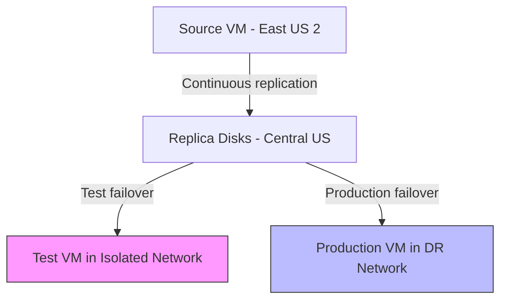

# How to Perform a Test Failover in Azure Site Recovery Without Affecting Production

Author: [nawazdhandala](https://www.github.com/nawazdhandala)

Tags: Azure Site Recovery, Test Failover, Disaster Recovery, Azure, Business Continuity, DR Testing, Failover

Description: Learn how to perform a test failover in Azure Site Recovery to validate your disaster recovery setup without impacting production workloads or ongoing replication.

---

Setting up disaster recovery replication is only half the battle. If you have never tested that the failover actually works, you are essentially hoping for the best. Azure Site Recovery makes DR testing straightforward with its test failover feature, which spins up VMs from replicated data in an isolated network without touching your production environment or interrupting replication.

This guide walks through how to plan, execute, and validate a test failover, plus how to clean up afterward.

## Why Test Failover Is Non-Negotiable

I have seen organizations spend months setting up disaster recovery only to discover during an actual outage that:

- The failover VMs could not reach critical dependencies
- Application configurations pointed to the wrong database server
- DNS resolution failed because internal zones were not replicated
- Custom scripts in the recovery plan had syntax errors
- The target VM sizes were too small for the workload

All of these would have been caught by a simple test failover. Azure makes this easy enough that there is no excuse to skip it. Run test failovers at least quarterly - monthly is better.

## How Test Failover Works

When you trigger a test failover, Azure Site Recovery:

1. Takes the latest recovery point (or one you specify)
2. Creates VMs from the replica disks in the target region
3. Attaches them to a virtual network you specify (isolated from production)
4. Does NOT stop ongoing replication
5. Does NOT affect the source VMs in any way
6. Does NOT consume your actual failover recovery points

The test VMs run independently. You can log into them, test applications, validate data, and then clean everything up when you are done.



## Step 1: Create an Isolated Test Network

The test VMs must be created in a network that is isolated from both your production network and the DR network. This prevents IP conflicts and accidental traffic routing.

```bash
# Create an isolated virtual network for test failovers
# This network has no peering or gateway connections to production
az network vnet create \
    --resource-group rg-dr-centralus \
    --name vnet-dr-test-isolated \
    --location centralus \
    --address-prefix 10.99.0.0/16 \
    --subnet-name subnet-test \
    --subnet-prefix 10.99.1.0/24

# Add additional subnets matching your production topology
az network vnet subnet create \
    --resource-group rg-dr-centralus \
    --vnet-name vnet-dr-test-isolated \
    --name subnet-test-app \
    --address-prefix 10.99.2.0/24

az network vnet subnet create \
    --resource-group rg-dr-centralus \
    --vnet-name vnet-dr-test-isolated \
    --name subnet-test-db \
    --address-prefix 10.99.3.0/24
```

Do not peer this network with any other network. The isolation is the whole point. If you need the test VMs to reach each other, they will because they share the same virtual network. If you need them to reach external services for validation, add a temporary NAT gateway.

## Step 2: Choose the Recovery Point

When initiating a test failover, you choose which recovery point to use:

**Latest processed** - The most recent recovery point that has been processed by Site Recovery. This gives you the closest-to-current state with minimal data loss. Recommended for most test scenarios.

**Latest app-consistent** - The most recent application-consistent recovery point. Use this when you want to verify that applications come up cleanly without needing crash recovery.

**Latest** - Processes all pending replication data first, then creates a recovery point. This takes longer but gives you the absolute latest state.

**Custom** - Pick a specific recovery point from the history. Useful for verifying that you can recover to a point before a known data corruption event.

For routine DR testing, "Latest processed" is usually the right choice. It completes quickly and represents a realistic failover scenario.

## Step 3: Execute the Test Failover

### For a Single VM

1. In the Recovery Services vault, go to "Replicated items"
2. Click on the VM you want to test
3. Click "Test failover"
4. Select the recovery point
5. Select the isolated test network
6. Click "OK"

The test failover job starts. You can monitor its progress in the vault's "Site Recovery jobs" section. It typically takes 5-15 minutes depending on the VM size and number of disks.

### For Multiple VMs (Using a Recovery Plan)

If your application spans multiple VMs, test them together using a recovery plan:

1. Go to "Recovery Plans" in the vault
2. Select your recovery plan
3. Click "Test failover"
4. Select the recovery point and test network
5. Click "OK"

The recovery plan executes VMs in the defined order (e.g., database first, then app server, then web server), ensuring dependencies come up correctly.

### Using PowerShell for Automated Testing

For regular automated DR testing, script the test failover:

```powershell
# Automated test failover script for a single VM
# Run this on a schedule (e.g., monthly) via Azure Automation

# Connect to the vault
$vault = Get-AzRecoveryServicesVault -Name "rsv-dr-centralus-001" -ResourceGroupName "rg-dr-centralus"
Set-AzRecoveryServicesAsrVaultContext -Vault $vault

# Get the replicated item (protected VM)
$container = Get-AzRecoveryServicesAsrProtectionContainer
$protectedItem = Get-AzRecoveryServicesAsrReplicationProtectedItem `
    -ProtectionContainer $container `
    -FriendlyName "vm-web-01"

# Get the latest processed recovery point
$recoveryPoints = Get-AzRecoveryServicesAsrRecoveryPoint -ReplicationProtectedItem $protectedItem
$latestRP = $recoveryPoints | Sort-Object RecoveryPointTime -Descending | Select-Object -First 1

# Get the test network
$testNetwork = Get-AzVirtualNetwork -Name "vnet-dr-test-isolated" -ResourceGroupName "rg-dr-centralus"

# Start test failover
$testFailoverJob = Start-AzRecoveryServicesAsrTestFailoverJob `
    -ReplicationProtectedItem $protectedItem `
    -AzureVMNetworkId $testNetwork.Id `
    -RecoveryPoint $latestRP `
    -Direction PrimaryToRecovery

# Wait for the job to complete
$testFailoverJob = Get-AzRecoveryServicesAsrJob -Job $testFailoverJob
while ($testFailoverJob.State -eq "InProgress") {
    Start-Sleep -Seconds 30
    $testFailoverJob = Get-AzRecoveryServicesAsrJob -Job $testFailoverJob
}

# Output the result
Write-Output "Test failover status: $($testFailoverJob.State)"
```

## Step 4: Validate the Test VMs

Once the test failover completes, the VMs are running in the isolated network. Now verify everything works.

### Basic Checks

- **VM boots successfully** - Check the boot diagnostics in the Azure portal
- **OS is responsive** - Connect via RDP (Windows) or SSH (Linux) using a jumpbox in the test network or a Bastion host
- **Disks are present** - Verify all data disks are attached and accessible
- **Network configuration** - Check that the VM has the expected IP address and can resolve DNS

### Application Checks

- **Services are running** - Verify that application services (IIS, Apache, SQL Server, etc.) started automatically
- **Application responds** - Hit the application endpoint and verify it returns expected results
- **Database connectivity** - If the app connects to a database, verify the connection works (you may need to update connection strings for the test environment)
- **Data integrity** - Spot-check that recent data is present

### Automated Validation Script

Run validation scripts after the test VMs are up:

```powershell
# Post-test-failover validation script
# Run this against the test VM to verify critical services

param(
    [string]$VMName = "vm-web-01",
    [string]$ResourceGroup = "rg-dr-centralus"
)

# Check VM status
$vm = Get-AzVM -Name $VMName -ResourceGroupName $ResourceGroup -Status
$powerState = ($vm.Statuses | Where-Object Code -like "PowerState/*").DisplayStatus
Write-Output "VM Power State: $powerState"

# Check boot diagnostics for errors
$bootDiag = Get-AzVMBootDiagnosticsData -ResourceGroupName $ResourceGroup -Name $VMName -Windows

# Run a command inside the VM to check services
$result = Invoke-AzVMRunCommand -ResourceGroupName $ResourceGroup -VMName $VMName -CommandId 'RunPowerShellScript' -ScriptString '
    # Check if critical Windows services are running
    $services = @("W3SVC", "MSSQLSERVER", "WAS")
    foreach ($svc in $services) {
        $status = Get-Service -Name $svc -ErrorAction SilentlyContinue
        if ($status) {
            Write-Output "$svc : $($status.Status)"
        } else {
            Write-Output "$svc : NOT FOUND"
        }
    }

    # Check network connectivity to expected endpoints
    $endpoints = @(
        @{Name="SQL Server"; Host="10.99.3.4"; Port=1433},
        @{Name="Redis Cache"; Host="10.99.2.10"; Port=6379}
    )
    foreach ($ep in $endpoints) {
        $test = Test-NetConnection -ComputerName $ep.Host -Port $ep.Port -WarningAction SilentlyContinue
        Write-Output "$($ep.Name) ($($ep.Host):$($ep.Port)) : $($test.TcpTestSucceeded)"
    }
'
Write-Output $result.Value[0].Message
```

## Step 5: Document Results

Keep a record of each test failover. Track:

- Date and time of the test
- VMs included
- Recovery point used
- Time to complete failover
- Issues discovered
- Resolution for each issue
- Overall pass/fail status

This documentation is often required for compliance (SOC 2, ISO 27001, PCI DSS) and is invaluable for improving your DR process over time.

## Step 6: Clean Up Test Resources

After validation, clean up the test VMs to stop incurring compute charges.

1. In the Recovery Services vault, go to "Replicated items"
2. Click on the VM (it will show "Test failover cleanup pending")
3. Click "Cleanup test failover"
4. Add notes about the test results
5. Check "Testing is complete. Delete test failover virtual machine(s)"
6. Click "OK"

ASR deletes the test VMs, their disks, and their NICs. The replica disks used for ongoing replication are untouched.

If you used a recovery plan, clean up from the recovery plan level to remove all test VMs at once.

## Common Test Failover Issues

**Test VM fails to boot with DHCP error.** The test network does not have a DHCP server. Configure static IPs for the failover VMs in the "Compute and Network" settings of each replicated item.

**Application cannot connect to database.** In the isolated test network, internal DNS might not resolve. Add host file entries or configure a DNS server in the test network.

**SQL Server starts in single-user mode.** This sometimes happens with crash-consistent recovery points. Use the latest app-consistent point instead, which ensures SQL Server is in a clean state.

**Boot diagnostics show BSOD.** Check that the target VM size supports the same generation (Gen1 vs Gen2) as the source. Also verify that the source VM's boot type (BIOS vs UEFI) is compatible.

## Wrapping Up

Test failovers in Azure Site Recovery are your safety net for the safety net. They let you prove that your disaster recovery configuration actually works without any risk to production. Make them a regular part of your operations cadence. Automate them if you can. Document the results. Fix any issues you find. When a real disaster hits, you will be glad you invested the time in testing.
