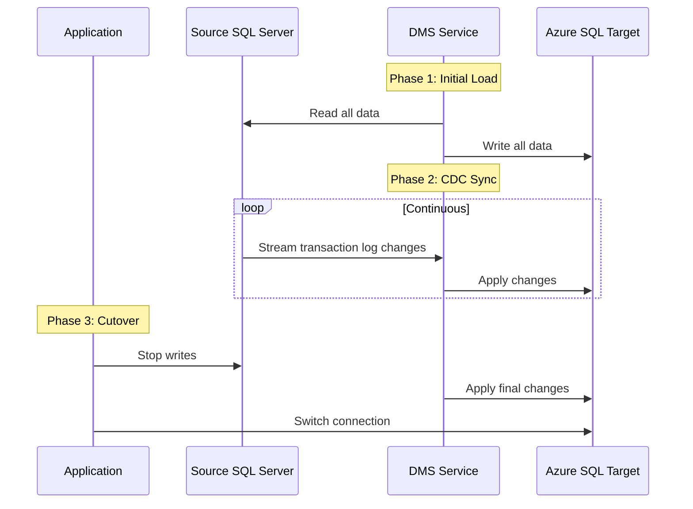

# How to Perform an Online Migration Using Azure Database Migration Service

Author: [nawazdhandala](https://www.github.com/nawazdhandala)

Tags: Azure, Database Migration, Online Migration, DMS, Azure Database Migration Service, Zero Downtime, SQL Server

Description: Learn how to perform an online (near-zero downtime) database migration using Azure Database Migration Service with continuous data sync.

---

Offline migrations require a maintenance window where your application goes dark while data is being copied. For a small database, that might be a few hours on a Saturday night. For a large database serving global users, it could mean days of downtime that the business simply will not accept. Online migration with Azure Database Migration Service (DMS) solves this by keeping your source database fully operational while it continuously replicates changes to the Azure target.

## How Online Migration Differs from Offline

In an offline migration, DMS copies all the data from source to target in a single pass. During this time, you should not write to the source database because those changes will not be captured.

In an online migration, DMS does something more sophisticated:

1. **Initial load**: Copies all existing data from the source to the target (same as offline).
2. **Change data capture (CDC)**: After the initial load, DMS continuously reads the transaction log of the source database and applies changes to the target in near-real-time.
3. **Cutover**: When you are ready, you stop application writes, let DMS sync the final transactions, and switch your application to the target.

The result is near-zero downtime - your application is down only for the few seconds or minutes it takes to switch connection strings.



## Prerequisites for Online Migration

Online migration has stricter requirements than offline:

- **DMS Premium tier**: Online migration requires the Premium SKU of Azure Database Migration Service, not Standard.
- **Transaction log access**: DMS reads the SQL Server transaction log, so the source database must be in Full recovery model (not Simple).
- **Change tracking enabled**: For SQL Server to Azure SQL Database migrations, tables need primary keys. DMS uses the transaction log for change tracking.
- **Network bandwidth**: CDC generates continuous network traffic between the source and DMS. Plan for sustained bandwidth.
- **Source database permissions**: The migration user needs `db_owner` on the source database and `VIEW SERVER STATE` on the source server.

## Step 1: Prepare the Source Database

First, ensure your source SQL Server database is ready for online migration.

```sql
-- Check the recovery model (must be FULL for online migration)
SELECT name, recovery_model_desc
FROM sys.databases
WHERE name = 'MyAppDB';

-- If not FULL, change it
ALTER DATABASE MyAppDB SET RECOVERY FULL;

-- Take a full backup (required to initialize the log chain)
BACKUP DATABASE MyAppDB
TO DISK = 'C:\Backups\MyAppDB_PreMigration.bak'
WITH INIT, COMPRESSION;

-- Verify all tables have primary keys (required for CDC tracking)
SELECT t.name AS TableName
FROM sys.tables t
LEFT JOIN sys.indexes i ON t.object_id = i.object_id AND i.is_primary_key = 1
WHERE i.object_id IS NULL;
-- Any tables returned here need primary keys added before migration
```

If any tables lack primary keys, add them:

```sql
-- Add a primary key to a table that does not have one
ALTER TABLE dbo.AuditLog
ADD CONSTRAINT PK_AuditLog PRIMARY KEY (AuditLogId);
```

## Step 2: Create the DMS Premium Instance

Online migration requires the Premium tier of DMS.

```bash
# Create a DMS instance with Premium SKU
az dms create \
  --name my-dms-online \
  --resource-group rg-migration \
  --location eastus \
  --sku-name Premium_4vCores \
  --subnet "/subscriptions/<sub-id>/resourceGroups/rg-migration/providers/Microsoft.Network/virtualNetworks/vnet-migration/subnets/snet-dms"
```

The Premium tier costs more, but it enables online migration capabilities. You can delete the DMS instance after the migration is complete to stop billing.

## Step 3: Create the Target Azure SQL Database

Create the target database if it does not exist. Size it appropriately - during the initial load, both read and write throughput will be high.

```bash
# Create the target database with enough DTUs for the migration load
az sql db create \
  --name MyAppDB \
  --resource-group rg-migration \
  --server my-azure-sql-server \
  --service-objective S4 \
  --max-size 100GB
```

Tip: Use a higher service tier during migration for faster initial load, then scale down after cutover.

## Step 4: Migrate the Schema First

Just like with offline migration, migrate the schema before the data. This ensures all tables, indexes, and constraints exist on the target before DMS starts loading data.

```bash
# Use sqlpackage to extract and publish the schema
sqlpackage /Action:Extract \
  /SourceServerName:my-onprem-server \
  /SourceDatabaseName:MyAppDB \
  /TargetFile:MyAppDB.dacpac

sqlpackage /Action:Publish \
  /SourceFile:MyAppDB.dacpac \
  /TargetServerName:my-azure-sql-server.database.windows.net \
  /TargetDatabaseName:MyAppDB \
  /TargetUser:sqladmin \
  /TargetPassword:'<password>'
```

**Important**: Drop foreign key constraints on the target before starting the migration. DMS loads tables in parallel, and foreign keys can cause constraint violations during the initial load. Re-create them after migration.

```sql
-- Script to disable foreign keys on target (run against Azure SQL)
-- Save the foreign key definitions first so you can recreate them
DECLARE @sql NVARCHAR(MAX) = '';
SELECT @sql += 'ALTER TABLE ' + QUOTENAME(OBJECT_SCHEMA_NAME(parent_object_id))
    + '.' + QUOTENAME(OBJECT_NAME(parent_object_id))
    + ' NOCHECK CONSTRAINT ' + QUOTENAME(name) + ';' + CHAR(13)
FROM sys.foreign_keys;
EXEC sp_executesql @sql;
```

## Step 5: Configure and Start the Online Migration

**Using the Azure Portal** (recommended):

1. Go to your DMS instance.
2. Click "New Migration Activity" and select "Online data migration".
3. Configure the source connection to your SQL Server.
4. Configure the target connection to Azure SQL Database.
5. Select the databases and tables to migrate.
6. Review the migration settings.
7. Start the activity.

DMS will begin the initial load. You can monitor progress in the portal, showing per-table row counts and status.

## Step 6: Monitor the CDC Sync

After the initial load completes, DMS enters the CDC phase. This is where it continuously reads the source transaction log and applies changes to the target.

Key things to monitor during CDC:

**Replication lag**: The time difference between a change on the source and when it appears on the target. In the Azure Portal, this shows as "CDC Latency". Ideal is under 5 seconds; acceptable is under 60 seconds.

**Pending changes**: The number of changes queued for application. A growing backlog means DMS cannot keep up with the write rate on the source.

**Source log usage**: The transaction log on the source will grow during online migration because DMS needs to read it. Make sure your source server has enough disk space for log growth.

```sql
-- Monitor transaction log size on the source server
SELECT
    name AS DatabaseName,
    type_desc AS FileType,
    size * 8 / 1024 AS SizeMB,
    FILEPROPERTY(name, 'SpaceUsed') * 8 / 1024 AS UsedMB
FROM sys.database_files
WHERE type_desc = 'LOG';
```

```bash
# Check migration task status via CLI
az dms project task show \
  --name online-migrate-myappdb \
  --resource-group rg-migration \
  --service-name my-dms-online \
  --project-name sql-to-azure-online \
  --expand output
```

## Step 7: Perform the Cutover

This is the critical moment. When the CDC latency is low and you are ready to switch, perform the cutover.

### Pre-Cutover Checklist

1. Verify CDC latency is minimal (under 5 seconds).
2. Notify your team and schedule the switch.
3. Prepare updated connection strings.
4. Have a rollback plan in case something goes wrong.

### Execute the Cutover

1. **Stop application writes to the source**: Take your application offline or put it in read-only mode. The downtime starts now.

2. **Wait for DMS to sync**: Watch the pending changes counter drop to zero. This usually takes 10-60 seconds.

3. **Complete the migration in DMS**: In the portal, click "Start cutover" on the migration activity. DMS will apply any remaining changes and mark the migration as complete.

4. **Re-enable foreign keys on the target**:
```sql
-- Re-enable foreign key constraints on the target
DECLARE @sql NVARCHAR(MAX) = '';
SELECT @sql += 'ALTER TABLE ' + QUOTENAME(OBJECT_SCHEMA_NAME(parent_object_id))
    + '.' + QUOTENAME(OBJECT_NAME(parent_object_id))
    + ' CHECK CONSTRAINT ' + QUOTENAME(name) + ';' + CHAR(13)
FROM sys.foreign_keys;
EXEC sp_executesql @sql;
```

5. **Update application connection strings**: Point your application to Azure SQL Database.

6. **Bring the application back online**: Your application now reads and writes to Azure SQL.

Total downtime: typically 1-5 minutes, depending on how quickly you can execute these steps.

## Step 8: Post-Cutover Validation

After the cutover, validate that everything is working:

```sql
-- Compare row counts between source and target for key tables
-- Source:
SELECT COUNT(*) FROM dbo.Customers;
-- Target:
SELECT COUNT(*) FROM dbo.Customers;

-- Run a few application-specific queries to verify data integrity
-- Check that recent records are present (they would have been synced via CDC)
SELECT TOP 10 * FROM dbo.Orders ORDER BY OrderDate DESC;
```

Also check:
- Application health metrics (error rates, response times)
- Index usage statistics on the target
- Any stored procedures that reference linked servers or cross-database queries

## Troubleshooting CDC Issues

**CDC latency keeps increasing**: The source database has a very high write rate and DMS cannot keep up. Consider:
- Upgrading the DMS instance to more vCores
- Reducing the write load on the source temporarily
- Checking network bandwidth between the source and DMS

**Transaction log fills up on source**: The log reader needs to catch up. Run a log backup on the source to free space, but do not truncate the log - DMS needs the unread portion.

**Migration task fails during initial load**: Check if there are schema mismatches between source and target. Also verify that all tables have primary keys.

## Wrapping Up

Online migration with Azure Database Migration Service is the right choice when you cannot afford significant downtime. The process is more involved than offline migration - you need the Premium DMS tier, the source must be in Full recovery model, all tables need primary keys, and you need to carefully manage the cutover window. But the payoff is substantial: your application stays online throughout the migration, with downtime measured in minutes rather than hours. Plan thoroughly, monitor the CDC sync closely, and practice the cutover before doing it in production.
