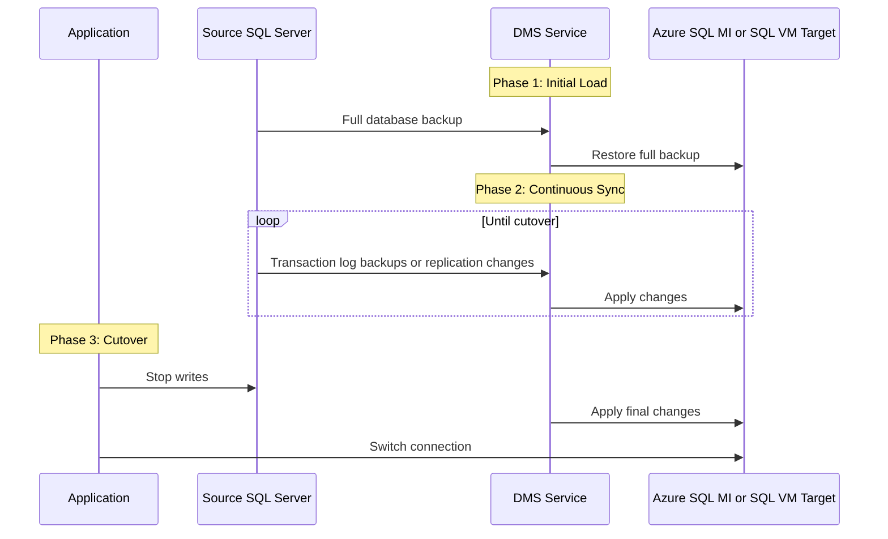

# How to Perform an Online Migration Using Azure Database Migration Service

Author: [nawazdhandala](https://www.github.com/nawazdhandala)

Tags: Azure, Database Migration, Online Migration, DMS, Azure Database Migration Service, Zero Downtime, SQL Server

Description: Learn how to perform an online (near-zero downtime) database migration using Azure Database Migration Service with continuous data sync.

---

Offline migrations require a maintenance window where your application goes dark while data is being copied. For a small database, that might be a few hours on a Saturday night. For a large database serving global users, it could mean days of downtime that the business simply will not accept. Online migration with Azure Database Migration Service (DMS) solves this by keeping your source database fully operational while it continuously restores changes to an Azure SQL Managed Instance or SQL Server on Azure VM target.

> **Important**: Azure DMS currently supports online SQL Server migrations to Azure SQL Managed Instance and SQL Server on Azure VM targets. Online migrations to Azure SQL Database targets are not available with DMS; use DMS offline migration for Azure SQL Database.

## How Online Migration Differs from Offline

In an offline migration, DMS copies all the data from source to target in a single pass. During this time, you should not write to the source database because those changes will not be captured.

In an online migration, DMS does something more sophisticated:

1. **Initial load**: Restores a full database backup from the source to the target.
2. **Continuous sync**: DMS continuously applies subsequent transaction log backups or near-real-time replication changes, depending on the selected migration method and target.
3. **Cutover**: When you are ready, you stop application writes, let DMS sync the final changes, and switch your application to the target.

The result is near-zero downtime - your application is down only for the few seconds or minutes it takes to switch connection strings.


```mermaid
sequenceDiagram
    participant App as Application
    participant Src as Source SQL Server
    participant DMS as DMS Service
    participant Tgt as Azure SQL MI or SQL VM Target

    Note over DMS: Phase 1: Initial Load
    Src->>DMS: Full database backup
    DMS->>Tgt: Restore full backup

    Note over DMS: Phase 2: Continuous Sync
    loop Until cutover
        Src->>DMS: Transaction log backups or replication changes
        DMS->>Tgt: Apply changes
    end

    Note over App: Phase 3: Cutover
    App->>Src: Stop writes
    DMS->>Tgt: Apply final changes
    App->>Tgt: Switch connection
```

## Prerequisites for Online Migration

Online migration has stricter requirements than offline:

- **Supported target**: Use Azure SQL Managed Instance or SQL Server on Azure VM. Azure SQL Database is supported by DMS for offline SQL Server migrations only.
- **Latest DMS experience**: Use Azure DMS from the Azure portal or current migration tooling. DMS (classic) SQL Server scenarios were retired on March 15, 2026.
- **Transaction log backups**: For log-shipping-based migrations, the source database must be in Full recovery model and you must provide a full backup plus ongoing transaction log backups.
- **Backup location**: Provide an SMB network share, Azure Storage file share, or Azure Storage blob container that DMS can access for the full and transaction log backup files.
- **Network bandwidth**: Continuous sync generates sustained network traffic between the source backup location, DMS, and the target. Plan for sustained bandwidth.
- **Source database permissions**: The login used to connect to the source SQL Server instance should be a member of the `sysadmin` server role or have `CONTROL SERVER` permission.

## Step 1: Prepare the Source Database

First, ensure your source SQL Server database is ready for online migration.

```sql
-- Check the recovery model (must be FULL for log-shipping-based online migration)
SELECT name, recovery_model_desc
FROM sys.databases
WHERE name = 'MyAppDB';

-- If not FULL, change it
ALTER DATABASE MyAppDB SET RECOVERY FULL;

-- Take a full backup for the initial restore
BACKUP DATABASE MyAppDB
TO DISK = 'C:\Backups\MyAppDB_Full.bak'
WITH INIT, COMPRESSION;

-- Take transaction log backups and continue taking them until cutover
BACKUP LOG MyAppDB
TO DISK = 'C:\Backups\MyAppDB_Log_001.trn'
WITH INIT, COMPRESSION;
```

Copy the full backup and each subsequent transaction log backup to the backup location that you configure in DMS. If you use an SMB network share, make sure the SQL Server service account can read and write to the share.

## Step 2: Create or Select the Target

Online migration requires a supported target such as Azure SQL Managed Instance or SQL Server on Azure VM. For Azure SQL Managed Instance, create the instance in a delegated subnet and size it appropriately for the migration workload.

```bash
# Create an Azure SQL Managed Instance target
az sql mi create \
  --name myapp-mi \
  --resource-group rg-migration \
  --location eastus \
  --admin-user sqladmin \
  --admin-password '<password>' \
  --subnet "/subscriptions/<sub-id>/resourceGroups/rg-migration/providers/Microsoft.Network/virtualNetworks/vnet-migration/subnets/snet-mi" \
  --tier GeneralPurpose \
  --family Gen5 \
  --capacity 8 \
  --storage 256GB
```

You can also use an existing SQL Server on Azure VM target. If you use an existing Azure VM, register it with the SQL Server IaaS Agent extension in Full management mode before starting the migration.

## Step 3: Prepare the Backup Location

DMS uses backup files for online SQL Server migrations to SQL Server on Azure VM and log-shipping-based migrations to Azure SQL Managed Instance. Put the full backup and each transaction log backup in a location DMS can access.

```bash
# Example: upload backups to an Azure Storage blob container
az storage blob upload \
  --account-name mystorageacct \
  --container-name sqlbackups \
  --name MyAppDB_Full.bak \
  --file ./Backups/MyAppDB_Full.bak \
  --auth-mode login

az storage blob upload \
  --account-name mystorageacct \
  --container-name sqlbackups \
  --name MyAppDB_Log_001.trn \
  --file ./Backups/MyAppDB_Log_001.trn \
  --auth-mode login
```

Tip: Use a storage account in the same region as the DMS migration and the target when possible. If your backups are in an on-premises network share, configure a self-hosted integration runtime so DMS can access the files and upload them to Azure.

## Step 4: Start the Online Migration

**Using the Azure Portal** (recommended):

1. Go to Azure Database Migration Service in the Azure portal.
2. Create a new migration or select an existing DMS migration workflow.
3. Choose SQL Server as the source and select Azure SQL Managed Instance or SQL Server on Azure VM as the target.
4. Select "Online migration" as the migration mode.
5. Configure the source connection and target connection.
6. Configure the backup location that contains the full and transaction log backups.
7. Select the databases to migrate.
8. Review the migration settings.
9. Start the migration.

DMS will begin the initial restore. You can monitor progress in the portal, including backup restore status and per-database migration status.

## Step 5: Monitor the Continuous Sync

After the initial restore completes, DMS enters the continuous sync phase. This is where it continuously applies subsequent changes to the target.

Key things to monitor during continuous sync:

**Replication or restore lag**: The time difference between a change on the source and when it is applied to the target. Keep the lag low before cutover.

**Pending backups or changes**: A growing backlog means DMS cannot keep up with the write rate on the source or cannot access new log backups quickly enough.

**Source log usage**: The transaction log on the source can grow if log backups are not taken frequently enough or if the migration falls behind. Make sure your source server has enough disk space for log growth.

```sql
-- Monitor transaction log size on the source database
SELECT
    name AS DatabaseName,
    type_desc AS FileType,
    size * 8 / 1024 AS SizeMB,
    FILEPROPERTY(name, 'SpaceUsed') * 8 / 1024 AS UsedMB
FROM sys.database_files
WHERE type_desc = 'LOG';
```

Continue taking log backups and placing them in the configured backup location until you are ready to cut over.

```sql
-- Continue log backups during the sync window
BACKUP LOG MyAppDB
TO DISK = 'C:\Backups\MyAppDB_Log_002.trn'
WITH INIT, COMPRESSION;
```

## Step 6: Perform the Cutover

This is the critical moment. When the lag is low and you are ready to switch, perform the cutover.

### Pre-Cutover Checklist

1. Verify replication or restore lag is minimal.
2. Notify your team and schedule the switch.
3. Prepare updated connection strings.
4. Have a rollback plan in case something goes wrong.

### Execute the Cutover

1. **Stop application writes to the source**: Take your application offline or put it in read-only mode. The downtime starts now.

2. **Take and upload the final log backup**: For log-shipping-based migrations, take a tail-log backup and put it in the configured backup location.
```sql
BACKUP LOG MyAppDB
TO DISK = 'C:\Backups\MyAppDB_Tail.trn'
WITH INIT, COMPRESSION, NORECOVERY;
```

3. **Wait for DMS to sync**: Watch the pending changes or backup restore status drop to zero.

4. **Complete the migration in DMS**: In the portal, use the cutover action on the migration. DMS will apply the remaining changes and mark the migration as complete.

5. **Update application connection strings**: Point your application to Azure SQL Managed Instance or SQL Server on Azure VM.

6. **Bring the application back online**: Your application now reads and writes to the Azure target.

Total downtime: typically minutes, depending on how quickly you can stop writes, sync the final changes, complete cutover, and update the application.

## Step 7: Post-Cutover Validation

After the cutover, validate that everything is working:

```sql
-- Compare row counts between source and target for key tables
-- Source:
SELECT COUNT(*) FROM dbo.Customers;
-- Target:
SELECT COUNT(*) FROM dbo.Customers;

-- Run a few application-specific queries to verify data integrity
-- Check that recent records are present
SELECT TOP 10 * FROM dbo.Orders ORDER BY OrderDate DESC;
```

Also check:
- Application health metrics (error rates, response times)
- Index usage statistics on the target
- Any stored procedures that reference linked servers or cross-database queries

## Troubleshooting Sync Issues

**Sync lag keeps increasing**: The source database has a very high write rate and DMS cannot keep up. Consider:
- Increasing target compute
- Reducing the write load on the source temporarily
- Checking network bandwidth between the backup location, DMS, and the target
- Taking and uploading log backups more frequently for log-shipping-based migrations

**Transaction log fills up on source**: Take regular log backups and make sure DMS can access them. Do not manually truncate the log in a way that breaks the log chain.

**Migration task fails during initial restore**: Check if the backup chain is valid, the backup files are accessible, and the target is compatible with the source SQL Server version and database features.

## Wrapping Up

Online migration with Azure Database Migration Service is the right choice when you cannot afford significant downtime and your target is Azure SQL Managed Instance or SQL Server on Azure VM. The process is more involved than offline migration - you need a supported target, valid full and transaction log backups or a supported replication method, accessible backup storage, and a carefully managed cutover window. But the payoff is substantial: your application stays online throughout most of the migration, with downtime measured in minutes rather than hours. Plan thoroughly, monitor the sync closely, and practice the cutover before doing it in production.
