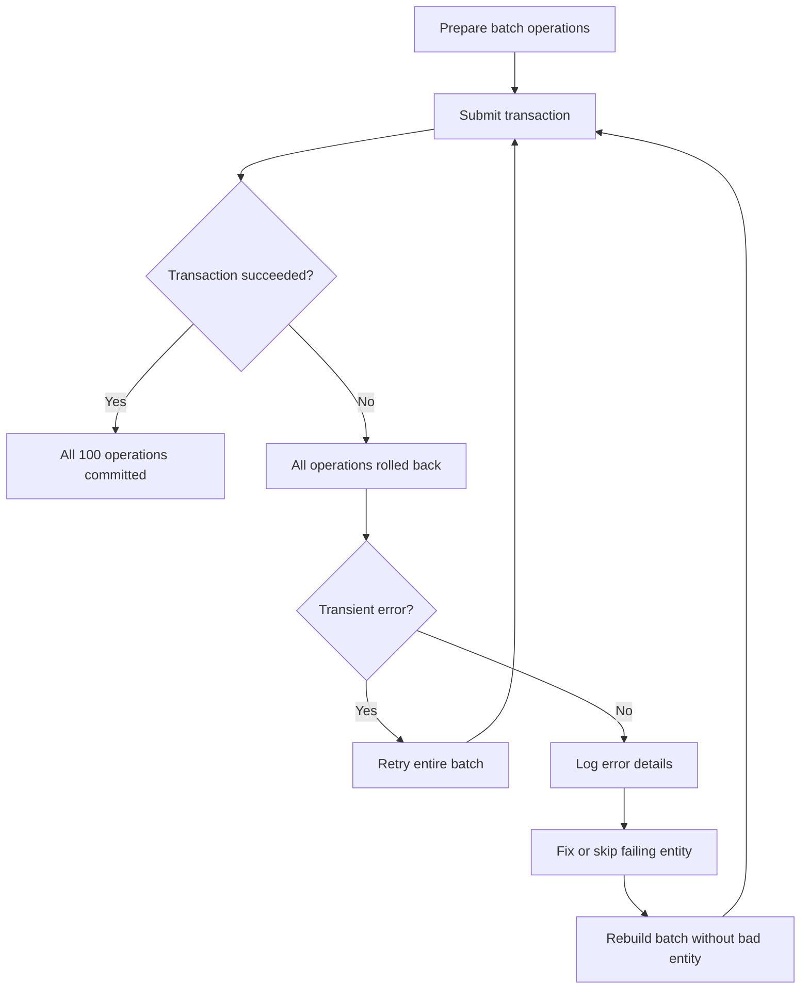

# How to Perform Batch Operations in Azure Table Storage

Author: [nawazdhandala](https://www.github.com/nawazdhandala)

Tags: Azure, Table Storage, Batch Operations, Entity Group Transactions, Performance, NoSQL

Description: Learn how to use batch operations in Azure Table Storage to insert, update, and delete multiple entities efficiently in a single atomic transaction.

---

When you need to work with multiple entities at once in Azure Table Storage, doing them one at a time is both slow and unreliable. Batch operations let you group up to 100 operations into a single atomic transaction. Either all operations succeed, or none of them do. This post covers how to use batch operations effectively, including the rules you need to follow and the performance benefits you can expect.

## Why Use Batch Operations?

There are two main reasons. First, performance. A batch of 100 inserts makes a single HTTP request instead of 100 separate requests. That alone can speed things up by an order of magnitude. Second, atomicity. If you need to insert five related entities and all of them must succeed or fail together, a batch operation gives you that guarantee without needing a distributed transaction coordinator.

Each batch operation is called an Entity Group Transaction (EGT). The name hints at the key constraint: all entities in a batch must share the same partition key.

## Batch Operation Rules

Before writing code, here are the rules.

- All entities in a batch must have the same PartitionKey.
- A batch can contain at most 100 operations.
- The total payload of a batch request cannot exceed 4 MB.
- Each entity can appear only once in a batch (no duplicate RowKeys).
- You can mix operation types (insert, update, delete, merge) in a single batch.

## Batch Insert with Python

Here is how to insert multiple entities in a single batch.

```python
from azure.data.tables import TableClient, TableTransactionError
import os

connection_string = os.environ["AZURE_STORAGE_CONNECTION_STRING"]
table_client = TableClient.from_connection_string(connection_string, "SensorReadings")

# Build a list of operations for the batch
# All entities must share the same PartitionKey
operations = []

sensor_readings = [
    {"PartitionKey": "sensor-42", "RowKey": "2026-02-16T10:00:00", "Temperature": 72.1, "Humidity": 45},
    {"PartitionKey": "sensor-42", "RowKey": "2026-02-16T10:01:00", "Temperature": 72.3, "Humidity": 44},
    {"PartitionKey": "sensor-42", "RowKey": "2026-02-16T10:02:00", "Temperature": 72.0, "Humidity": 46},
    {"PartitionKey": "sensor-42", "RowKey": "2026-02-16T10:03:00", "Temperature": 71.8, "Humidity": 47},
    {"PartitionKey": "sensor-42", "RowKey": "2026-02-16T10:04:00", "Temperature": 72.5, "Humidity": 44},
]

# Each operation is a tuple of (action, entity)
# Valid actions: "create", "upsert", "update", "delete"
for reading in sensor_readings:
    operations.append(("create", reading))

# Submit the batch - all operations succeed or fail atomically
try:
    table_client.submit_transaction(operations)
    print(f"Batch of {len(operations)} entities inserted successfully")
except TableTransactionError as e:
    print(f"Batch failed: {e.message}")
```

## Batch Insert with .NET

```csharp
using Azure.Data.Tables;
using System.Collections.Generic;

var tableClient = new TableClient(connectionString, "SensorReadings");
await tableClient.CreateIfNotExistsAsync();

// Build a list of actions for the transaction
var actions = new List<TableTransactionAction>();

// Add multiple insert operations - all must share the same PartitionKey
for (int i = 0; i < 5; i++)
{
    var entity = new TableEntity("sensor-42", $"2026-02-16T10:{i:D2}:00")
    {
        { "Temperature", 72.0 + (i * 0.1) },
        { "Humidity", 45 + i }
    };
    actions.Add(new TableTransactionAction(TableTransactionActionType.Add, entity));
}

// Execute the transaction atomically
try
{
    await tableClient.SubmitTransactionAsync(actions);
    Console.WriteLine("Batch succeeded");
}
catch (TableTransactionFailedException ex)
{
    Console.WriteLine($"Batch failed at index {ex.FailedTransactionActionIndex}: {ex.Message}");
}
```

## Mixed Operations in a Batch

You can combine inserts, updates, merges, and deletes in a single batch. This is useful when a business operation touches multiple entities.

```python
# Mixed batch: insert new entities, update existing ones, delete obsolete ones
operations = [
    # Insert a new reading
    ("create", {
        "PartitionKey": "sensor-42",
        "RowKey": "2026-02-16T11:00:00",
        "Temperature": 73.0,
        "Humidity": 42
    }),
    # Update an existing reading (merge mode preserves other properties)
    ("update", {
        "PartitionKey": "sensor-42",
        "RowKey": "2026-02-16T10:00:00",
        "Temperature": 72.15,  # Corrected value
    }, {"mode": "merge"}),
    # Delete an erroneous reading
    ("delete", {
        "PartitionKey": "sensor-42",
        "RowKey": "2026-02-16T09:59:00",
    }),
]

table_client.submit_transaction(operations)
```

## Batching Large Datasets

Since each batch is limited to 100 operations, you need to split large datasets into chunks when loading bulk data.

```python
def batch_insert_entities(table_client, entities, batch_size=100):
    """
    Insert entities in batches of up to 100.
    All entities must have the same PartitionKey.
    Returns the count of successfully inserted entities.
    """
    total_inserted = 0

    # Split entities into chunks of batch_size
    for i in range(0, len(entities), batch_size):
        chunk = entities[i:i + batch_size]
        operations = [("create", entity) for entity in chunk]

        try:
            table_client.submit_transaction(operations)
            total_inserted += len(chunk)
            print(f"Batch {i // batch_size + 1}: inserted {len(chunk)} entities")
        except TableTransactionError as e:
            print(f"Batch {i // batch_size + 1} failed: {e.message}")
            # You could implement retry logic here

    return total_inserted

# Generate 500 entities for a single sensor
entities = []
for minute in range(500):
    entities.append({
        "PartitionKey": "sensor-42",
        "RowKey": f"reading-{minute:05d}",
        "Value": 72.0 + (minute * 0.01)
    })

inserted = batch_insert_entities(table_client, entities)
print(f"Total inserted: {inserted}")
```

## Handling Multiple Partition Keys

Since batches only work within a single partition, you need to group your entities by partition key first.

```python
from collections import defaultdict

def batch_insert_multi_partition(table_client, entities, batch_size=100):
    """
    Insert entities across multiple partitions.
    Groups entities by PartitionKey and processes each group in batches.
    """
    # Group entities by their partition key
    partitions = defaultdict(list)
    for entity in entities:
        partitions[entity["PartitionKey"]].append(entity)

    total = 0
    for pk, partition_entities in partitions.items():
        # Process each partition's entities in batches of 100
        for i in range(0, len(partition_entities), batch_size):
            chunk = partition_entities[i:i + batch_size]
            operations = [("upsert", e) for e in chunk]

            try:
                table_client.submit_transaction(operations)
                total += len(chunk)
            except TableTransactionError as e:
                print(f"Batch failed for partition {pk}: {e.message}")

    return total
```

## Error Handling

When a batch fails, the entire transaction is rolled back. The error tells you which operation in the batch caused the failure.

```python
try:
    table_client.submit_transaction(operations)
except TableTransactionError as e:
    # The error includes details about which operation failed
    print(f"Transaction failed: {e.message}")

    # In production, you might want to:
    # 1. Log the failed batch for investigation
    # 2. Retry transient errors
    # 3. Split the batch and retry individual operations
    # 4. Move permanently failing entities to an error queue
```

Here is the flow for handling batch failures.



## Performance Comparison

To give you a sense of the performance difference, here are rough numbers from a real workload inserting 1,000 entities.

Individual inserts: about 1,000 HTTP requests, taking roughly 30 to 60 seconds depending on network latency.

Batch inserts (100 per batch): 10 HTTP requests, taking roughly 1 to 3 seconds.

That is a 10x to 20x speedup, and the difference only grows with larger datasets.

## When Not to Use Batches

Batch operations are not always the right choice. If your entities belong to different partitions, you cannot batch them together. If you need individual error handling per entity (some failures are acceptable while others are not), individual operations give you more granular control.

Also, if your entities are large, you might hit the 4 MB payload limit before reaching 100 operations. In that case, use smaller batch sizes.

Batch operations are one of the key tools for getting good performance out of Azure Table Storage. Use them whenever you are working with multiple entities in the same partition, and your data loading and processing pipelines will be dramatically faster.
