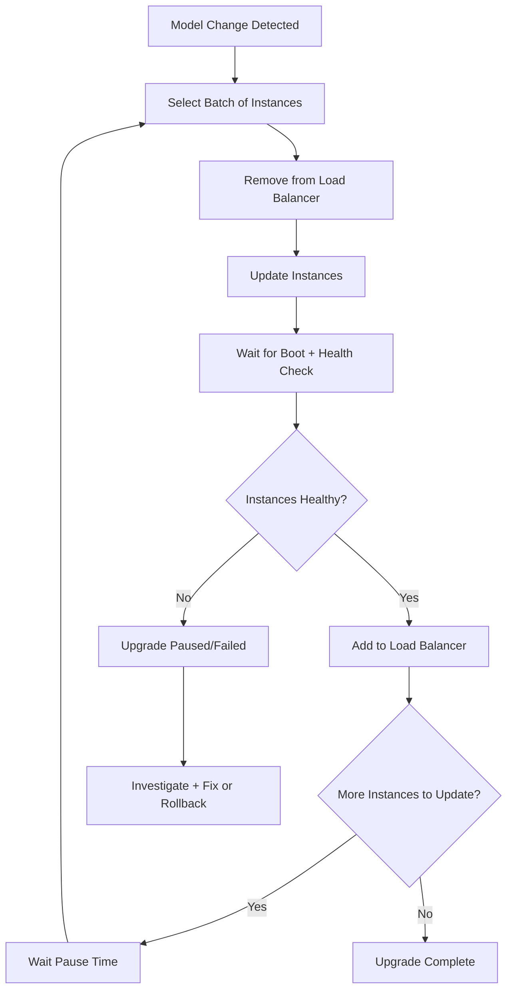

# How to Perform Rolling Upgrades on Azure VM Scale Sets

Author: [nawazdhandala](https://www.github.com/nawazdhandala)

Tags: Azure, VM Scale Sets, Rolling Upgrades, Deployment Strategy, Zero Downtime, DevOps

Description: A practical guide to performing rolling upgrades on Azure VM Scale Sets for zero-downtime deployments with health monitoring and rollback.

---

Updating a VM Scale Set is not like updating a single VM. When you change the scale set model - whether it is a new OS image, a configuration change, or an extension update - you need to roll that change out to potentially dozens or hundreds of instances without taking the entire service offline. Rolling upgrades give you a way to do this incrementally, updating a batch of instances at a time while the rest continue serving traffic.

I have been through enough botched updates to appreciate the value of a controlled rollout. The first time I pushed a bad image to a scale set with an Automatic upgrade policy, every instance updated simultaneously and the entire service went down. Rolling upgrades with health checks would have caught the problem after the first batch and stopped the rollout.

## Understanding Upgrade Policies

Azure VM Scale Sets support three upgrade policies:

**Manual**: When you change the scale set model, nothing happens automatically. You manually select which instances to update and when. This gives you full control but requires operational overhead.

**Automatic**: All instances are updated as soon as the model changes. Fast but dangerous for production because there is no gradual rollout.

**Rolling**: Instances are updated in configurable batches. After each batch, the scale set waits for health confirmation before proceeding to the next batch. This is the policy you want for production.

## Configuring Rolling Upgrade Policy

Set up the rolling upgrade policy when creating the scale set or update it on an existing one:

```bash
# Create a scale set with rolling upgrade policy
az vmss create \
  --resource-group myResourceGroup \
  --name myScaleSet \
  --image Ubuntu2204 \
  --vm-sku Standard_D2s_v5 \
  --instance-count 6 \
  --upgrade-policy-mode Rolling \
  --max-batch-instance-percent 20 \
  --max-unhealthy-instance-percent 20 \
  --max-unhealthy-upgraded-instance-percent 20 \
  --pause-time-between-batches PT2S \
  --admin-username azureuser \
  --generate-ssh-keys \
  --lb myLoadBalancer \
  --health-probe myHealthProbe

# Or update an existing scale set to use rolling upgrades
az vmss update \
  --resource-group myResourceGroup \
  --name myScaleSet \
  --set upgradePolicy.mode=Rolling \
  --set upgradePolicy.rollingUpgradePolicy.maxBatchInstancePercent=20 \
  --set upgradePolicy.rollingUpgradePolicy.maxUnhealthyInstancePercent=20 \
  --set upgradePolicy.rollingUpgradePolicy.maxUnhealthyUpgradedInstancePercent=20 \
  --set upgradePolicy.rollingUpgradePolicy.pauseTimeBetweenBatches=PT2S
```

Let me break down each parameter:

**maxBatchInstancePercent**: The percentage of total instances updated in a single batch. With 10 instances and 20%, each batch updates 2 instances. Lower values mean slower but safer rollouts.

**maxUnhealthyInstancePercent**: The maximum percentage of instances in the scale set that can be unhealthy at any point during the upgrade. If this threshold is exceeded, the upgrade stops.

**maxUnhealthyUpgradedInstancePercent**: The maximum percentage of upgraded instances that can be unhealthy. If newly upgraded instances fail health checks at a rate higher than this, the upgrade stops.

**pauseTimeBetweenBatches**: The wait time between completing one batch and starting the next. Format is ISO 8601 duration (PT2S = 2 seconds, PT30S = 30 seconds, PT5M = 5 minutes).

## Health Probes Are Required

Rolling upgrades require health monitoring. Without a way to verify that updated instances are healthy, the rolling upgrade has no signal to determine whether to continue or stop.

You can use either a load balancer health probe or the Application Health Extension:

### Load Balancer Health Probe

```bash
# Create a load balancer with a health probe
az network lb probe create \
  --resource-group myResourceGroup \
  --lb-name myLoadBalancer \
  --name myHealthProbe \
  --protocol Http \
  --port 80 \
  --path /health \
  --interval 15 \
  --threshold 2
```

### Application Health Extension

The Application Health Extension runs inside each VM and reports health status directly to the scale set:

```bash
# Add the Application Health Extension to the scale set
az vmss extension set \
  --resource-group myResourceGroup \
  --vmss-name myScaleSet \
  --name ApplicationHealthLinux \
  --publisher Microsoft.ManagedServices \
  --version 1.0 \
  --settings '{
    "protocol": "http",
    "port": 8080,
    "requestPath": "/health"
  }'
```

I prefer the Application Health Extension because it works independently of the load balancer and can detect application-level issues that the load balancer probe might miss.

## Triggering a Rolling Upgrade

Once the rolling upgrade policy is configured, updates happen automatically when you change the scale set model. Here are common operations that trigger an upgrade:

### Updating the OS Image

```bash
# Update the scale set image
az vmss update \
  --resource-group myResourceGroup \
  --name myScaleSet \
  --set virtualMachineProfile.storageProfile.imageReference.version=latest
```

### Updating a Custom Image

If you use a Shared Image Gallery, push a new image version and update the scale set:

```bash
# Update to a new custom image version
az vmss update \
  --resource-group myResourceGroup \
  --name myScaleSet \
  --set virtualMachineProfile.storageProfile.imageReference.id="/subscriptions/<sub-id>/resourceGroups/imageRG/providers/Microsoft.Compute/galleries/myGallery/images/myImage/versions/2.0.0"
```

### Updating Extensions

```bash
# Update a custom script extension
az vmss extension set \
  --resource-group myResourceGroup \
  --vmss-name myScaleSet \
  --name CustomScript \
  --publisher Microsoft.Azure.Extensions \
  --version 2.1 \
  --settings '{"commandToExecute": "apt-get update && apt-get install -y nginx"}'
```

## Monitoring the Rolling Upgrade

Watch the progress of a rolling upgrade in real time:

```bash
# Check the status of the current rolling upgrade
az vmss rolling-upgrade get-latest \
  --resource-group myResourceGroup \
  --name myScaleSet \
  -o table

# View individual instance upgrade status
az vmss list-instances \
  --resource-group myResourceGroup \
  --name myScaleSet \
  --query "[].{InstanceId:instanceId, LatestModel:latestModelApplied, State:provisioningState}" \
  -o table
```

The `latestModelApplied` field tells you whether each instance is running the current model (`true`) or the previous model (`false`). During a rolling upgrade, you will see a mix as batches are processed.

## Handling Upgrade Failures

If the rolling upgrade detects too many unhealthy instances, it automatically stops. When this happens, you need to investigate the issue before proceeding.

```bash
# Check why the upgrade stopped
az vmss rolling-upgrade get-latest \
  --resource-group myResourceGroup \
  --name myScaleSet \
  --query "{Status:runningStatus.code, Error:error, Progress:progress}" \
  -o json

# Check the health of individual instances
az vmss get-instance-view \
  --resource-group myResourceGroup \
  --name myScaleSet \
  --instance-id "*" \
  --query "[].{InstanceId:instanceId, Health:vmHealth.status.code, State:statuses[1].displayStatus}" \
  -o table
```

### Rolling Back

If the new image or configuration is bad, you have a few options:

**Revert the model change**: Update the scale set back to the previous image or configuration. Instances that were already updated will be upgraded again to the reverted model.

```bash
# Revert to the previous image version
az vmss update \
  --resource-group myResourceGroup \
  --name myScaleSet \
  --set virtualMachineProfile.storageProfile.imageReference.version=1.0.0
```

**Manually reimage specific instances**: If only a few instances were updated, you can reimage them individually.

```bash
# Reimage specific instances back to the scale set model
az vmss reimage --resource-group myResourceGroup --name myScaleSet --instance-ids 0 1 2
```

## Best Practices for Rolling Upgrades

### Batch Size

For small scale sets (under 10 instances), use 20% batch size. For larger scale sets, you can use larger batches (33-50%) to speed up the rollout while still maintaining safety.

### Pause Time

The pause between batches should be long enough for newly updated instances to start handling traffic and for any issues to become apparent. I recommend at least 30 seconds to 2 minutes for web applications, and longer for applications with warm-up requirements.

### Health Check Grace Period

New instances need time to boot, run startup scripts, and warm up the application before they can pass health checks. Configure a grace period:

```bash
# Set automatic repair policy with grace period
az vmss update \
  --resource-group myResourceGroup \
  --name myScaleSet \
  --set automaticRepairsPolicy.enabled=true \
  --set automaticRepairsPolicy.gracePeriod=PT30M
```

### Pre-Upgrade Testing

Before triggering a rolling upgrade to the full scale set, test the new image on a single instance:

```bash
# Manually update a single instance to the latest model
az vmss update-instances \
  --resource-group myResourceGroup \
  --name myScaleSet \
  --instance-ids 0
```

Verify the instance is healthy, check application logs, and confirm functionality before rolling out to the rest.

## Rolling Upgrade Flow

Here is the sequence of events during a rolling upgrade:



## Integrating with CI/CD

In a CI/CD pipeline, the rolling upgrade is typically triggered by updating the image reference in the scale set model. Here is a simplified GitHub Actions workflow:

```yaml
# .github/workflows/deploy.yml
name: Deploy to Scale Set
on:
  push:
    branches: [main]
jobs:
  deploy:
    runs-on: ubuntu-latest
    steps:
      - name: Azure Login
        uses: azure/login@v1
        with:
          creds: ${{ secrets.AZURE_CREDENTIALS }}

      - name: Update Scale Set Image
        run: |
          # Update the scale set with the new image version
          az vmss update \
            --resource-group myResourceGroup \
            --name myScaleSet \
            --set virtualMachineProfile.storageProfile.imageReference.version=${{ github.sha }}

      - name: Monitor Rolling Upgrade
        run: |
          # Wait for the rolling upgrade to complete
          while true; do
            STATUS=$(az vmss rolling-upgrade get-latest \
              --resource-group myResourceGroup \
              --name myScaleSet \
              --query "runningStatus.code" -o tsv)
            if [ "$STATUS" = "Completed" ]; then
              echo "Rolling upgrade completed successfully"
              break
            elif [ "$STATUS" = "Failed" ]; then
              echo "Rolling upgrade failed"
              exit 1
            fi
            sleep 30
          done
```

## Wrapping Up

Rolling upgrades are the production-grade way to update VM Scale Sets. Configure appropriate batch sizes, health checks, and pause times. Always have a rollback plan ready. Monitor the upgrade as it progresses and investigate any health check failures immediately. The initial setup takes a bit more effort than the Automatic policy, but the safety it provides for production workloads is well worth it.
