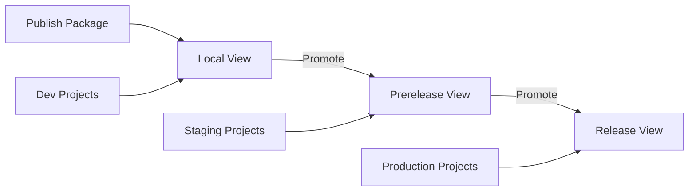

# How to Publish and Consume NuGet Packages Using Azure Artifacts Feeds

Author: [nawazdhandala](https://www.github.com/nawazdhandala)

Tags: Azure Artifacts, NuGet, Package Management, Azure DevOps, .NET, CI/CD, DevOps

Description: Learn how to create Azure Artifacts feeds, publish NuGet packages from pipelines, and consume them in .NET projects.

---

Sharing code between projects is a fundamental challenge in software development. You can copy-paste files, use Git submodules, or create shared projects in a monorepo. But if you are working in the .NET ecosystem, NuGet packages are the standard answer, and Azure Artifacts gives you a private feed to host them without running your own NuGet server.

In this post, I will walk through the full lifecycle: creating a feed, publishing a package from an Azure Pipeline, consuming it in another project, and handling versioning and retention.

## Why Azure Artifacts?

You might wonder why you need a private feed when nuget.org exists. The reason is simple: you do not want to publish your internal libraries to a public registry. Azure Artifacts gives you:

- Private feeds scoped to your organization or project
- Integration with Azure Pipelines for automated publishing
- Upstream sources that proxy public registries (nuget.org, npmjs.com)
- Views for controlling package maturity (prerelease vs. release)
- Retention policies to manage storage

## Step 1: Create a Feed

Navigate to **Artifacts** in your Azure DevOps project. Click **Create Feed**.

Configure the feed:

- **Name**: Something descriptive like `internal-packages` or your team name
- **Visibility**: Choose who can access it. "Members of [your organization]" is the most common
- **Upstream sources**: Enable these to proxy public packages. This lets developers get both internal and public packages from a single source
- **Scope**: Organization-scoped feeds are shared across projects; project-scoped feeds are isolated to one project

Once created, you will see the feed with instructions for connecting to it.

## Step 2: Create a .NET Class Library

If you do not already have a library to package, here is a quick example.

The following commands create a simple class library with a useful extension method.

```bash
# Create a new class library project
dotnet new classlib -n MyCompany.Utilities -o src/MyCompany.Utilities

# Navigate to the project
cd src/MyCompany.Utilities
```

Edit the `.csproj` file to include NuGet package metadata.

```xml
<!-- MyCompany.Utilities.csproj with NuGet metadata -->
<Project Sdk="Microsoft.NET.Sdk">
  <PropertyGroup>
    <TargetFramework>net8.0</TargetFramework>

    <!-- NuGet package metadata -->
    <PackageId>MyCompany.Utilities</PackageId>
    <Version>1.0.0</Version>
    <Authors>MyCompany</Authors>
    <Description>Shared utility methods for internal projects</Description>
    <PackageTags>utilities;helpers;internal</PackageTags>

    <!-- Generate package on build -->
    <GeneratePackageOnBuild>true</GeneratePackageOnBuild>
  </PropertyGroup>
</Project>
```

Add some actual functionality to the library.

```csharp
// StringExtensions.cs - Useful string helper methods
namespace MyCompany.Utilities
{
    public static class StringExtensions
    {
        /// <summary>
        /// Truncates a string to the specified maximum length,
        /// appending an ellipsis if truncation occurs.
        /// </summary>
        public static string Truncate(this string value, int maxLength)
        {
            if (string.IsNullOrEmpty(value)) return value;
            return value.Length <= maxLength ? value : value[..maxLength] + "...";
        }

        /// <summary>
        /// Converts a string to a URL-friendly slug.
        /// </summary>
        public static string ToSlug(this string value)
        {
            if (string.IsNullOrEmpty(value)) return value;

            // Convert to lowercase and replace spaces with hyphens
            var slug = value.ToLowerInvariant()
                .Replace(" ", "-")
                .Replace("_", "-");

            // Remove non-alphanumeric characters except hyphens
            slug = System.Text.RegularExpressions.Regex.Replace(slug, @"[^a-z0-9\-]", "");

            // Remove consecutive hyphens
            slug = System.Text.RegularExpressions.Regex.Replace(slug, @"-+", "-");

            return slug.Trim('-');
        }
    }
}
```

## Step 3: Publish from Azure Pipelines

The pipeline below builds the package and publishes it to your Azure Artifacts feed.

```yaml
# azure-pipelines.yml - Build and publish NuGet package
trigger:
  branches:
    include:
      - main
  paths:
    include:
      - src/MyCompany.Utilities/**

pool:
  vmImage: 'ubuntu-latest'

variables:
  # Build configuration
  buildConfiguration: 'Release'
  # Package version - using build ID for unique versions
  packageVersion: '1.0.$(Build.BuildId)'

steps:
  # Restore dependencies
  - task: DotNetCoreCLI@2
    displayName: 'Restore'
    inputs:
      command: 'restore'
      projects: 'src/MyCompany.Utilities/*.csproj'

  # Build the project
  - task: DotNetCoreCLI@2
    displayName: 'Build'
    inputs:
      command: 'build'
      projects: 'src/MyCompany.Utilities/*.csproj'
      arguments: '--configuration $(buildConfiguration) --no-restore'

  # Run tests if any exist
  - task: DotNetCoreCLI@2
    displayName: 'Test'
    inputs:
      command: 'test'
      projects: 'tests/**/*.csproj'
      arguments: '--configuration $(buildConfiguration)'

  # Pack the NuGet package with the computed version
  - task: DotNetCoreCLI@2
    displayName: 'Pack'
    inputs:
      command: 'pack'
      packagesToPack: 'src/MyCompany.Utilities/*.csproj'
      configuration: '$(buildConfiguration)'
      versioningScheme: 'byEnvVar'
      versionEnvVar: 'packageVersion'
      outputDir: '$(Build.ArtifactStagingDirectory)/packages'

  # Push the package to Azure Artifacts
  - task: NuGetAuthenticate@1
    displayName: 'Authenticate to feed'

  - task: DotNetCoreCLI@2
    displayName: 'Push to feed'
    inputs:
      command: 'push'
      packagesToPush: '$(Build.ArtifactStagingDirectory)/packages/*.nupkg'
      nuGetFeedType: 'internal'
      publishVstsFeed: 'internal-packages'
```

## Step 4: Consume the Package

To use the package in another project, you need to add the Azure Artifacts feed as a NuGet source.

Create a `nuget.config` file in your solution root.

```xml
<?xml version="1.0" encoding="utf-8"?>
<!-- nuget.config - Configure package sources including Azure Artifacts -->
<configuration>
  <packageSources>
    <!-- Clear default sources to be explicit -->
    <clear />
    <!-- Azure Artifacts feed (internal packages and upstream proxy) -->
    <add key="internal-packages"
         value="https://pkgs.dev.azure.com/yourorg/yourproject/_packaging/internal-packages/nuget/v3/index.json" />
    <!-- Public NuGet.org as fallback -->
    <add key="nuget.org"
         value="https://api.nuget.org/v3/index.json" />
  </packageSources>
</configuration>
```

Now install the package in your consuming project.

```bash
# Add the package to your project
dotnet add package MyCompany.Utilities --version 1.0.42
```

In a pipeline, authentication happens automatically with the NuGetAuthenticate task.

```yaml
# Pipeline that consumes packages from Azure Artifacts
steps:
  # Authenticate to the feed before restoring
  - task: NuGetAuthenticate@1
    displayName: 'Authenticate to Azure Artifacts'

  # Restore will pull from Azure Artifacts using the nuget.config
  - task: DotNetCoreCLI@2
    displayName: 'Restore'
    inputs:
      command: 'restore'
      projects: '**/*.csproj'
      feedsToUse: 'config'
      nugetConfigPath: 'nuget.config'
```

## Versioning Strategies

Picking the right versioning strategy saves a lot of pain down the road.

**Build ID versioning**: Use `1.0.$(Build.BuildId)` for simple incrementing versions. Easy but not semantic.

**GitVersion**: Use a tool like GitVersion to compute semantic versions from your Git history. More complex but provides meaningful version numbers.

**Manual versioning**: Update the version in the `.csproj` file manually. Works for libraries with infrequent releases but is error-prone.

Here is how I typically set up GitVersion in a pipeline.

```yaml
# Using GitVersion for semantic versioning
steps:
  - task: gitversion/setup@0
    displayName: 'Install GitVersion'
    inputs:
      versionSpec: '5.x'

  - task: gitversion/execute@0
    displayName: 'Calculate version'

  - task: DotNetCoreCLI@2
    displayName: 'Pack with semantic version'
    inputs:
      command: 'pack'
      packagesToPack: 'src/**/*.csproj'
      versioningScheme: 'byEnvVar'
      versionEnvVar: 'GitVersion.NuGetVersionV2'
```

## Using Views for Package Maturity

Azure Artifacts feeds have views that act as maturity levels. By default, every feed has three views:

- **Local**: All published packages
- **Prerelease**: Packages promoted from Local
- **Release**: Packages promoted from Prerelease

This lets consuming projects decide their risk tolerance. A development project might pull from the Local view, while a production project only consumes packages from the Release view.



To promote a package, click on it in the Azure Artifacts UI and select **Promote**. You can also automate promotion from a pipeline using the Azure CLI.

## Configuring Retention Policies

Without retention policies, your feed will grow indefinitely. Azure Artifacts lets you set limits on how many versions of each package to keep.

Go to your feed settings and configure:

- **Maximum number of versions per package**: I usually set this to 10-20 for active packages
- **Days to keep recently downloaded versions**: Set to 30-60 days

Promoted packages (in Prerelease or Release views) are not affected by retention policies, so your stable releases are always preserved.

## Troubleshooting Common Issues

**401 Unauthorized when restoring packages**: Make sure you have the NuGetAuthenticate task before any restore steps. For local development, run `az artifacts universal login` or use the Azure Artifacts Credential Provider.

**Package not found after publishing**: Check that you are looking at the correct feed and that the publishing pipeline completed successfully. Also verify that the nuget.config in the consuming project points to the right feed URL.

**Version conflicts**: If multiple packages depend on different versions of your library, NuGet will try to resolve them. Use `<PackageReference>` with explicit versions and consider using version ranges like `[1.0, 2.0)` for more flexibility.

## Wrapping Up

Azure Artifacts with NuGet gives you a clean, integrated way to share .NET libraries across your organization. The key steps are straightforward: create a feed, package your library, publish from a pipeline, and configure your consuming projects to use the feed. Add views and retention policies for governance, and you have a complete internal package management system that scales with your team.
