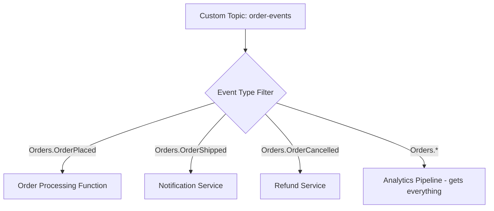

# How to Publish Custom Events to Azure Event Grid Topics

Author: [nawazdhandala](https://www.github.com/nawazdhandala)

Tags: Azure, Event Grid, Custom Events, Event-Driven Architecture, Pub/Sub, Cloud Messaging, Serverless

Description: Learn how to create Azure Event Grid custom topics and publish your own events for event-driven application architectures.

---

Azure Event Grid is designed for reactive, event-driven architectures. While it shines at routing Azure resource events (like "blob created" or "resource group changed"), its real power comes when you publish your own custom events. Custom topics let you plug your application events into the same routing and filtering infrastructure that Azure uses internally.

## What Are Custom Topics?

An Event Grid custom topic is an endpoint you own where you send events. Subscribers register against the topic and receive events based on filters. Think of it as a pub/sub hub specifically built for events - lightweight, serverless, and fully managed.

Unlike Service Bus topics (which are designed for reliable message queuing), Event Grid topics are designed for event notification. They push events to subscribers via webhooks, Azure Functions, Service Bus queues, or other handlers. The delivery model is push-based with retry, not pull-based.

## Creating a Custom Topic

Let's start by creating a custom topic.

```bash
# Create a resource group for our Event Grid resources
az group create --name rg-events --location eastus2

# Create a custom topic
az eventgrid topic create \
  --name topic-order-events \
  --resource-group rg-events \
  --location eastus2 \
  --input-schema eventgridschema

# Get the topic endpoint URL (you will send events here)
az eventgrid topic show \
  --name topic-order-events \
  --resource-group rg-events \
  --query "endpoint" \
  --output tsv

# Get the access key for publishing
az eventgrid topic key list \
  --name topic-order-events \
  --resource-group rg-events \
  --query "key1" \
  --output tsv
```

## Event Schema

Every event published to Event Grid must follow a schema. The default Event Grid schema looks like this.

```json
[
  {
    "id": "unique-event-id",
    "eventType": "Orders.OrderPlaced",
    "subject": "/orders/12345",
    "eventTime": "2026-02-16T10:30:00Z",
    "data": {
      "orderId": "12345",
      "customerId": "cust-789",
      "totalAmount": 99.95,
      "currency": "USD",
      "items": [
        {
          "productId": "widget-01",
          "quantity": 3,
          "unitPrice": 33.32
        }
      ]
    },
    "dataVersion": "1.0"
  }
]
```

The `id` must be unique per event. The `eventType` is what subscribers filter on. The `subject` provides additional context for filtering. The `data` field is your custom payload - it can be any valid JSON.

## Publishing Events with C#

Here is a C# example using the Azure SDK.

```csharp
using Azure;
using Azure.Messaging.EventGrid;

// Create the publisher client with the topic endpoint and access key
var topicEndpoint = new Uri("https://topic-order-events.eastus2-1.eventgrid.azure.net/api/events");
var credential = new AzureKeyCredential("your-topic-access-key");
var client = new EventGridPublisherClient(topicEndpoint, credential);

// Build a list of events to publish
var events = new List<EventGridEvent>
{
    new EventGridEvent(
        subject: "/orders/12345",
        eventType: "Orders.OrderPlaced",
        dataVersion: "1.0",
        data: new
        {
            orderId = "12345",
            customerId = "cust-789",
            totalAmount = 99.95,
            currency = "USD",
            placedAt = DateTimeOffset.UtcNow
        }
    ),
    new EventGridEvent(
        subject: "/orders/12346",
        eventType: "Orders.OrderPlaced",
        dataVersion: "1.0",
        data: new
        {
            orderId = "12346",
            customerId = "cust-101",
            totalAmount = 45.00,
            currency = "USD",
            placedAt = DateTimeOffset.UtcNow
        }
    )
};

// Publish the batch of events
await client.SendEventsAsync(events);
Console.WriteLine("Events published successfully");
```

## Publishing Events with Python

The same thing in Python, which is common for data processing pipelines.

```python
from azure.eventgrid import EventGridPublisherClient, EventGridEvent
from azure.core.credentials import AzureKeyCredential
from datetime import datetime, timezone

# Set up the client
endpoint = "https://topic-order-events.eastus2-1.eventgrid.azure.net/api/events"
credential = AzureKeyCredential("your-topic-access-key")
client = EventGridPublisherClient(endpoint, credential)

# Build the events
events = [
    EventGridEvent(
        event_type="Inventory.StockLow",
        subject="/inventory/widget-01",
        data={
            "productId": "widget-01",
            "currentStock": 5,
            "reorderThreshold": 10,
            "warehouseId": "warehouse-east"
        },
        data_version="1.0"
    ),
    EventGridEvent(
        event_type="Inventory.StockDepleted",
        subject="/inventory/gadget-02",
        data={
            "productId": "gadget-02",
            "currentStock": 0,
            "lastSoldAt": datetime.now(timezone.utc).isoformat(),
            "warehouseId": "warehouse-east"
        },
        data_version="1.0"
    )
]

# Publish the events
client.send(events)
print("Events published successfully")
```

## Publishing with curl (for Testing)

During development, you might want to test quickly with curl.

```bash
# Get the topic endpoint and key
TOPIC_ENDPOINT=$(az eventgrid topic show --name topic-order-events --resource-group rg-events --query "endpoint" --output tsv)
TOPIC_KEY=$(az eventgrid topic key list --name topic-order-events --resource-group rg-events --query "key1" --output tsv)

# Publish a test event
curl -X POST "$TOPIC_ENDPOINT" \
  -H "Content-Type: application/json" \
  -H "aeg-sas-key: $TOPIC_KEY" \
  -d '[{
    "id": "test-001",
    "eventType": "Test.EventPublished",
    "subject": "/test/hello",
    "eventTime": "2026-02-16T12:00:00Z",
    "data": {
      "message": "Hello from Event Grid"
    },
    "dataVersion": "1.0"
  }]'
```

## Creating a Subscription

Events are useless without subscribers. Here is how to create a subscription that sends events to a webhook endpoint.

```bash
# Subscribe to all events on the topic, delivering to a webhook
az eventgrid event-subscription create \
  --name sub-order-webhook \
  --source-resource-id "/subscriptions/{sub-id}/resourceGroups/rg-events/providers/Microsoft.EventGrid/topics/topic-order-events" \
  --endpoint "https://myapp.azurewebsites.net/api/events" \
  --endpoint-type webhook

# Subscribe to only OrderPlaced events, delivering to an Azure Function
az eventgrid event-subscription create \
  --name sub-order-processor \
  --source-resource-id "/subscriptions/{sub-id}/resourceGroups/rg-events/providers/Microsoft.EventGrid/topics/topic-order-events" \
  --endpoint "/subscriptions/{sub-id}/resourceGroups/rg-events/providers/Microsoft.Web/sites/func-order-processor/functions/ProcessOrder" \
  --endpoint-type azurefunction \
  --included-event-types "Orders.OrderPlaced"
```

## Designing Your Event Types

A good event type naming convention makes filtering and routing much easier. Use a hierarchical format like `Department.Entity.Action`.



Some naming tips:

- Use PascalCase for consistency: `Orders.OrderPlaced`, not `orders.order_placed`
- Include the entity in the event type: `Inventory.StockLow`, not just `StockLow`
- Use past tense for events that already happened: `OrderPlaced`, not `PlaceOrder`
- Use versioned data schemas (`dataVersion: "2.0"`) when your payload structure changes

## Batch Publishing for Performance

Event Grid accepts up to 1 MB per request and supports batching. For high-throughput scenarios, batch your events.

```csharp
// Batch events for efficient publishing
var allEvents = GenerateEvents(10000); // Generate a large number of events

// Split into batches of 500 (stay well under the 1 MB limit)
var batches = allEvents.Chunk(500);

foreach (var batch in batches)
{
    // SendEventsAsync handles the batch as a single HTTP request
    await client.SendEventsAsync(batch);
}
```

## Using Managed Identity Instead of Access Keys

For production systems, avoid using access keys. Use Managed Identity with the `EventGrid Data Sender` role instead.

```csharp
using Azure.Identity;
using Azure.Messaging.EventGrid;

// Use DefaultAzureCredential which supports Managed Identity
var client = new EventGridPublisherClient(
    new Uri("https://topic-order-events.eastus2-1.eventgrid.azure.net/api/events"),
    new DefaultAzureCredential()
);

// Everything else stays the same
await client.SendEventsAsync(events);
```

## Monitoring Published Events

Track your published event metrics in Azure Monitor. Key metrics include published events, matched events, dropped events, and delivery latency. Set up alerts on delivery failures to catch issues early.

## Summary

Publishing custom events to Azure Event Grid is straightforward. Create a topic, format your events according to the schema, and publish them using the SDK, REST API, or CLI. Use meaningful event types and subjects for effective filtering, batch events for performance, and prefer Managed Identity over access keys. With custom topics, your application events get the same powerful routing and delivery infrastructure that Azure uses for its own resource events.
