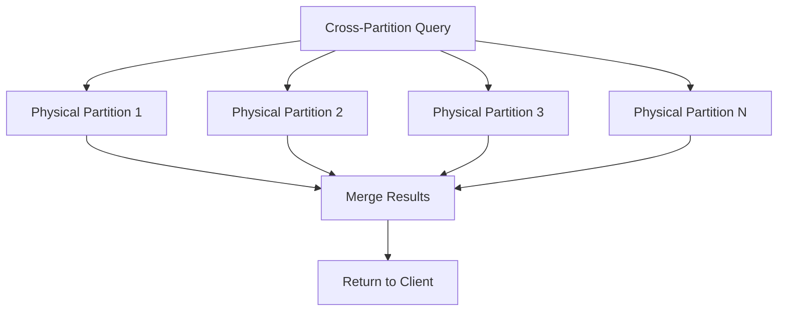

# How to Query Across Partitions Efficiently in Azure Cosmos DB

Author: [nawazdhandala](https://www.github.com/nawazdhandala)

Tags: Azure, Cosmos DB, Cross-Partition Queries, Query Optimization, Performance, NoSQL

Description: Strategies and techniques to minimize the cost and latency of cross-partition queries in Azure Cosmos DB when single-partition queries are not possible.

---

In Azure Cosmos DB, the most efficient queries are single-partition queries - those that include the partition key in the WHERE clause and target just one logical partition. But real applications often need to query across all partitions. Search features, administrative dashboards, analytics, and reporting all require cross-partition queries. These queries fan out to every physical partition, which multiplies both the RU cost and the latency. This guide covers how to make cross-partition queries as efficient as possible.

## Why Cross-Partition Queries Are Expensive

When you run a query without specifying a partition key, Cosmos DB sends the query to every physical partition in parallel. Each partition runs the query independently and returns its results. The gateway then merges and returns the combined results.



The costs multiply because:

- Each partition charges its own RU cost for executing the query
- The network overhead of coordinating across partitions adds latency
- ORDER BY, GROUP BY, and aggregation operations require additional processing at the merge step
- More physical partitions mean higher fan-out costs

A query that costs 5 RUs on a single partition might cost 50+ RUs across 10 partitions.

## Technique 1: Enable Cross-Partition Queries Explicitly

By default, the SDK will throw an error if you run a query without a partition key and have not explicitly enabled cross-partition queries. Enable it explicitly so you are intentional about it:

```csharp
// Explicitly enable cross-partition queries in the request options
var queryOptions = new QueryRequestOptions
{
    // This tells the SDK to fan out the query across all partitions
    // Without this, queries without a partition key will fail
    MaxConcurrency = -1  // -1 means maximum parallelism
};

var query = new QueryDefinition(
    "SELECT * FROM c WHERE c.status = 'active' AND c.category = 'electronics'"
);

// Execute with cross-partition options
FeedIterator<Product> iterator = container.GetItemQueryIterator<Product>(
    query, requestOptions: queryOptions);

double totalRUs = 0;
List<Product> allResults = new List<Product>();

while (iterator.HasMoreResults)
{
    FeedResponse<Product> page = await iterator.ReadNextAsync();
    totalRUs += page.RequestCharge;
    allResults.AddRange(page);
}

Console.WriteLine($"Found {allResults.Count} results, cost: {totalRUs} RUs");
```

## Technique 2: Maximize Parallelism

The MaxConcurrency setting controls how many partitions are queried in parallel. Higher concurrency reduces total latency but uses more client-side resources:

```csharp
// Tune parallelism based on your needs
var queryOptions = new QueryRequestOptions
{
    // Maximum number of partitions queried in parallel
    // -1 = no limit (fastest, uses most resources)
    // 1 = sequential (slowest, least resources)
    // N = specific number of parallel queries
    MaxConcurrency = -1,

    // Maximum buffer size for pre-fetching results
    // Higher values reduce latency but use more memory
    MaxBufferedItemCount = 100
};
```

## Technique 3: Use Projections to Reduce Transfer Size

Cross-partition queries transfer data from every partition. Minimize what each partition returns:

```csharp
// BAD: Selecting all fields transfers unnecessary data from every partition
var heavyQuery = new QueryDefinition("SELECT * FROM c WHERE c.category = 'electronics'");

// GOOD: Project only needed fields
var lightQuery = new QueryDefinition(
    "SELECT c.id, c.name, c.price, c.category FROM c WHERE c.category = 'electronics'"
);

// Compare RU costs
var heavyResult = await container.GetItemQueryIterator<dynamic>(heavyQuery, requestOptions: queryOptions).ReadNextAsync();
Console.WriteLine($"All fields: {heavyResult.RequestCharge} RUs, {heavyResult.Count} items");

var lightResult = await container.GetItemQueryIterator<dynamic>(lightQuery, requestOptions: queryOptions).ReadNextAsync();
Console.WriteLine($"Projected: {lightResult.RequestCharge} RUs, {lightResult.Count} items");
```

## Technique 4: Add Appropriate Filters

The more selective your WHERE clause, the fewer documents each partition needs to process and return. Make sure your filters are indexed:

```csharp
// BAD: No filter - every partition returns all documents
var noFilter = new QueryDefinition("SELECT * FROM c");

// BETTER: Filter narrows results per partition
var filtered = new QueryDefinition(
    "SELECT * FROM c WHERE c.createdAt > @since AND c.status = 'active'"
).WithParameter("@since", DateTime.UtcNow.AddDays(-7).ToString("O"));

// BEST: Highly selective filter
var selective = new QueryDefinition(
    "SELECT * FROM c WHERE c.createdAt > @since AND c.status = 'active' AND c.region = 'US'"
).WithParameter("@since", DateTime.UtcNow.AddDays(-1).ToString("O"));
```

## Technique 5: Use OFFSET LIMIT for Pagination

Avoid fetching all results when you only need a page:

```csharp
// Paginate cross-partition results efficiently
// Use OFFSET LIMIT when you need specific pages
int pageSize = 20;
int pageNumber = 3;

var pagedQuery = new QueryDefinition(
    "SELECT c.id, c.name, c.price FROM c " +
    "WHERE c.category = 'electronics' " +
    "ORDER BY c.price DESC " +
    "OFFSET @offset LIMIT @limit"
)
.WithParameter("@offset", (pageNumber - 1) * pageSize)
.WithParameter("@limit", pageSize);

var results = await container.GetItemQueryIterator<Product>(
    pagedQuery, requestOptions: queryOptions).ReadNextAsync();

Console.WriteLine($"Page {pageNumber}: {results.Count} items, {results.RequestCharge} RUs");
```

Note: OFFSET LIMIT still reads through all preceding results, so page 100 is more expensive than page 1. For better pagination, use continuation tokens:

```csharp
// Use continuation tokens for more efficient pagination
string continuationToken = null;

var query = new QueryDefinition(
    "SELECT c.id, c.name, c.price FROM c WHERE c.category = 'electronics'"
);

var options = new QueryRequestOptions
{
    MaxItemCount = 20,  // Items per page
    MaxConcurrency = -1
};

// First page
FeedIterator<Product> iterator = container.GetItemQueryIterator<Product>(
    query, continuationToken: null, requestOptions: options);

if (iterator.HasMoreResults)
{
    FeedResponse<Product> page = await iterator.ReadNextAsync();
    continuationToken = page.ContinuationToken;  // Save this for the next page

    foreach (Product item in page)
    {
        Console.WriteLine($"  {item.Name}: ${item.Price}");
    }
}

// Next page - uses the continuation token
iterator = container.GetItemQueryIterator<Product>(
    query, continuationToken: continuationToken, requestOptions: options);
```

## Technique 6: Denormalize for Common Cross-Partition Queries

If you have a cross-partition query that runs frequently, consider creating a separate container with a partition key that makes it a single-partition query:

```csharp
// Original container: partitioned by customerId
// Query: "SELECT * FROM c WHERE c.category = 'electronics'" - cross-partition!

// Solution: Create a second container partitioned by category
// Write to both containers when data changes

// Container 1: For customer-specific queries (partitioned by customerId)
await ordersContainer.CreateItemAsync(order, new PartitionKey(order.CustomerId));

// Container 2: For category-based queries (partitioned by category)
var categoryView = new
{
    id = order.Id,
    category = order.Category,
    name = order.Name,
    price = order.Price,
    customerId = order.CustomerId
};
await categoryContainer.CreateItemAsync(categoryView, new PartitionKey(order.Category));

// Now the category query is single-partition and much cheaper
var query = new QueryDefinition("SELECT * FROM c WHERE c.category = 'electronics'");
var results = await categoryContainer.GetItemQueryIterator<dynamic>(
    query,
    requestOptions: new QueryRequestOptions { PartitionKey = new PartitionKey("electronics") }
).ReadNextAsync();
```

The tradeoff is double the write cost and the complexity of keeping both containers in sync. Use the change feed to automate the synchronization.

## Technique 7: Use Hierarchical Partition Keys

If your cross-partition queries always include a higher-level grouping, hierarchical partition keys can help:

```csharp
// With hierarchical partition key: /tenantId/userId
// Querying all users for a tenant is NOT a cross-partition query
// because tenantId is the first level of the hierarchy

ContainerProperties props = new ContainerProperties(
    id: "users",
    partitionKeyPaths: new List<string> { "/tenantId", "/userId" }
);

// This query is efficiently scoped to one tenant's data
var tenantQuery = new QueryDefinition(
    "SELECT * FROM c WHERE c.tenantId = @tenantId AND c.status = 'active'"
).WithParameter("@tenantId", "tenant-42");
```

## Technique 8: Aggregate Server-Side

For aggregation queries (COUNT, SUM, AVG), let the server do the work rather than fetching all documents client-side:

```csharp
// Let the server aggregate instead of fetching all documents
// BAD: Fetch all docs and count client-side
var allDocs = new QueryDefinition("SELECT * FROM c WHERE c.category = 'electronics'");
// Then count in your code... transfers all document data unnecessarily

// GOOD: Server-side aggregation
var countQuery = new QueryDefinition(
    "SELECT VALUE COUNT(1) FROM c WHERE c.category = 'electronics'"
);
var countResult = await container.GetItemQueryIterator<int>(
    countQuery, requestOptions: queryOptions).ReadNextAsync();
Console.WriteLine($"Count: {countResult.First()}, Cost: {countResult.RequestCharge} RUs");

// Server-side aggregation with grouping
var groupQuery = new QueryDefinition(
    "SELECT c.category, COUNT(1) as count, AVG(c.price) as avgPrice " +
    "FROM c GROUP BY c.category"
);
```

## Monitoring Cross-Partition Query Costs

Track your cross-partition query impact:

```csharp
// Log detailed query metrics to identify expensive cross-partition queries
var options = new QueryRequestOptions
{
    MaxConcurrency = -1,
    PopulateIndexMetrics = true  // Get index utilization info
};

var iterator = container.GetItemQueryIterator<dynamic>(query, requestOptions: options);
while (iterator.HasMoreResults)
{
    FeedResponse<dynamic> page = await iterator.ReadNextAsync();
    Console.WriteLine($"RU charge: {page.RequestCharge}");
    Console.WriteLine($"Item count: {page.Count}");

    // Check if index metrics are available
    if (page.Headers.TryGetValue("x-ms-cosmos-index-utilization", out string indexMetrics))
    {
        Console.WriteLine($"Index utilization: {indexMetrics}");
    }
}
```

Cross-partition queries are sometimes unavoidable, but they should never be your primary access pattern. Design your partition key to support your most frequent queries as single-partition operations, and use the techniques above to make the occasional cross-partition query as lean as possible. When a cross-partition query runs too frequently or costs too much, consider it a signal to denormalize your data model or adjust your partition key strategy.
