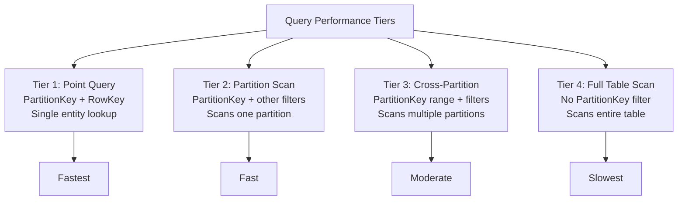

# How to Query Azure Table Storage Using OData Filters

Author: [nawazdhandala](https://www.github.com/nawazdhandala)

Tags: Azure, Table Storage, OData, Query Filters, NoSQL, Data Retrieval, Cloud Development

Description: Master OData filter expressions to query Azure Table Storage efficiently with examples covering comparison, logical, and type-specific operators.

---

Azure Table Storage uses OData filter expressions for querying data. If you have worked with SQL databases, the OData syntax will feel familiar but with some important differences. In this post, I will cover the full range of OData filter operations you can use with Table Storage, from basic equality checks to complex compound queries.

## OData Filter Basics

An OData filter is a string expression that evaluates to true or false for each entity. Only entities where the expression evaluates to true are returned. The filter is passed as a parameter when querying entities.

```python
from azure.data.tables import TableClient
import os

connection_string = os.environ["AZURE_STORAGE_CONNECTION_STRING"]
table_client = TableClient.from_connection_string(connection_string, "Orders")

# Basic equality filter
# Returns only entities where Status equals "shipped"
results = table_client.query_entities(
    query_filter="Status eq 'shipped'"
)

for entity in results:
    print(f"Order {entity['RowKey']}: {entity['Status']}")
```

## Comparison Operators

OData supports six comparison operators.

`eq` (equal), `ne` (not equal), `gt` (greater than), `ge` (greater than or equal), `lt` (less than), `le` (less than or equal).

```python
# Find orders with amount greater than 100
expensive_orders = table_client.query_entities(
    query_filter="Amount gt 100"
)

# Find orders not yet shipped
pending_orders = table_client.query_entities(
    query_filter="Status ne 'shipped'"
)

# Find orders placed on or after a specific date
# Date values use the datetime format with the datetime prefix
recent_orders = table_client.query_entities(
    query_filter="OrderDate ge datetime'2026-01-01T00:00:00Z'"
)

# Find orders with quantity less than or equal to 5
small_orders = table_client.query_entities(
    query_filter="Quantity le 5"
)
```

## Logical Operators

You can combine conditions using `and`, `or`, and `not`.

```python
# Combine conditions with 'and'
# Both conditions must be true for an entity to be returned
results = table_client.query_entities(
    query_filter="PartitionKey eq 'US-West' and Status eq 'pending' and Amount gt 50"
)

# Use 'or' for alternative conditions
results = table_client.query_entities(
    query_filter="Status eq 'shipped' or Status eq 'delivered'"
)

# Use 'not' to negate a condition
results = table_client.query_entities(
    query_filter="not (Status eq 'cancelled')"
)

# Complex compound query with parentheses for grouping
results = table_client.query_entities(
    query_filter=(
        "PartitionKey eq 'US-West' "
        "and (Status eq 'pending' or Status eq 'processing') "
        "and Amount gt 100"
    )
)
```

## Querying by Data Type

Different property types require different syntax in the filter string.

### String Properties

String values are enclosed in single quotes.

```python
# String equality
results = table_client.query_entities(
    query_filter="CustomerName eq 'John Smith'"
)

# Strings with single quotes need to be escaped by doubling them
results = table_client.query_entities(
    query_filter="CustomerName eq 'O''Brien'"
)
```

### Numeric Properties

Integer and float values are written without quotes.

```python
# Integer comparison
results = table_client.query_entities(
    query_filter="Quantity eq 10"
)

# Float comparison
results = table_client.query_entities(
    query_filter="Price gt 29.99"
)

# Long integers need the L suffix
results = table_client.query_entities(
    query_filter="BigNumber gt 2147483647L"
)
```

### Boolean Properties

Boolean values are `true` or `false` (lowercase).

```python
# Boolean filter
results = table_client.query_entities(
    query_filter="IsActive eq true"
)

results = table_client.query_entities(
    query_filter="IsDeleted eq false and IsPremium eq true"
)
```

### DateTime Properties

DateTime values use the `datetime` prefix with ISO 8601 format.

```python
# Query for entities modified after a specific date and time
results = table_client.query_entities(
    query_filter="Timestamp gt datetime'2026-02-01T00:00:00Z'"
)

# Date range query
results = table_client.query_entities(
    query_filter=(
        "OrderDate ge datetime'2026-01-01T00:00:00Z' "
        "and OrderDate lt datetime'2026-02-01T00:00:00Z'"
    )
)
```

### GUID Properties

GUID values use the `guid` prefix.

```python
# Query by GUID property
results = table_client.query_entities(
    query_filter="TransactionId eq guid'550e8400-e29b-41d4-a716-446655440000'"
)
```

## Building Filters Dynamically in Python

Constructing filter strings by hand is error-prone. Here is a helper approach.

```python
def build_filter(conditions):
    """
    Build an OData filter string from a list of condition dictionaries.
    Each condition has: field, operator, value, and optionally value_type.
    """
    parts = []
    for cond in conditions:
        field = cond["field"]
        op = cond["operator"]
        value = cond["value"]
        value_type = cond.get("value_type", "string")

        # Format the value based on its type
        if value_type == "string":
            formatted = f"'{value}'"
        elif value_type == "number":
            formatted = str(value)
        elif value_type == "boolean":
            formatted = "true" if value else "false"
        elif value_type == "datetime":
            formatted = f"datetime'{value}'"
        elif value_type == "guid":
            formatted = f"guid'{value}'"
        else:
            formatted = f"'{value}'"

        parts.append(f"{field} {op} {formatted}")

    return " and ".join(parts)

# Build a filter dynamically
filter_str = build_filter([
    {"field": "PartitionKey", "operator": "eq", "value": "US-West"},
    {"field": "Amount", "operator": "gt", "value": 100, "value_type": "number"},
    {"field": "IsActive", "operator": "eq", "value": True, "value_type": "boolean"},
])

# Result: "PartitionKey eq 'US-West' and Amount gt 100 and IsActive eq true"
results = table_client.query_entities(query_filter=filter_str)
```

## Using OData Filters in .NET

The .NET SDK supports both raw filter strings and LINQ-style expressions.

```csharp
using Azure.Data.Tables;

var tableClient = new TableClient(connectionString, "Orders");

// Raw OData filter string
var results = tableClient.QueryAsync<TableEntity>(
    filter: "PartitionKey eq 'US-West' and Amount gt 100"
);

await foreach (var entity in results)
{
    Console.WriteLine($"Order: {entity.RowKey}, Amount: {entity["Amount"]}");
}

// Using the TableClient filter builder for type safety
string filter = TableClient.CreateQueryFilter(
    $"PartitionKey eq {'US-West'} and Status eq {'pending'}"
);

var typeSafeResults = tableClient.QueryAsync<TableEntity>(filter: filter);
```

## Using OData Filters with the REST API

If you call the REST API directly, the filter goes in the `$filter` query parameter.

```bash
# Query entities with a filter via REST API
curl -X GET \
  "https://myaccount.table.core.windows.net/Orders()?%24filter=PartitionKey%20eq%20'US-West'%20and%20Amount%20gt%20100" \
  -H "x-ms-version: 2024-11-04" \
  -H "Accept: application/json;odata=nometadata"
```

Note that the `$` in `$filter` must be URL-encoded as `%24`.

## Query Performance by Filter Type

Not all filters perform equally. Here is the performance hierarchy.



Always include the PartitionKey in your filter when possible. Without it, Azure must scan every partition in the table.

## Limitations

OData filters in Azure Table Storage do not support `startswith`, `endswith`, `contains`, or any string functions. You cannot do pattern matching or LIKE queries.

There is no `in` operator. To check if a field matches one of several values, you must chain `or` conditions.

```python
# No 'in' operator, so use 'or' chains
results = table_client.query_entities(
    query_filter=(
        "Status eq 'pending' or Status eq 'processing' or Status eq 'review'"
    )
)
```

Property names are case-sensitive. If your property is "CustomerName," filtering on "customername" will not match anything.

## Combining Filters with Select and Top

For maximum efficiency, combine your filter with the select parameter to return only the properties you need.

```python
# Efficient query: filter, select, and limit
results = table_client.query_entities(
    query_filter="PartitionKey eq 'US-West' and Amount gt 100",
    select=["RowKey", "CustomerName", "Amount", "Status"],
    results_per_page=50
)

for entity in results:
    print(f"{entity['CustomerName']}: ${entity['Amount']}")
```

OData filters are the primary way to query Azure Table Storage. They are not as flexible as SQL, but for key-value lookups and partition-scoped queries, they get the job done efficiently. Structure your queries to always include the PartitionKey, keep your filter expressions simple, and use the select parameter to minimize data transfer.
