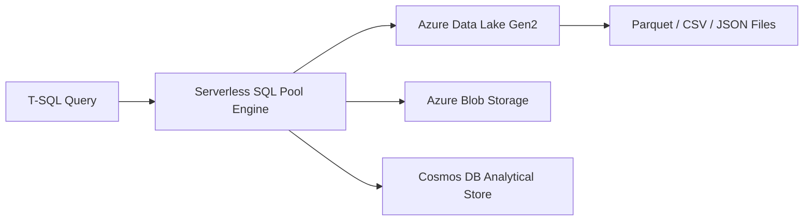

# How to Query External Data with Serverless SQL Pool in Azure Synapse Analytics

Author: [nawazdhandala](https://www.github.com/nawazdhandala)

Tags: Azure, Synapse Analytics, Serverless SQL Pool, External Data, Data Lake, T-SQL, OPENROWSET

Description: Learn how to use Azure Synapse serverless SQL pool to query data stored in Azure Data Lake without loading it into a database first.

---

Azure Synapse serverless SQL pool lets you run T-SQL queries directly against files in Azure Data Lake Storage without loading the data into a database first. There is no infrastructure to provision, no data to import, and you only pay for the data your queries process. It is ideal for ad-hoc exploration, data discovery, and creating logical data warehouse layers over your data lake.

## How Serverless SQL Pool Works

When you submit a query to the serverless SQL pool, the engine reads files from Azure Storage (Data Lake Gen2, Blob Storage, or Cosmos DB analytical store), processes them in a distributed manner, and returns the results. You never create or manage compute resources - Azure handles all of that behind the scenes.

The entry point for querying external data is either the `OPENROWSET` function or external tables. Both let you define the file location, format, and schema, and then query the data using standard T-SQL.



## Prerequisites

- An Azure Synapse workspace
- An Azure Data Lake Storage Gen2 account with data files (Parquet, CSV, or JSON)
- Appropriate permissions (Storage Blob Data Reader on the storage account)

## Step 1: Access the Serverless SQL Pool

The serverless SQL pool is automatically available in every Synapse workspace. You do not need to create it - it is called "Built-in" in the Synapse Studio.

Connect using the serverless SQL endpoint:
- **Server**: `my-synapse-workspace-ondemand.sql.azuresynapse.net`
- **Database**: `master` (or a user-created database)
- **Authentication**: SQL auth or Azure AD

```bash
# Connect using sqlcmd to the serverless endpoint
sqlcmd -S my-synapse-workspace-ondemand.sql.azuresynapse.net \
  -d master \
  -U sqladmin \
  -P '<password>' -N
```

## Step 2: Query Files with OPENROWSET

The quickest way to query external data is with the `OPENROWSET` function.

### Querying Parquet Files

Parquet files are self-describing - they contain schema information - so you do not need to specify column definitions.

```sql
-- Query a single Parquet file
-- Parquet files include schema, so no column mapping needed
SELECT TOP 100 *
FROM OPENROWSET(
    BULK 'https://synapsedatalake2026.dfs.core.windows.net/data/sales/year=2025/*.parquet',
    FORMAT = 'PARQUET'
) AS sales_data;

-- Query with filtering and aggregation
SELECT
    ProductCategory,
    COUNT(*) AS OrderCount,
    SUM(TotalAmount) AS Revenue,
    AVG(TotalAmount) AS AvgOrderValue
FROM OPENROWSET(
    BULK 'https://synapsedatalake2026.dfs.core.windows.net/data/sales/**/*.parquet',
    FORMAT = 'PARQUET'
) AS sales
WHERE OrderDate >= '2025-01-01' AND OrderDate < '2026-01-01'
GROUP BY ProductCategory
ORDER BY Revenue DESC;
```

The `**` wildcard pattern recursively matches files in subdirectories. The `*` pattern matches files in a single directory.

### Querying CSV Files

CSV files do not contain schema information, so you need to tell the engine about the columns.

```sql
-- Query a CSV file with explicit schema definition
SELECT *
FROM OPENROWSET(
    BULK 'https://synapsedatalake2026.dfs.core.windows.net/data/customers/customers.csv',
    FORMAT = 'CSV',
    PARSER_VERSION = '2.0',
    HEADER_ROW = TRUE,           -- First row contains column names
    FIELDTERMINATOR = ',',
    ROWTERMINATOR = '\n'
) WITH (
    CustomerId INT,               -- Column 1
    CustomerName VARCHAR(200),    -- Column 2
    Email VARCHAR(200),           -- Column 3
    City VARCHAR(100),            -- Column 4
    Country VARCHAR(100)          -- Column 5
) AS customers;
```

### Querying JSON Files

```sql
-- Query JSON files (each line is a JSON object)
SELECT
    JSON_VALUE(doc, '$.orderId') AS OrderId,
    JSON_VALUE(doc, '$.customer.name') AS CustomerName,
    CAST(JSON_VALUE(doc, '$.total') AS DECIMAL(10,2)) AS Total,
    JSON_VALUE(doc, '$.status') AS Status
FROM OPENROWSET(
    BULK 'https://synapsedatalake2026.dfs.core.windows.net/data/orders/*.json',
    FORMAT = 'CSV',
    FIELDQUOTE = '0x0b',         -- Trick to read entire lines as single field
    FIELDTERMINATOR = '0x0b',
    ROWTERMINATOR = '0x0a'
) WITH (doc NVARCHAR(MAX)) AS orders;
```

## Step 3: Handle Authentication

The serverless SQL pool needs permission to read files from storage. There are several authentication methods:

### Managed Identity (Recommended)

```sql
-- Use the workspace managed identity to access storage
-- The managed identity must have Storage Blob Data Reader role
SELECT *
FROM OPENROWSET(
    BULK 'https://synapsedatalake2026.dfs.core.windows.net/data/sales/*.parquet',
    FORMAT = 'PARQUET'
) AS sales;
```

Grant the Synapse workspace managed identity access to storage:

```bash
# Get the workspace managed identity principal ID
IDENTITY_ID=$(az synapse workspace show \
  --name my-synapse-workspace \
  --resource-group rg-synapse \
  --query "identity.principalId" -o tsv)

# Get the storage account resource ID
STORAGE_ID=$(az storage account show \
  --name synapsedatalake2026 \
  --resource-group rg-synapse \
  --query id -o tsv)

# Assign Storage Blob Data Reader role
az role assignment create \
  --role "Storage Blob Data Reader" \
  --assignee $IDENTITY_ID \
  --scope $STORAGE_ID
```

### SAS Token

```sql
-- Create a database-scoped credential with a SAS token
CREATE DATABASE SCOPED CREDENTIAL SalesDataCredential
WITH IDENTITY = 'SHARED ACCESS SIGNATURE',
SECRET = 'sv=2021-06-08&ss=b&srt=co&sp=rl&se=2026-12-31&sig=...';

-- Create an external data source using the credential
CREATE EXTERNAL DATA SOURCE SalesDataLake
WITH (
    LOCATION = 'https://synapsedatalake2026.dfs.core.windows.net/data',
    CREDENTIAL = SalesDataCredential
);

-- Query using the data source
SELECT TOP 100 *
FROM OPENROWSET(
    BULK 'sales/*.parquet',
    DATA_SOURCE = 'SalesDataLake',
    FORMAT = 'PARQUET'
) AS sales;
```

## Step 4: Create External Tables

For frequently queried datasets, create external tables so users can query them like regular tables without knowing the file paths.

```sql
-- Create a database for your logical data warehouse
CREATE DATABASE SalesAnalytics;
GO

USE SalesAnalytics;
GO

-- Create a master key (required for credentials)
CREATE MASTER KEY ENCRYPTION BY PASSWORD = '<StrongPassword123!>';

-- Create the external data source
CREATE EXTERNAL DATA SOURCE DataLake
WITH (
    LOCATION = 'https://synapsedatalake2026.dfs.core.windows.net/data'
);

-- Create an external file format for Parquet
CREATE EXTERNAL FILE FORMAT ParquetFormat
WITH (
    FORMAT_TYPE = PARQUET
);

-- Create an external table that maps to Parquet files
CREATE EXTERNAL TABLE dbo.Sales (
    OrderId BIGINT,
    ProductId INT,
    CustomerId INT,
    OrderDate DATE,
    Quantity INT,
    UnitPrice DECIMAL(10, 2),
    TotalAmount DECIMAL(12, 2),
    ProductCategory VARCHAR(100)
)
WITH (
    LOCATION = 'sales/**/*.parquet',
    DATA_SOURCE = DataLake,
    FILE_FORMAT = ParquetFormat
);

-- Now query it like a regular table
SELECT
    ProductCategory,
    SUM(TotalAmount) AS Revenue
FROM dbo.Sales
WHERE OrderDate >= '2025-01-01'
GROUP BY ProductCategory
ORDER BY Revenue DESC;
```

## Step 5: Create Views for a Logical Data Warehouse

Build a logical data warehouse layer by creating views over your external data. This is where serverless SQL pool really shines - you create a semantic layer without any data movement.

```sql
-- Create a view that joins sales data with customer data
CREATE VIEW dbo.vw_SalesByRegion AS
SELECT
    s.OrderDate,
    s.ProductCategory,
    c.Country,
    c.City,
    SUM(s.TotalAmount) AS Revenue,
    COUNT(*) AS OrderCount
FROM OPENROWSET(
    BULK 'sales/**/*.parquet',
    DATA_SOURCE = 'DataLake',
    FORMAT = 'PARQUET'
) AS s
JOIN OPENROWSET(
    BULK 'dimensions/customers.parquet',
    DATA_SOURCE = 'DataLake',
    FORMAT = 'PARQUET'
) AS c ON s.CustomerId = c.CustomerId
GROUP BY s.OrderDate, s.ProductCategory, c.Country, c.City;

-- Users can query the view without knowing about the underlying files
SELECT Country, SUM(Revenue) AS TotalRevenue
FROM dbo.vw_SalesByRegion
WHERE OrderDate >= '2025-01-01'
GROUP BY Country
ORDER BY TotalRevenue DESC;
```

## Step 6: Optimize for Cost

Serverless SQL pool charges based on data processed. Here are ways to minimize cost:

**Use Parquet format**: Parquet is columnar and compressed. When you SELECT specific columns, the engine only reads those columns from the file. A query that selects 3 out of 50 columns might process 90% less data than with CSV.

**Partition your data**: Organize files into partition folders (e.g., `/year=2025/month=01/`) and filter on partition columns. The engine skips entire folders that do not match your filter.

```sql
-- Query with partition pruning
-- The engine only reads files in the year=2025 folder
SELECT *
FROM OPENROWSET(
    BULK 'sales/year=2025/month=*/day=*/*.parquet',
    DATA_SOURCE = 'DataLake',
    FORMAT = 'PARQUET'
) AS sales;
```

**Select only needed columns**: Never use `SELECT *` in production queries. Specify the columns you need.

**Use CETAS for repeated queries**: If you query the same data repeatedly, use CREATE EXTERNAL TABLE AS SELECT (CETAS) to materialize results as Parquet files.

```sql
-- Materialize a query result as Parquet files for faster repeated access
CREATE EXTERNAL TABLE dbo.MonthlySalesSummary
WITH (
    LOCATION = 'summaries/monthly_sales/',
    DATA_SOURCE = DataLake,
    FILE_FORMAT = ParquetFormat
)
AS
SELECT
    YEAR(OrderDate) AS SalesYear,
    MONTH(OrderDate) AS SalesMonth,
    ProductCategory,
    SUM(TotalAmount) AS Revenue,
    COUNT(*) AS OrderCount
FROM dbo.Sales
GROUP BY YEAR(OrderDate), MONTH(OrderDate), ProductCategory;
```

## Wrapping Up

Serverless SQL pool in Azure Synapse Analytics is a powerful tool for querying data lake files without any upfront provisioning. Use `OPENROWSET` for ad-hoc queries, external tables for stable datasets, and views to build a logical data warehouse layer. The combination of Parquet format, proper partitioning, and selective column queries keeps costs low while giving you the full power of T-SQL against your data lake. It bridges the gap between raw data files and structured analytics without requiring a traditional ETL pipeline.
