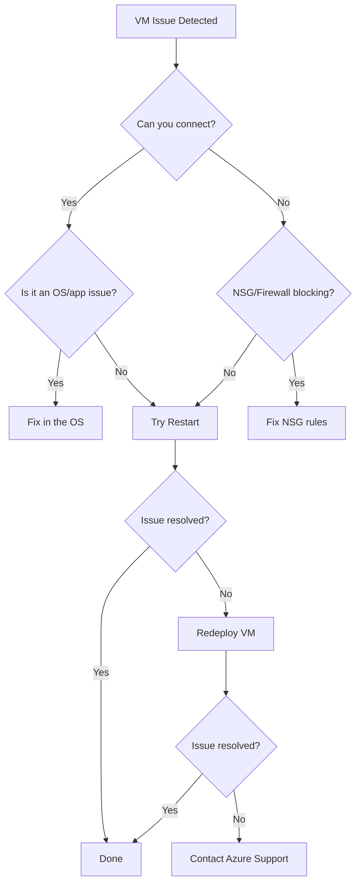

# How to Redeploy an Azure Virtual Machine to a New Host Node

Author: [nawazdhandala](https://www.github.com/nawazdhandala)

Tags: Azure, Virtual Machines, Redeployment, Troubleshooting, Host Node, Cloud Operations

Description: Learn when and how to redeploy an Azure VM to a new physical host node to resolve connectivity and performance issues.

---

Sometimes an Azure VM develops problems that have nothing to do with your software or configuration. Intermittent network connectivity issues, unexpected performance degradation, or strange hardware-related errors can point to a problem with the underlying physical host. When that happens, redeploying the VM to a new host node is often the quickest fix.

Redeployment moves your VM to a different physical server within the same Azure datacenter. Your data stays intact, your configuration does not change, and the VM gets a fresh start on new hardware. It is essentially the cloud equivalent of moving a server to a different rack.

## When to Redeploy

Redeployment is not your first troubleshooting step. It is something you reach for after ruling out OS-level and application-level issues. Here are the scenarios where redeployment makes sense:

**Persistent RDP or SSH failures**: If you cannot connect to the VM and have verified that NSG rules, the OS firewall, and the VM agent are all fine, the issue might be at the host level.

**Intermittent network packet loss**: When the VM experiences packet loss that is not explained by bandwidth limits or application behavior, the host's network stack might be having issues.

**Unexplained performance drops**: If CPU steal time is high on Linux (visible in top/htop) or the VM is slower than expected for its size, the physical host might be overloaded or degraded.

**After Azure Service Health notifications**: Sometimes Azure notifies you of host-level issues. Redeployment lets you proactively move off the affected host.

## What Happens During Redeployment

Understanding the process helps you plan for the impact:

1. Azure shuts down the VM (a clean shutdown, not a power-off).
2. The VM is moved to a new physical host within the same Azure datacenter.
3. The VM is powered back on.
4. The OS disk, data disks, and network configuration all carry over.

There are some important side effects:

- The VM will get a new dynamic public IP address (if using dynamic allocation). Static IPs are preserved.
- Temporary disk data (the D: drive on Windows, /dev/sdb on Linux) is lost. This is the local SSD attached to the physical host, not your managed disks.
- The VM will be unavailable during the redeployment, typically for 5 to 15 minutes.
- Any in-memory data that was not persisted to disk will be lost.

## Redeploying Through the Azure Portal

The simplest way to redeploy is through the portal:

1. Navigate to your VM in the Azure portal.
2. In the left menu, scroll down to the "Help" section.
3. Click "Redeploy + reapply".
4. Click the "Redeploy" button.
5. Wait for the operation to complete.

The portal will show the progress and notify you when the VM is back online.

## Redeploying with Azure CLI

For scripting and automation, use the CLI:

```bash
# Redeploy a VM to a new host node
az vm redeploy \
  --resource-group myResourceGroup \
  --name myVM
```

That is it. One command. The CLI will wait for the operation to complete and return the result.

If you want to script a redeploy with pre and post checks:

```bash
#!/bin/bash
# Script to redeploy a VM with health checks

RESOURCE_GROUP="myResourceGroup"
VM_NAME="myVM"

# Record current state
echo "Recording current VM state..."
az vm get-instance-view \
  --resource-group $RESOURCE_GROUP \
  --name $VM_NAME \
  --query "{Status:instanceView.statuses[1].displayStatus, Host:instanceView.platformFaultDomain}" \
  -o table

# Perform the redeployment
echo "Starting redeployment..."
az vm redeploy \
  --resource-group $RESOURCE_GROUP \
  --name $VM_NAME

# Check the result
echo "Redeployment complete. New state:"
az vm get-instance-view \
  --resource-group $RESOURCE_GROUP \
  --name $VM_NAME \
  --query "{Status:instanceView.statuses[1].displayStatus, Host:instanceView.platformFaultDomain}" \
  -o table

# Verify connectivity (wait for VM to fully boot)
echo "Waiting 60 seconds for VM to fully boot..."
sleep 60

PUBLIC_IP=$(az vm show --resource-group $RESOURCE_GROUP --name $VM_NAME \
  --show-details --query publicIps -o tsv)

echo "Testing SSH connectivity..."
ssh -o ConnectTimeout=10 -o StrictHostKeyChecking=no azureuser@$PUBLIC_IP "echo 'VM is reachable'"
```

## Redeploying with PowerShell

If you prefer PowerShell:

```powershell
# Redeploy using Azure PowerShell
Set-AzVM -ResourceGroupName "myResourceGroup" -Name "myVM" -Redeploy

# With error handling
try {
    Set-AzVM -ResourceGroupName "myResourceGroup" -Name "myVM" -Redeploy
    Write-Host "VM redeployed successfully"
} catch {
    Write-Error "Redeployment failed: $_"
}
```

## Redeploying with ARM Templates

You can also trigger a redeploy through a REST API call, which is useful for integration with custom automation:

```bash
# Trigger redeploy via REST API
az rest --method post \
  --uri "https://management.azure.com/subscriptions/{sub-id}/resourceGroups/myResourceGroup/providers/Microsoft.Compute/virtualMachines/myVM/redeploy?api-version=2023-07-01"
```

## Verifying the Redeploy Worked

After redeployment, you want to confirm the VM is actually on a different host. While Azure does not expose the exact host identifier, you can check the platform fault domain, which indicates the physical fault domain assignment:

```bash
# Check the fault domain after redeployment
az vm get-instance-view \
  --resource-group myResourceGroup \
  --name myVM \
  --query "instanceView.platformFaultDomain" -o tsv
```

If the fault domain changed, the VM is definitely on a different physical host. Even if it shows the same fault domain number, the VM has still been moved to a new host within that fault domain.

You should also verify that the original problem is resolved. If you were seeing packet loss, run your network tests again. If SSH was failing, confirm you can connect. If performance was degraded, run your benchmarks.

## Dealing with Temporary Disk Data Loss

The temporary disk is the one thing you absolutely need to plan for. It gets wiped during redeployment because the new physical host has its own local SSD.

Common things stored on the temp disk that you might need to recreate:

- Page file or swap space (Windows recreates the page file automatically, Linux may need swap reconfigured)
- Application cache files
- Temp directories used by apps like SQL Server tempdb

If your application uses the temp disk, make sure you have scripts or configuration that recreates the expected directory structure and data on boot. A systemd service or a startup script works well for this.

```bash
# Example systemd service to recreate temp disk structure on boot
# /etc/systemd/system/setup-tempdisk.service

[Unit]
Description=Set up temporary disk directories
After=local-fs.target

[Service]
Type=oneshot
ExecStart=/bin/bash -c 'mkdir -p /mnt/resource/cache /mnt/resource/tmp && chmod 1777 /mnt/resource/tmp'

[Install]
WantedBy=multi-user.target
```

## Redeployment vs. Other Recovery Options

Redeployment is one of several recovery tools. Here is how they compare:

**Restart**: Just reboots the VM on the same host. Useful for OS-level hangs but will not help with host-level issues.

**Redeploy**: Moves the VM to a new host. Fixes host-level issues but causes downtime and loses temp disk data.

**Reapply**: Re-applies the VM's configuration without moving it. Good for fixing misconfigurations in the Azure fabric layer.

**Stop/Start (Deallocate)**: Deallocating and starting achieves a similar effect to redeployment - the VM gets placed on potentially new hardware. The difference is that deallocation releases the compute resources (and you stop paying for compute), while redeployment explicitly requests a new host.

Here is a decision flow:



## Automating Redeployment with Monitoring

For critical VMs, you can set up automated redeployment when certain conditions are met. For instance, if a health probe fails for an extended period and basic remediation (restart) does not help, trigger a redeploy.

```bash
# Example Azure Function or Logic App trigger pseudocode:
# 1. Health check fails for 10+ minutes
# 2. Attempt VM restart
# 3. Wait 5 minutes
# 4. If still unhealthy, trigger redeploy

# The actual redeploy command in an automation runbook
az vm redeploy \
  --resource-group myResourceGroup \
  --name myVM \
  --no-wait
```

Pairing this with OneUptime monitoring gives you visibility into when redeployments happen and whether they resolve the issue. You can track redeployment frequency per VM - if a VM is being redeployed frequently, that might indicate a deeper problem with the VM size, region, or configuration.

## Impact on Availability Sets and Zones

If your VM is part of an availability set, redeployment moves it to a new host within the same availability set. The fault domain may change, but the VM stays within the availability set's constraints.

For VMs in an availability zone, redeployment keeps the VM in the same zone. It will be placed on a new host within that zone.

## Wrapping Up

Redeploying an Azure VM is a straightforward operation with real impact. It is your go-to tool when host-level issues are causing problems that restart cannot fix. Plan for the temporary disk data loss, make sure you have static IPs if you need stable addressing, and verify the original problem is resolved after the redeploy. Keep it in your troubleshooting toolkit right between "try a restart" and "call Azure Support."
