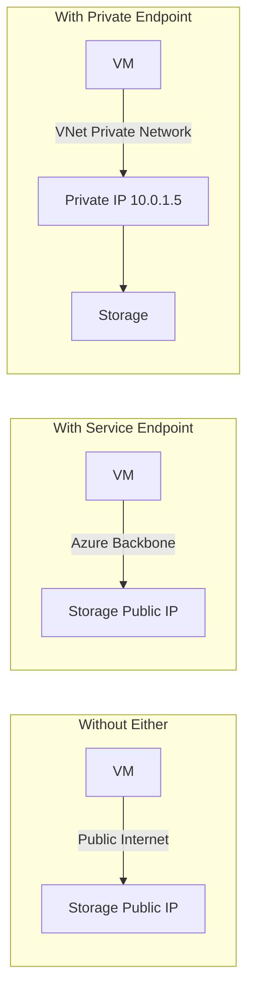
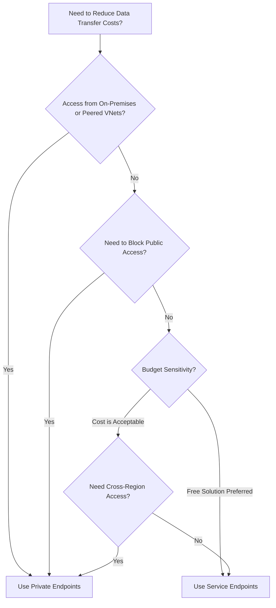

# How to Reduce Azure Data Transfer Costs with Private Endpoints and Service Endpoints

Author: [nawazdhandala](https://www.github.com/nawazdhandala)

Tags: Azure, Private Endpoints, Service Endpoints, Data Transfer, Cost Optimization, Networking, Security

Description: Learn how to reduce Azure data transfer costs and improve security by using Private Endpoints and Service Endpoints for Azure PaaS services.

---

Data transfer costs on Azure can be surprisingly expensive, especially when traffic between your VMs and Azure PaaS services (like Storage, SQL Database, or Key Vault) takes an indirect path through the public internet. By using Private Endpoints and Service Endpoints, you can route this traffic over the Azure backbone network instead, which is both cheaper and more secure.

In this post, I will explain the difference between these two approaches, when to use each one, and how to set them up to reduce your data transfer bill.

## Understanding Azure Data Transfer Pricing

Azure data transfer pricing has a few key rules:

- **Inbound data** (into Azure from the internet): Free
- **Outbound data** (from Azure to the internet): $0.087/GB for the first 10 TB/month
- **Data transfer between Azure regions**: $0.02-$0.08/GB depending on the regions
- **Data transfer within the same region**: Free (mostly)

The "mostly" in that last point is important. When your VM connects to an Azure PaaS service (like Azure Storage) using the service's public endpoint, the traffic technically goes out to the internet and back in. Even though both resources are in the same region, you might be charged for outbound data transfer.

## Service Endpoints vs. Private Endpoints

Both solutions keep traffic on the Azure backbone, but they work differently:

### Service Endpoints

- Free to use
- Routes traffic from your VNet to the Azure service over the Azure backbone
- The PaaS service still has a public IP, but your traffic does not leave Azure's network
- Configured at the subnet level
- Does not provide a private IP for the service

### Private Endpoints

- Cost: ~$7.30/month per endpoint plus $0.01/GB for processed data
- Creates a private IP address in your VNet for the PaaS service
- Traffic goes entirely through your VNet using the private IP
- Works across regions and VNet peering
- Blocks public access if desired (more secure)



## When to Use Service Endpoints

Service Endpoints are the right choice when:

- You want to reduce data transfer costs with zero additional monthly cost
- You do not need to access the PaaS service from on-premises or peered VNets
- You do not need to block public internet access to the PaaS service
- You want a quick, simple setup

```bash
# Enable a Service Endpoint for Azure Storage on a subnet
az network vnet subnet update \
  --resource-group myResourceGroup \
  --vnet-name myVNet \
  --name mySubnet \
  --service-endpoints Microsoft.Storage

# Verify the service endpoint is enabled
az network vnet subnet show \
  --resource-group myResourceGroup \
  --vnet-name myVNet \
  --name mySubnet \
  --query "serviceEndpoints" \
  --output table
```

After enabling the Service Endpoint, configure the Storage account to accept traffic from the VNet:

```bash
# Add a network rule to the storage account to allow traffic from the subnet
az storage account network-rule add \
  --resource-group myResourceGroup \
  --account-name mystorageaccount \
  --vnet-name myVNet \
  --subnet mySubnet

# Set the default action to Deny (only allow traffic from approved VNets)
az storage account update \
  --resource-group myResourceGroup \
  --name mystorageaccount \
  --default-action Deny
```

You can enable Service Endpoints for multiple services on the same subnet:

```bash
# Enable Service Endpoints for Storage, SQL, and Key Vault
az network vnet subnet update \
  --resource-group myResourceGroup \
  --vnet-name myVNet \
  --name mySubnet \
  --service-endpoints Microsoft.Storage Microsoft.Sql Microsoft.KeyVault
```

## When to Use Private Endpoints

Private Endpoints are the right choice when:

- You need to access the PaaS service from on-premises via VPN or ExpressRoute
- You need to access the service from peered VNets
- You want to completely disable public internet access to the service
- You need DNS-based routing to the service via private IP
- Compliance requirements mandate that data never touches the public internet

```bash
# Create a Private Endpoint for Azure Storage
# First, disable private endpoint network policies on the subnet
az network vnet subnet update \
  --resource-group myResourceGroup \
  --vnet-name myVNet \
  --name myPrivateEndpointSubnet \
  --disable-private-endpoint-network-policies true

# Create the Private Endpoint
az network private-endpoint create \
  --resource-group myResourceGroup \
  --name myStoragePrivateEndpoint \
  --vnet-name myVNet \
  --subnet myPrivateEndpointSubnet \
  --private-connection-resource-id "/subscriptions/<sub-id>/resourceGroups/myRG/providers/Microsoft.Storage/storageAccounts/mystorageaccount" \
  --group-id blob \
  --connection-name myStorageConnection
```

After creating the Private Endpoint, set up DNS so the storage hostname resolves to the private IP:

```bash
# Create a Private DNS Zone for blob storage
az network private-dns zone create \
  --resource-group myResourceGroup \
  --name "privatelink.blob.core.windows.net"

# Link the DNS zone to your VNet
az network private-dns link vnet create \
  --resource-group myResourceGroup \
  --zone-name "privatelink.blob.core.windows.net" \
  --name myVNetDNSLink \
  --virtual-network myVNet \
  --registration-enabled false

# Create a DNS zone group to auto-register DNS records
az network private-endpoint dns-zone-group create \
  --resource-group myResourceGroup \
  --endpoint-name myStoragePrivateEndpoint \
  --name myZoneGroup \
  --private-dns-zone "privatelink.blob.core.windows.net" \
  --zone-name "blob"
```

Now, when your VM resolves `mystorageaccount.blob.core.windows.net`, it gets the private IP (like 10.0.2.5) instead of the public IP.

## Calculating Cost Savings

Let me walk through a real scenario. Suppose your application transfers 5 TB of data per month to Azure Storage in the same region.

**Without Service/Private Endpoints** (traffic goes via public path):
- Potential outbound data charges: 5,120 GB * $0.087/GB = $445/month

**With Service Endpoints** (free):
- Data transfer: $0 (traffic stays on Azure backbone, same-region)
- Service Endpoint cost: $0
- Total: $0/month

**With Private Endpoints**:
- Data transfer: $0 (private network)
- Private Endpoint: ~$7.30/month
- Data processed: 5,120 GB * $0.01/GB = $51.20/month
- Total: $58.50/month

In both cases, the savings are significant. Service Endpoints save more money, but Private Endpoints offer stronger security and cross-VNet access.

## Setting Up Private Endpoints for Common Azure Services

Here are the group IDs and DNS zone names for the most common Azure services:

| Service | Group ID | Private DNS Zone |
|---------|---------|-----------------|
| Azure Storage (Blob) | blob | privatelink.blob.core.windows.net |
| Azure Storage (File) | file | privatelink.file.core.windows.net |
| Azure SQL Database | sqlServer | privatelink.database.windows.net |
| Azure Key Vault | vault | privatelink.vaultcore.azure.net |
| Azure Cosmos DB | Sql | privatelink.documents.azure.com |
| Azure Container Registry | registry | privatelink.azurecr.io |

```bash
# Create a Private Endpoint for Azure SQL Database
az network private-endpoint create \
  --resource-group myResourceGroup \
  --name mySqlPrivateEndpoint \
  --vnet-name myVNet \
  --subnet myPrivateEndpointSubnet \
  --private-connection-resource-id "/subscriptions/<sub-id>/resourceGroups/myRG/providers/Microsoft.Sql/servers/mysqlserver" \
  --group-id sqlServer \
  --connection-name mySqlConnection
```

## Step by Step: Complete Private Endpoint Setup for a Web Application

Here is a complete example for a web application that connects to Azure SQL and Azure Storage:

```bash
#!/bin/bash
# Complete Private Endpoint setup for a web application

RESOURCE_GROUP="myAppRG"
VNET_NAME="myAppVNet"
PE_SUBNET="privateEndpointSubnet"
STORAGE_ACCOUNT="myappstorage"
SQL_SERVER="myappsqlserver"

# Step 1: Create subnet for private endpoints
az network vnet subnet create \
  --resource-group $RESOURCE_GROUP \
  --vnet-name $VNET_NAME \
  --name $PE_SUBNET \
  --address-prefixes 10.0.3.0/24 \
  --disable-private-endpoint-network-policies true

# Step 2: Create Private Endpoint for Storage
az network private-endpoint create \
  --resource-group $RESOURCE_GROUP \
  --name storageEndpoint \
  --vnet-name $VNET_NAME \
  --subnet $PE_SUBNET \
  --private-connection-resource-id $(az storage account show -g $RESOURCE_GROUP -n $STORAGE_ACCOUNT --query id -o tsv) \
  --group-id blob \
  --connection-name storageConn

# Step 3: Create Private Endpoint for SQL
az network private-endpoint create \
  --resource-group $RESOURCE_GROUP \
  --name sqlEndpoint \
  --vnet-name $VNET_NAME \
  --subnet $PE_SUBNET \
  --private-connection-resource-id $(az sql server show -g $RESOURCE_GROUP -n $SQL_SERVER --query id -o tsv) \
  --group-id sqlServer \
  --connection-name sqlConn

# Step 4: Set up DNS zones
for zone in "privatelink.blob.core.windows.net" "privatelink.database.windows.net"; do
  az network private-dns zone create -g $RESOURCE_GROUP -n $zone
  az network private-dns link vnet create \
    -g $RESOURCE_GROUP \
    --zone-name $zone \
    --name "${zone//\./-}-link" \
    --virtual-network $VNET_NAME \
    --registration-enabled false
done

# Step 5: Register DNS records for each endpoint
az network private-endpoint dns-zone-group create \
  -g $RESOURCE_GROUP \
  --endpoint-name storageEndpoint \
  --name storageZoneGroup \
  --private-dns-zone "privatelink.blob.core.windows.net" \
  --zone-name blob

az network private-endpoint dns-zone-group create \
  -g $RESOURCE_GROUP \
  --endpoint-name sqlEndpoint \
  --name sqlZoneGroup \
  --private-dns-zone "privatelink.database.windows.net" \
  --zone-name sql

# Step 6: Disable public access on both services
az storage account update -g $RESOURCE_GROUP -n $STORAGE_ACCOUNT --default-action Deny
az sql server update -g $RESOURCE_GROUP -n $SQL_SERVER --enable-public-network false

echo "Private Endpoint setup complete"
```

## Decision Flowchart



## Summary

Service Endpoints and Private Endpoints both reduce data transfer costs by keeping traffic on the Azure backbone. Service Endpoints are free and simple - use them when you just need to reduce costs for VNet-to-PaaS traffic in the same region. Private Endpoints cost a small monthly fee but provide a private IP, cross-VNet access, and the ability to completely block public access. For most production environments, the security and flexibility of Private Endpoints justify the small additional cost. Either way, both options are better than routing your Azure-to-Azure traffic over the public internet.
