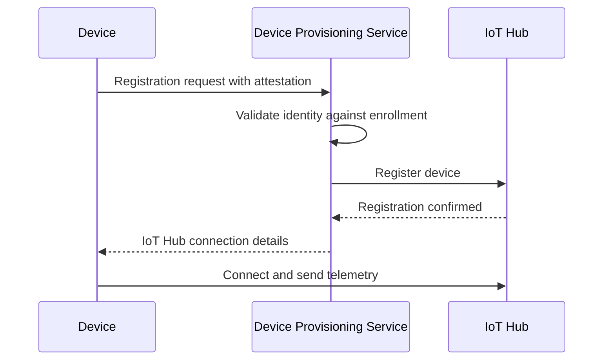

# How to Register IoT Devices at Scale Using Azure IoT Hub Device Provisioning Service

Author: [nawazdhandala](https://www.github.com/nawazdhandala)

Tags: Azure IoT Hub, Device Provisioning Service, IoT, Device Registration, TPM, X.509, Enrollment

Description: Learn how to use Azure IoT Hub Device Provisioning Service to automatically register and provision IoT devices at scale with zero-touch enrollment.

---

Manually registering IoT devices one by one works when you have a handful of them. But when you are deploying hundreds, thousands, or millions of devices, manual registration is not viable. Azure IoT Hub Device Provisioning Service (DPS) automates the entire process. A device powers on, contacts DPS, proves its identity, and gets automatically assigned to the right IoT Hub with the correct initial configuration. No human intervention needed.

This guide covers how to set up DPS, configure enrollment groups and individual enrollments, and handle the most common provisioning scenarios.

## How DPS Works

The provisioning flow has four steps:

1. **Device powers on** and contacts the DPS global endpoint
2. **DPS authenticates** the device using its enrollment credentials (TPM, X.509 certificate, or symmetric key)
3. **DPS assigns** the device to an IoT Hub based on your allocation policy
4. **Device connects** to the assigned IoT Hub and starts operating



The beauty of this model is that devices are manufactured with their credentials baked in (a certificate, a TPM chip, or a symmetric key) and shipped without any knowledge of which IoT Hub they will connect to. DPS handles that mapping at provisioning time.

## Prerequisites

- An Azure subscription
- At least one Azure IoT Hub created
- Familiarity with your device's attestation mechanism (how it proves its identity)

## Step 1: Create the Device Provisioning Service

```bash
# Create a resource group for IoT resources
az group create --name rg-iot-production --location eastus2

# Create the IoT Hub (if not already created)
az iot hub create \
    --resource-group rg-iot-production \
    --name iothub-production-001 \
    --sku S1 \
    --partition-count 4 \
    --location eastus2

# Create the Device Provisioning Service
az iot dps create \
    --resource-group rg-iot-production \
    --name dps-production-001 \
    --location eastus2

# Link the IoT Hub to the DPS instance
# This tells DPS which hub(s) to assign devices to
az iot dps linked-hub create \
    --resource-group rg-iot-production \
    --dps-name dps-production-001 \
    --connection-string "$(az iot hub connection-string show --hub-name iothub-production-001 --query connectionString -o tsv)" \
    --location eastus2
```

You can link multiple IoT Hubs to a single DPS instance. This is useful for distributing devices across hubs by region, capacity, or function.

## Step 2: Choose Your Attestation Mechanism

DPS supports three attestation types:

### TPM (Trusted Platform Module)

Best for: Devices with hardware TPM chips. Each device has a unique endorsement key burned into the TPM at manufacturing time. Very secure because the key cannot be extracted from the chip.

### X.509 Certificates

Best for: Devices that support PKI. You create a certificate chain where a root CA signs intermediate CAs, which sign individual device certificates. Enrollment groups let you enroll all devices sharing a common certificate chain in one configuration.

### Symmetric Keys

Best for: Simpler devices or prototyping. Each device has a shared symmetric key. Less secure than TPM or X.509 but much easier to set up. Derived keys can be generated from a group enrollment key for individual devices.

## Step 3: Create an Enrollment Group (X.509)

Enrollment groups are the most efficient way to provision large numbers of devices. All devices that present a certificate signed by the same root or intermediate CA are provisioned through the group.

First, create or obtain your certificate chain. For production, use a proper CA. For development:

```bash
# Generate a self-signed root CA certificate for development
# In production, use certificates from a trusted CA
openssl req -x509 -new -nodes \
    -key root-ca.key \
    -sha256 -days 3650 \
    -out root-ca.pem \
    -subj "/CN=IoT Root CA/O=MyCompany/C=US"

# Generate a device certificate signed by the root CA
openssl req -new -nodes \
    -key device-001.key \
    -out device-001.csr \
    -subj "/CN=device-001"

openssl x509 -req \
    -in device-001.csr \
    -CA root-ca.pem \
    -CAkey root-ca.key \
    -CAcreateserial \
    -out device-001.pem \
    -days 365 \
    -sha256
```

Upload the root certificate to DPS and create the enrollment group:

```bash
# Upload the root CA certificate to DPS
az iot dps certificate create \
    --resource-group rg-iot-production \
    --dps-name dps-production-001 \
    --certificate-name "iot-root-ca" \
    --path "./root-ca.pem"

# After uploading, verify the certificate through proof-of-possession
# (generates a verification code that you sign with the CA private key)

# Create an enrollment group that trusts this root CA
az iot dps enrollment-group create \
    --resource-group rg-iot-production \
    --dps-name dps-production-001 \
    --enrollment-id "factory-floor-devices" \
    --certificate-path "./root-ca.pem" \
    --provisioning-status enabled \
    --allocation-policy hashed \
    --iot-hubs "iothub-production-001.azure-devices.net"
```

Now any device that presents a certificate signed by this root CA will be automatically provisioned into the linked IoT Hub.

## Step 4: Create an Enrollment Group (Symmetric Key)

For simpler scenarios, symmetric key enrollment groups are faster to set up:

```bash
# Create an enrollment group with symmetric key attestation
az iot dps enrollment-group create \
    --resource-group rg-iot-production \
    --dps-name dps-production-001 \
    --enrollment-id "sensor-devices-group" \
    --attestation-type symmetricKey \
    --provisioning-status enabled \
    --allocation-policy hashed \
    --iot-hubs "iothub-production-001.azure-devices.net"
```

For individual devices, derive a unique key from the group key:

```python
# Python script to derive a device-specific symmetric key
# from the enrollment group primary key
import base64
import hmac
import hashlib

def derive_device_key(group_key, device_id):
    """
    Derive a device-specific key from the enrollment group key.
    Each device gets a unique key derived from its registration ID.
    """
    # Decode the base64 group key
    key_bytes = base64.b64decode(group_key)

    # Create HMAC-SHA256 of the device ID using the group key
    message = device_id.encode('utf-8')
    signed = hmac.new(key_bytes, message, hashlib.sha256).digest()

    # Return the base64-encoded derived key
    return base64.b64encode(signed).decode('utf-8')

# Example: derive a key for device "sensor-temp-042"
group_primary_key = "your-enrollment-group-primary-key-base64"
device_id = "sensor-temp-042"
device_key = derive_device_key(group_primary_key, device_id)
print(f"Device key for {device_id}: {device_key}")
```

## Step 5: Create Individual Enrollments

For special devices or testing, create individual enrollments that map a specific device to specific settings:

```bash
# Create an individual enrollment for a specific device
az iot dps enrollment create \
    --resource-group rg-iot-production \
    --dps-name dps-production-001 \
    --enrollment-id "gateway-device-001" \
    --attestation-type symmetricKey \
    --provisioning-status enabled \
    --allocation-policy static \
    --iot-hubs "iothub-production-001.azure-devices.net" \
    --initial-twin-properties '{"tags":{"environment":"production","role":"gateway"},"properties":{"desired":{"telemetryInterval":30}}}'
```

Individual enrollments take precedence over enrollment groups. If a device matches both an individual enrollment and a group enrollment, the individual enrollment is used.

## Step 6: Configure Allocation Policies

Allocation policies determine how DPS distributes devices across linked IoT Hubs:

**Evenly weighted distribution** - Distributes devices roughly equally across all linked hubs. Good for load balancing.

**Lowest latency** - Assigns devices to the hub with the lowest latency from the device's location. Good for geo-distributed deployments.

**Static configuration** - Always assigns to a specific hub. Good for dedicated hubs per customer or function.

**Custom (Azure Functions)** - Runs an Azure Function to decide the assignment. Good for complex business logic.

For a multi-region deployment:

```bash
# Link multiple IoT Hubs in different regions
az iot dps linked-hub create \
    --resource-group rg-iot-production \
    --dps-name dps-production-001 \
    --connection-string "$(az iot hub connection-string show --hub-name iothub-eastus2-001 --query connectionString -o tsv)" \
    --location eastus2

az iot dps linked-hub create \
    --resource-group rg-iot-production \
    --dps-name dps-production-001 \
    --connection-string "$(az iot hub connection-string show --hub-name iothub-westeurope-001 --query connectionString -o tsv)" \
    --location westeurope

# Configure enrollment group to use lowest-latency allocation
# Devices in Europe will be assigned to the West Europe hub,
# devices in the US will be assigned to the East US 2 hub
az iot dps enrollment-group update \
    --resource-group rg-iot-production \
    --dps-name dps-production-001 \
    --enrollment-id "sensor-devices-group" \
    --allocation-policy geoLatency
```

## Step 7: Device-Side Provisioning Code

Here is a simplified device provisioning flow using the Azure IoT Device SDK for Python:

```python
# Device provisioning client - runs on the IoT device
# This code contacts DPS, authenticates, and gets assigned to an IoT Hub
from azure.iot.device import ProvisioningDeviceClient, IoTHubDeviceClient

# DPS endpoint and device credentials
# These are baked into the device firmware at manufacturing
DPS_ENDPOINT = "global.azure-devices-provisioning.net"
ID_SCOPE = "0ne00XXXXXX"  # From the DPS instance
DEVICE_ID = "sensor-temp-042"
DEVICE_KEY = "derived-symmetric-key-here"

def provision_and_connect():
    # Step 1: Create the provisioning client
    provisioning_client = ProvisioningDeviceClient.create_from_symmetric_key(
        provisioning_host=DPS_ENDPOINT,
        registration_id=DEVICE_ID,
        id_scope=ID_SCOPE,
        symmetric_key=DEVICE_KEY
    )

    # Step 2: Register with DPS (this gets the IoT Hub assignment)
    registration_result = provisioning_client.register()

    if registration_result.status == "assigned":
        print(f"Assigned to hub: {registration_result.registration_state.assigned_hub}")
        print(f"Device ID: {registration_result.registration_state.device_id}")

        # Step 3: Connect to the assigned IoT Hub
        hub_client = IoTHubDeviceClient.create_from_symmetric_key(
            symmetric_key=DEVICE_KEY,
            hostname=registration_result.registration_state.assigned_hub,
            device_id=registration_result.registration_state.device_id
        )

        hub_client.connect()
        print("Connected to IoT Hub successfully")
        return hub_client
    else:
        print(f"Provisioning failed: {registration_result.status}")
        return None

# Run provisioning on device startup
client = provision_and_connect()
```

## Reprovisioning and Device Lifecycle

DPS also handles reprovisioning. If a device needs to move to a different hub (e.g., the device is reassigned to a different region), it can re-register with DPS to get a new assignment. Configure the reprovisioning policy on the enrollment to control what happens to device data during reprovisioning.

Options include:
- **Re-provision and migrate data** - Move the device twin to the new hub
- **Re-provision and reset** - Create a fresh device twin on the new hub
- **Never reprovision** - Reject the registration attempt

## Wrapping Up

DPS turns device provisioning from a manual bottleneck into an automated, zero-touch process. Whether you are deploying 100 devices or 100,000, the flow is the same: devices boot, authenticate with DPS, and get assigned to the right hub. Use enrollment groups with X.509 certificates for the best security at scale, symmetric keys for simpler deployments, and allocation policies to distribute devices intelligently across regions. With DPS in place, your device deployment scales without scaling your operations team.
