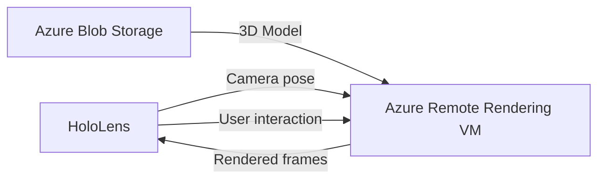

# How to Render High-Quality 3D Models in a HoloLens App Using Azure Remote Rendering

Author: [nawazdhandala](https://www.github.com/nawazdhandala)

Tags: Azure, Remote Rendering, HoloLens, 3D Models, Mixed Reality, Unity, Cloud Computing

Description: Learn how to use Azure Remote Rendering to display high-fidelity 3D models on HoloLens by offloading rendering to powerful cloud GPUs.

---

HoloLens is remarkable hardware, but it has limits. The onboard GPU can handle moderate polygon counts and basic materials, but throw a 50-million-polygon CAD model at it and the experience falls apart. Azure Remote Rendering solves this by doing the heavy rendering work on cloud GPUs and streaming the result to the headset. The HoloLens displays the final frames, and the user sees a high-fidelity 3D model that would be impossible to render locally.

This guide covers setting up Azure Remote Rendering, converting 3D models, starting rendering sessions, and displaying the results in a HoloLens Unity app.

## How Remote Rendering Works

The architecture is straightforward: Azure provisions a virtual machine with a powerful GPU in the cloud. Your Unity app connects to this VM and sends camera position and orientation data. The VM renders the scene from that viewpoint and streams compressed video frames back to the HoloLens. The frames are composited with the real-world view, creating the illusion that the 3D model exists in physical space.



The latency is typically 60-80 milliseconds, which is noticeable if you are looking for it but acceptable for most inspection and review scenarios.

## Prerequisites

- An Azure subscription.
- An Azure Remote Rendering account.
- Unity 2020.3 LTS or later with the Azure Remote Rendering Unity SDK.
- A HoloLens 2 device (or the HoloLens emulator for testing).
- A 3D model in a supported format (FBX, GLTF, GLB, or converted ARR format).

## Step 1: Create a Remote Rendering Account

```bash
# Create an Azure Remote Rendering account
az remote-rendering-account create \
  --resource-group myResourceGroup \
  --name myRenderingAccount \
  --location eastus \
  --sku Standard
```

Retrieve the account credentials.

```bash
# Get the account ID
az remote-rendering-account show \
  --resource-group myResourceGroup \
  --name myRenderingAccount \
  --query "accountId" \
  --output tsv

# Get the account key
az remote-rendering-account key show \
  --resource-group myResourceGroup \
  --name myRenderingAccount \
  --query "primaryKey" \
  --output tsv
```

## Step 2: Upload and Convert Your 3D Model

Azure Remote Rendering cannot render source files directly. Models must first be converted to the optimized ARR format. Upload your model to Azure Blob Storage, then trigger a conversion.

```bash
# Upload the 3D model to blob storage
az storage blob upload \
  --account-name myStorageAccount \
  --container-name models \
  --name factory-floor.fbx \
  --file ./factory-floor.fbx
```

Trigger the conversion using the REST API or SDK. Here is the conversion configuration file.

```json
{
  "settings": {
    "inputLocation": {
      "storageContainerUri": "https://myStorageAccount.blob.core.windows.net/models",
      "blobPrefix": "factory-floor.fbx",
      "relativeInputAssetPath": "factory-floor.fbx"
    },
    "outputLocation": {
      "storageContainerUri": "https://myStorageAccount.blob.core.windows.net/converted",
      "blobPrefix": "factory-floor"
    }
  }
}
```

The conversion process analyzes the model, optimizes geometry, and generates the ARR binary format. Conversion time depends on model complexity - a simple model takes minutes while a complex CAD assembly can take an hour or more.

## Step 3: Initialize Remote Rendering in Unity

Add the Azure Remote Rendering SDK to your Unity project and create the session manager.

```csharp
// RemoteRenderingManager.cs
// Manages the connection to Azure Remote Rendering and model loading
using Microsoft.Azure.RemoteRendering;
using Microsoft.Azure.RemoteRendering.Unity;
using UnityEngine;
using System.Threading.Tasks;

public class RemoteRenderingManager : MonoBehaviour
{
    // Configuration for the remote rendering session
    private string accountId = "your-account-id";
    private string accountKey = "your-account-key";
    private string accountDomain = "your-account-domain";
    private string remoteRenderingDomain = "westeurope.mixedreality.azure.com";

    private RemoteRenderingClient client;
    private RenderingSession currentSession;

    async void Start()
    {
        await InitializeRemoteRendering();
    }

    private async Task InitializeRemoteRendering()
    {
        // Create the rendering client with account credentials
        SessionConfiguration config = new SessionConfiguration
        {
            AccountId = accountId,
            AccountKey = accountKey,
            AccountDomain = accountDomain,
            RemoteRenderingDomain = remoteRenderingDomain
        };

        RemoteRenderingInitialization init = new RemoteRenderingInitialization
        {
            ConnectionType = ConnectionType.General,
            GraphicsApi = GraphicsApiType.WmrD3D11,
            ToolsetVersion = RemoteRenderingInitialization.GetCurrentToolsetVersion(),
            UnitsPerMeter = 1.0f,
            Forward = Axis.NegativeZ,
            Right = Axis.X,
            Up = Axis.Y
        };

        RemoteManagerUnity.InitializeManager(init);
        client = new RemoteRenderingClient(config);

        Debug.Log("Remote Rendering client initialized.");
    }
}
```

## Step 4: Create a Rendering Session

A rendering session provisions a cloud GPU. You choose the VM size based on your model's complexity.

```csharp
// Creates a new remote rendering session with the specified VM size
public async Task<RenderingSession> CreateSession()
{
    // Choose VM size: Standard for models up to 20M polygons,
    // Premium for larger models up to 100M+ polygons
    RenderingSessionCreationOptions options = new RenderingSessionCreationOptions
    {
        MaxLeaseInMinutes = 30,    // Session auto-terminates after this time
        Size = RenderingSessionVmSize.Standard  // or Premium for larger models
    };

    Debug.Log("Creating remote rendering session...");
    CreateRenderingSessionResult result = await client.CreateNewRenderingSessionAsync(options);

    if (result.ErrorCode != Result.Success)
    {
        Debug.LogError($"Failed to create session: {result.ErrorCode}");
        return null;
    }

    currentSession = result.Session;

    // Wait for the session to be ready (VM provisioning takes 1-5 minutes)
    while (true)
    {
        RenderingSessionPropertiesResult props =
            await currentSession.GetPropertiesAsync();

        if (props.SessionProperties.Status == RenderingSessionStatus.Ready)
        {
            Debug.Log("Session is ready.");
            break;
        }
        else if (props.SessionProperties.Status == RenderingSessionStatus.Error)
        {
            Debug.LogError("Session entered error state.");
            return null;
        }

        Debug.Log($"Session status: {props.SessionProperties.Status}. Waiting...");
        await Task.Delay(5000);
    }

    return currentSession;
}
```

Standard VMs cost roughly $3.00 per hour, while Premium VMs cost about $12.00 per hour. The session is billed for the duration it runs, so terminate sessions when they are no longer needed.

## Step 5: Connect and Load the Model

After the session is ready, connect your HoloLens to it and load the converted model.

```csharp
// Connects to the rendering session and loads a 3D model
public async Task ConnectAndLoadModel(string modelUrl)
{
    if (currentSession == null)
    {
        Debug.LogError("No active session. Create one first.");
        return;
    }

    // Connect the Unity session to the remote rendering session
    ConnectToRuntimeParams connectParams = new ConnectToRuntimeParams();
    connectParams.Mode = ServiceRenderMode.Default;

    Result connectResult = await currentSession.ConnectAsync(connectParams);

    if (connectResult != Result.Success)
    {
        Debug.LogError($"Failed to connect: {connectResult}");
        return;
    }

    Debug.Log("Connected to remote rendering session.");

    // Load the model from blob storage
    // The URL should point to the converted .arrAsset file
    LoadModelOptions loadOptions = new LoadModelOptions(
        modelUrl,
        currentSession.Connection.CurrentCoordinateSystem
    );

    LoadModelResult modelResult = await currentSession.Connection.LoadModelAsync(loadOptions);

    if (modelResult.Root != null)
    {
        // The model is now loaded - create a Unity representation
        Entity rootEntity = modelResult.Root;

        // Position the model in front of the user
        rootEntity.Position = new Float3(0, 0, 2);  // 2 meters ahead
        rootEntity.Scale = new Float3(0.01f, 0.01f, 0.01f);  // Scale down if needed

        // Create a Unity proxy game object to interact with the remote entity
        rootEntity.CreateGameObject(UnityCreationMode.CreateUnityComponents);

        Debug.Log($"Model loaded. Entity count: {CountEntities(rootEntity)}");
    }
    else
    {
        Debug.LogError("Failed to load model.");
    }
}

// Recursively counts entities in the loaded model
private int CountEntities(Entity entity)
{
    int count = 1;
    foreach (Entity child in entity.Children)
    {
        count += CountEntities(child);
    }
    return count;
}
```

## Step 6: Handle User Interaction

Users expect to interact with 3D models - rotating, scaling, and inspecting parts. Since the model is rendered remotely, interaction requires sending input events to the cloud.

```csharp
// Performs a raycast on the remote model to detect which part the user is looking at
public async void OnGaze(Ray gazeRay)
{
    if (currentSession?.Connection == null) return;

    // Convert the Unity ray to remote rendering coordinates
    RayCast rayCast = new RayCast(
        new Float3(gazeRay.origin.x, gazeRay.origin.y, gazeRay.origin.z),
        new Float3(gazeRay.direction.x, gazeRay.direction.y, gazeRay.direction.z),
        100.0f,  // Max distance in meters
        RayCastHitCollection.ClosestHit
    );

    RayCastQueryResult result = await currentSession.Connection.RayCastQueryAsync(rayCast);

    if (result.Hits.Count > 0)
    {
        RayCastHit hit = result.Hits[0];
        Entity hitEntity = hit.HitEntity;

        // Highlight the part the user is looking at
        HighlightEntity(hitEntity);
    }
}

// Changes the material color of an entity to highlight it
private void HighlightEntity(Entity entity)
{
    // Get or create an override material for highlighting
    foreach (MeshComponent mesh in entity.FindComponentsOfType<MeshComponent>())
    {
        foreach (var material in mesh.UsedMaterials)
        {
            // Tint the material to show selection
            if (material.MaterialSubType == MaterialType.Pbr)
            {
                PbrMaterial pbrMat = material as PbrMaterial;
                pbrMat.AlbedoColor = new Color4(1.0f, 0.8f, 0.0f, 1.0f);
            }
        }
    }
}
```

## Step 7: Manage Session Lifecycle

Sessions cost money while running. Implement proper lifecycle management.

```csharp
// Extend the session lease if the user needs more time
public async void ExtendSession(int additionalMinutes)
{
    if (currentSession == null) return;

    UpdateSessionOptions options = new UpdateSessionOptions
    {
        MaxLeaseInMinutes = currentSession.MaxLeaseInMinutes + additionalMinutes
    };

    await currentSession.RenewAsync(options);
    Debug.Log($"Session extended by {additionalMinutes} minutes.");
}

// Terminate the session when done to stop billing
public async void StopSession()
{
    if (currentSession == null) return;

    await currentSession.StopAsync();
    currentSession = null;
    Debug.Log("Remote rendering session terminated.");
}
```

## Performance Considerations

**Network requirements**: Azure Remote Rendering needs a stable connection with at least 40 Mbps bandwidth and under 80ms latency. Wi-Fi works for office scenarios, but enterprise-grade access points perform better than consumer routers.

**VM size selection**: Start with Standard and test. If you see frame drops or the model fails to load, upgrade to Premium. There is no penalty for trying Standard first.

**Model optimization**: Even though the cloud GPU is powerful, optimizing your model before conversion helps. Remove hidden geometry, merge small meshes, and reduce texture resolution where detail is not needed.

**Session reuse**: If multiple users need to view the same model, they can share a single rendering session. Each user connects to the same session and gets their own viewpoint rendered independently.

## Summary

Azure Remote Rendering unlocks a category of HoloLens applications that would otherwise be impossible. By rendering complex 3D models on cloud GPUs and streaming the result, you get high-fidelity visuals on lightweight hardware. The workflow is convert your model, start a session, connect from Unity, and load the model. User interaction works through remote raycasts and material overrides. Just keep an eye on session costs and terminate sessions when they are no longer needed.
