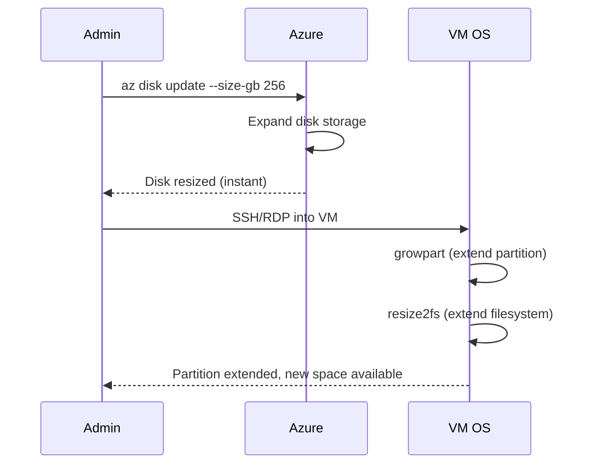

# How to Resize an Azure Managed Disk Without Downtime

Author: [nawazdhandala](https://www.github.com/nawazdhandala)

Tags: Azure, Managed Disks, Disk Resize, Online Resize, Cloud Infrastructure, Virtual Machines

Description: Learn how to expand Azure Managed Disks without stopping your virtual machine, including OS-level partition extension for both Linux and Windows.

---

Running out of disk space used to mean downtime. You had to stop the VM, resize the disk, start the VM back up, and then extend the partition inside the OS. Azure now supports online disk resizing for most disk types, letting you expand a managed disk while the VM keeps running. In this guide, I will walk through the process of resizing disks without downtime and extending the partition at the OS level.

## Online Resize Support

Azure supports expanding managed disks without deallocating the VM for the following disk types:

- Premium SSD
- Standard SSD
- Standard HDD
- Premium SSD v2
- Ultra Disk

The key requirement is that the disk must be attached to a running VM. The resize operation only increases the size - you cannot shrink a managed disk.

## Resizing a Data Disk Online

```bash
# Check the current disk size
az disk show \
  --name data-disk-01 \
  --resource-group my-resource-group \
  --query "{name:name, currentSize:diskSizeGb, sku:sku.name}" \
  --output table

# Resize the disk from 128 GiB to 256 GiB while the VM is running
az disk update \
  --name data-disk-01 \
  --resource-group my-resource-group \
  --size-gb 256

# Verify the new size
az disk show \
  --name data-disk-01 \
  --resource-group my-resource-group \
  --query "diskSizeGb"
```

The Azure-level resize happens almost instantly. But the operating system inside the VM still sees the old partition size. You need to extend the partition and file system to use the new space.

## Resizing an OS Disk Online

OS disk online resize works the same way for data disks.

```bash
# Get the OS disk name
OS_DISK=$(az vm show \
  --name my-vm \
  --resource-group my-resource-group \
  --query "storageProfile.osDisk.name" -o tsv)

# Resize the OS disk
az disk update \
  --name "$OS_DISK" \
  --resource-group my-resource-group \
  --size-gb 128

echo "OS disk resized to 128 GiB"
```

## Extending the Partition on Linux

After Azure resizes the disk, you need to extend the partition and file system inside the Linux VM. This can be done online without unmounting.

```bash
# SSH into the VM

# Check the current disk layout
# You will see the disk is larger but the partition has not changed
lsblk

# Example output:
# NAME    MAJ:MIN RM  SIZE RO TYPE MOUNTPOINT
# sda       8:0    0  128G  0 disk
# |-sda1    8:1    0   64G  0 part /
# sdb       8:16   0  256G  0 disk         <- resized from 128G
# |-sdb1    8:17   0  128G  0 part /data   <- still shows 128G

# For a disk with a single partition, use growpart to extend it
# Install growpart if not available
sudo apt-get install -y cloud-guest-utils  # Debian/Ubuntu
# sudo yum install -y cloud-utils-growpart  # RHEL/CentOS

# Extend partition 1 on /dev/sdb to use all available space
sudo growpart /dev/sdb 1

# Extend the file system
# For ext4:
sudo resize2fs /dev/sdb1

# For xfs:
# sudo xfs_growfs /data

# Verify the new size
df -h /data
lsblk
```

## Extending the Partition on Windows

On Windows, you can extend the volume using PowerShell or Disk Management.

```powershell
# Open PowerShell as Administrator on the VM

# List all partitions and their sizes
Get-Partition | Format-Table DiskNumber, PartitionNumber, DriveLetter, Size

# Find the maximum size the partition can be extended to
$maxSize = (Get-PartitionSupportedSize -DriveLetter D).SizeMax

# Extend the partition to use all available space
Resize-Partition -DriveLetter D -Size $maxSize

# Verify the new size
Get-Partition -DriveLetter D | Format-Table DriveLetter, Size
```

If you prefer the graphical approach, open Disk Management (diskmgmt.msc), right-click the volume, and select "Extend Volume."

## Resizing with PowerShell

```powershell
# Resize a managed disk online using PowerShell
$diskName = "data-disk-01"
$resourceGroup = "my-resource-group"
$newSizeGB = 256

# Get the disk object
$disk = Get-AzDisk -ResourceGroupName $resourceGroup -DiskName $diskName

# Update the size
$disk.DiskSizeGB = $newSizeGB
Update-AzDisk -ResourceGroupName $resourceGroup -DiskName $diskName -Disk $disk

Write-Output "Disk resized to $newSizeGB GiB"
```

## Resizing with Terraform

If you manage infrastructure with Terraform, update the disk_size_gb parameter.

```hcl
resource "azurerm_managed_disk" "data" {
  name                 = "data-disk-01"
  location             = azurerm_resource_group.main.location
  resource_group_name  = azurerm_resource_group.main.name
  storage_account_type = "Premium_LRS"
  create_option        = "Empty"

  # Change this value and apply to resize
  # Terraform will resize in-place without recreating the disk
  disk_size_gb = 256  # was 128
}
```

## Upgrading the Performance Tier

Resizing a Premium SSD not only gives you more space but can also upgrade the performance tier. Each Premium SSD size tier has specific IOPS and throughput limits.

```bash
# A P10 (128 GiB) disk has 500 IOPS and 100 MB/s
# Resizing to P20 (256 GiB) bumps it to 2,300 IOPS and 150 MB/s
az disk update \
  --name data-disk-01 \
  --resource-group my-resource-group \
  --size-gb 256

# You can also set a specific performance tier higher than the baseline
# For example, set a 256 GiB disk to P30 performance tier
az disk update \
  --name data-disk-01 \
  --resource-group my-resource-group \
  --set tier=P30
```

## Handling LVM Volumes on Linux

If your disk uses LVM (Logical Volume Manager), the resize process has extra steps.

```bash
# After Azure resizes the physical disk

# Resize the PV (Physical Volume) to recognize the new disk size
sudo pvresize /dev/sdb1

# Extend the LV (Logical Volume) to use all free space
sudo lvextend -l +100%FREE /dev/mapper/vg_data-lv_data

# Resize the file system
sudo resize2fs /dev/mapper/vg_data-lv_data

# For xfs:
# sudo xfs_growfs /data

# Verify
sudo pvs
sudo lvs
df -h /data
```

## The Complete Resize Flow



## Important Limitations

You cannot shrink a managed disk. If you over-provision, you are stuck with that size (though you can create a smaller disk and copy the data).

Online resize is not supported for disks encrypted with Azure Disk Encryption (the VM-level BitLocker/dm-crypt encryption). You need to deallocate the VM first. However, server-side encryption with customer-managed keys works fine with online resize.

If the VM does not recognize the new disk size, you may need to rescan the SCSI bus on Linux.

```bash
# Rescan the SCSI bus to detect the new disk size
# This is sometimes needed if the OS does not auto-detect the change
echo 1 | sudo tee /sys/class/block/sdb/device/rescan
```

## Monitoring After Resize

After resizing, monitor the disk to make sure the new capacity is being used correctly.

```bash
# Check disk IOPS and throughput after resize
az monitor metrics list \
  --resource "/subscriptions/<sub>/resourceGroups/my-resource-group/providers/Microsoft.Compute/disks/data-disk-01" \
  --metric "Composite Disk Read Operations/sec" "Composite Disk Write Operations/sec" \
  --interval PT1H \
  --output table
```

Online disk resizing is one of those Azure features that saves real operational pain. No more scheduling maintenance windows just to add disk space. Resize the disk in Azure, extend the partition in the OS, and you are done - all while your application keeps running.
