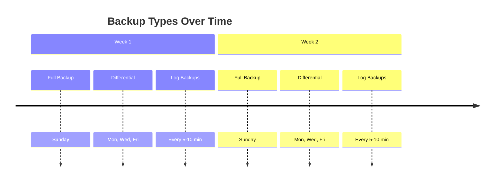

# How to Restore an Azure SQL Database from a Point-in-Time Backup

Author: [nawazdhandala](https://www.github.com/nawazdhandala)

Tags: Azure SQL, Backup, Restore, Disaster Recovery, Point-in-Time, Azure, Database

Description: Learn how to restore an Azure SQL Database to a specific point in time using automatic backups to recover from accidental data loss or corruption.

---

Someone ran a DELETE statement without a WHERE clause. A deployment script corrupted data in a production table. A developer dropped a table they thought was in the dev environment but was actually in production. These things happen, and when they do, you need to restore your database to a point in time before the damage occurred.

Azure SQL Database includes automatic backups that allow you to restore to any point in time within the retention period. No configuration is required - backups happen automatically. In this post, I will walk through how the backup system works and how to perform a point-in-time restore.

## How Azure SQL Database Backups Work

Azure SQL Database creates three types of backups automatically:

**Full backups**: Created weekly. These are a complete copy of the entire database.

**Differential backups**: Created every 12-24 hours. These contain only the changes since the last full backup.

**Transaction log backups**: Created every 5-10 minutes. These capture every transaction that occurred since the last log backup.

Together, these three types allow you to restore to any second within the retention period. Azure uses the most recent full backup, applies the appropriate differential backup, and then replays the transaction log up to the exact moment you specify.



## Backup Retention Periods

The default retention period depends on your service tier:

- **Basic**: 7 days
- **Standard**: 35 days
- **Premium**: 35 days
- **General Purpose**: 7 days (configurable up to 35 days)
- **Business Critical**: 7 days (configurable up to 35 days)
- **Hyperscale**: 7 days (configurable up to 35 days)

You can extend retention beyond 35 days using long-term backup retention (LTR), which stores backups for up to 10 years. That is covered in a separate post.

To change the short-term retention period:

```bash
# Set backup retention to 28 days
az sql db str-policy set \
    --resource-group myResourceGroup \
    --server myserver \
    --name mydb \
    --retention-days 28
```

## Performing a Point-in-Time Restore via Azure Portal

### Step 1: Determine the Restore Point

First, figure out when the damage occurred. Check application logs, audit logs, or talk to the team to pinpoint when the bad operation ran. You want to restore to a moment just before that event.

### Step 2: Navigate to Your Database

Go to the Azure Portal and open the database you need to restore.

### Step 3: Click Restore

In the top toolbar, click "Restore". This opens the restore configuration page.

### Step 4: Configure the Restore

**Restore point**: Enter the date and time you want to restore to. The portal shows the earliest and latest available restore points.

**Database name**: The restored database gets a new name. You cannot overwrite the existing database. I recommend a name like "mydb-restored-20260216" so it is clear what it is.

**Server**: By default, the database restores to the same server. You can choose a different server if needed.

**Compute + storage**: Choose the pricing tier for the restored database. It defaults to the same tier as the original.

### Step 5: Start the Restore

Click "Create". The restore process begins. Depending on the database size and how much transaction log needs to be replayed, this can take minutes to hours.

### Step 6: Verify the Restored Data

Once the restore completes, connect to the restored database and verify the data. Check the tables and rows that were affected by the incident.

### Step 7: Swap or Copy Data

Once you have verified the restored database is correct, you have several options:

- Rename the original database and rename the restored database to take its place
- Copy the needed data from the restored database to the original
- Point your application to the restored database

## Performing a Point-in-Time Restore via Azure CLI

The CLI is useful for scripting and automation:

```bash
# Restore a database to a specific point in time
az sql db restore \
    --resource-group myResourceGroup \
    --server myserver \
    --name mydb \
    --dest-name mydb-restored \
    --time "2026-02-16T10:30:00Z"
```

The `--time` parameter must be in UTC format.

To restore to a different server (must be in the same subscription):

```bash
# Restore to a different server
az sql db restore \
    --resource-group myResourceGroup \
    --server myserver \
    --name mydb \
    --dest-name mydb-restored \
    --dest-resource-group anotherResourceGroup \
    --dest-server anotherserver \
    --time "2026-02-16T10:30:00Z"
```

## Performing a Point-in-Time Restore via PowerShell

```powershell
# Restore a database to a specific point in time
Restore-AzSqlDatabase `
    -FromPointInTimeBackup `
    -ResourceGroupName "myResourceGroup" `
    -ServerName "myserver" `
    -TargetDatabaseName "mydb-restored" `
    -ResourceId "/subscriptions/{sub-id}/resourceGroups/myResourceGroup/providers/Microsoft.Sql/servers/myserver/databases/mydb" `
    -PointInTime "2026-02-16T10:30:00Z"
```

## Performing a Point-in-Time Restore via T-SQL

You can also use T-SQL from the master database:

```sql
-- Restore a database to a specific point in time using T-SQL
-- Run this in the master database
RESTORE DATABASE [mydb_restored]
FROM DATABASE_SNAPSHOT = 'mydb'
WITH POINT_IN_TIME = '2026-02-16T10:30:00Z';
```

Note: The T-SQL syntax varies and may not support all options. The Portal and CLI methods are more reliable for Azure SQL Database restores.

## Swapping Databases After Restore

After verifying the restored data, you might want to replace the original database. Here is a safe approach:

```bash
# Step 1: Rename the original database (keeps it as a backup)
az sql db rename \
    --resource-group myResourceGroup \
    --server myserver \
    --name mydb \
    --new-name mydb-damaged

# Step 2: Rename the restored database to the original name
az sql db rename \
    --resource-group myResourceGroup \
    --server myserver \
    --name mydb-restored \
    --new-name mydb

# Step 3: Once confirmed, delete the damaged database
# az sql db delete --resource-group myResourceGroup --server myserver --name mydb-damaged --yes
```

The rename operation is fast and does not copy data. However, connection strings that specify the database by name will automatically point to the renamed database. Plan for a brief interruption.

## Restoring a Deleted Database

If someone deleted the entire database, you can still restore it within the retention period.

### Via Azure Portal

1. Go to your SQL server.
2. Under "Data management", click "Deleted databases".
3. You will see a list of recently deleted databases with their deletion time.
4. Click on the deleted database and click "Restore".
5. Choose a restore point (before the deletion time) and a name.

### Via Azure CLI

```bash
# List deleted databases on the server
az sql db list-deleted \
    --resource-group myResourceGroup \
    --server myserver \
    --output table

# Restore a deleted database
az sql db restore \
    --resource-group myResourceGroup \
    --server myserver \
    --name mydb \
    --dest-name mydb-restored \
    --deleted-time "2026-02-16T12:00:00Z" \
    --time "2026-02-16T11:55:00Z"
```

## Understanding Restore Times

The time it takes to restore a database depends on several factors:

- **Database size**: Larger databases take longer to restore because more data needs to be copied.
- **Transaction log volume**: If the restore point requires replaying a large amount of transaction log, the recovery phase takes longer.
- **Target tier**: Restoring to a higher tier is faster because more resources are available for the restore operation.
- **Concurrent operations**: Heavy activity on the server can slow down restores.

As a rough guideline:
- Small databases (under 10 GB): 5-15 minutes
- Medium databases (10-100 GB): 15-60 minutes
- Large databases (100+ GB): 1-4 hours or more

## Best Practices

**Document recovery procedures.** Write a runbook that describes exactly how to perform a restore, including who to notify, how to verify the data, and how to swap databases. Practice the procedure before you need it.

**Test restores regularly.** Do a practice restore at least quarterly. This verifies that your backups are working and that your team knows the process.

**Know your retention period.** If your default is 7 days and an incident is discovered after 8 days, you cannot restore. Consider extending retention for critical databases.

**Act quickly after an incident.** The sooner you start the restore, the closer you can get to the moment before the damage. Transaction log backups happen every 5-10 minutes, so you can usually get very close.

**Do not delete the original database.** Always rename it first. If the restore turns out to be wrong, you can switch back.

**Consider geo-restore for regional outages.** Point-in-time restore works within the same region. For regional disasters, use geo-restore from geo-redundant backups (automatically configured for most tiers).

## Summary

Azure SQL Database automatic backups provide a safety net that lets you recover from accidental data loss, corruption, or deletion by restoring to any point in time within the retention period. The process is straightforward through the Portal, CLI, or PowerShell. No advance configuration is needed - backups are automatic. The key is to know how to use the restore feature before you need it, so practice the procedure and keep your recovery runbook current.
