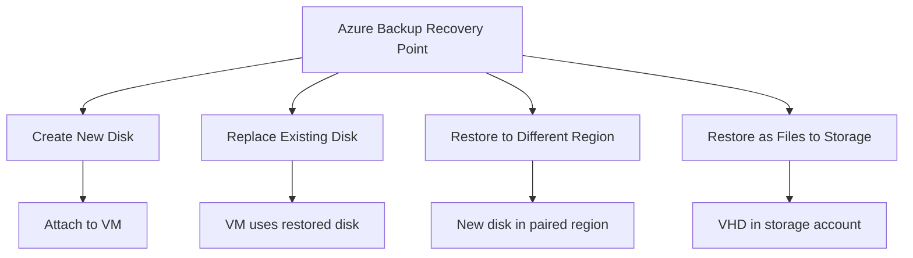

# How to Restore Azure Managed Disks from Azure Backup Snapshots

Author: [nawazdhandala](https://www.github.com/nawazdhandala)

Tags: Azure Backup, Managed Disks, Disk Restore, Snapshots, Azure VMs, Data Recovery, Instant Restore

Description: Step-by-step guide to restoring Azure managed disks from Azure Backup snapshots, including full disk restore, disk swap, and cross-region restore scenarios.

---

When an Azure VM has a corrupted disk, a misconfigured volume, or data loss on a specific disk, you do not always need to restore the entire VM. Azure Backup lets you restore individual managed disks from backup snapshots, which is faster and more targeted. You can create a new disk from a recovery point and either attach it to an existing VM or swap it in place of the problematic disk.

This guide covers the different disk restore scenarios and walks through each one step by step.

## Disk Restore Options

Azure Backup gives you several ways to restore managed disks:

**Create new disk** - Restore a disk to a new managed disk resource. You can then attach it to any VM or use it for data recovery.

**Replace existing disk** - Swap a VM's current disk with the restored version. This is the quickest way to revert a disk to a previous state.

**Restore to a different region** - If you have cross-region restore (CRR) enabled on the vault, you can restore disks to the paired region.

**Restore as files** - Download the disk data as VHD files to a storage account. Useful for offline analysis or migration.



## Prerequisites

- An Azure VM with an active backup in a Recovery Services vault
- At least one successful backup recovery point
- Permissions to create managed disks and modify VM configurations
- For cross-region restore: CRR must be enabled on the vault

## Step 1: Find the Right Recovery Point

List available recovery points for the VM:

```bash
# List all recovery points for a backed-up VM
# This shows the date, type, and tier of each recovery point
az backup recoverypoint list \
    --resource-group rg-backup-eastus2 \
    --vault-name rsv-backup-eastus2-001 \
    --container-name "IaasVMContainer;V2;rg-production;vm-app-01" \
    --item-name "VM;iaasvmcontainerv2;rg-production;vm-app-01" \
    --output table
```

The output shows recovery points with their timestamps and types. Points in the "Snapshot" tier restore faster than those in the "Vault" tier because snapshot data is already stored as managed disk snapshots in your resource group.

Choose the recovery point that represents the state you want to restore to. If you need the disk from before a corruption event that happened yesterday at 3 PM, pick the most recent recovery point before that time.

## Step 2: Restore a Disk as a New Managed Disk

This is the safest option because it does not modify the existing VM. You get a new disk that you can inspect before attaching.

### Using the Portal

1. In the Recovery Services vault, go to "Backup items" and select the VM
2. Click "Restore VM"
3. Select the recovery point
4. Choose "Restore disks" (not "Create new" or "Replace existing")
5. Select the target resource group
6. Select which disks to restore (OS disk, data disks, or all)
7. Provide a staging storage account for the restore operation
8. Click "Restore"

### Using Azure CLI

```bash
# Restore disks from a backup recovery point to a staging location
# The restored disks are created as new managed disk resources

az backup restore restore-disks \
    --resource-group rg-backup-eastus2 \
    --vault-name rsv-backup-eastus2-001 \
    --container-name "IaasVMContainer;V2;rg-production;vm-app-01" \
    --item-name "VM;iaasvmcontainerv2;rg-production;vm-app-01" \
    --rp-name "recovery-point-id" \
    --storage-account strestorestaging \
    --target-resource-group rg-restored-disks \
    --restore-only-osdisk false

# Monitor the restore job
az backup job list \
    --resource-group rg-backup-eastus2 \
    --vault-name rsv-backup-eastus2-001 \
    --output table
```

The restore job creates new managed disks in the target resource group. The disks are named with a prefix based on the original disk name and a unique suffix.

## Step 3: Attach the Restored Disk to a VM

After the restore completes, attach the new disk to the target VM.

### Attach as a Data Disk for Inspection

This is useful when you want to browse the disk contents without affecting the VM's boot disk:

```bash
# Attach the restored disk as a data disk to an existing VM
# This lets you browse the disk contents and copy specific files

# First, find the restored disk name
az disk list \
    --resource-group rg-restored-disks \
    --output table

# Attach it to the VM
az vm disk attach \
    --resource-group rg-production \
    --vm-name vm-app-01 \
    --name "restored-disk-name" \
    --disk "/subscriptions/<sub-id>/resourceGroups/rg-restored-disks/providers/Microsoft.Compute/disks/restored-disk-name"
```

After attaching, RDP or SSH into the VM. The restored disk appears as a new volume. You can browse it, compare files, and copy what you need.

### Swap the OS Disk

If the VM's OS disk is corrupted and you need to replace it entirely:

```powershell
# Swap the VM's OS disk with the restored version
# This requires stopping the VM first

# Stop the VM
Stop-AzVM -ResourceGroupName "rg-production" -Name "vm-app-01" -Force

# Get the restored disk
$restoredDisk = Get-AzDisk -ResourceGroupName "rg-restored-disks" -DiskName "restored-os-disk-name"

# Get the VM
$vm = Get-AzVM -ResourceGroupName "rg-production" -Name "vm-app-01"

# Set the OS disk to the restored disk
Set-AzVMOSDisk -VM $vm -ManagedDiskId $restoredDisk.Id -Name $restoredDisk.Name

# Update the VM configuration
Update-AzVM -ResourceGroupName "rg-production" -VM $vm

# Start the VM
Start-AzVM -ResourceGroupName "rg-production" -Name "vm-app-01"

Write-Output "OS disk swapped successfully"
```

### Swap a Data Disk

For a corrupted data disk:

```powershell
# Replace a data disk with the restored version
# This preserves the VM's OS disk and other data disks

# Stop the VM (required for disk swap)
Stop-AzVM -ResourceGroupName "rg-production" -Name "vm-app-01" -Force

# Get VM and identify the disk to replace
$vm = Get-AzVM -ResourceGroupName "rg-production" -Name "vm-app-01"

# Find the data disk by LUN
$diskToReplace = $vm.StorageProfile.DataDisks | Where-Object { $_.Lun -eq 1 }
Write-Output "Replacing disk: $($diskToReplace.Name) at LUN $($diskToReplace.Lun)"

# Remove the old data disk
Remove-AzVMDataDisk -VM $vm -Name $diskToReplace.Name

# Get the restored disk
$restoredDisk = Get-AzDisk -ResourceGroupName "rg-restored-disks" -DiskName "restored-data-disk-name"

# Add the restored disk at the same LUN
Add-AzVMDataDisk -VM $vm `
    -Name $restoredDisk.Name `
    -ManagedDiskId $restoredDisk.Id `
    -Lun $diskToReplace.Lun `
    -Caching $diskToReplace.Caching `
    -CreateOption Attach

# Update and start the VM
Update-AzVM -ResourceGroupName "rg-production" -VM $vm
Start-AzVM -ResourceGroupName "rg-production" -Name "vm-app-01"

Write-Output "Data disk at LUN $($diskToReplace.Lun) replaced with restored version"
```

## Step 4: Cross-Region Restore

If your vault has Cross Region Restore (CRR) enabled, you can restore disks to the paired region. This is useful for disaster recovery scenarios where the primary region is unavailable.

```bash
# Restore disks to the paired region using Cross Region Restore
# CRR must be enabled on the vault (GRS storage type required)

# List secondary region recovery points
az backup recoverypoint list \
    --resource-group rg-backup-eastus2 \
    --vault-name rsv-backup-eastus2-001 \
    --container-name "IaasVMContainer;V2;rg-production;vm-app-01" \
    --item-name "VM;iaasvmcontainerv2;rg-production;vm-app-01" \
    --use-secondary-region \
    --output table

# Restore to the secondary region
az backup restore restore-disks \
    --resource-group rg-backup-eastus2 \
    --vault-name rsv-backup-eastus2-001 \
    --container-name "IaasVMContainer;V2;rg-production;vm-app-01" \
    --item-name "VM;iaasvmcontainerv2;rg-production;vm-app-01" \
    --rp-name "recovery-point-id" \
    --storage-account strestorecentralus \
    --target-resource-group rg-restored-disks-centralus \
    --use-secondary-region
```

CRR recovery points are typically 12-24 hours behind the primary region because of the asynchronous replication to the secondary region.

## Step 5: Restore Disks as VHD Files

For scenarios where you need the raw disk data (offline analysis, migration, or archival), restore to a storage account as VHD files:

1. Start a disk restore job
2. The ARM template and VHD files are placed in the staging storage account
3. Download the VHD files or mount them using Azure Storage Explorer

The VHD file can be:
- Downloaded to an on-premises environment
- Used to create a new managed disk in a different subscription
- Mounted locally for forensic analysis
- Imported into another cloud platform

## Performance Considerations

**Snapshot tier vs. vault tier.** Restores from the snapshot tier complete in minutes because the data is already stored as managed disk snapshots in your subscription. Vault tier restores can take hours because data must be rehydrated from the vault.

**Disk size impact.** Larger disks take longer to restore. A 128 GB disk from the vault tier typically takes 1-2 hours. A 1 TB disk can take 4-8 hours.

**Concurrent restores.** You can run multiple disk restore jobs simultaneously, but they share the vault's throughput capacity. For time-sensitive restores, limit concurrency to avoid throttling.

## Cleanup After Restore

After verifying the restore, clean up temporary resources:

```bash
# Delete the old (corrupted) disk if it was replaced
az disk delete \
    --resource-group rg-production \
    --name "old-corrupted-disk-name" \
    --yes

# Delete the staging storage account data if no longer needed
az storage blob delete-batch \
    --source restore-container \
    --account-name strestorestaging
```

Do not delete the old disk immediately. Keep it for a few days as a fallback in case the restored disk has issues.

## Wrapping Up

Restoring individual managed disks from Azure Backup is a surgical operation compared to full VM restores. Whether you need to swap a corrupted OS disk, recover data from a specific data disk, or create a copy for analysis, disk-level restore gives you the flexibility to do it efficiently. Use snapshot-tier recovery points for the fastest restores, and keep the staging storage account available for vault-tier restores. Always verify the restored disk before discarding the original.
