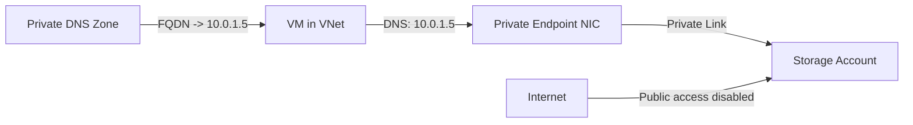

# How to Restrict Azure Storage Account Access Using Private Endpoints

Author: [nawazdhandala](https://www.github.com/nawazdhandala)

Tags: Azure, Storage Account, Private Endpoint, Security, Networking, Private Link, Data Protection

Description: A practical guide to restricting Azure Storage Account access using Private Endpoints to keep storage traffic on your private network and block public access.

---

Azure Storage Accounts are accessible over the public internet by default. Even with shared access signatures and firewall rules, the endpoint itself is reachable from anywhere. For organizations handling sensitive data, this is not acceptable. Regulators, auditors, and security teams want storage traffic to stay on private networks, period.

Azure Private Endpoints solve this by bringing the storage account's endpoint into your VNet with a private IP address. Combined with disabling public access, your storage account becomes invisible to the internet while remaining fully accessible to your VNet resources.

## How Private Endpoints Work with Storage

When you create a Private Endpoint for a storage account, Azure provisions a network interface in your VNet subnet with a private IP address. DNS is configured so that the storage account's FQDN (like `mystorageaccount.blob.core.windows.net`) resolves to this private IP instead of the public one.

The result: your applications connect to the same FQDN they always have, but the traffic routes privately through your VNet.



## Storage Sub-Resources

Azure Storage has multiple sub-resources, and each needs its own Private Endpoint:

| Sub-Resource | FQDN | Purpose |
|-------------|------|---------|
| blob | mystorageaccount.blob.core.windows.net | Blob storage |
| file | mystorageaccount.file.core.windows.net | File shares |
| queue | mystorageaccount.queue.core.windows.net | Queue storage |
| table | mystorageaccount.table.core.windows.net | Table storage |
| dfs | mystorageaccount.dfs.core.windows.net | Data Lake Gen2 |
| web | mystorageaccount.z13.web.core.windows.net | Static websites |

If your application uses both blob and file storage, you need two Private Endpoints - one for each sub-resource.

## Step 1: Create Private Endpoint for Blob Storage

```bash
# Get the storage account resource ID
STORAGE_ID=$(az storage account show \
  --resource-group myResourceGroup \
  --name mystorageaccount \
  --query id \
  --output tsv)

# Create the Private Endpoint for blob storage
az network private-endpoint create \
  --resource-group myResourceGroup \
  --name storageBlob-PE \
  --vnet-name myVNet \
  --subnet privateEndpointSubnet \
  --private-connection-resource-id $STORAGE_ID \
  --group-id blob \
  --connection-name storageBlobConnection
```

## Step 2: Configure Private DNS Zone for Blob

```bash
# Create the Private DNS Zone for blob storage
az network private-dns zone create \
  --resource-group myResourceGroup \
  --name privatelink.blob.core.windows.net

# Link the DNS zone to your VNet
az network private-dns link vnet create \
  --resource-group myResourceGroup \
  --zone-name privatelink.blob.core.windows.net \
  --name blobDNSLink \
  --virtual-network myVNet \
  --registration-enabled false

# Create a DNS zone group for automatic record management
az network private-endpoint dns-zone-group create \
  --resource-group myResourceGroup \
  --endpoint-name storageBlob-PE \
  --name blobZoneGroup \
  --private-dns-zone privatelink.blob.core.windows.net \
  --zone-name privatelink-blob-core-windows-net
```

## Step 3: Add Private Endpoints for Other Sub-Resources

If you use file shares, repeat for the file sub-resource:

```bash
# Create Private Endpoint for file storage
az network private-endpoint create \
  --resource-group myResourceGroup \
  --name storageFile-PE \
  --vnet-name myVNet \
  --subnet privateEndpointSubnet \
  --private-connection-resource-id $STORAGE_ID \
  --group-id file \
  --connection-name storageFileConnection

# Create Private DNS Zone for file storage
az network private-dns zone create \
  --resource-group myResourceGroup \
  --name privatelink.file.core.windows.net

az network private-dns link vnet create \
  --resource-group myResourceGroup \
  --zone-name privatelink.file.core.windows.net \
  --name fileDNSLink \
  --virtual-network myVNet \
  --registration-enabled false

az network private-endpoint dns-zone-group create \
  --resource-group myResourceGroup \
  --endpoint-name storageFile-PE \
  --name fileZoneGroup \
  --private-dns-zone privatelink.file.core.windows.net \
  --zone-name privatelink-file-core-windows-net
```

## Step 4: Disable Public Network Access

Once Private Endpoints are working, disable public access:

```bash
# Disable all public network access to the storage account
az storage account update \
  --resource-group myResourceGroup \
  --name mystorageaccount \
  --public-network-access Disabled
```

After this change:
- Azure Portal Storage Explorer will not work from your browser (it goes through the public endpoint)
- AzCopy from your local machine will fail
- Any application connecting from outside the VNet will fail
- Applications inside the VNet (or connected via VPN/ExpressRoute) will work normally

If you need to access the storage account from the portal or from a specific network temporarily, use the network rules approach instead:

```bash
# Alternative: Allow only specific VNet subnets instead of disabling entirely
az storage account network-rule add \
  --resource-group myResourceGroup \
  --account-name mystorageaccount \
  --vnet-name myVNet \
  --subnet appSubnet

# Set default action to deny
az storage account update \
  --resource-group myResourceGroup \
  --name mystorageaccount \
  --default-action Deny
```

## Step 5: Verify DNS Resolution

From a VM inside the VNet, verify that the storage FQDN resolves to the private IP:

```bash
# Verify DNS resolution
nslookup mystorageaccount.blob.core.windows.net

# Expected output:
# Name:    mystorageaccount.privatelink.blob.core.windows.net
# Address: 10.0.1.5
# Aliases: mystorageaccount.blob.core.windows.net
```

The address should be a private IP from your subnet, not a public Azure IP.

## Step 6: Test Connectivity

Test blob access from within the VNet:

```bash
# Test listing containers (from a VM in the VNet)
az storage container list \
  --account-name mystorageaccount \
  --auth-mode login \
  --output table
```

## Handling Multi-VNet Access

If multiple VNets need to access the same storage account privately, you have two options:

**Option 1: Private Endpoint per VNet.** Create a separate Private Endpoint in each VNet. Each gets its own private IP.

```bash
# Create PE in VNet 2
az network private-endpoint create \
  --resource-group rgVNet2 \
  --name storageBlob-PE-VNet2 \
  --vnet-name vnet2 \
  --subnet peSubnet \
  --private-connection-resource-id $STORAGE_ID \
  --group-id blob \
  --connection-name storageBlobConnection2
```

**Option 2: VNet Peering.** Peer the VNets and link the Private DNS Zone to all of them. Traffic from VNet 2 routes through peering to the Private Endpoint in VNet 1.

Option 1 is cleaner and does not depend on VNet peering. Option 2 is cheaper since you pay for fewer Private Endpoints.

## Handling On-Premises Access

For on-premises servers to use the Private Endpoint, configure DNS forwarding:

1. On-premises DNS server forwards `privatelink.blob.core.windows.net` to Azure DNS (via a forwarder VM or Azure DNS Private Resolver)
2. Azure DNS resolves through the Private DNS Zone
3. On-premises server gets the private IP
4. Traffic routes through ExpressRoute or VPN to the Private Endpoint

Without DNS forwarding, on-premises servers resolve the public IP and cannot connect when public access is disabled.

## Monitoring Private Endpoint Traffic

Monitor traffic through the Private Endpoint using Azure Monitor metrics on the storage account:

```bash
# Check storage metrics for private endpoint traffic
az monitor metrics list \
  --resource "/subscriptions/<sub-id>/resourceGroups/myResourceGroup/providers/Microsoft.Storage/storageAccounts/mystorageaccount" \
  --metric Transactions \
  --dimension Authentication \
  --interval PT1H \
  --output table
```

Enable storage analytics logging to see which IP addresses are accessing your storage:

```bash
# Enable diagnostic logging for blob storage
az monitor diagnostic-settings create \
  --resource "/subscriptions/<sub-id>/resourceGroups/myResourceGroup/providers/Microsoft.Storage/storageAccounts/mystorageaccount/blobServices/default" \
  --name storageDiagnostics \
  --workspace myLogAnalyticsWorkspace \
  --logs '[{"category":"StorageRead","enabled":true},{"category":"StorageWrite","enabled":true}]'
```

## Common Issues

**AzCopy fails from developer machines.** Expected when public access is disabled. Developers need to connect through a bastion host or VPN to access storage.

**Azure Portal cannot browse blobs.** The portal accesses storage through the public endpoint. Use Azure Storage Explorer from a VM inside the VNet or connect your local machine via VPN.

**Other Azure services cannot access storage.** Services like Azure Functions, Logic Apps, or Data Factory may need VNet integration or their own Private Endpoints to access the storage account when public access is disabled.

**DNS resolution returns public IP.** The Private DNS Zone is not linked to the VNet, or the zone group was not created for the Private Endpoint. Check the DNS zone links and zone groups.

## Summary

Restricting Azure Storage Account access with Private Endpoints involves three main steps: create Private Endpoints for each storage sub-resource you use, set up Private DNS zones for proper name resolution, and disable public network access. The DNS configuration is the most error-prone part, so verify resolution from each network that needs access. For multi-VNet and on-premises scenarios, plan your DNS forwarding carefully. The result is a storage account that is completely inaccessible from the public internet while remaining fully functional for your private network resources.
