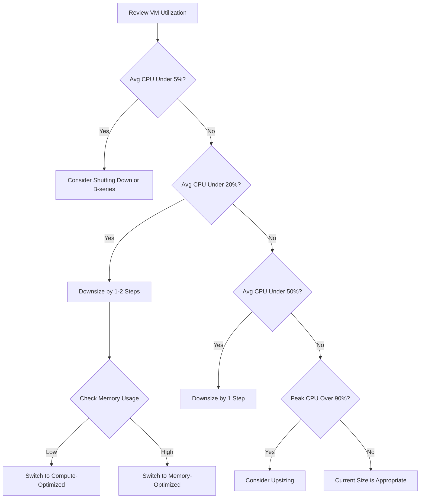

# How to Right-Size Azure Virtual Machines to Reduce Monthly Cloud Costs

Author: [nawazdhandala](https://www.github.com/nawazdhandala)

Tags: Azure, Virtual Machines, Cost Optimization, Right-Sizing, Cloud Costs, FinOps, Performance

Description: A practical guide to right-sizing Azure virtual machines by analyzing usage patterns and selecting optimal VM sizes to cut costs.

---

If you have been running Azure VMs for a while, there is a very good chance you are paying for more compute than you actually need. It is the most common cloud cost waste I see across organizations of all sizes. Teams provision VMs for peak load, but peak load happens for maybe 10% of the day. The rest of the time, those VMs sit around at 5-15% CPU utilization, burning money.

Right-sizing is the practice of matching your VM size to your actual workload needs. It sounds simple, but doing it well requires understanding your usage patterns and knowing what to look for. Let me walk through the process.

## Why VMs End Up Oversized

There are a few reasons teams end up with oversized VMs:

- **Provisioning for peak**: When someone provisions a VM, they think about the worst case. "We might get a traffic spike, so let us get an 8-core VM." Then the spike never comes, or it comes for 30 minutes a week.
- **Lift and shift**: When migrating from on-premises, teams replicate the on-premises hardware specs in Azure. But the on-premises server was also oversized, and now you are paying cloud prices for idle capacity.
- **No ongoing review**: VMs get provisioned, the workload changes over time (maybe traffic patterns shift, maybe you optimize the code), but nobody goes back to resize the VM.
- **Fear of downtime**: Resizing a VM requires a restart. Teams avoid it because of the brief interruption, so the VM stays oversized forever.

## Step 1: Use Azure Advisor Recommendations

Azure Advisor analyzes your VM usage over the past 7 days and flags VMs that are consistently underutilized. This is the fastest way to find right-sizing opportunities.

```bash
# Get cost recommendations from Azure Advisor
az advisor recommendation list \
  --category Cost \
  --query "[?shortDescription.problem=='Right-size or shutdown underutilized virtual machines'].{VM: resourceMetadata.resourceId, CurrentSize: extendedProperties.currentSku, RecommendedSize: extendedProperties.targetSku, Savings: extendedProperties.annualSavingsAmount}" \
  --output table
```

Advisor uses these thresholds by default:

- Average CPU utilization below 5% over 7 days
- Average network utilization below 7 MB over 7 days

These thresholds are conservative. A VM that averages 5% CPU is almost certainly oversized. But you can also catch VMs in the 5-20% range that are good candidates for downsizing.

## Step 2: Analyze VM Metrics in Detail

Advisor gives you a quick snapshot, but for a thorough analysis, you need to look at metrics over a longer period. Check at least 30 days of data to capture weekly patterns and monthly peaks.

```bash
# Get CPU utilization over the last 30 days
az monitor metrics list \
  --resource "/subscriptions/<sub-id>/resourceGroups/myRG/providers/Microsoft.Compute/virtualMachines/myVM" \
  --metric "Percentage CPU" \
  --interval PT1H \
  --start-time $(date -u -d '30 days ago' +%Y-%m-%dT%H:%M:%SZ) \
  --aggregation Average Maximum \
  --output table
```

Key metrics to check:

- **CPU**: Look at average AND peak. If peak is under 50%, you can safely downsize.
- **Memory**: Check the available memory percentage. If you consistently have 60%+ free memory, you have too much RAM.
- **Network**: High network throughput might require a VM size with higher bandwidth limits.
- **Disk IOPS**: If your VM hits IOPS limits, you might need to consider disk-optimized sizes.

For memory metrics, you need the Azure Monitor agent installed because Azure does not collect in-guest memory metrics by default:

```bash
# Query memory usage from Log Analytics (requires Azure Monitor agent)
# This KQL query shows average available memory over 30 days
Perf
| where ObjectName == "Memory" and CounterName == "% Used Memory"
| where Computer == "myVM"
| where TimeGenerated > ago(30d)
| summarize AvgMemoryUsed = avg(CounterValue), MaxMemoryUsed = max(CounterValue) by bin(TimeGenerated, 1h)
| order by TimeGenerated desc
```

## Step 3: Understand VM Families and Choose the Right One

Azure has many VM families, each optimized for different workloads. Choosing the right family is as important as choosing the right size.

| Family | Optimized For | Good For |
|--------|--------------|----------|
| B-series | Burstable, variable CPU | Dev/test, small web servers, CI agents |
| D-series | General purpose, balanced | Web servers, app servers, small databases |
| E-series | Memory-optimized | Databases, in-memory caching, analytics |
| F-series | Compute-optimized | Batch processing, gaming servers, scientific computing |
| L-series | Storage-optimized | Big data, NoSQL databases, data warehouses |
| N-series | GPU-accelerated | Machine learning, rendering, video encoding |

A common mistake: running a database on a D-series VM when the workload is memory-bound. Switching to an E-series with less CPU but more memory could improve performance and cost less.

## Step 4: Consider B-Series for Variable Workloads

B-series VMs are burstable - they accumulate CPU credits during idle periods and spend them during bursts. If your workload spends most of its time at low CPU and occasionally spikes, B-series can save 30-50% compared to equivalent D-series VMs.

```bash
# Check CPU credit balance for a B-series VM
az monitor metrics list \
  --resource "/subscriptions/<sub-id>/resourceGroups/myRG/providers/Microsoft.Compute/virtualMachines/myBurstableVM" \
  --metric "CPU Credits Remaining" \
  --interval PT5M \
  --output table
```

If the credits stay consistently high, your workload is a good fit for B-series. If credits frequently hit zero, the VM is spending more time bursting than baseline, and you should switch to a standard VM size.

## Step 5: Resize the VM

Once you have identified the right size, resize the VM. Note that resizing requires a VM restart, which means brief downtime.

```bash
# Check which sizes are available for resizing (within the same hardware cluster)
az vm list-vm-resize-options \
  --resource-group myResourceGroup \
  --name myVM \
  --output table

# Resize the VM
az vm resize \
  --resource-group myResourceGroup \
  --name myVM \
  --size Standard_D2s_v5
```

If the target size is not in the resize options list, you need to deallocate the VM first (which allows it to move to a different hardware cluster):

```bash
# Deallocate the VM (this releases the hardware allocation)
az vm deallocate \
  --resource-group myResourceGroup \
  --name myVM

# Now resize to any available size
az vm resize \
  --resource-group myResourceGroup \
  --name myVM \
  --size Standard_B2ms

# Start the VM
az vm start \
  --resource-group myResourceGroup \
  --name myVM
```

## Step 6: Automate Right-Sizing Reviews

Right-sizing is not a one-time activity. Workloads change, and VMs that are right-sized today might be oversized in six months. Set up a regular review process.

Use Azure Workbooks to create a dashboard that shows VM utilization across your subscription:

```kusto
// KQL query for a VM utilization dashboard
// Shows VMs with average CPU under 20% over the last 30 days
Perf
| where ObjectName == "Processor" and CounterName == "% Processor Time"
| where TimeGenerated > ago(30d)
| summarize AvgCPU = avg(CounterValue), MaxCPU = max(CounterValue), P95CPU = percentile(CounterValue, 95) by Computer
| where AvgCPU < 20
| order by AvgCPU asc
```

## Step 7: Calculate the Cost Impact

Before making changes, calculate how much you will save:

```bash
# Get the current price of your VM size
az vm list-skus \
  --location eastus \
  --size Standard_D4s_v5 \
  --query "[0].costs" \
  --output json

# Compare pricing between sizes (approximate monthly costs)
# Standard_D4s_v5 (4 vCPUs, 16 GB): ~$140/month
# Standard_D2s_v5 (2 vCPUs, 8 GB): ~$70/month
# Savings: $70/month per VM = $840/year per VM
```

Multiply savings by the number of VMs you can downsize. For organizations with hundreds of VMs, right-sizing can easily save tens of thousands of dollars per month.

## Step 8: Plan for Minimal Downtime

To minimize the impact of VM resizes:

1. **Use availability sets or VMSS**: Resize one instance at a time while others handle traffic.
2. **Schedule during maintenance windows**: Resize during off-peak hours.
3. **Use Azure Update Management**: Coordinate resizes with other maintenance activities.
4. **Automate with runbooks**: Create Azure Automation runbooks that resize VMs during off-peak hours.

```bash
# Example: Resize a VM to a smaller size at night and back up in the morning
# This pattern works well for dev/test environments

# Scale down at 8 PM
az vm resize --resource-group myRG --name myVM --size Standard_B2s

# Scale up at 7 AM
az vm resize --resource-group myRG --name myVM --size Standard_D4s_v5
```

## Right-Sizing Decision Flowchart



## Summary

Right-sizing Azure VMs is one of the highest-impact cost optimization activities you can do. Start with Azure Advisor for quick wins, then analyze metrics over 30+ days for a thorough review. Match VM families to workload types - do not run memory-heavy workloads on compute-optimized VMs and vice versa. Consider B-series for variable workloads. Make right-sizing a regular process, not a one-time effort. The savings add up quickly, especially across large fleets of VMs.
