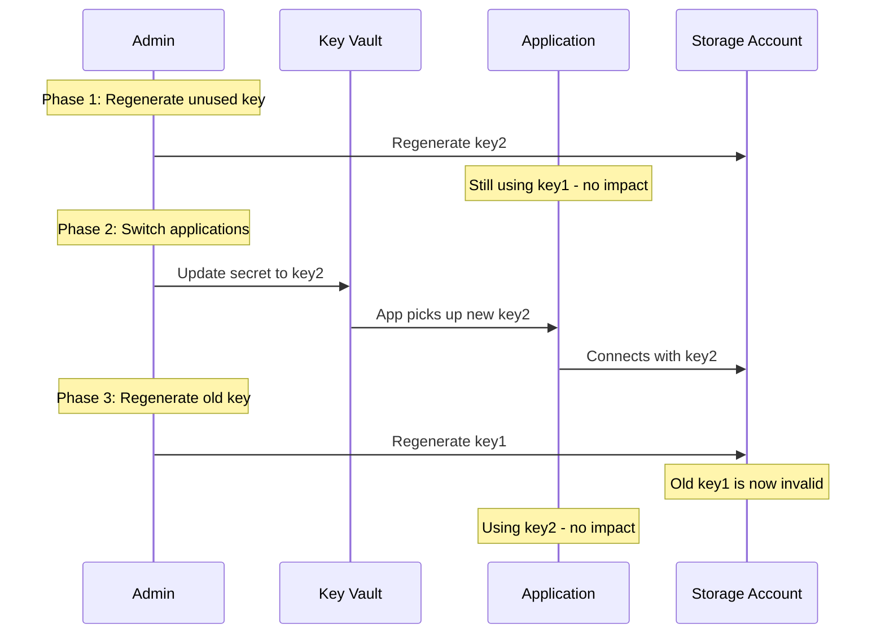

# How to Rotate Azure Storage Account Access Keys Safely

Author: [nawazdhandala](https://www.github.com/nawazdhandala)

Tags: Azure, Storage Account, Key Rotation, Security, Access Keys, Best Practices, Credentials Management

Description: A practical guide to rotating Azure Storage account access keys without causing downtime, including automation strategies and migration to managed identities.

---

Every Azure Storage account comes with two access keys. These keys grant full control over the storage account - anyone who has a key can read, write, and delete any data. Rotating these keys regularly is a fundamental security practice, but doing it wrong can take down your application. In this post, I will walk through a safe key rotation strategy that avoids downtime and explain how to automate the process.

## Why Two Keys Exist

Azure gives you two keys (key1 and key2) specifically to enable zero-downtime rotation. The idea is simple: while your applications are using key1, you regenerate key2. Then you update your applications to use key2. Once all applications are switched over, you regenerate key1. At no point is there a gap where no valid key exists.

```bash
# View the current access keys
az storage account keys list \
  --account-name mystorageaccount \
  --resource-group my-resource-group \
  --output table
```

This shows both keys along with their permissions (typically Full for both).

## The Safe Rotation Process

Here is the step-by-step process to rotate keys safely.

### Step 1: Identify Which Key Is Currently in Use

Before rotating anything, find out which key your applications are using. Check connection strings in your application configuration, Key Vault secrets, and any service configurations that reference the storage account.

```bash
# Check which key is being used by looking at connection strings
# in your app configuration, Key Vault, etc.
# The key value in the connection string tells you which one is active

# If using Azure Key Vault, check the secret value
az keyvault secret show \
  --vault-name my-keyvault \
  --name storage-connection-string \
  --query "value" -o tsv
```

### Step 2: Regenerate the Key That Is NOT in Use

If your applications are using key1, regenerate key2 first. This has zero impact on running applications.

```bash
# Regenerate key2 (assuming applications use key1)
az storage account keys renew \
  --account-name mystorageaccount \
  --resource-group my-resource-group \
  --key key2

echo "key2 regenerated - applications still using key1 are unaffected"
```

### Step 3: Update Applications to Use the New Key

Update all application configurations, connection strings, and Key Vault secrets to use the newly regenerated key2.

```bash
# Get the new key2 value
NEW_KEY=$(az storage account keys list \
  --account-name mystorageaccount \
  --resource-group my-resource-group \
  --query "[1].value" -o tsv)

# Build the new connection string
CONNECTION_STRING="DefaultEndpointsProtocol=https;AccountName=mystorageaccount;AccountKey=$NEW_KEY;EndpointSuffix=core.windows.net"

# Update the Key Vault secret with the new connection string
az keyvault secret set \
  --vault-name my-keyvault \
  --name storage-connection-string \
  --value "$CONNECTION_STRING"

echo "Key Vault updated with new connection string using key2"
```

### Step 4: Verify Applications Are Working with the New Key

Give your applications time to pick up the new configuration. Check logs and monitoring for any authentication errors.

### Step 5: Regenerate the Old Key

Once all applications are confirmed to be using key2, regenerate key1.

```bash
# Now regenerate key1 - this invalidates the old key
az storage account keys renew \
  --account-name mystorageaccount \
  --resource-group my-resource-group \
  --key key1

echo "key1 regenerated - old key is now invalid"
```

## Rotation Flow Diagram



## Automating Key Rotation with Azure Key Vault

Azure Key Vault can automate the rotation process using an event-driven approach.

```bash
# Create a Key Vault rotation policy for the storage key
# This triggers an Azure Function when the key is near expiration

# Step 1: Store the storage key in Key Vault
az keyvault secret set \
  --vault-name my-keyvault \
  --name storage-key \
  --value "$(az storage account keys list --account-name mystorageaccount --resource-group my-resource-group --query '[0].value' -o tsv)" \
  --expires "2026-05-16T00:00:00Z" \
  --tags "managed-by=rotation-policy"
```

## Rotation Script for Automation

Here is a Python script that automates the entire rotation process.

```python
from azure.identity import DefaultAzureCredential
from azure.mgmt.storage import StorageManagementClient
from azure.keyvault.secrets import SecretClient
import time

credential = DefaultAzureCredential()
subscription_id = "your-subscription-id"

# Initialize clients
storage_client = StorageManagementClient(credential, subscription_id)
kv_client = SecretClient(
    vault_url="https://my-keyvault.vault.azure.net/",
    credential=credential
)

resource_group = "my-resource-group"
account_name = "mystorageaccount"

def rotate_storage_key():
    """
    Safely rotate storage account access keys.
    Assumes applications read the connection string from Key Vault.
    """
    # Step 1: Determine which key is currently in use
    current_secret = kv_client.get_secret("storage-connection-string")
    current_key = extract_key_from_connection_string(current_secret.value)

    # Step 2: Get both keys from the storage account
    keys = storage_client.storage_accounts.list_keys(resource_group, account_name)
    key1_value = keys.keys[0].value
    key2_value = keys.keys[1].value

    # Determine which key to regenerate
    if current_key == key1_value:
        # Currently using key1, regenerate key2 first
        print("Currently using key1. Regenerating key2...")
        key_to_regen = "key2"
        new_key_index = 1
    else:
        # Currently using key2, regenerate key1 first
        print("Currently using key2. Regenerating key1...")
        key_to_regen = "key1"
        new_key_index = 0

    # Step 3: Regenerate the unused key
    storage_client.storage_accounts.regenerate_key(
        resource_group, account_name,
        {"key_name": key_to_regen}
    )
    print(f"{key_to_regen} regenerated")

    # Step 4: Get the new key value
    keys = storage_client.storage_accounts.list_keys(resource_group, account_name)
    new_key = keys.keys[new_key_index].value

    # Step 5: Update Key Vault with new connection string
    new_conn_str = (
        f"DefaultEndpointsProtocol=https;"
        f"AccountName={account_name};"
        f"AccountKey={new_key};"
        f"EndpointSuffix=core.windows.net"
    )
    kv_client.set_secret("storage-connection-string", new_conn_str)
    print("Key Vault updated with new connection string")

    # Step 6: Wait for applications to pick up the new key
    print("Waiting 60 seconds for applications to update...")
    time.sleep(60)

    # Step 7: Regenerate the old key
    old_key_name = "key1" if key_to_regen == "key2" else "key2"
    storage_client.storage_accounts.regenerate_key(
        resource_group, account_name,
        {"key_name": old_key_name}
    )
    print(f"{old_key_name} regenerated. Rotation complete.")

def extract_key_from_connection_string(conn_str):
    """Extract the AccountKey value from a connection string."""
    for part in conn_str.split(";"):
        if part.startswith("AccountKey="):
            return part.split("=", 1)[1]
    return None

# Run the rotation
rotate_storage_key()
```

## Rotating Keys with PowerShell

```powershell
# Get the current keys
$keys = Get-AzStorageAccountKey -ResourceGroupName "my-resource-group" -Name "mystorageaccount"

# Regenerate key2
New-AzStorageAccountKey `
  -ResourceGroupName "my-resource-group" `
  -Name "mystorageaccount" `
  -KeyName "key2"

# Get the updated keys
$newKeys = Get-AzStorageAccountKey -ResourceGroupName "my-resource-group" -Name "mystorageaccount"
$newKey2 = $newKeys[1].Value

# Update Key Vault
$connectionString = "DefaultEndpointsProtocol=https;AccountName=mystorageaccount;AccountKey=$newKey2;EndpointSuffix=core.windows.net"
$secretValue = ConvertTo-SecureString -String $connectionString -AsPlainText -Force
Set-AzKeyVaultSecret -VaultName "my-keyvault" -Name "storage-connection-string" -SecretValue $secretValue

Write-Output "Key rotated and Key Vault updated"
```

## Moving to Managed Identity (The Better Solution)

The best way to handle key rotation is to stop using keys altogether. Azure AD authentication with managed identities eliminates the need for keys in most scenarios.

```python
from azure.identity import DefaultAzureCredential
from azure.storage.blob import BlobServiceClient

# No keys needed - uses the VM's managed identity
credential = DefaultAzureCredential()
blob_service = BlobServiceClient(
    account_url="https://mystorageaccount.blob.core.windows.net",
    credential=credential
)

# This works without any storage keys
containers = blob_service.list_containers()
for container in containers:
    print(container.name)
```

```bash
# Assign the Storage Blob Data Contributor role to a managed identity
az role assignment create \
  --assignee <managed-identity-object-id> \
  --role "Storage Blob Data Contributor" \
  --scope "/subscriptions/<sub>/resourceGroups/my-resource-group/providers/Microsoft.Storage/storageAccounts/mystorageaccount"
```

## Setting Up a Rotation Schedule

For organizations that still need to use access keys, set up a regular rotation schedule.

Rotate keys at least every 90 days. Many compliance frameworks require this.

Use Azure Policy to audit storage accounts with old keys.

```bash
# Check when keys were last rotated
az storage account show \
  --name mystorageaccount \
  --resource-group my-resource-group \
  --query "keyCreationTime" \
  --output table
```

## Best Practices

Store keys in Azure Key Vault, never in application code or config files.

Use managed identities instead of keys wherever possible. Azure AD authentication is more secure and eliminates the rotation problem entirely.

Test the rotation process in a non-production environment first. A botched rotation in production causes an outage.

Monitor for authentication failures during and after rotation. Set up alerts in Azure Monitor for 403 errors on your storage account.

Document which applications use which key. Without this information, rotation becomes a guessing game.

Key rotation is a necessary security hygiene practice for Azure Storage accounts. Do it regularly, do it carefully, and ideally, migrate to managed identities so you do not have to do it at all.
