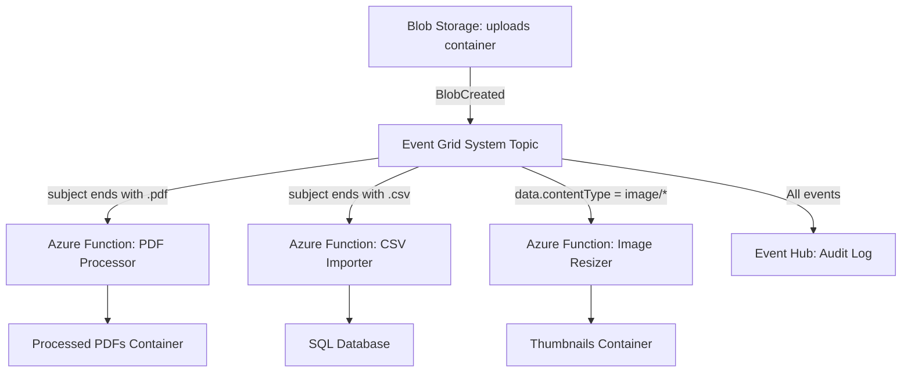

# How to Route Azure Blob Storage Events with Azure Event Grid

Author: [nawazdhandala](https://www.github.com/nawazdhandala)

Tags: Azure, Blob Storage, Event Grid, Event Routing, File Processing, Serverless, Cloud Storage

Description: Set up event-driven file processing by routing Azure Blob Storage events through Event Grid to functions, queues, and webhooks.

---

Polling a storage container to check for new files is wasteful and slow. Azure Event Grid eliminates that pattern entirely by pushing events to your handlers the moment a blob is created, modified, or deleted. This guide covers everything from basic setup to advanced routing scenarios with filters.

## What Blob Storage Events Are Available?

Azure Blob Storage emits several event types through Event Grid:

- **Microsoft.Storage.BlobCreated** - a new blob was created or an existing blob was replaced
- **Microsoft.Storage.BlobDeleted** - a blob was deleted
- **Microsoft.Storage.BlobRenamed** - a blob was renamed (Data Lake Storage Gen2 only)
- **Microsoft.Storage.DirectoryCreated** - a directory was created (Data Lake Storage Gen2 only)
- **Microsoft.Storage.DirectoryRenamed** - a directory was renamed (Data Lake Storage Gen2 only)
- **Microsoft.Storage.DirectoryDeleted** - a directory was deleted (Data Lake Storage Gen2 only)
- **Microsoft.Storage.BlobTierChanged** - the blob access tier changed
- **Microsoft.Storage.AsyncOperationInitiated** - an async operation started (like copying a blob)
- **Microsoft.Storage.BlobInventoryPolicyCompleted** - an inventory policy run completed

The most commonly used events are BlobCreated and BlobDeleted. These fire for both block blobs and page blobs, and for any API that creates a blob (PutBlob, PutBlockList, CopyBlob, etc.).

## Basic Setup: Blob Created Events to a Function

Let's start with the most common scenario - triggering an Azure Function when a blob is uploaded.

```bash
# Get the storage account resource ID
STORAGE_ID=$(az storage account show \
  --name stfileprocessing \
  --resource-group rg-files \
  --query "id" \
  --output tsv)

# Create a system topic for the storage account
az eventgrid system-topic create \
  --name systopic-blob-events \
  --resource-group rg-files \
  --location eastus2 \
  --topic-type Microsoft.Storage.StorageAccounts \
  --source "$STORAGE_ID"

# Subscribe to BlobCreated events, sending to an Azure Function
az eventgrid system-topic event-subscription create \
  --name sub-process-uploads \
  --resource-group rg-files \
  --system-topic-name systopic-blob-events \
  --endpoint "/subscriptions/{sub-id}/resourceGroups/rg-files/providers/Microsoft.Web/sites/func-file-processor/functions/ProcessUpload" \
  --endpoint-type azurefunction \
  --included-event-types "Microsoft.Storage.BlobCreated"
```

## Filtering by Container and File Extension

You almost never want to receive events for every blob in every container. Use subject filters to narrow it down.

The subject for blob events follows this format:
```
/blobServices/default/containers/{container-name}/blobs/{blob-name}
```

```bash
# Only receive events for blobs in the "uploads" container that are PDFs
az eventgrid system-topic event-subscription create \
  --name sub-pdf-uploads \
  --resource-group rg-files \
  --system-topic-name systopic-blob-events \
  --endpoint "/subscriptions/{sub-id}/resourceGroups/rg-files/providers/Microsoft.Web/sites/func-pdf-processor/functions/ProcessPdf" \
  --endpoint-type azurefunction \
  --included-event-types "Microsoft.Storage.BlobCreated" \
  --subject-begins-with "/blobServices/default/containers/uploads/" \
  --subject-ends-with ".pdf"
```

```bash
# Only receive events for images in the "photos" container
az eventgrid system-topic event-subscription create \
  --name sub-image-uploads \
  --resource-group rg-files \
  --system-topic-name systopic-blob-events \
  --endpoint "/subscriptions/{sub-id}/resourceGroups/rg-files/providers/Microsoft.Web/sites/func-image-processor/functions/ProcessImage" \
  --endpoint-type azurefunction \
  --included-event-types "Microsoft.Storage.BlobCreated" \
  --subject-begins-with "/blobServices/default/containers/photos/" \
  --advanced-filter data.contentType StringIn "image/jpeg" "image/png" "image/webp"
```

## Routing Architecture

A typical file processing architecture routes different file types to different handlers.



## Handling Blob Created Events in Code

Here is the Azure Function that receives and processes blob created events.

```csharp
using Azure.Messaging.EventGrid;
using Azure.Storage.Blobs;
using Microsoft.Azure.Functions.Worker;
using Microsoft.Extensions.Logging;

public class BlobEventProcessor
{
    private readonly BlobServiceClient _blobService;
    private readonly ILogger<BlobEventProcessor> _logger;

    public BlobEventProcessor(BlobServiceClient blobService, ILogger<BlobEventProcessor> logger)
    {
        _blobService = blobService;
        _logger = logger;
    }

    [Function("ProcessUpload")]
    public async Task Run([EventGridTrigger] EventGridEvent eventGridEvent)
    {
        _logger.LogInformation("Processing blob event: {EventType}", eventGridEvent.EventType);

        // Parse the event data
        var blobData = eventGridEvent.Data.ToObjectFromJson<BlobCreatedEventData>();

        _logger.LogInformation("Blob URL: {Url}", blobData.Url);
        _logger.LogInformation("Content Type: {ContentType}", blobData.ContentType);
        _logger.LogInformation("Content Length: {Length} bytes", blobData.ContentLength);
        _logger.LogInformation("API: {Api}", blobData.Api);

        // Extract container and blob name from the subject
        // Subject format: /blobServices/default/containers/{container}/blobs/{blobpath}
        var subject = eventGridEvent.Subject;
        var containerStart = subject.IndexOf("/containers/") + "/containers/".Length;
        var blobStart = subject.IndexOf("/blobs/") + "/blobs/".Length;
        var containerName = subject.Substring(containerStart, subject.IndexOf("/blobs/") - containerStart);
        var blobName = subject.Substring(blobStart);

        _logger.LogInformation("Container: {Container}, Blob: {Blob}", containerName, blobName);

        // Download the blob for processing
        var containerClient = _blobService.GetBlobContainerClient(containerName);
        var blobClient = containerClient.GetBlobClient(blobName);

        var downloadResult = await blobClient.DownloadContentAsync();
        var content = downloadResult.Value.Content;

        // Process based on content type
        switch (blobData.ContentType)
        {
            case "application/pdf":
                await ProcessPdf(content.ToArray(), blobName);
                break;
            case "text/csv":
                await ProcessCsv(content.ToString(), blobName);
                break;
            default:
                _logger.LogInformation("Skipping unsupported content type: {Type}", blobData.ContentType);
                break;
        }
    }

    private async Task ProcessPdf(byte[] content, string fileName)
    {
        _logger.LogInformation("Processing PDF: {FileName} ({Size} bytes)", fileName, content.Length);
        // Your PDF processing logic here
    }

    private async Task ProcessCsv(string content, string fileName)
    {
        var lineCount = content.Split('\n').Length;
        _logger.LogInformation("Processing CSV: {FileName} ({Lines} lines)", fileName, lineCount);
        // Your CSV processing logic here
    }
}

// Event data model for BlobCreated events
public class BlobCreatedEventData
{
    public string Api { get; set; }
    public string ClientRequestId { get; set; }
    public string RequestId { get; set; }
    public string ETag { get; set; }
    public string ContentType { get; set; }
    public long ContentLength { get; set; }
    public string BlobType { get; set; }
    public string Url { get; set; }
    public string Sequencer { get; set; }
}
```

## Bicep Template for the Full Setup

Here is a complete Bicep template that sets up a storage account, system topic, and filtered subscriptions.

```bicep
// Complete setup for blob event routing
param location string = resourceGroup().location

// Storage account
resource storageAccount 'Microsoft.Storage/storageAccounts@2023-01-01' = {
  name: 'stfileprocessing${uniqueString(resourceGroup().id)}'
  location: location
  sku: { name: 'Standard_LRS' }
  kind: 'StorageV2'
}

// Create the uploads container
resource uploadsContainer 'Microsoft.Storage/storageAccounts/blobServices/containers@2023-01-01' = {
  name: '${storageAccount.name}/default/uploads'
}

// System topic for blob events
resource systemTopic 'Microsoft.EventGrid/systemTopics@2022-06-15' = {
  name: 'systopic-blob-events'
  location: location
  properties: {
    source: storageAccount.id
    topicType: 'Microsoft.Storage.StorageAccounts'
  }
}

// Subscription for PDF files
resource pdfSubscription 'Microsoft.EventGrid/systemTopics/eventSubscriptions@2022-06-15' = {
  parent: systemTopic
  name: 'sub-pdf-processing'
  properties: {
    destination: {
      endpointType: 'AzureFunction'
      properties: {
        resourceId: '${functionApp.id}/functions/ProcessPdf'
      }
    }
    filter: {
      includedEventTypes: ['Microsoft.Storage.BlobCreated']
      subjectBeginsWith: '/blobServices/default/containers/uploads/'
      subjectEndsWith: '.pdf'
    }
  }
}

// Subscription for CSV files routed to a Service Bus queue
resource csvSubscription 'Microsoft.EventGrid/systemTopics/eventSubscriptions@2022-06-15' = {
  parent: systemTopic
  name: 'sub-csv-import'
  properties: {
    destination: {
      endpointType: 'ServiceBusQueue'
      properties: {
        resourceId: '${serviceBusNamespace.id}/queues/csv-imports'
      }
    }
    filter: {
      includedEventTypes: ['Microsoft.Storage.BlobCreated']
      subjectBeginsWith: '/blobServices/default/containers/uploads/'
      subjectEndsWith: '.csv'
    }
  }
}
```

## Handling Duplicate Events

Blob Storage events can occasionally be delivered more than once, especially if the blob creation involves multiple API calls (like PutBlockList after multiple PutBlock calls). Make your handlers idempotent by using the event's `id` field as a deduplication key.

```csharp
// Simple idempotency check using a cache or database
private readonly HashSet<string> _processedEvents = new();

public async Task HandleEvent(EventGridEvent ev)
{
    // Skip if we have already processed this event
    if (!_processedEvents.Add(ev.Id))
    {
        _logger.LogInformation("Skipping duplicate event: {EventId}", ev.Id);
        return;
    }

    // Process the event
    await ProcessBlob(ev);
}
```

For production systems, use a distributed store like Redis or a database table for deduplication instead of in-memory collections.

## Avoiding Event Storms

If your processing function writes output blobs to the same storage account, you can accidentally create an infinite loop - the output blob triggers another BlobCreated event, which triggers processing, which creates another output blob, and so on.

Prevent this by using subject filters. Write output blobs to a different container that is not covered by your subscription filter, or use a separate storage account for outputs.

## Summary

Routing Blob Storage events through Event Grid gives you instant, push-based file processing without polling. Use system topics to capture blob events, subject filters to route by container and file extension, and advanced filters to route by content type or size. Keep your handlers idempotent to handle duplicate deliveries, and be careful about event storms when writing output blobs to the same storage account.
