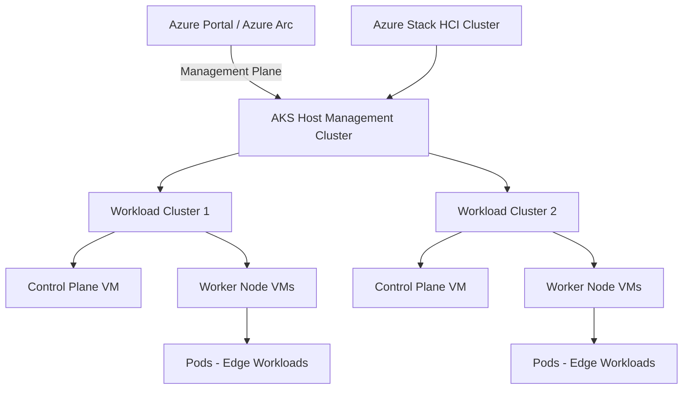

# How to Run Azure Kubernetes Service on Azure Stack HCI for Edge Workloads

Author: [nawazdhandala](https://www.github.com/nawazdhandala)

Tags: Azure, Kubernetes, Azure Stack HCI, Edge Computing, AKS, Containers, Hybrid Cloud

Description: Learn how to deploy and manage Azure Kubernetes Service on Azure Stack HCI to run containerized edge workloads on your own infrastructure.

---

Running Kubernetes at the edge has a specific appeal: your containers run close to the data sources, close to the users, and close to the machines they control. Azure Kubernetes Service (AKS) on Azure Stack HCI brings the managed Kubernetes experience to your on-premises hardware, complete with Azure Arc integration for centralized management. You get the same kubectl experience, the same container ecosystem, and the same GitOps workflows, but the pods run on your own servers.

This guide covers deploying AKS on Azure Stack HCI, creating workload clusters, and managing them through Azure.

## Architecture

AKS on Azure Stack HCI has a layered architecture:



The **management cluster** handles lifecycle operations - creating, scaling, and upgrading workload clusters. Each **workload cluster** is an independent Kubernetes cluster with its own control plane and worker nodes, all running as VMs on the Azure Stack HCI hypervisor.

## Prerequisites

- Azure Stack HCI cluster deployed and registered with Azure (version 22H2 or later).
- At least 4 vCPUs and 8 GB RAM available per Kubernetes node VM.
- An Azure subscription with the required resource providers registered.
- A static IP range for Kubernetes node VMs and load balancer IPs.
- Windows Admin Center installed (or use PowerShell directly).
- Internet connectivity for pulling container images and connecting to Azure.

## Step 1: Prepare the Azure Stack HCI Cluster

Make sure your Azure Stack HCI cluster meets the networking requirements for AKS.

```powershell
# Verify the cluster has enough resources
Get-ClusterNode | ForEach-Object {
    $node = $_
    $memory = Get-CimInstance -ClassName Win32_ComputerSystem -ComputerName $node.Name
    [PSCustomObject]@{
        Node = $node.Name
        TotalMemoryGB = [math]::Round($memory.TotalPhysicalMemory / 1GB, 2)
        Status = $node.State
    }
} | Format-Table

# Check available storage
Get-Volume -CimSession (Get-ClusterNode).Name | Where-Object FileSystemLabel -eq "VMStorage" | Format-Table
```

Plan your IP address allocation:

- **Kubernetes node VMs**: A range of static IPs (for example, 10.0.0.100 - 10.0.0.150).
- **Control plane IP**: A single IP for the Kubernetes API server.
- **Load balancer IPs**: A range for Kubernetes LoadBalancer services (for example, 10.0.0.200 - 10.0.0.220).

## Step 2: Install the AKS on HCI Module

```powershell
# Install the AKS-HCI PowerShell module on the management machine
Install-Module -Name AksHci -Force -AcceptLicense

# Import the module
Import-Module AksHci

# Verify the installation
Get-Command -Module AksHci | Measure-Object
```

## Step 3: Configure and Install the AKS Host

The AKS host is the management cluster that orchestrates workload cluster operations.

```powershell
# Set the configuration for the AKS host installation
$vnet = New-AksHciNetworkSetting `
  -Name "aks-default-network" `
  -vSwitchName "ConvergedSwitch" `
  -Gateway "10.0.0.1" `
  -DnsServers "10.0.0.53" `
  -IpAddressPrefix "10.0.0.0/24" `
  -k8sNodeIpPoolStart "10.0.0.100" `
  -k8sNodeIpPoolEnd "10.0.0.150" `
  -VipPoolStart "10.0.0.200" `
  -VipPoolEnd "10.0.0.220"

# Set the AKS-HCI configuration
Set-AksHciConfig `
  -ImageDir "C:\ClusterStorage\VMStorage\AKS\Images" `
  -workingDir "C:\ClusterStorage\VMStorage\AKS\Working" `
  -cloudConfigLocation "C:\ClusterStorage\VMStorage\AKS\Config" `
  -vnet $vnet `
  -cloudservicecidr "10.0.0.230/24"

# Set Azure registration configuration
Set-AksHciRegistration `
  -SubscriptionId "your-subscription-id" `
  -ResourceGroupName "myResourceGroup"

# Install the AKS host (management cluster) - this takes 15-30 minutes
Install-AksHci
```

The installation downloads VM images, creates the management cluster VMs, and registers everything with Azure Arc.

## Step 4: Create a Workload Cluster

With the management cluster running, create a workload cluster for your applications.

```powershell
# Create a Linux workload cluster with 2 worker nodes
New-AksHciCluster `
  -Name "edge-cluster-01" `
  -ControlPlaneNodeCount 1 `
  -LinuxNodeCount 2 `
  -LinuxNodeVmSize "Standard_K8S3_v1" `
  -ControlPlaneVmSize "Standard_K8S3_v1"
```

Available VM sizes for AKS on HCI:

| Size | vCPUs | Memory | Storage |
|------|-------|--------|---------|
| Standard_K8S2_v1 | 2 | 2 GB | 32 GB |
| Standard_K8S3_v1 | 4 | 6 GB | 128 GB |
| Standard_K8S4_v1 | 8 | 16 GB | 256 GB |

For edge workloads, `Standard_K8S3_v1` is usually sufficient. Scale up the VM size if your containers need more memory.

After the cluster is created, get the kubeconfig.

```powershell
# Get the kubeconfig to access the workload cluster
Get-AksHciCredential -Name "edge-cluster-01"

# Verify connectivity
kubectl get nodes
```

Expected output:

```
NAME                              STATUS   ROLES                  AGE   VERSION
edge-cluster-01-control-plane-0   Ready    control-plane,master   5m    v1.27.3
edge-cluster-01-linux-worker-0    Ready    <none>                 3m    v1.27.3
edge-cluster-01-linux-worker-1    Ready    <none>                 3m    v1.27.3
```

## Step 5: Deploy an Edge Workload

Here is an example deployment for an edge data processing application.

```yaml
# edge-processor.yaml
# Deploys a data processing application that reads from local sensors
apiVersion: apps/v1
kind: Deployment
metadata:
  name: edge-processor
  namespace: default
spec:
  replicas: 2
  selector:
    matchLabels:
      app: edge-processor
  template:
    metadata:
      labels:
        app: edge-processor
    spec:
      containers:
        - name: processor
          image: myregistry.azurecr.io/edge-processor:v1.0
          ports:
            - containerPort: 8080
          env:
            # Environment variable pointing to the local data source
            - name: DATA_SOURCE
              value: "mqtt://10.0.0.50:1883"
            # Azure IoT Hub connection for upstream reporting
            - name: IOT_HUB_CONNECTION
              valueFrom:
                secretKeyRef:
                  name: iot-credentials
                  key: connection-string
          resources:
            requests:
              cpu: "250m"
              memory: "256Mi"
            limits:
              cpu: "500m"
              memory: "512Mi"
---
# Expose the processor with a LoadBalancer service
apiVersion: v1
kind: Service
metadata:
  name: edge-processor-svc
spec:
  type: LoadBalancer
  selector:
    app: edge-processor
  ports:
    - port: 80
      targetPort: 8080
```

Deploy it.

```bash
# Deploy the edge processing workload
kubectl apply -f edge-processor.yaml

# Check the deployment status
kubectl get deployments

# Get the external IP assigned by the load balancer
kubectl get svc edge-processor-svc
```

## Step 6: Enable Azure Arc for GitOps

Connecting the workload cluster to Azure Arc enables GitOps-based deployments where your cluster automatically syncs with a Git repository.

```bash
# Connect the workload cluster to Azure Arc
az connectedk8s connect \
  --name "edge-cluster-01" \
  --resource-group myResourceGroup \
  --location eastus

# Enable GitOps with Flux v2
az k8s-configuration flux create \
  --name "edge-apps" \
  --cluster-name "edge-cluster-01" \
  --resource-group myResourceGroup \
  --cluster-type connectedClusters \
  --namespace "flux-system" \
  --scope cluster \
  --url "https://github.com/your-org/edge-manifests" \
  --branch "main" \
  --kustomization name=apps path=./apps prune=true
```

With GitOps, pushing manifest changes to your repository automatically deploys them to the edge cluster. No need to run kubectl from your laptop against a remote edge location.

## Step 7: Scale and Update Clusters

Scale worker nodes based on workload demand.

```powershell
# Scale the cluster to 4 Linux worker nodes
Set-AksHciClusterNodePool `
  -ClusterName "edge-cluster-01" `
  -Name "default" `
  -Count 4

# Check the updated node count
kubectl get nodes
```

Update the Kubernetes version when new releases are available.

```powershell
# Check available updates
Get-AksHciUpdates

# Update the management cluster first
Update-AksHci

# Then update the workload cluster
Update-AksHciCluster -Name "edge-cluster-01"
```

Always update the management cluster before workload clusters. The management cluster must be at the same version or higher than any workload cluster it manages.

## Monitoring Edge Clusters

Use Azure Monitor Container Insights for centralized monitoring of all your edge clusters.

```bash
# Enable monitoring on the connected cluster
az k8s-extension create \
  --name "azuremonitor-containers" \
  --cluster-name "edge-cluster-01" \
  --resource-group myResourceGroup \
  --cluster-type connectedClusters \
  --extension-type Microsoft.AzureMonitor.Containers
```

This deploys monitoring agents to the cluster that report metrics and logs to your Azure Monitor workspace. You can view CPU usage, memory consumption, pod health, and container logs from the Azure portal regardless of where the cluster physically runs.

## Summary

AKS on Azure Stack HCI brings managed Kubernetes to your on-premises hardware without sacrificing the cloud management experience. The setup involves installing the management cluster on your HCI infrastructure, creating workload clusters as needed, and connecting them to Azure Arc for centralized operations. For edge scenarios, the combination of local compute with cloud management through GitOps and Azure Monitor means your operations team manages edge clusters the same way they manage cloud clusters. The physical location of the hardware becomes an implementation detail rather than a fundamentally different operational model.
